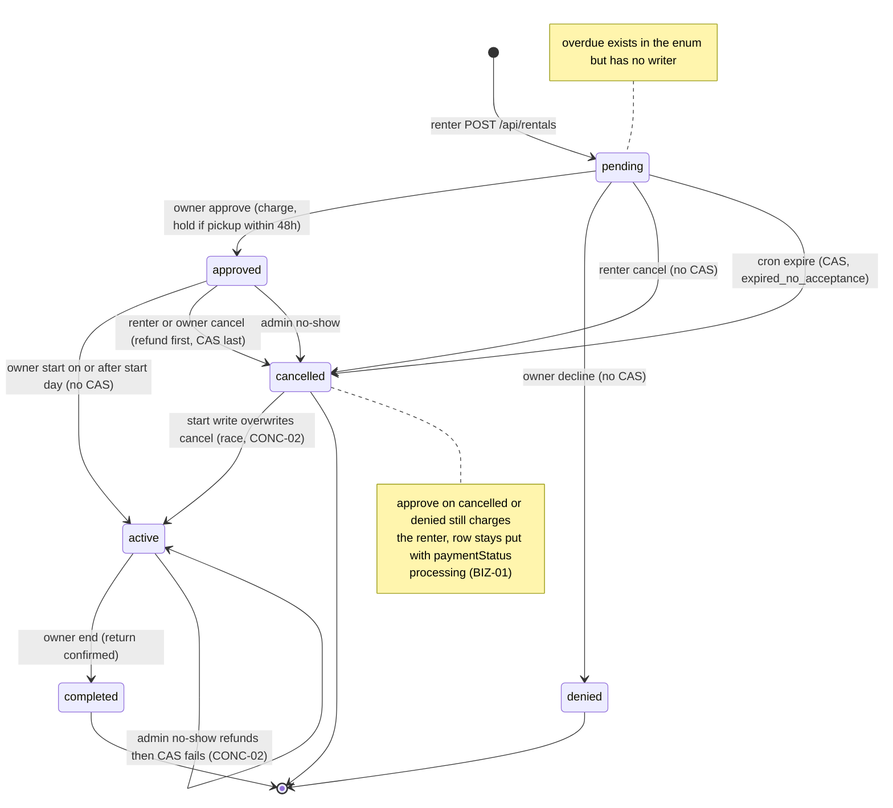
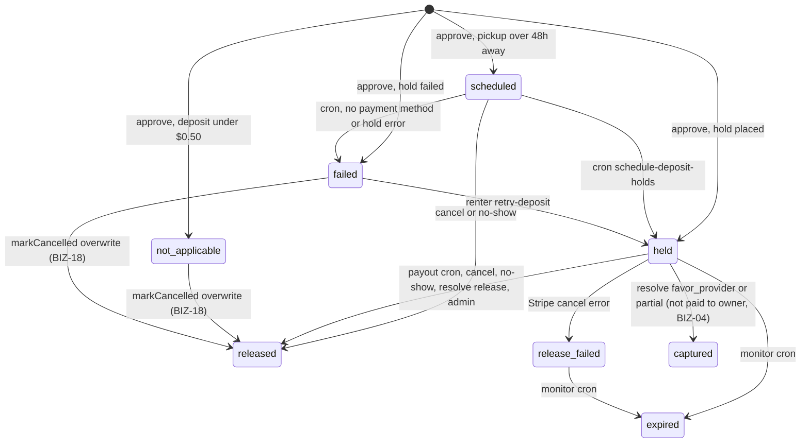
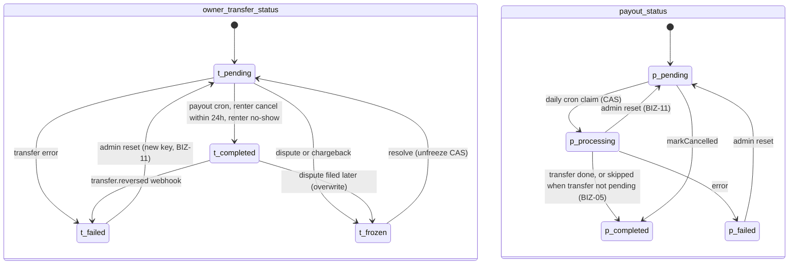
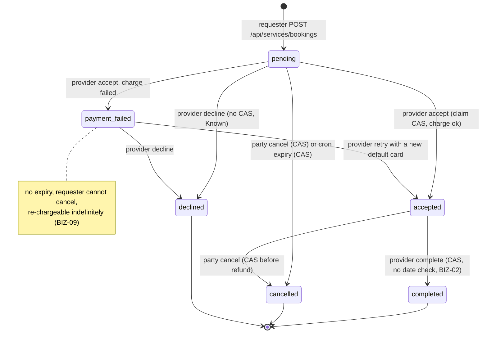
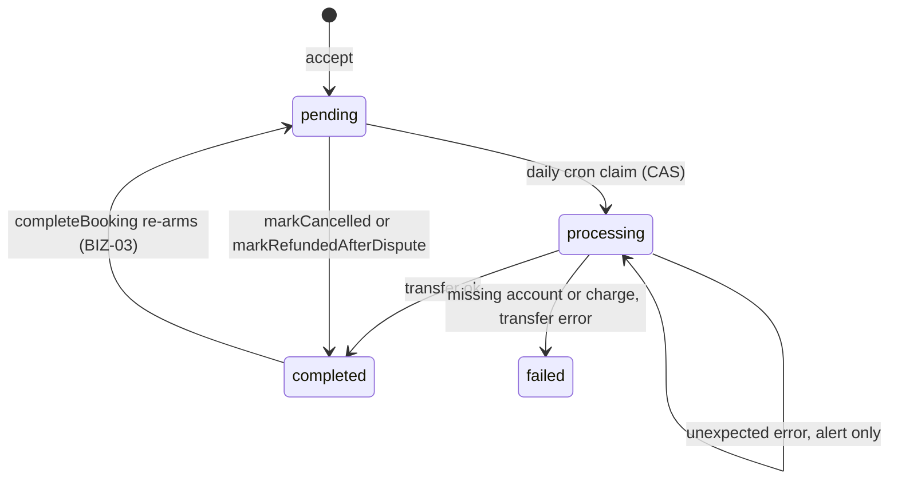
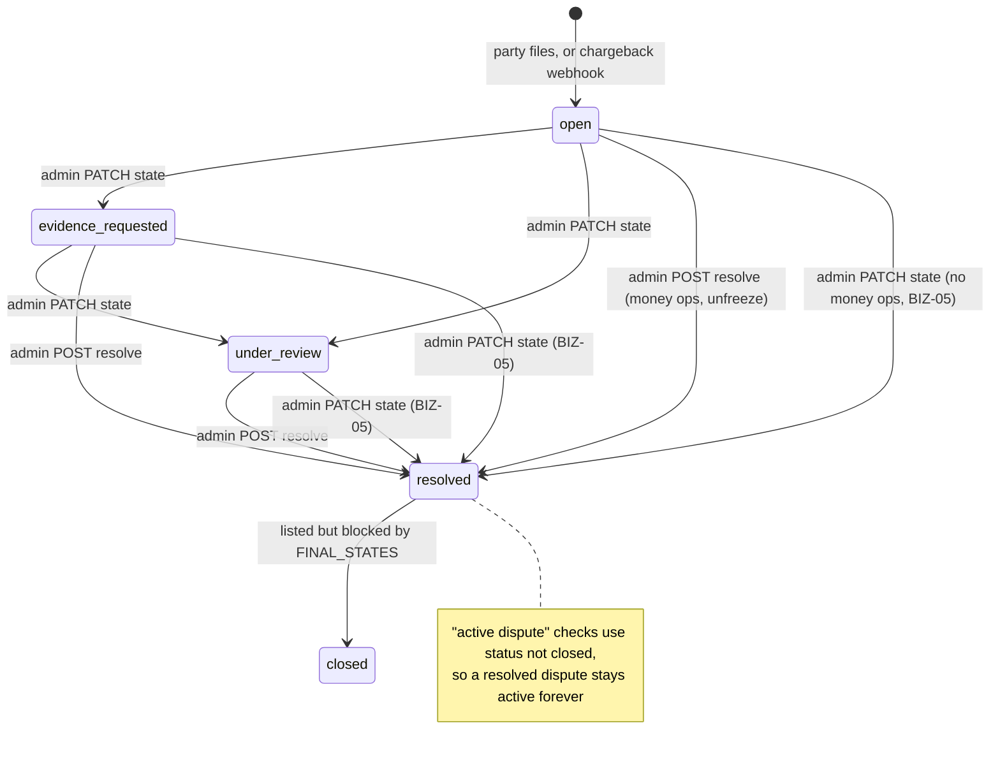

# Booking state machines (as implemented)

> **Lead auditor preface.** This document was drafted by the business-logic auditor and reviewed in the adversarial pass. Finding IDs have been renumbered to the audit's final IDs (see `09-priority-matrix.md`), and paths now start at `hoador-web/`. Four drift points that the adversarial review established are not all visible in the tables below, so they are listed here:
>
> 1. **Rental payout eligibility trusts only `payoutStatus`.** `findEligibleForPayout` (`src/dal/payment-lifecycle.dal.ts` ~L358-400) checks neither `payments.status = 'refunded'` nor `ownerTransferStatus`. A rental that was refunded but stayed `active`, because a cancel lost its CAS to `start`, therefore still pays the owner from platform funds. Stripe does not stop this: refunds don't limit later `source_transaction` transfers (CONC-02).
> 2. **Pending requests never block dates, and approval never re-checks.** Two overlapping requests can both reach `approved` (CONC-01).
> 3. **Chargebacks may never create their dispute.** The auto-dispute insert uses `created_by = 'system'` against an FK to `user.id`. If that row is missing, the insert throws before `freezeForDispute`, so the "open dispute ⇒ no payout" invariant also drifts for chargebacks (BIZ-06).
> 4. **Self-deleted users stay chargeable.** Anonymization neither cancels a user's pending outbound requests nor detaches their cards (BIZ-07).
>
> Money-moving transitions should be read together with `02-business-logic-findings.md` and `05-concurrency-findings.md`.

This document describes the state machines as the code implements them. It uses the hoador-web working tree at `develop` 7f49271 or later, read on 2026-09-23. Paths are relative to `hoador-web/`.

Terms used in the tables:

- **CAS** means an `UPDATE … WHERE <state> = expected RETURNING`, with the returned row count checked.
- **none** means a read followed by a write, with no guard in between.
- **tx** means a database transaction. None of these machines uses one.
- Finding IDs are the audit's final IDs (see `09-priority-matrix.md`). **Known** marks a follow-up already listed in `plans/README.md`.

Rentals have no status column of their own: `rental_requests.status` is the status of both the request and the rental (`src/db/schemas/rentals.schema.ts:81`).

---

## 1. Rental request / rental — `rental_requests.status`

### States

| State       | Meaning                                                                                                                                                                                                        |
| ----------- | -------------------------------------------------------------------------------------------------------------------------------------------------------------------------------------------------------------- |
| `pending`   | Awaiting the owner. `expiresAt` is set to `createdAt + 72h` (`src/dal/rentals.dal.ts:616-618`).                                                                                                                |
| `approved`  | The renter has been charged, and a `rentals` row and a lifecycle row have been created.                                                                                                                        |
| `active`    | The owner has confirmed pickup.                                                                                                                                                                                |
| `completed` | The owner has confirmed the return. This sets `rentals.returnConfirmedAt`, which starts the 24h dispute window and the payout clock.                                                                           |
| `cancelled` | Cancelled. `cancellation_reason` records how: `renter_cancellation`, `owner_cancellation`, `renter_no_show`, `owner_no_show` or `expired_no_acceptance`. It is `NULL` when a renter cancels a pending request. |
| `denied`    | The owner declined.                                                                                                                                                                                            |
| `overdue`   | Exists in the enum only. No production code writes it (only seeds do).                                                                                                                                         |

### Transitions

| From → To                                         | Actor                 | Route / cron                           | Guard (file:line)                                                                                                                                                                                                                                                                 | Atomic?                                                                                                                                                                                | Side effects, in order                                                                                                                                                                                                                                                                                                                     |
| ------------------------------------------------- | --------------------- | -------------------------------------- | --------------------------------------------------------------------------------------------------------------------------------------------------------------------------------------------------------------------------------------------------------------------------------- | -------------------------------------------------------------------------------------------------------------------------------------------------------------------------------------- | ------------------------------------------------------------------------------------------------------------------------------------------------------------------------------------------------------------------------------------------------------------------------------------------------------------------------------------------ |
| ∅ → pending                                       | renter                | `POST /api/rentals`                    | Quote blockers (`src/features/rentals/services/rental-quote.ts:110-158`), thrown at `rental-service.ts:176-179`: own listing, end before start, past start day, min/max period, conflict with approved/active rentals or blocks. The conflict check fails open if the read fails. | Single INSERT (`rentals.dal.ts:619-648`). No overlap constraint.                                                                                                                       | Audit log (`rental-service.ts:219-237`) → activity → legal acceptances (allSettled) → owner notification (fire-and-forget)                                                                                                                                                                                                                 |
| pending → approved                                | owner                 | `POST /api/rentals/[id]/approve`       | Owner check (`rental-service.ts:389`); Connect ready (`:436`); total ≥ $0.50 (`:447`). **No status guard before the charge (BIZ-01).**                                                                                                                                            | The claim is a CAS on `paymentStatus` only (`rentals.dal.ts:1884-1902`). The status check, status update and rental insert are three separate statements, no tx (`:1970-2017`, Known). | Store the payment method (`:426`) → claim (`:456`) → Stripe charge `rental-charge-{id}` (`:481-507`) → audit (`:598`) → deposit hold if pickup ≤48h away, key `deposit-hold-{requestId}` (`:640-667`) → DAL approve (`:674`) → payment row (`:693`) → lifecycle row (`:762`) → `after()`: notifications, agreement PDF, close linked needs |
| pending (paymentStatus → failed)                  | system during approve | same                                   | Charge threw, or PaymentIntent did not succeed                                                                                                                                                                                                                                    | Plain UPDATE (`:511-514`, `:571-574`)                                                                                                                                                  | Audit → renter + owner notifications                                                                                                                                                                                                                                                                                                       |
| pending → denied                                  | owner                 | `POST …/decline`                       | Owner check (`decline/route.ts:73`); status read (`rentals.dal.ts:2063`)                                                                                                                                                                                                          | **none**: UPDATE with only `WHERE id` (`:2068-2075`). Ignores an in-flight `processing` claim (BIZ-01).                                                                                | Audit → activity → renter notification                                                                                                                                                                                                                                                                                                     |
| pending → cancelled                               | renter                | `POST …/cancel`                        | `assessCancellation` (`src/features/rentals/lib/cancellation-eligibility.ts:50-61`); renter + status check (`cancellation-service.ts:51-59`)                                                                                                                                      | **none** (`rentals.dal.ts:1834-1843`, Known race with approve)                                                                                                                         | Audit → activity → owner notification                                                                                                                                                                                                                                                                                                      |
| pending → cancelled (`expired_no_acceptance`)     | cron, hourly          | `expire-pending-bookings`              | `status='pending' AND expiresAt<now AND paymentStatus≠'processing'` (`rentals.dal.ts:1755-1761`)                                                                                                                                                                                  | CAS (`:1780-1798`)                                                                                                                                                                     | Release the hold if one exists (`src/features/payments/lib/expire-pending-bookings.ts:78-92`) → renter + owner notifications                                                                                                                                                                                                               |
| approved → active                                 | owner                 | `POST …/start`                         | Owner check (`start/route.ts:85`); status is `approved` (`rentals.dal.ts:2774`); start day reached (`:2789-2797`)                                                                                                                                                                 | **none** (`:2800-2806`). This write can overwrite a concurrent `cancelled` (CONC-02).                                                                                                  | `actualStartDate` → listing set to `rented` → renter notification                                                                                                                                                                                                                                                                          |
| active → completed                                | owner                 | `POST …/end`                           | Owner check (`end/route.ts:106`); status is `active` (`rentals.dal.ts:2919-2926`). No date check.                                                                                                                                                                                 | **none** (`:2929-2935`)                                                                                                                                                                | `actualEndDate`, `returnConfirmedAt`, damage fields → listing set to `available` → audit → renter notification                                                                                                                                                                                                                             |
| approved → cancelled                              | renter or owner       | `POST …/cancel`                        | Status read + party check (`cancellation-service.ts:115-133`); `paymentStatus==='refunded'` short-circuits to success (`:150-159`)                                                                                                                                                | CAS `approved → cancelled`, but only **after** money has moved (`rentals.dal.ts:3450-3472`) (CONC-02)                                                                                  | Refund, key `refund-rental-{id}-{charge}-{amount}` (`:161`) → payments row set to `refunded` (`:173`) → release the hold, or `scheduled → released` (`:179-206`) → if a renter cancels <24h out, a 30% owner transfer (`:208-240`) → CAS (`:244`) → `markCancelled` (`:251`) → audit → ops alert → notifications                           |
| approved\|active\|completed → cancelled (no-show) | admin                 | `POST /api/admin/rentals/[id]/no-show` | Admin check; `status≠cancelled` and payment not `refunded` (`cancellation-service.ts:359-364`). **Does not require `approved`.**                                                                                                                                                  | Same CAS, after money moves (`:463-467`). The CAS throws for active or completed rentals (CONC-02).                                                                                    | Refund → release the hold → owner transfer for a renter no-show → CAS → `markCancelled` → audit → ops alert                                                                                                                                                                                                                                |

### `paymentStatus` sub-state on `rental_requests`

| From → To                       | Where                                                                                                             |
| ------------------------------- | ----------------------------------------------------------------------------------------------------------------- |
| pending (default) → processing  | Approval claim (`rentals.dal.ts:1884-1902`)                                                                       |
| failed → processing             | Approval retry. It uses the key `rental-charge-{id}-retry-{Date.now()}` (`rental-service.ts:476-478`).            |
| processing → failed             | The charge threw, or the PaymentIntent ended in a status other than succeeded (`:511-514`, `:571-574`)            |
| processing → succeeded          | The DAL approve step (`rentals.dal.ts:1990`)                                                                      |
| processing → processing (stuck) | The charge succeeded, then approval failed. The hourly `detect-stale-charge-claims` cron alerts (detection only). |

`refunded` is never written to this column. Refunds are recorded in `payments.status` instead.

### Illegal or unguarded paths that are reachable today

- An owner can approve a request that is already `cancelled`, `denied` or expired. The renter is charged, and possibly held; the row stays cancelled or denied with `processing` (BIZ-01). A decline can also race a claim that is in flight (BIZ-01). Approve vs renter-cancel is not serialized (Known).
- A rental can be `approved` with no `rentals` row (Known), or with no lifecycle row or payment row. It is then never paid out and cannot be cancelled (BIZ-12).
- A rental can stay `approved` or `active` after its charge was refunded: when cancel fails after the refund, when cancel races start, or when an admin runs no-show on an active rental (CONC-02).
- Two overlapping `approved` rentals can exist (CONC-01). Approval can land after the start day (BIZ-10).
- Deleting the listing hard-deletes `completed` and `cancelled` rows, even while their lifecycle is still open (DB-01).

**Terminal states:** `completed`, `cancelled`, `denied`. `overdue` cannot be reached; if it were, it would be a dead end, because end requires `active` and cancel refuses it.

---

## 2. Rental payment lifecycle — `rental_payment_lifecycle`

There is one row per rental, inserted at approval (`rental-service.ts:762-770`). The row stores no money: payout amounts are read live from `rental_requests`.

### 2a. `deposit_hold_status`

| From → To                                         | Actor                         | Route / cron                                                                                                                                                                                                                         | Guard                                                                                                                                   | Atomic?                                              | Side effects                                                                                                                                        |
| ------------------------------------------------- | ----------------------------- | ------------------------------------------------------------------------------------------------------------------------------------------------------------------------------------------------------------------------------------ | --------------------------------------------------------------------------------------------------------------------------------------- | ---------------------------------------------------- | --------------------------------------------------------------------------------------------------------------------------------------------------- |
| ∅ → not_applicable \| scheduled \| held \| failed | owner                         | approve                                                                                                                                                                                                                              | Deposit < $0.50 → `not_applicable`; pickup more than 48h away → `scheduled`; otherwise place the hold now (`rental-service.ts:633-672`) | INSERT                                               | Hold key `deposit-hold-{requestId}`                                                                                                                 |
| scheduled → held                                  | cron, hourly                  | `schedule-deposit-holds`                                                                                                                                                                                                             | `scheduled AND now < startDate ≤ now+48h` (`src/dal/payment-lifecycle.dal.ts:437-442`). No rental-status filter.                        | none                                                 | Place hold (key `deposit-hold-{rentalId}`) → set `held` (`payment-lifecycle-service.ts:301-305`) → set `rentals.securityDepositAuthId` (`:311-314`) |
| scheduled → failed                                | cron                          | same                                                                                                                                                                                                                                 | No payment method, or the hold failed (`:273-284`, `:317-321`)                                                                          | none                                                 | Renter + owner notification → ops alert                                                                                                             |
| failed → held                                     | renter                        | `POST …/retry-deposit`                                                                                                                                                                                                               | Renter check; row is `failed`; before the start date (`:495-511`)                                                                       | none; card-scoped key `deposit-hold-{rentalId}-{pm}` | Hold → set `held` → store authId → record the payment method                                                                                        |
| held → released                                   | cron / renter / owner / admin | `process-payouts` (`:62-91`); cancel (`cancellation-service.ts:181-190`); no-show; `/resolve` with favor_renter or dismissed (`dispute-resolution-service.ts:599-603`); admin release (`payment-lifecycle-admin-service.ts:170-212`) | Row is `held`                                                                                                                           | none                                                 | Cancel the Stripe PaymentIntent, then write the status                                                                                              |
| scheduled → released                              | renter / owner / admin        | cancel, no-show (`cancellation-service.ts:204-206`)                                                                                                                                                                                  | —                                                                                                                                       | none                                                 | Status write only                                                                                                                                   |
| held → release_failed                             | cron / cancel / no-show       | as above                                                                                                                                                                                                                             | Stripe cancel threw                                                                                                                     | none                                                 | Ops alert                                                                                                                                           |
| held \| release_failed → expired                  | cron, daily                   | `monitor-deposit-expiry`                                                                                                                                                                                                             | Placed at least 6 days ago, and Stripe reports the PaymentIntent `canceled` (`payment-lifecycle-service.ts:444-448`)                    | none                                                 | Ops alert                                                                                                                                           |
| held → captured                                   | admin                         | `POST /api/disputes/[id]/resolve` (favor*provider or partial*\*)                                                                                                                                                                     | Row is `held`; partial amount ≤ deposit (`dispute-resolution-service.ts:137-150`)                                                       | Stripe key `deposit-capture-{disputeId}`             | Capture → `markDepositCaptured`. The captured amount is **never transferred to the owner** (BIZ-04).                                                |
| not_applicable \| failed → released               | cancel / no-show              | `markCancelled` override (`payment-lifecycle.dal.ts:516-518`)                                                                                                                                                                        | Applied unless the release failed                                                                                                       | none                                                 | Drift: records a release that never happened (BIZ-18)                                                                                               |

The `payment_intent.canceled → expired` webhook path never fires. The hold's metadata has no `rentalId` (`services/stripe/deposit-hold.ts:45-50`, `webhook-handlers.ts:212-215`).

### 2b. `owner_transfer_status`

| From → To           | Actor               | Where                                                                                                                                                                                                        | Atomic? |
| ------------------- | ------------------- | ------------------------------------------------------------------------------------------------------------------------------------------------------------------------------------------------------------ | ------- |
| ∅ → pending         | owner               | approve                                                                                                                                                                                                      | INSERT  |
| pending → completed | cron, renter, admin | Payout (`payment-lifecycle-service.ts:165-172`); renter cancel <24h (`cancellation-service.ts:220-227`); renter no-show (`:440-447`). Key `transfer-owner-{rentalId}`, plus `-retry-n` after an admin reset. | none    |
| pending → failed    | cron / cancel       | No Connect account, no charge id, or the transfer failed (`payment-lifecycle-service.ts:97-100, 116-119, 146-149`)                                                                                           | none    |
| any → frozen        | party or webhook    | Dispute created (`dispute-creation-service.ts:236`); chargeback (`chargeback-service.ts:201`); `freezeForDispute` (`payment-lifecycle.dal.ts:546-575`). This overwrites `completed` too (BIZ-18).            | none    |
| frozen → pending    | admin               | `/resolve` → `unfreezeAfterResolution` (`:584-604`)                                                                                                                                                          | CAS     |
| failed → pending    | admin               | Reset transfer status. `retryCount++` means a new idempotency key (BIZ-11).                                                                                                                                  | none    |
| completed → failed  | Stripe              | `transfer.reversed` webhook (`webhook-handlers.ts:229-245`)                                                                                                                                                  | none    |

`processing` exists in the enum, but nothing writes it.

### 2c. `payout_status` (the concurrency lock)

| From → To                      | Actor            | Where / guard                                                                                                                                                                                                                      | Atomic?          |
| ------------------------------ | ---------------- | ---------------------------------------------------------------------------------------------------------------------------------------------------------------------------------------------------------------------------------- | ---------------- |
| ∅ → pending                    | owner            | approve                                                                                                                                                                                                                            | INSERT           |
| pending → processing           | cron, **daily**  | Eligible when the request is `completed`, `returnConfirmedAt ≤ now−24h`, payout is `pending`, and there is no open, evidence_requested or under_review dispute (`payment-lifecycle.dal.ts:379-396`). Frozen rows are not excluded. | CAS (`:246-266`) |
| processing → completed         | cron             | After release and transfer, **or** when the transfer status is not `pending` (transfer skipped, marked done anyway) (`payment-lifecycle-service.ts:95, 176-179`) (BIZ-05)                                                          | none             |
| processing → failed            | cron             | Release or transfer error; catch-all (`:73-76`, `:101-104`, `:120-123`, `:150-153`, `:183`)                                                                                                                                        | none             |
| pending → completed            | cancel / no-show | `markCancelled` (`payment-lifecycle.dal.ts:501-537`). This is the "skip" sentinel.                                                                                                                                                 | none             |
| processing \| failed → pending | admin            | Reset payout status (`payment-lifecycle-admin-service.ts:59-93`). This can re-run a transfer that already happened (BIZ-11).                                                                                                       | none             |

**Terminal states:** deposit `released`, `captured`, `expired`, `not_applicable`; transfer `completed`; payout `completed`. `release_failed` and `failed` need ops to act.

---

## 3. Service booking — `service_bookings.status`

### States

| State            | Meaning                                                                                             |
| ---------------- | --------------------------------------------------------------------------------------------------- |
| `pending`        | Requested; not charged. Expires 72h after creation.                                                 |
| `accepted`       | The requester has been charged and a lifecycle row created.                                         |
| `payment_failed` | The accept charge failed. The provider may retry.                                                   |
| `declined`       | The provider refused.                                                                               |
| `completed`      | The provider marked the job done. `completedAt` starts the 24h dispute window and the payout clock. |
| `cancelled`      | Cancelled by a party or by expiry.                                                                  |

### Transitions

| From → To                                  | Actor                 | Route / cron                  | Guard                                                                                                                                                                                                              | Atomic?                                                                                                                                       | Side effects, in order                                                                                                                                                                                                                                                                                            |
| ------------------------------------------ | --------------------- | ----------------------------- | ------------------------------------------------------------------------------------------------------------------------------------------------------------------------------------------------------------------ | --------------------------------------------------------------------------------------------------------------------------------------------- | ----------------------------------------------------------------------------------------------------------------------------------------------------------------------------------------------------------------------------------------------------------------------------------------------------------------- |
| ∅ → pending                                | requester             | `POST /api/services/bookings` | Listing is `active` (`service-booking-quote.ts:100-103`); not own listing (`:108-113`); hours given (`:118-123`); date not past (`:135-140`); requester has a payment method (`service-booking-service.ts:98-101`) | INSERT                                                                                                                                        | Audit → provider notification (awaited) → legal acceptances                                                                                                                                                                                                                                                       |
| pending \| payment_failed → accepted       | provider              | `POST …/accept`               | Provider check + status read (`:276-281`); Connect ready (`:306-309`); F12 same-card guard (`:324-332`). No date check (BIZ-10).                                                                                   | Claim CAS on status **and** `paymentStatus` (`src/dal/service-booking.dal.ts:241-261`). A pre-charge failure releases the claim (`:352-354`). | Charge, key `service-charge-{id}`, or `…-retry-{pm}` on retry (`:361-382`) → booking set to `accepted` (`:457-468`) → payment row → lifecycle row (`:488-494`) → audit → notification (fire-and-forget) → close linked needs → agreement PDF. A post-charge failure leaves the claim and alerts ops (`:505-525`). |
| pending \| payment_failed → payment_failed | provider              | accept                        | The charge threw                                                                                                                                                                                                   | Plain UPDATE (`:384-405`)                                                                                                                     | Records the card that failed → requester + provider notifications → audit                                                                                                                                                                                                                                         |
| pending \| payment_failed → declined       | provider              | `POST …/decline`              | Provider check + status read (`:609-614`)                                                                                                                                                                          | **none** (`:616-620`, Known race with accept)                                                                                                 | Audit → requester notification                                                                                                                                                                                                                                                                                    |
| pending → cancelled (expired)              | cron, hourly          | `expire-pending-bookings`     | `status='pending' AND paymentStatus IS NULL` (`service-booking.dal.ts:291-297`)                                                                                                                                    | CAS (`:316-338`)                                                                                                                              | Notifications                                                                                                                                                                                                                                                                                                     |
| pending \| accepted → cancelled            | requester or provider | `POST …/cancel`               | `assessServiceCancellation` + no active dispute (`service-booking-service.ts:708-728`; `src/features/services/lib/booking-cancellation.ts:52-90`)                                                                  | CAS **before** any money moves, blocked while `processing` (`:757-772`)                                                                       | Lifecycle `markCancelled` (`:774-778`) → refund per tier (`:780-803`) → if the requester cancels ≤24h out, 30% provider transfer, key `service-cancel-transfer-{id}` (`:809-847`) → refund fields → audit → notifications                                                                                         |
| accepted → completed                       | provider              | `POST …/complete`             | Provider check + status (`:645-657`). **No check that the service date has arrived (BIZ-02).**                                                                                                                     | CAS (`:664-676`)                                                                                                                              | Lifecycle `payoutStatus = 'pending'`, unconditionally (`:678`) (BIZ-03) → audit → notification                                                                                                                                                                                                                    |

### `paymentStatus` sub-state

| From → To                   | Where                                                                                |
| --------------------------- | ------------------------------------------------------------------------------------ |
| null → processing           | Accept claim                                                                         |
| failed → processing         | Accept retry claim                                                                   |
| processing → null or failed | Pre-charge failure releases the claim                                                |
| processing → `succeeded`    | Charge succeeded; the column takes the PaymentIntent status                          |
| processing → failed         | Charge threw                                                                         |
| processing (stuck)          | Post-charge persistence failed. Ops is alerted, and the stale-claim cron detects it. |

### Illegal or unguarded paths that are reachable today

- The provider can mark a booking `completed` before the service date. The dispute window is then empty, the requester can't cancel, and payout follows 24h later (BIZ-02).
- A `favor_renter` resolution leaves the booking `accepted`. A later `complete` re-arms the payout (BIZ-03).
- `payment_failed` never expires, the requester can't cancel it, and the provider can re-charge at any time (BIZ-09).
- Accept can happen after the scheduled time (BIZ-10).
- Decline is not serialized against accept (Known).
- After any dispute, cancellation is blocked forever, because "active" means `status≠closed` and `closed` is unreachable (BIZ-18).

**Terminal states:** `completed`, `cancelled`, `declined`. `payment_failed` behaves as a non-terminal trap.

---

## 4. Service payment lifecycle — `service_payment_lifecycle`

There is one row per booking, inserted at accept (`service-booking-service.ts:488-494`). `providerPayout` is snapshotted at charge time.

| Field: From → To               | Actor            | Where / guard                                                                                                                                                                                                                | Atomic?          |
| ------------------------------ | ---------------- | ---------------------------------------------------------------------------------------------------------------------------------------------------------------------------------------------------------------------------- | ---------------- |
| payout: ∅ → pending            | provider         | accept                                                                                                                                                                                                                       | INSERT           |
| payout: pending → processing   | cron, **daily**  | Eligible when the booking is `completed`, `completedAt < now−24h`, payout is `pending`, transfer ≠ `frozen`, `providerPayout` is not null, and there is no open dispute (`src/dal/service-payment-lifecycle.dal.ts:260-270`) | CAS (`:152-172`) |
| payout: processing → completed | cron             | Transfer succeeded, key `service-transfer-{id}` (`service-payment-lifecycle-service.ts:65-100`)                                                                                                                              | none             |
| payout: processing → failed    | cron             | No Connect account or charge id; transfer error (`:49-63`, `:73-86`)                                                                                                                                                         | none             |
| payout: processing (stuck)     | cron             | Unexpected error; alert only (`:116-126`)                                                                                                                                                                                    | —                |
| payout: pending → completed    | party / admin    | `markCancelled` (`service-payment-lifecycle.dal.ts:292-304`); `markRefundedAfterDispute` (`:396-411`)                                                                                                                        | none             |
| payout: completed → pending    | provider         | `completeBooking` (`service-booking-service.ts:678`). **This re-arms the payout after a full refund (BIZ-03).**                                                                                                              | none             |
| transfer: ∅ → pending          | provider         | accept                                                                                                                                                                                                                       | INSERT           |
| transfer: pending → completed  | cron / cancel    | Payout (`service-payment-lifecycle-service.ts:88-96`); requester cancel ≤24h (`service-booking-service.ts:824-833`)                                                                                                          | none             |
| transfer: any → frozen         | party or webhook | Dispute created (`dispute-creation-service.ts:450`); chargeback (`chargeback-service.ts:125`); `freezeForDispute` (`service-payment-lifecycle.dal.ts:309-361`)                                                               | none             |
| transfer: frozen → pending     | admin            | Resolve with partial, favor_provider or dismissed (`dispute-resolution-service.ts:378, 381`); `unfreezeAfterResolution` (`service-payment-lifecycle.dal.ts:366-389`)                                                         | CAS              |
| transfer: any → completed      | admin            | Resolve with favor_renter → `markRefundedAfterDispute`                                                                                                                                                                       | none             |

A partial resolution reduces `providerPayout` by the refunded amount (`dispute-resolution-service.ts:368-377`). If that step is retried after a later failure, the amount is reduced twice.

---

## 5. Dispute — `disputes.status`

### States

| State                | Meaning                                                                        |
| -------------------- | ------------------------------------------------------------------------------ |
| `open`               | Filed. `evidenceDeadline` is set to +7 days but is not enforced in this state. |
| `evidence_requested` | Admin asked for evidence. The deadline is enforced.                            |
| `under_review`       | Admin reviewing. A +48h additional deadline is set.                            |
| `resolved`           | Outcome recorded (only when resolved via `/resolve`).                          |
| `closed`             | Final. **Unreachable in practice.**                                            |

### Transitions

| From → To                                             | Actor                                 | Route                             | Guard                                                                                                                                                                                                                                                                                                                                                   | Atomic?                                                                                                                                              | Side effects, in order                                                                                                                                                                                                                                                                                                                       |
| ----------------------------------------------------- | ------------------------------------- | --------------------------------- | ------------------------------------------------------------------------------------------------------------------------------------------------------------------------------------------------------------------------------------------------------------------------------------------------------------------------------------------------------- | ---------------------------------------------------------------------------------------------------------------------------------------------------- | -------------------------------------------------------------------------------------------------------------------------------------------------------------------------------------------------------------------------------------------------------------------------------------------------------------------------------------------- |
| ∅ → open                                              | renter / owner / requester / provider | `POST /api/disputes`              | Party check (`dispute-creation-service.ts:157-163, 315-321`); no active or prior dispute (`:168-186, 339-359`); filing window — rental (`src/dal/dispute.dal.ts:920-963`), service (`:365-393`); rate limit 3/month, 10/year (`:200-211`, check-then-insert); service status accepted\|completed (`:308-313`); service payout not yet done (`:408-423`) | The unique indexes `disputes_rental_id_unique` / `disputes_service_booking_id_unique` (`src/db/schemas/disputes.schema.ts:67-70`) serialize creation | Freeze the lifecycle (`:236` / `:450`) → audit logs → notifications → ops alert                                                                                                                                                                                                                                                              |
| ∅ → open                                              | Stripe                                | `charge.dispute.created` webhook  | Payment found for the charge                                                                                                                                                                                                                                                                                                                            | Same unique index                                                                                                                                    | Link to an existing dispute, or auto-create one with `createdBy: "system"` (see Open question 1 in 03) → freeze → ops alert                                                                                                                                                                                                                  |
| open → evidence_requested \| under_review             | admin                                 | `PATCH /api/disputes/[id]/state`  | `validateTransition` (`src/features/disputes/lib/state-machine.ts:55-85`); no party check (Known)                                                                                                                                                                                                                                                       | **none** (`src/dal/dispute.dal.ts:740-747`)                                                                                                          | `under_review` sets a +48h deadline (`state/route.ts:93-98`) → audit → notification for `evidence_requested`                                                                                                                                                                                                                                 |
| evidence_requested → under_review                     | admin                                 | same                              | same                                                                                                                                                                                                                                                                                                                                                    | none                                                                                                                                                 | same                                                                                                                                                                                                                                                                                                                                         |
| open \| evidence_requested \| under_review → resolved | admin                                 | `PATCH …/state`                   | same                                                                                                                                                                                                                                                                                                                                                    | none                                                                                                                                                 | **Records no outcome, moves no money, does not unfreeze (BIZ-05)**                                                                                                                                                                                                                                                                           |
| open \| evidence_requested \| under_review → resolved | admin                                 | `POST /api/disputes/[id]/resolve` | Admin (`resolve/route.ts:38-43`); not already resolved or closed (`dispute-resolution-service.ts:103-107`); partial ≤ deposit or ≤ `providerPayout`                                                                                                                                                                                                     | **none** (`dispute.dal.ts:804-815`). Concurrent resolves are serialized only by Stripe keys on the capture.                                          | **Rental:** capture or release the deposit (`:153-193`); a failure throws and leaves the dispute unresolved → resolve → unfreeze → audit → notifications → ops alert. **Service:** refund (`service-refund-{disputeId}[-partial]`) and adjust or close the lifecycle, or unfreeze (`:318-382`) → resolve → audit → notifications → ops alert |
| resolved → closed                                     | —                                     | —                                 | Allowed by `VALID_TRANSITIONS` (`state-machine.ts:11`) but rejected by `FINAL_STATES` (`:28, 61-66`)                                                                                                                                                                                                                                                    | —                                                                                                                                                    | Unreachable                                                                                                                                                                                                                                                                                                                                  |

Evidence can be added only in `open`, `evidence_requested` and `under_review` (`evidence/route.ts:93-104`). Deadlines apply only to the last two (`dispute.dal.ts:1183-1188`). No cron sends deadline notifications (BIZ-17).

**Resolution outcomes that move money.** For rentals, the only money operation is on the deposit: `favor_provider` captures it in full, `partial_*` captures part of it, and `favor_renter` and `dismissed` release it. The rental charge is never refunded through a dispute. For services, `favor_renter` refunds the full charge; `partial_*` refunds `partialAmount` and lowers `providerPayout`; `favor_provider` and `dismissed` only unfreeze.

**Terminal state:** `resolved` is the effective terminal state.

---

## 6. Cross-machine invariants and where they drift

| Invariant                                                                      | Enforced by                                                                                                                                                  | Where it drifts                                                                                                                            |
| ------------------------------------------------------------------------------ | ------------------------------------------------------------------------------------------------------------------------------------------------------------ | ------------------------------------------------------------------------------------------------------------------------------------------ |
| A request is charged only while `pending`                                      | Nothing. The claim checks `paymentStatus` only.                                                                                                              | BIZ-01: the row ends `cancelled` or `denied` with `paymentStatus='processing'` and a live charge.                                          |
| `approved` ⇒ `rentals` row + lifecycle row + payment row exist                 | Service ordering, no tx                                                                                                                                      | Known (`rentals` insert); BIZ-12 (lifecycle and payment inserts are swallowed).                                                            |
| Rental `cancelled` ⇔ payment refunded ⇔ lifecycle `payout=completed`           | Refund first, then status CAS, then `markCancelled`                                                                                                          | CONC-02: refunded but `approved` or `active`; the retry reports success.                                                                   |
| An open dispute ⇒ no payout                                                    | Payout-query LEFT JOIN on open states, plus `frozen` (the service query checks frozen; the rental query does not)                                            | BIZ-05: the state route resolves without unfreezing, so the rental payout completes without paying. BIZ-18: freeze overwrites `completed`. |
| The filing window is open before the payout clock ends                         | Rental: `returnConfirmedAt+24h` (`dispute.dal.ts:939-950`) = payout cutoff (`payment-lifecycle.dal.ts:392-395`). Service: `completedAt+24h` = payout cutoff. | BIZ-02: an early service completion empties the window.                                                                                    |
| Service refunded in full ⇒ no payout                                           | `markRefundedAfterDispute` sets `completed`                                                                                                                  | BIZ-03: `completeBooking` resets payout to `pending`.                                                                                      |
| The deposit is released or captured exactly once, and a capture pays the owner | Status checks on `held`; Stripe keys                                                                                                                         | BIZ-04 (a capture never pays the owner); BIZ-18 (`markCancelled` overwrite, inert webhook).                                                |
| A live lifecycle ⇒ the rental rows survive                                     | Listing-delete guard (approved, active, overdue, pending only)                                                                                               | DB-01: `completed` rows inside the window cascade away with their payments and lifecycle.                                                  |
| A transfer is made at most once per rental                                     | Key `transfer-owner-{rentalId}` (24h); payout CAS                                                                                                            | BIZ-11: admin resets after 24h, or with a new retry key.                                                                                   |
| Owner payout is never below the agreed split                                   | Stored `ownerPayout` computed at request time                                                                                                                | SEC-03: the renter controls `setupFee`.                                                                                                    |
| One dispute per booking                                                        | DB unique index                                                                                                                                              | Holds (verified).                                                                                                                          |
| One review per reviewer per booking, only after completion                     | Partial unique index; status check                                                                                                                           | Holds (verified).                                                                                                                          |
