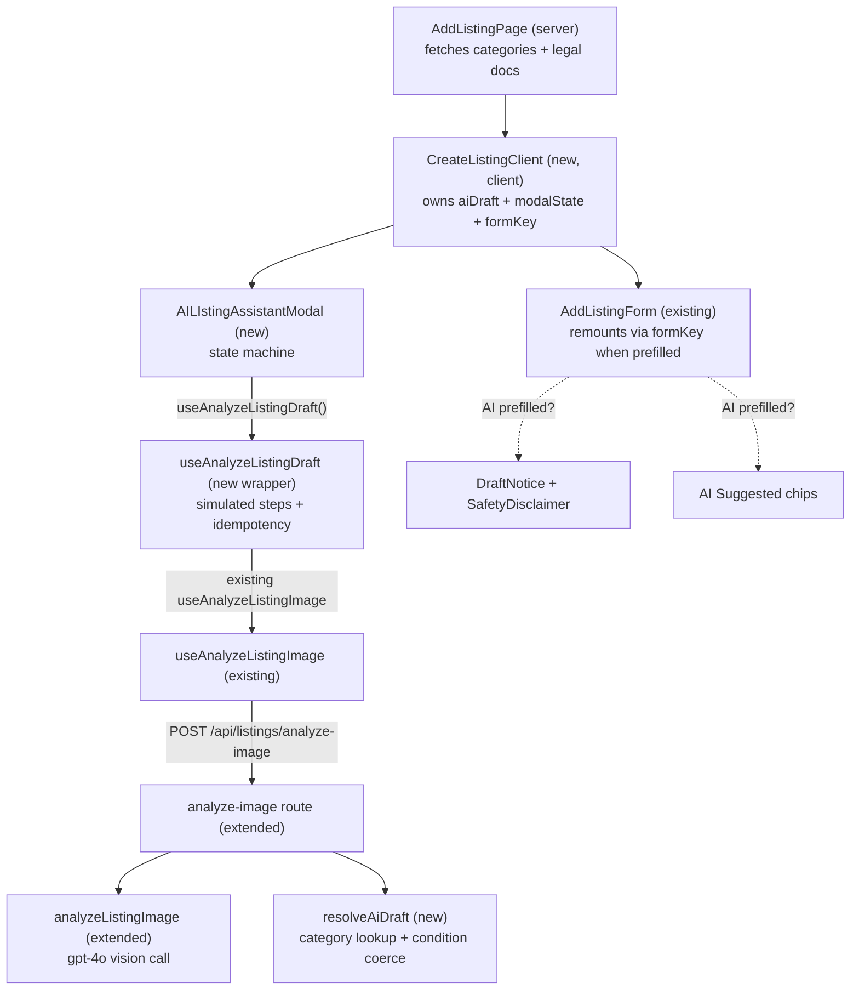
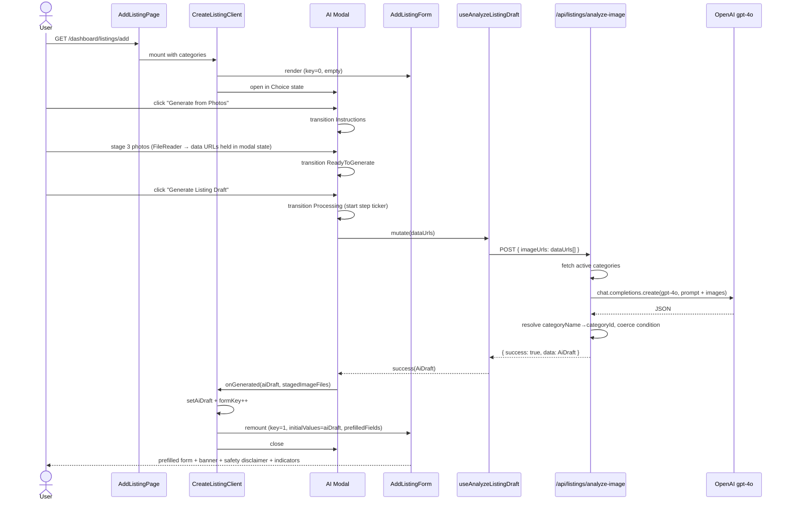

# AI Listing Assistant — Design Document

## Overview

This design productionizes the existing [analyze-listing-image](src/services/openai/analyze-listing-image.ts) prototype into the live create-listing flow at [src/app/dashboard/listings/add/page.tsx](src/app/dashboard/listings/add/page.tsx). The headline shape:

- A new client orchestrator wraps the existing [AddListingForm](src/features/listings/components/listing-form/add-listing-form.tsx) and a new **AI Listing Assistant modal**. The form mounts empty behind the modal on page load.
- The modal is a small client-side state machine (Choice → Instructions → ReadyToGenerate → Processing → Error). Selecting "Fill Out Manually" closes it; selecting AI keeps the same modal open through the entire AI flow.
- On AI success, the orchestrator stores an `aiDraft` and bumps a `formKey`, causing [AddListingForm](src/features/listings/components/listing-form/add-listing-form.tsx) to remount with `initialValues={aiDraft}` and an "AI prefill" context that drives the draft banner, the Safety-Notes disclaimer, and per-field "AI Suggested" indicators.
- The existing [/api/listings/analyze-image](src/app/api/listings/analyze-image/route.ts) route is extended to (a) inject the current active category catalog into the gpt-4o prompt at request time, (b) emit the canonical condition enum, (c) post-process the model response into an `AiDraft` shape with a resolved `categoryId`, and (d) enforce a per-user rate limit.
- No database schema changes. No new third-party dependencies.

This design intentionally chooses minimum surgery to the live form: the orchestrator and the modal are net-new; the form takes an opt-in `aiPrefilledFields` prop and otherwise behaves as today.

## Architecture

### High-level component layout



### End-to-end sequence (happy path)



### Mapping to requirements

- Form behind modal from landing → **Req 1.1**, **Req 7.1**.
- Modal-as-single-state-machine, manual dismisses in place, AI transitions in place → **Req 1.4, 1.5, 1.6**.
- Photos staged client-side as data URLs, no upload to blob → **Req 3.3, 4.6**.
- One generation per modal session enforced UI-side; per-user rate limit server-side → **Req 4.2, 4.3, 4.5**.
- Category resolved server-side using _active_ catalog → **Req 5.3, 5.4**.
- Condition mapped to canonical enum → **Req 5.5**.
- Brand/Model nullable left blank → **Req 5.6**.
- Reuse standard form, validation, blob pipeline, approval gate → **Req 10**.

## Components and Interfaces

### 1. `CreateListingClient` (new client orchestrator)

**Location:** [src/features/listings/components/listing-form/create-listing-client.tsx](src/features/listings/components/listing-form/create-listing-client.tsx) (new)

**Responsibility:** owns the modal+form composition and the AI prefill state. Replaces the direct `<AddListingForm>` render in [page.tsx](src/app/dashboard/listings/add/page.tsx).

```ts
type AiPrefilledFieldKey =
  | "name"
  | "description"
  | "categoryId"
  | "brand"
  | "model"
  | "condition"
  | "specifications"
  | "instructions"
  | "safetyNotes";

interface CreateListingClientProps {
  categories: Category[];
  ownerPolicyDocuments?: OwnerPolicyDocuments;
}

// Internal state
const [modalOpen, setModalOpen] = useState(true);
const [aiDraft, setAiDraft] = useState<AiDraft | null>(null);
const [stagedImages, setStagedImages] = useState<ImageFile[]>([]);
const [formKey, setFormKey] = useState(0);
const [modalDismissedThisSession, setDismissed] = useState(false);
```

**Behaviors:**

- Renders `<AddListingForm key={formKey} initialValues={initialFromAiDraft} aiPrefilledFields={...} ... />`.
- Renders `<AILIstingAssistantModal open={modalOpen && !modalDismissedThisSession} ... />` on top.
- `onGenerated(aiDraft, images)`: store both, `setFormKey(k => k + 1)`, close modal.
- `onManual()`: close modal, mark dismissed (so it does not auto-reopen per **Req 1.6**).
- `onCancelFromAi()`: close modal, mark dismissed, carry staged images forward by setting `stagedImages` so the remounted form starts with them (this enforces "photos preserved" per **Req 9.5**).

The page component ([page.tsx](src/app/dashboard/listings/add/page.tsx)) changes only its final render — `<AddListingForm ...>` becomes `<CreateListingClient ...>`.

### 2. `AILIstingAssistantModal` (new)

**Location:** `src/features/listings/components/ai-listing-assistant/ai-listing-assistant-modal.tsx` (new)

Built on the shadcn [Dialog](src/components/ui/dialog.tsx) primitive (consistent with existing dialogs in the codebase, e.g. [cancel-request-dialog](src/features/rentals/components/renting-lending/cancel-request-dialog.tsx)).

```ts
type ModalState =
  | { kind: "choice" }
  | { kind: "instructions"; staged: StagedPhoto[] } // staged.length may be 0
  | { kind: "processing"; startedAt: number; currentStepIndex: number }
  | { kind: "error"; reason: AiFailureReason; staged: StagedPhoto[] };

interface StagedPhoto {
  id: string; // uuid
  file: File;
  previewUrl: string; // URL.createObjectURL — revoke on remove
  dataUrl: string; // base64 string, computed lazily on Generate click
}

type AiFailureReason =
  | "low_confidence" // model returned but couldn't identify
  | "network"
  | "rate_limited"
  | "server";

interface Props {
  open: boolean;
  onManualSelected: () => void; // Choice → Manual
  onCancelFromAi: (staged: ImageFile[]) => void; // Cancel/X during AI flow
  onGenerated: (draft: AiDraft, images: ImageFile[]) => void;
}
```

Sub-views (single file or split, design-time decision):

- **ChoiceView** — two large buttons; copy uses "Generate from Photos" / "Fill Out Manually" per **Req 1.3**.
- **InstructionsView** — guidance content (per-photo-type with the _why_ copy from **Req 3.2**), photo picker reusing the existing [PhotosSection's](src/features/listings/components/listing-form/photos-section/photos-section.tsx) underlying file-picker primitives where reasonable; staged photos shown as previews via `URL.createObjectURL`; "Generate Listing Draft" button disabled when `staged.length === 0` per **Req 3.7**.
- **ProcessingView** — driven by `useSimulatedSteps` (below). Shows the scripted step list plus the "This usually takes less than 10 seconds" expectation per **Req 6.4**.
- **ErrorView** — message keyed by `AiFailureReason`, plus three actions: _Try again_ (re-enters Processing), _Add more photos_ (back to Instructions with previous photos retained), _Continue manually_ (closes modal, photos preserved) per **Req 9.2**.

**Constraints carried by the modal itself:**

- The modal does NOT support reopening after dismissal (**Req 1.6**) — the orchestrator controls `open`.
- The modal does NOT show the standard form's draft banner; the banner lives on the form (after the modal closes) per **Req 7.5**.

### 3. `useAnalyzeListingDraft` (new wrapper hook)

**Location:** `src/features/listings/hooks/use-analyze-listing-draft.ts` (new)

Thin wrapper over the existing `useAnalyzeListingImage` ([use-listing-mutations.ts:121](src/features/listings/hooks/use-listing-mutations.ts#L121)) that:

1. Lazily converts staged `File` objects to base64 data URLs (FileReader) before the request, so the modal only pays this cost on Generate click — matching **Req 4.6**.
2. Adds a per-modal-session **idempotency flag**: after the first successful response, subsequent calls are no-ops at the hook layer. UI also disables re-entry, but the hook is a belt-and-braces guard for **Req 4.3**.
3. Maps server failures to `AiFailureReason`:
   - HTTP 429 → `rate_limited`
   - HTTP 5xx / network error → `network` (with retry permitted)
   - HTTP 4xx (non-429) → `server`
   - HTTP 200 but `data` missing key high-signal fields (no `name` AND no `categoryId`) → `low_confidence`

```ts
function useAnalyzeListingDraft(opts: {
  onSuccess: (draft: AiDraft) => void;
  onFailure: (reason: AiFailureReason) => void;
}) {
  const analyze = useAnalyzeListingImage();
  const hasSucceededRef = useRef(false);

  return useMemo(
    () => ({
      isPending: analyze.isPending,
      generate: async (files: File[]) => {
        /* ... */
      },
    }),
    [analyze],
  );
}
```

### 4. `useSimulatedSteps` (new utility)

**Location:** `src/features/listings/components/ai-listing-assistant/use-simulated-steps.ts` (new)

A small hook that advances through a scripted step list on a timer while a promise is pending. Used to deliver the perceived-progress UX per **Req 6.2** without taking dependencies on streaming.

```ts
interface Step {
  id: string;
  label: string;
  minMs: number;
}
function useSimulatedSteps(
  active: boolean,
  steps: Step[],
): {
  currentStepIndex: number;
  completedSteps: Step[];
  finalize: () => void; // call when the network call resolves; fast-forwards to last step
};
```

Script (initial values; tuneable):

| #   | label                            | minMs |
| --- | -------------------------------- | ----- |
| 1   | Analyzing photos…                | 600   |
| 2   | Identifying brand and model      | 1200  |
| 3   | Reviewing visible specifications | 1200  |
| 4   | Drafting title and description   | 1500  |
| 5   | Preparing your listing draft     | 800   |

If the network resolves before step 5, `finalize()` advances to step 5 and waits 400 ms before transitioning out (avoids a jarring "instant complete"). If the network resolves _after_ step 5, the step stays on "Preparing your listing draft" with subtle indeterminate motion. This keeps progress honest in both directions.

### 5. `DraftNotice` and `SafetyDisclaimer` (new view primitives)

**Location:**

- `src/features/listings/components/listing-form/draft-notice.tsx` (new)
- `src/features/listings/components/listing-form/safety-disclaimer.tsx` (new)

`DraftNotice` is a non-dismissible top-of-form banner using the existing [Alert](src/components/ui/alert.tsx) primitive with attention styling. Rendered by `AddListingForm` when `aiPrefilledFields` is non-empty. Implements **Req 7.5**.

`SafetyDisclaimer` is rendered by [AdditionalDetailsSection](src/features/listings/components/listing-form/additional-details-section.tsx) adjacent to the Safety Notes textarea, when AI prefilled either `safetyNotes` or `instructions`. Uses a destructive/warning variant of `Alert` to be visually distinct from the general `DraftNotice`. Implements **Req 7.6**.

### 6. `AiPrefillContext` (new)

**Location:** `src/features/listings/components/listing-form/ai-prefill-context.tsx` (new)

```ts
interface AiPrefillContextValue {
  prefilledFields: ReadonlySet<AiPrefilledFieldKey>;
}
const AiPrefillContext = createContext<AiPrefillContextValue | null>(null);
export function useAiPrefill() {
  /* returns ctx or null */
}
```

`AddListingForm` wraps its children in this provider when `aiPrefilledFields` is non-empty (and not at all otherwise — so the manual flow has zero behavioral change). Individual form sections call `useAiPrefill()` and may render an `AISuggestedBadge` adjacent to fields whose keys are in `prefilledFields`. Implements **Req 7.4**.

### 7. `AddListingForm` modifications

**Location:** [src/features/listings/components/listing-form/add-listing-form.tsx](src/features/listings/components/listing-form/add-listing-form.tsx)

Changes:

- Add optional prop `aiPrefilledFields?: ReadonlyArray<AiPrefilledFieldKey>`.
- When present and non-empty:
  - Render `<DraftNotice />` immediately above the Photos section.
  - Wrap children in `<AiPrefillContext.Provider value={{ prefilledFields: new Set(aiPrefilledFields) }}>`.
- Section order is updated to put Photos first per **Req 2.1** (the file already renders the sections — only their order needs adjusting).
- No change to validation, submit flow, or `useListingFormSubmit`. AI prefill flows through `initialValues` already supported by [useListingForm](src/features/listings/hooks/use-listing-form.ts).

### 8. `analyze-image` route extensions

**Location:** [src/app/api/listings/analyze-image/route.ts](src/app/api/listings/analyze-image/route.ts)

Changes (additive — existing test page consumers continue to work, but the route now returns a richer `data` payload):

1. Fetch active categories at request time (DAL `listingDAL.getListingCategories()`).
2. Pass category names into `analyzeListingImage(imageUrls, { categoryNames, conditionEnum })` (signature extended below).
3. After OpenAI responds, run `resolveAiDraft(raw, categories)`:
   - `categoryId`: case-insensitive trim match on `categoryName` → category UUID; `null` if no match.
   - `condition`: assert membership in `["new","good","fair","poor"]`; `null` if not.
   - `brand`/`model`: pass through as `string | null` (no fabrication).
   - `specifications`: pass through, drop entries with empty string values.
   - `name`, `description`, `instructions`, `safetyNotes`: pass through.
4. Return `{ success: true, data: AiDraft }` (shape below).
5. Apply rate limit middleware before invoking OpenAI (see Error Handling).

The route is the single place that owns the "AI output → form-ready prefill" contract. Clients never see raw category names or `excellent` condition values.

### 9. `analyzeListingImage` service extensions

**Location:** [src/services/openai/analyze-listing-image.ts](src/services/openai/analyze-listing-image.ts)

Signature changes from `analyzeListingImage(imageUrls)` to:

```ts
interface AnalyzeOptions {
  categoryNames: string[];  // injected into prompt
  conditionEnum: readonly ["new","good","fair","poor"]; // injected into prompt
}
analyzeListingImage(imageUrls: string | string[], opts: AnalyzeOptions): Promise<RawAiResponse>;
```

The prompt is updated to:

- Frame the role around a "rental marketplace for items, tools, and equipment" rather than a "tool rental platform" — half the active category catalog (Kids & Baby, Party Equipment, Cleaning, Miscellaneous) is not tool-shaped, and tool-specific framing biased the model's identification and spec keys.
- Render the category list dynamically from `opts.categoryNames` (no hardcoded 8-item list). When no category clearly fits, the prompt directs the model to use `"Miscellaneous"` rather than guessing the closest — aligns with **Req 5.3** (leave Category unset rather than assign incorrectly).
- Render the condition list dynamically from `opts.conditionEnum` and emit only those values (replaces the current `excellent` → `new` mismatch at the source per **Req 5.5**).
- Continue to emit `null` for brand/model when not visible (favoring blank over guesses per **Req 5.6**).
- Treat `specifications` as a free-form `Record<string, string>` rather than a fixed `power | weight | dimensions | material` skeleton. The prompt instructs the model to emit 1–4 short, lowercase, common-noun keys appropriate to the item (examples cover non-tool categories: "capacity" for a cooler, "seating" for a tent, "age range" for a baby item). The downstream resolver, the `AiDraft` schema, and the form's specifications UI already accept arbitrary keys, so no resolver or UI changes are required.

`temperature` and `max_tokens` are unchanged.

## Data Models

### Client-side: `AiDraft` (canonical contract between modal and form)

```ts
interface AiDraft {
  name: string | null;
  description: string | null;
  categoryId: string | null; // resolved UUID (or null if AI couldn't pick a valid category)
  brand: string | null;
  model: string | null;
  condition: "new" | "good" | "fair" | "poor" | null;
  specifications: Record<string, string>; // empty object if none
  instructions: string | null;
  safetyNotes: string | null;
}
```

Conversion to form `initialValues`:

```ts
function aiDraftToInitialValues(
  d: AiDraft,
  images: ImageFile[],
): Partial<CreateListingFormClientValues> {
  return {
    ...(d.name ? { name: d.name } : {}),
    ...(d.description ? { description: d.description } : {}),
    ...(d.categoryId ? { categoryId: d.categoryId } : {}),
    ...(d.brand ? { brand: d.brand } : {}),
    ...(d.model ? { model: d.model } : {}),
    ...(d.condition ? { condition: d.condition } : {}),
    ...(Object.keys(d.specifications).length > 0
      ? { specifications: d.specifications }
      : {}),
    ...(d.instructions ? { instructions: d.instructions } : {}),
    ...(d.safetyNotes ? { safetyNotes: d.safetyNotes } : {}),
    images,
  };
}
```

`aiPrefilledFields` for the form context is computed in lockstep — the keys whose values were emitted.

### Server-side: `RawAiResponse` (private to the route)

```ts
interface RawAiResponse {
  name: string;
  description: string;
  categoryName: string;
  brand: string | null;
  model: string | null;
  condition: string; // expected new|good|fair|poor; coerced if not
  specifications: Record<string, string>;
  instructions: string;
  safetyNotes: string;
}
```

Validated with a `z.object` parser (`safeParse`); a parse failure routes to the `low_confidence` error path rather than 500ing.

### Field mapping table

| AI raw           | →   | Form field                                                                                 | Coercion rules                                                                                         |
| ---------------- | --- | ------------------------------------------------------------------------------------------ | ------------------------------------------------------------------------------------------------------ |
| `name`           | →   | `name` (required)                                                                          | nullable on failure; if null, no prefill                                                               |
| `description`    | →   | `description` (required)                                                                   | nullable on failure; if null, no prefill                                                               |
| `categoryName`   | →   | `categoryId`                                                                               | server case-insensitive match on active catalog; null if no match                                      |
| `brand`          | →   | `brand` (optional)                                                                         | pass through; null preserved                                                                           |
| `model`          | →   | `model` (optional)                                                                         | pass through; null preserved                                                                           |
| `condition`      | →   | `condition` (enum)                                                                         | assert in `new\|good\|fair\|poor`; null if not                                                         |
| `specifications` | →   | `specifications` (jsonb)                                                                   | drop empty-string values                                                                               |
| `instructions`   | →   | `instructions` (optional)                                                                  | pass through                                                                                           |
| `safetyNotes`    | →   | `safetyNotes` (optional)                                                                   | pass through                                                                                           |
| —                |     | dailyRate, weekly, monthly, deposit, delivery*, setup*, periods, ownerPoliciesAcknowledged | never set by AI; default values from [useListingForm](src/features/listings/hooks/use-listing-form.ts) |
| StagedPhoto[]    | →   | `images`                                                                                   | carried from modal; existing upload pipeline runs on submit                                            |

### No database schema changes

Critically, this design adds **no new tables, columns, indexes, or migrations**. Listings, listing_images, and listing_categories are untouched. The "AI-assistedness" of a listing is purely a transient client state and is not persisted (and there is no current business reason to persist it; if metrics later require persistence, it would be added in a follow-up).

## Error Handling

### Failure modes and user-facing responses

| Mode                                                                                   | Detection                                            | UX (Req 9)                                                                                    |
| -------------------------------------------------------------------------------------- | ---------------------------------------------------- | --------------------------------------------------------------------------------------------- |
| OpenAI HTTP/timeout failure                                                            | mutation `onError` with non-429 5xx or network error | Error state, `reason="network"`, _Try again_ + _Continue manually_                            |
| OpenAI returns malformed/unparseable JSON                                              | `z.safeParse(RawAiResponse).success === false`       | Error state, `reason="low_confidence"`, _Add more photos_ + _Try again_ + _Continue manually_ |
| OpenAI returns parseable JSON but key fields missing (no `name` AND no `categoryName`) | post-resolve check                                   | Same as above (`low_confidence`)                                                              |
| Rate limit hit                                                                         | HTTP 429 from route                                  | Error state, `reason="rate_limited"`, _Continue manually_ only                                |
| Category cannot be resolved                                                            | `categoryId === null` after lookup                   | Not an error — proceed with `categoryId` left blank per **Req 5.3, 5.6**                      |
| Condition not in enum                                                                  | post-resolve check                                   | Not an error — proceed with `condition` left blank per **Req 5.5, 5.6**                       |

User-facing copy never references OpenAI, gpt-4o, "inference," or technical error messages (**Req 6.3**, **Req 9.1**). All failures are logged server-side via the existing `withRequestLogging` wrapper (already in place on the route) with sufficient context (userId, image count, parse error if applicable) to debug **Req 9.4**.

### Server-side rate limiting

Per-user limit: **10 successful invocations per user per hour**, enforced in the route handler before invoking OpenAI. Implementation uses an in-memory token bucket per user keyed by `userId`, with a TTL window. (Note: in a multi-instance deployment, this would migrate to a shared store such as Upstash; for current single-region Vercel deployment, in-memory is adequate. Flagged as a Decision below.)

Failed calls do **not** consume tokens; only HTTP 200 + valid `RawAiResponse` parse consume. This prevents users getting stuck behind their own failures.

UI-side, the modal further restricts to **one successful generation per modal session** via `useAnalyzeListingDraft`'s `hasSucceededRef` (**Req 4.3**). Together these satisfy "explicit user action; one-shot per draft; cost-bounded across sessions."

### What is intentionally not handled

- AI inferring invalid `categoryName` outside the active catalog — handled by leaving `categoryId` blank rather than retrying or warning the user.
- AI returning `condition="excellent"` after the prompt update — should not happen post-prompt-fix, but defensive code still leaves `condition` blank. No alert is surfaced.
- Concurrent modal re-opens after success — prevented by `modalDismissedThisSession` per **Req 1.6**; no error state needed.

## Telemetry / Instrumentation

Events emitted (names indicative; align with existing analytics conventions during implementation):

| Event                                        | When                                  | Payload                                                                                                              |
| -------------------------------------------- | ------------------------------------- | -------------------------------------------------------------------------------------------------------------------- |
| `listing_create_modal_opened`                | modal mounts in Choice state          | `{ entryPath: "create_listing_page" }`                                                                               |
| `listing_create_choice_selected`             | Choice button click                   | `{ choice: "ai" \| "manual" }`                                                                                       |
| `listing_ai_photos_staged`                   | photo added/removed in Instructions   | `{ count }`                                                                                                          |
| `listing_ai_generation_started`              | Generate click                        | `{ photoCount }`                                                                                                     |
| `listing_ai_generation_succeeded`            | mutation success                      | `{ photoCount, latencyMs, prefilledFields: AiPrefilledFieldKey[], categoryResolved: bool, conditionResolved: bool }` |
| `listing_ai_generation_failed`               | mutation failure                      | `{ photoCount, latencyMs, reason: AiFailureReason }`                                                                 |
| `listing_ai_continue_manually_after_failure` | error → manual button                 | `{ reason }`                                                                                                         |
| `listing_submitted` (existing or extended)   | form submit success                   | extend payload: `{ usedAi: bool, prefilledFieldsCount: number, editedAiFieldsCount: number }`                        |
| `listing_create_abandoned` (if exists)       | unmount with form dirty and no submit | `{ usedAi: bool }`                                                                                                   |

The `editedAiFieldsCount` value is computed at submit time by comparing the final form values against the `aiDraft` stored by the orchestrator. This directly powers the **Req 12.2** "average edits after generation" metric.

Server side, log per request: `userId`, `photoCount`, `latencyMs`, `rateLimitTokensRemaining`, `parseSucceeded`, `categoryResolved`, `conditionResolved`. The route's existing `withRequestLogging` provides the request frame.

## Testing Strategy

### Unit tests (Vitest)

- `resolveAiDraft` — pure function: covers happy path, no-match category, invalid condition, null brand/model, empty specifications, malformed input safeParse failure.
- `aiDraftToInitialValues` — covers each field's null-suppression behavior so that null values do not overwrite form defaults.
- `useSimulatedSteps` — covers: ticker advances on schedule; `finalize()` fast-forwards but holds final step for the 400 ms grace; component does not advance past the final step when the network is slow.
- `useAnalyzeListingDraft` — covers: idempotency (second `generate` call no-ops after success); error mapping (429 → `rate_limited`, 5xx → `network`, parse failure → `low_confidence`); FileReader conversion.
- Modal state machine — pure reducer covering every transition in the state diagram, including: Choice→Manual, Choice→Instructions, Instructions↔(photos staged), Instructions→Closed via cancel, ReadyToGenerate→Processing, Processing→Closed, Processing→Error, Error→Processing/Instructions/Closed.

### Component tests (React Testing Library)

- `ChoiceView` renders both options and emits the correct callback.
- `InstructionsView` shows guidance copy with all four photo types; disables Generate when no photos staged.
- `ProcessingView` renders steps in order; renders the "less than 10 seconds" expectation; renders evidence callouts only for fields actually present in the AiDraft (e.g. asserts no "We found a model number" when `model: null`).
- `ErrorView` renders correct copy + actions per `AiFailureReason` (rate_limited gets only "Continue manually").
- `DraftNotice` is non-dismissible (no close button rendered).
- `SafetyDisclaimer` renders adjacent to the Safety Notes textarea only when `safetyNotes` is in `prefilledFields` (or `instructions`).
- `AddListingForm` with `aiPrefilledFields=[]` renders identically to today (no banner, no disclaimer, no indicators).

### Integration tests (Vitest)

- The full server route: mocked OpenAI client + real category DAL fixture; asserts `categoryName` "Power Tools" → resolved UUID; `condition` "excellent" (legacy) → null; missing required fields → `low_confidence`-shaped 200 response.
- Rate-limit middleware: 11th call within window returns 429.
- Prompt construction includes all _active_ category names from the DAL.

### E2E tests (Playwright, in [e2e/](e2e/))

- AI happy path: visit `/dashboard/listings/add`, modal opens in Choice state, select AI, upload 3 fixture images, click Generate, wait for prefilled form, assert banner visible, assert safety disclaimer visible, assert at least one "AI Suggested" indicator visible, submit, assert listing created with `approvalStatus = pending_review` (existing assertion pattern from listings e2e).
- Manual path from Choice: modal opens, click Manual, modal closes, form interactable, no banner.
- Cancel from AI: open AI flow, stage photos, click Cancel, modal closes, photos retained in form, no banner.
- Failure path: mock the analyze endpoint to 500, assert error state in modal with "Try again" + "Continue manually"; click "Continue manually" and proceed.

These align with the existing test-plan conventions (`4-test-plan.md`, `4-e2e-test-plan.md`, `4-uat-test-plan.md` in [specs/listings/](specs/listings/)). The full mapping into those documents happens in Phase 4.

## Decisions and Rationale

1. **Reuse `useAnalyzeListingImage` instead of writing a new mutation.** The hook already wraps the route correctly; introducing a parallel mutation would split error handling.
2. **Wrap with `useAnalyzeListingDraft` rather than extending `useAnalyzeListingImage` directly.** The wrapper owns the orchestration-specific concerns (FileReader conversion, simulated-steps coordination, idempotency, error mapping). Keeping `useAnalyzeListingImage` thin preserves the test page and any other internal consumers.
3. **Server resolves categoryId and condition.** Centralizing the AI-output → form-contract translation in the route (a) prevents the client from needing to know the active category list for resolution, (b) makes the contract typed and testable, (c) keeps the test page working unchanged because the route's `data` is a strict superset of what existed before.
4. **Update the gpt-4o prompt to emit canonical condition enum.** Cheaper and safer than client-side coercion. Eliminates the [listing.schema.ts:96](src/features/listings/form-schema/listing.schema.ts#L96) "excellent" mismatch at the source.
5. **Inject categories into the prompt dynamically.** Prevents the catalog from drifting from the prompt (currently 8 vs. 10).
6. **Remount the form via `formKey` on AI success rather than lifting the form state.** The form is empty during the modal flow because the modal blocks interaction; remount carries no user-data loss and avoids a large refactor of `AddListingForm`'s internals.
7. **Per-user rate limit instead of per-draft enforcement.** True per-draft enforcement would require a server-issued draft token; for MVP the cost concern is bounded by per-user limits plus UI one-shot. Per-draft tokens are a clean follow-up if abuse appears.
8. **In-memory rate limit for MVP.** Acceptable in a single Vercel region; flagged for migration to a shared store (e.g. Upstash) if multi-region or autoscaled.
9. **No persistence of AI-draft metadata in the DB.** Metrics needs are met by event payloads. Adds zero schema risk.
10. **Drop SerpAPI completely from this feature.** The test page's auto-trigger to `/api/test-serp` does not migrate to production; the feature's pricing remains 100% manual per **Req 5.8, 5.9**.
11. **Safety-Notes disclaimer uses warning-styled `Alert`, not a destructive variant.** Visually distinct without implying the field itself is broken; preserves "polished marketplace workflow" framing per **Req 11.3**. (Open to escalation if legal/product wants stronger language.)

## Open / Follow-up Items (not blocking)

- Decision on a separate **owner acknowledgment checkbox** for AI-drafted Safety Notes (flagged in `1-requirements.md` Assumptions). Defaulted to "not in MVP" but easy to add: an additional Zod `aiSafetyNotesAcknowledged` field gated by `aiPrefilledFields.has("safetyNotes")`. Implementation lift: ~half a day.
- Migration of the rate limiter to a shared store when multi-instance demands it.
- Telemetry event names need to be reconciled with the existing analytics naming convention during the Tasks phase.

## Requirements Traceability

| Requirement                                                                            | Design element                                                                                          |
| -------------------------------------------------------------------------------------- | ------------------------------------------------------------------------------------------------------- |
| R1 (entry choice; modal-as-state-machine; no auto-reopen)                              | `CreateListingClient` state + `AILIstingAssistantModal` state machine; `modalDismissedThisSession` flag |
| R2 (Photos first in both flows)                                                        | `AddListingForm` section reordering                                                                     |
| R3 (staged photos + guidance + camera + cancel)                                        | `InstructionsView`, `StagedPhoto`, `useSimulatedSteps` orchestration                                    |
| R4 (explicit trigger; one-shot; server-side enforcement)                               | `useAnalyzeListingDraft.hasSucceededRef` + route rate limit                                             |
| R5 (gpt-4o; category resolution; condition; nulls; no pricing)                         | extended `analyzeListingImage` + `resolveAiDraft` + prompt update                                       |
| R6 (processing UX; simulated steps + evidence callouts)                                | `ProcessingView` + `useSimulatedSteps` + evidence selectors                                             |
| R7 (prefilled review form; indicators; draft banner; safety disclaimer; manual submit) | `AddListingForm` + `AiPrefillContext` + `DraftNotice` + `SafetyDisclaimer`                              |
| R8 (photos persist; no auto-reprocess; no regeneration)                                | `aiPrefilledFields` snapshot doesn't trigger re-analysis; modal is single-shot                          |
| R9 (graceful errors; low-confidence; recovery)                                         | `AiFailureReason` + `ErrorView` + `low_confidence` parse fallback                                       |
| R10 (reuse standard flow; approval gate)                                               | orchestrator wraps existing `AddListingForm`; no changes to submit pipeline                             |
| R11 (trust/control/mobile-first/predictability)                                        | all interaction in modal; explicit triggers; shadcn primitives consistent with rest of app              |
| R12 (instrumentation for primary + secondary metrics)                                  | event list in Telemetry section                                                                         |
