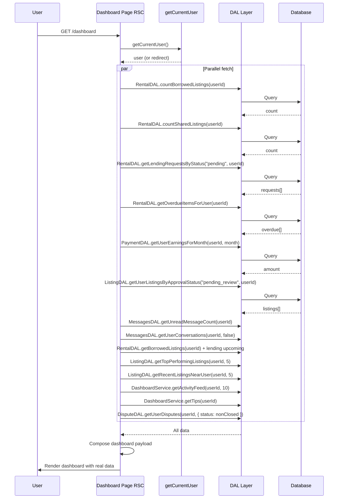

# User Dashboard - Design Document

## Overview

This design document describes the technical architecture and implementation approach for the User Dashboard feature at `/dashboard`. The dashboard is the main landing page for authenticated users and must display real data from the application's data access layer (DAL). All hardcoded content (alerts, pending requests, summary stats, activity feed, schedule, analytics) is replaced with server-side data. New widgets (Quick Actions, Unread Messages, Top Performing Tools, Neighborhood Activity, Tips & Suggestions, Active Disputes) are added. The Reward Points section is removed. The architecture follows the existing Hoador patterns: server-side data fetching in a React Server Component (RSC), React Query for client-side mutations where applicable, and no new external APIs.

**Requirements traceability:** This design satisfies [specs/dashboard/1-requirements.md](specs/dashboard/1-requirements.md) (Requirements 1–14 and Non-Functional Requirements).

## Architecture

### High-Level Architecture

The dashboard uses a single RSC page that fetches all widget data in parallel and passes it to presentational components. Client components are used only where interactivity or client-side state (e.g., existing React Query hooks) is required.

```
┌─────────────────────────────────────────────────────────────────────────┐
│                     Presentation Layer                                    │
│  - Dashboard Page (RSC) - src/app/dashboard/page.tsx                     │
│  - PageHeader, ScrollToTop (existing)                                     │
│  - Quick Actions Bar (RSC or client)                                      │
│  - Summary Cards, Overdue Alerts, Pending Requests, Pending Review         │
│  - Unread Messages, Mini-Analytics, Activity Feed, Upcoming Schedule      │
│  - Top Performing Tools, Neighborhood Activity, Tips, Active Disputes      │
└────────────────────────────────┬────────────────────────────────────────┘
                                 │ props (dashboard data)
┌────────────────────────────────▼────────────────────────────────────────┐
│                     Application Layer                                     │
│  - Server Component data fetching (getCurrentUser + parallel DAL calls)  │
│  - Optional: React Query in client widgets (e.g. PendingReviewWidget)     │
│  - No new API routes for dashboard (data fetched in RSC)                  │
└────────────────────────────────┬────────────────────────────────────────┘
                                 │
┌────────────────────────────────▼────────────────────────────────────────┐
│                     Data Access Layer (DAL)                               │
│  - RentalDAL (counts, overdue, pending requests, borrowed, schedule)      │
│  - ListingDAL (pending review, top performing, neighborhood)             │
│  - PaymentDAL (earnings for month; extend if needed)                      │
│  - MessagesDAL (unread count, recent conversations)                      │
│  - DisputeDAL (active disputes for user)                                 │
│  - ReviewDAL (if needed for activity / top tools)                        │
└────────────────────────────────┬────────────────────────────────────────┘
                                 │
┌────────────────────────────────▼────────────────────────────────────────┐
│                     Database Layer                                        │
│  - rental_requests, rentals, listings, listing_images, user              │
│  - payments, conversations, messages                                      │
│  - disputes (with rental relation)                                        │
└─────────────────────────────────────────────────────────────────────────┘
```

### Data Flow



**Design decision:** One RSC load with parallel DAL calls avoids multiple client round-trips and keeps the dashboard fast and simple. Widgets that today use React Query (e.g. `PendingReviewWidget` with `usePendingListingsCount`) can remain client-side for consistency with garage/listings, or be refactored to receive server-injected count when the dashboard page is implemented; the design allows either. Requirement 2 (summary cards) and NFRs (load within 3s, no N+1) are met by batching and parallelizing.

### Component Architecture

| Component                    | Type                     | Responsibility                                                                        | Requirements |
| ---------------------------- | ------------------------ | ------------------------------------------------------------------------------------- | ------------ |
| `src/app/dashboard/page.tsx` | RSC                      | Auth check, parallel data fetch, layout, pass data to widgets                         | Req 1        |
| PageHeader                   | Existing                 | Greeting (user first name), description                                               | Req 1        |
| QuickActionsBar              | RSC or client            | Links: List a Tool, Browse Tools, View Messages, optional View Rentals, Profile       | Req 6        |
| DashboardSummaryCards        | RSC                      | Four cards: Active Rentals, Tools Lent, Pending Requests, This Month Earnings         | Req 2        |
| OverdueAlertsWidget          | RSC                      | List overdue items (borrower + lender), link each to rental/request detail            | Req 3        |
| PendingRequestsWidget        | RSC                      | List pending lending requests, link each to request detail (no inline Accept/Decline) | Req 4        |
| PendingReviewWidget          | Client (existing) or RSC | Count/listings pending review, link to garage?tab=pending_review                      | Req 5        |
| UnreadMessagesWidget         | RSC                      | Unread count + recent conversations preview, link to mailbox/conversation             | Req 7        |
| MiniAnalyticsSection         | RSC                      | Rentals per period, earnings trend, inventory usage (real aggregations)               | Req 8        |
| RecentActivityFeed           | RSC                      | Composite activity list (rentals, requests, reviews, listings), link to detail        | Req 9        |
| UpcomingScheduleWidget       | RSC                      | Next 7 days: returns, pickups; links to rental detail / messaging                     | Req 10       |
| TopPerformingToolsWidget     | RSC                      | Top 3–5 listings by rentals or rating, link to listing/garage                         | Req 11       |
| NeighborhoodActivityWidget   | RSC                      | Recent listings near user (or platform-wide recent if no location)                    | Req 12       |
| TipsSuggestionsWidget        | RSC                      | Rule-based tips from user/listing data, link to profile/garage/listing                | Req 13       |
| ActiveDisputesWidget         | RSC                      | Count + list of active disputes, link to dispute detail/list                          | Req 14       |

**Layout order (Req 1):** Header → Alerts row (Pending Review + Overdue) → Pending Requests (if any) → Summary cards (4) → Quick Actions → Unread Messages (if used) → Two-column: Activity Feed + Upcoming Schedule; below: Mini-Analytics → Top Performing, Neighborhood, Tips, Active Disputes (order can be tuned in implementation). Sections with no data show empty state or are hidden per requirements.

## Components and Interfaces

### Dashboard Page (RSC)

The page fetches the current user, then in a single parallel block loads all data needed for every widget. No `DASHBOARD_PAGE` or other hardcoded dashboard constants are used for alerts or pending requests.

```typescript
// src/app/dashboard/page.tsx (conceptual)
export const dynamic = "force-dynamic";

export default async function DashboardPage() {
  const user = await getCurrentUser();
  if (!user) redirect to sign-in;

  const userId = user.id;
  const now = new Date();
  const startOfMonth = new Date(now.getFullYear(), now.getMonth(), 1);
  const endOfMonth = new Date(now.getFullYear(), now.getMonth() + 1, 0);

  const [
    activeRentalsCount,
    toolsLentCount,
    pendingRequests,
    overdueItems,
    earningsThisMonth,
    pendingReviewListings,
    unreadCount,
    recentConversations,
    borrowedAndLendingUpcoming,
    topPerformingListings,
    neighborhoodListings,
    activityFeedItems,
    tips,
    activeDisputes,
  ] = await Promise.all([
    rentalDAL.countBorrowedListings(userId),
    rentalDAL.countSharedListings(userId),
    rentalDAL.getLendingRequestsByStatus("pending", userId),
    rentalDAL.getOverdueItemsForUser(userId),           // New or derived
    paymentDAL.getUserEarningsForMonth(userId, startOfMonth, endOfMonth), // New or derived
    listingDAL.getUserListingsByApprovalStatus("pending_review", userId),
    messagesDAL.getUnreadMessageCount(userId),
    messagesDAL.getUserConversations(userId, false).then(c => c.slice(0, 3)),
    getUpcomingSchedule(userId),                         // New helper: borrowed + lending next 7 days
    listingDAL.getTopPerformingListings(userId, 5),     // New method or service
    listingDAL.getRecentListingsNearUser(userId, 5),     // New method or fallback
    getDashboardActivityFeed(userId, 10),                // New service/helper
    getDashboardTips(userId),                            // New service/helper
    disputeDAL.getUserDisputes(userId, { status: nonClosed, limit: 5 }),
  ]);

  return (
    <div className="space-y-6">
      <PageHeader title={greeting(user.firstName)} description={...} />
      <QuickActionsBar />
      <div className="grid gap-4 lg:grid-cols-2">
        <PendingReviewWidget count={pendingReviewListings.length} /> {/* or keep client hook */}
        {overdueItems.length > 0 && <OverdueAlertsWidget items={overdueItems} />}
        {pendingRequests.length > 0 && (
          <PendingRequestsWidget items={pendingRequests.slice(0, 2)} totalCount={pendingRequests.length} />
        )}
      </div>
      <DashboardSummaryCards
        activeRentals={activeRentalsCount}
        toolsLent={toolsLentCount}
        pendingRequests={pendingRequests.length}
        earningsThisMonth={earningsThisMonth}
      />
      {/* ... remaining widgets with passed-in data ... */}
    </div>
  );
}
```

**PendingReviewWidget:** The existing widget uses `usePendingListingsCount()` (React Query). Options: (A) Keep as-is for consistency with garage; (B) Refactor to accept optional server-injected `count`/`listings` when rendered from dashboard to avoid double fetch. Design allows either; implementation can choose (B) for fewer client requests.

### Pending Requests Widget (link to detail only)

Per Requirement 4, the widget does not expose Accept/Decline buttons; each row links to the rental request detail page where the user can approve or decline.

- **Route for request detail:** Use existing route for viewing a single lending request (e.g. `/dashboard/rentals/lending/request/[id]` or equivalent). Each `pendingRequests[i]` has `id` (rental request id); link to that URL.
- **Display:** Listing name, requester name, status text (e.g. "X days left to respond"), single primary link "View request" or use the row as the link.

### New or Extended DAL Methods

| Method                                                   | Layer           | Purpose                                                                                                                                                                                | Requirements |
| -------------------------------------------------------- | --------------- | -------------------------------------------------------------------------------------------------------------------------------------------------------------------------------------- | ------------ |
| `RentalDAL.getOverdueItemsForUser(userId)`               | DAL             | Overdue as borrower (endDate < today, status approved/active) + as owner (renter has not returned). Return list with listing name, other party, days late, rental/request id for link. | Req 3        |
| `PaymentDAL.getUserEarningsForMonth(userId, start, end)` | DAL             | Sum of payments where user is payee and payment date in [start, end], status succeeded.                                                                                                | Req 2        |
| `ListingDAL.getTopPerformingListings(userId, limit)`     | DAL             | User's listings ordered by rental count (or rating) desc, limit N. Use rental_requests/listings/reviews as needed.                                                                     | Req 11       |
| `ListingDAL.getRecentListingsNearUser(userId, limit)`    | DAL             | If user/listings have location: recent listings near user. Else: platform-wide recent listings (or hide widget).                                                                       | Req 12       |
| `getDashboardActivityFeed(userId, limit)`                | Service or page | Composite: recent rental requests (as renter/owner), completed rentals, new/updated listings, reviews received. Sort by date desc, take `limit`.                                       | Req 9        |
| `getDashboardTips(userId)`                               | Service or page | Rule-based: e.g. "Add photos" if any listing has no images, "Complete profile" if missing fields, "Set competitive price" for low-rent listings. Return 1–3 tips with optional link.   | Req 13       |
| `getUpcomingSchedule(userId)`                            | Service or page | From RentalDAL.getBorrowedListings (upcoming + current) and lending approved/active; build list of events (return due, pickup due) for next 7 days; sort by date.                      | Req 10       |

**Analytics (Req 8):** Use existing or small extensions:

- Rentals per week: query rental_requests (or rentals) grouped by week for user (as renter or owner).
- Earnings trend: PaymentDAL.getUserEarningsForMonth for last few months (or new `getUserEarningsByMonthRange`).
- Inventory usage: ListingDAL counts (active vs inactive/archived) to compute percentage.

All of the above must run server-side and return plain data (no fake values).

## Data Models

### Dashboard payload types (for RSC → widgets)

```typescript
// Types used by dashboard page and widgets (can live in src/features/dashboard/types.ts or similar)

interface DashboardSummary {
  activeRentalsCount: number;
  toolsLentCount: number;
  pendingRequestsCount: number;
  earningsThisMonth: number; // cents or decimal; format in UI
}

interface OverdueItem {
  id: string; // rental or rental request id
  listingName: string;
  statusText: string; // e.g. "3 days late"
  otherPartyName: string;
  linkTo: string; // rental or request detail URL
}

interface PendingRequestItem {
  id: string;
  listingName: string;
  requesterName: string;
  statusText: string;
  requestDetailUrl: string;
}

interface ActivityFeedItem {
  id: string;
  title: string;
  description?: string;
  timestamp: Date;
  relativeTime: string; // "2 hours ago"
  linkTo?: string;
  icon?: string;
}

interface ScheduleEntry {
  date: Date;
  description: string;
  linkTo?: string;
  type: "return" | "pickup" | "other";
}

interface TopPerformingListing {
  listingId: string;
  name: string;
  metricText: string; // "5 rentals" or "4.8 stars"
}

interface DashboardTip {
  text: string;
  linkTo?: string;
}
```

Existing DAL types (e.g. `LendingRequestItem`, `ConversationSummary`, `DisputeWithRelations`) are reused where applicable; the above are for dashboard-specific views and links.

### Removal of hardcoded constants

- Delete or stop importing from `src/constants/dashboard.ts` the arrays and labels used for alerts and pending requests. The dashboard page and widgets use only the data fetched from the DAL and the types above.

## Error Handling

1. **Unauthenticated user:** Redirect to sign-in before any DAL calls. (Req 1.)
2. **Single-widget DAL failure:** Catch errors per logical widget (e.g. one try/catch per Promise.all segment or per helper). On failure: log the error; pass empty array/zero or an error flag to that widget. Widget renders empty state or a short “Unable to load” message; rest of dashboard still renders. (NFR Reliability.)
3. **Missing user profile (e.g. firstName):** Use fallback "User" (or "there") in header. (NFR Reliability, Edge Cases.)
4. **DAL returns empty:** Widgets receive empty data and show empty state or hide as specified per requirement. No throw.

No new API routes are introduced for the dashboard; errors are handled inside the RSC and passed as props (e.g. `error?: string` for a widget).

## Testing Strategy

- **Unit:**
  - New or extended DAL methods: `getOverdueItemsForUser`, `getUserEarningsForMonth`, `getTopPerformingListings`, `getRecentListingsNearUser` (with and without location).
  - Helpers: `getDashboardActivityFeed`, `getDashboardTips`, `getUpcomingSchedule` with mocked DAL.
- **Integration:**
  - Dashboard RSC: with mocked getCurrentUser and DALs, assert correct DAL calls (parallel, correct userId) and that no hardcoded alert/pending request data is passed.
  - Verify Pending Requests widget receives request detail URLs and no Accept/Decline actions.
- **E2E (optional):**
  - Authenticated user opens `/dashboard`; summary cards and at least one widget show real data; links (Quick Actions, request detail, etc.) navigate to correct routes.

## Requirements Traceability

| Req | Design element                                                                                                          |
| --- | ----------------------------------------------------------------------------------------------------------------------- |
| 1   | Dashboard RSC at `/dashboard`, auth redirect, header, section order, responsive layout, no Reward Points                |
| 2   | DashboardSummaryCards with data from RentalDAL counts, PaymentDAL.getUserEarningsForMonth                               |
| 3   | OverdueAlertsWidget, RentalDAL.getOverdueItemsForUser, links to rental/request detail                                   |
| 4   | PendingRequestsWidget, getLendingRequestsByStatus("pending"), link to request detail only (no Accept/Decline in widget) |
| 5   | PendingReviewWidget (existing or server-injected count), link to garage?tab=pending_review                              |
| 6   | QuickActionsBar with List a Tool, Browse Tools, View Messages (and optional Rentals, Profile)                           |
| 7   | UnreadMessagesWidget, MessagesDAL.getUnreadMessageCount + getUserConversations (recent 2–3)                             |
| 8   | MiniAnalyticsSection with real aggregations (rentals per week, earnings trend, inventory usage)                         |
| 9   | RecentActivityFeed from getDashboardActivityFeed (composite)                                                            |
| 10  | UpcomingScheduleWidget from getUpcomingSchedule (next 7 days)                                                           |
| 11  | TopPerformingToolsWidget from ListingDAL.getTopPerformingListings                                                       |
| 12  | NeighborhoodActivityWidget from ListingDAL.getRecentListingsNearUser (or fallback/hide)                                 |
| 13  | TipsSuggestionsWidget from getDashboardTips (rule-based)                                                                |
| 14  | ActiveDisputesWidget from DisputeDAL.getUserDisputes (non-closed), link to dispute detail/list                          |

Non-functional: Parallel fetch and single RSC satisfy performance; per-widget error handling satisfies reliability; auth and DAL scoping satisfy security; layout and empty states satisfy usability.
