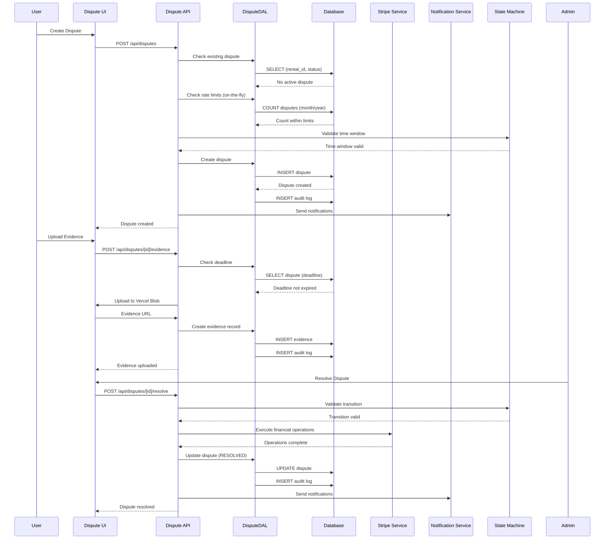

# Disputes Feature - Design Document

## Overview

This design document outlines the technical architecture and implementation approach for the Disputes feature. The system enables renters and providers to file disputes related to tool rentals, with a structured workflow for evidence collection, admin resolution, and financial operations through Stripe integration.

The MVP implementation focuses on manual admin resolution with on-demand deadline enforcement, supporting image and text evidence uploads. The system integrates with Stripe for financial operations (holds, refunds, deposits) and maintains compatibility with Stripe chargeback disputes.

## Architecture

### High-Level Architecture

The Disputes feature follows a layered architecture consistent with the existing Hoador codebase (Architecture v2):

```
┌─────────────────────────────────────────────────────────┐
│              Presentation Layer                         │
│  - Disputes List Page (Server/Client Components)       │
│  - Dispute Details Page (Server/Client Components)     │
│  - Dispute Creation Form (Client Component)             │
│  - Evidence Upload Components (Client Component)        │
│  - Admin Resolution UI (Client Component)               │
│  - Rental UI Integration (Dispute Status Badge)        │
└────────────────────┬────────────────────────────────────┘
                     │
┌────────────────────▼────────────────────────────────────┐
│              Application Layer                           │
│  - API Routes (dispute CRUD, state transitions)        │
│  - Server Components (data fetching)                    │
│  - React Query Hooks (client-side state)                │
└────────────────────┬────────────────────────────────────┘
                     │
┌────────────────────▼────────────────────────────────────┐
│              Service Layer                              │
│  - Stripe Dispute Service (refunds, holds, deposits)   │
│  - Notification Service (dispute events)                │
│  - State Machine Service (transition validation)        │
│  - Deadline Enforcement Service (on-demand checks)     │
└────────────────────┬────────────────────────────────────┘
                     │
┌────────────────────▼────────────────────────────────────┐
│              Data Access Layer (DAL)                    │
│  - DisputeDAL (all dispute operations: disputes,         │
│    evidence, audit logs, notes, financial operations)   │
└────────────────────┬────────────────────────────────────┘
                     │
┌────────────────────▼────────────────────────────────────┐
│              Database Layer                             │
│  - disputes table                                       │
│  - dispute_evidence table                               │
│  - dispute_audit_logs table                              │
│  - dispute_internal_notes table                          │
│  - dispute_financial_operations table                   │
└─────────────────────────────────────────────────────────┘
```

### Data Flow



## Database Schema Design

### Core Tables

#### 1. disputes Table

```typescript
// src/db/schemas/disputes.schema.ts
export const disputes = pgTable(
  "disputes",
  {
    id: uuid("id").defaultRandom().primaryKey(),
    rentalId: uuid("rental_id")
      .references(() => rentals.id, { onDelete: "restrict" }) // Prevent deletion if dispute exists
      .notNull()
      .unique(), // One active dispute per rental
    createdBy: text("created_by")
      .references(() => user.id, { onDelete: "cascade" })
      .notNull(),
    createdByRole: disputeRoleEnum("created_by_role").notNull(), // 'renter' | 'provider'
    reasonCode: disputeReasonCodeEnum("reason_code").notNull(),
    description: text("description").notNull(),
    status: disputeStatusEnum("status").default("open").notNull(),
    policyVersion: varchar("policy_version", { length: 50 }).notNull(), // String identifier like "v1.0"

    // Time windows
    createdAt: timestamp("created_at").defaultNow().notNull(),
    evidenceDeadline: timestamp("evidence_deadline"), // Calculated: createdAt + 7 days
    additionalEvidenceDeadline: timestamp("additional_evidence_deadline"), // Calculated when EVIDENCE_REQUESTED

    // Resolution
    resolvedAt: timestamp("resolved_at"),
    resolvedBy: text("resolved_by").references(() => user.id, {
      onDelete: "set null",
    }),
    resolutionOutcome: disputeResolutionOutcomeEnum("resolution_outcome"),
    resolutionReason: text("resolution_reason"), // Max 1000 chars

    // Stripe chargeback linkage
    stripeChargebackId: varchar("stripe_chargeback_id", { length: 255 }),

    updatedAt: timestamp("updated_at")
      .defaultNow()
      .$onUpdate(() => new Date())
      .notNull(),
  },
  (table) => ({
    rentalIdIdx: index("disputes_rental_id_idx").on(table.rentalId),
    createdByIdx: index("disputes_created_by_idx").on(table.createdBy),
    statusIdx: index("disputes_status_idx").on(table.status),
    reasonCodeIdx: index("disputes_reason_code_idx").on(table.reasonCode),
    createdAtIdx: index("disputes_created_at_idx").on(table.createdAt), // For rate limiting queries
    rentalStatusIdx: index("disputes_rental_status_idx").on(
      table.rentalId,
      table.status,
    ), // For active dispute checks
  }),
);
```

#### 2. dispute_evidence Table

```typescript
export const disputeEvidence = pgTable(
  "dispute_evidence",
  {
    id: uuid("id").defaultRandom().primaryKey(),
    disputeId: uuid("dispute_id")
      .references(() => disputes.id, { onDelete: "cascade" })
      .notNull(),
    uploadedBy: text("uploaded_by")
      .references(() => user.id, { onDelete: "cascade" })
      .notNull(),
    uploadedByRole: disputeRoleEnum("uploaded_by_role").notNull(), // 'renter' | 'provider'
    evidenceType: evidenceTypeEnum("evidence_type").notNull(), // 'image' | 'text'
    content: text("content").notNull(), // Image URL or text content
    uploadedAt: timestamp("uploaded_at").defaultNow().notNull(),
  },
  (table) => ({
    disputeIdIdx: index("dispute_evidence_dispute_id_idx").on(table.disputeId),
    uploadedByIdx: index("dispute_evidence_uploaded_by_idx").on(
      table.uploadedBy,
    ),
    uploadedAtIdx: index("dispute_evidence_uploaded_at_idx").on(
      table.uploadedAt,
    ),
  }),
);
```

#### 3. dispute_audit_logs Table

```typescript
export const disputeAuditLogs = pgTable(
  "dispute_audit_logs",
  {
    id: uuid("id").defaultRandom().primaryKey(),
    disputeId: uuid("dispute_id")
      .references(() => disputes.id, { onDelete: "cascade" })
      .notNull(),
    actionType: auditActionTypeEnum("action_type").notNull(), // 'state_change' | 'evidence_upload' | 'financial_operation' | 'note_created' | etc.
    userId: text("user_id").references(() => user.id, { onDelete: "set null" }), // Nullable for system actions
    previousState: disputeStatusEnum("previous_state"), // For state changes
    newState: disputeStatusEnum("new_state"), // For state changes
    details: jsonb("details").$type<Record<string, any>>(), // Flexible JSON for action-specific data
    reason: text("reason"), // Optional reason for action
    createdAt: timestamp("created_at").defaultNow().notNull(),
  },
  (table) => ({
    disputeIdIdx: index("dispute_audit_logs_dispute_id_idx").on(
      table.disputeId,
    ),
    userIdIdx: index("dispute_audit_logs_user_id_idx").on(table.userId),
    actionTypeIdx: index("dispute_audit_logs_action_type_idx").on(
      table.actionType,
    ),
    createdAtIdx: index("dispute_audit_logs_created_at_idx").on(
      table.createdAt,
    ),
  }),
);
```

#### 4. dispute_internal_notes Table

```typescript
export const disputeInternalNotes = pgTable(
  "dispute_internal_notes",
  {
    id: uuid("id").defaultRandom().primaryKey(),
    disputeId: uuid("dispute_id")
      .references(() => disputes.id, { onDelete: "cascade" })
      .notNull(),
    adminId: text("admin_id")
      .references(() => user.id, { onDelete: "cascade" })
      .notNull(),
    content: text("content").notNull(),
    createdAt: timestamp("created_at").defaultNow().notNull(),
    updatedAt: timestamp("updated_at")
      .defaultNow()
      .$onUpdate(() => new Date())
      .notNull(),
  },
  (table) => ({
    disputeIdIdx: index("dispute_internal_notes_dispute_id_idx").on(
      table.disputeId,
    ),
    adminIdIdx: index("dispute_internal_notes_admin_id_idx").on(table.adminId),
    createdAtIdx: index("dispute_internal_notes_created_at_idx").on(
      table.createdAt,
    ),
  }),
);
```

#### 5. dispute_financial_operations Table

```typescript
export const disputeFinancialOperations = pgTable(
  "dispute_financial_operations",
  {
    id: uuid("id").defaultRandom().primaryKey(),
    disputeId: uuid("dispute_id")
      .references(() => disputes.id, { onDelete: "cascade" })
      .notNull(),
    operationType: financialOperationTypeEnum("operation_type").notNull(), // 'hold_payout' | 'refund_partial' | 'refund_full' | 'capture_deposit'
    amount: decimal("amount", { precision: 10, scale: 2 }), // Nullable for hold operations
    stripeOperationId: varchar("stripe_operation_id", { length: 255 }), // Refund ID, Transfer ID, etc.
    stripePaymentIntentId: varchar("stripe_payment_intent_id", { length: 255 }),
    stripeTransferId: varchar("stripe_transfer_id", { length: 255 }),
    status: financialOperationStatusEnum("status").default("pending").notNull(), // 'pending' | 'succeeded' | 'failed'
    errorMessage: text("error_message"),
    performedBy: text("performed_by")
      .references(() => user.id, { onDelete: "set null" })
      .notNull(),
    performedAt: timestamp("performed_at").defaultNow().notNull(),
  },
  (table) => ({
    disputeIdIdx: index("dispute_financial_operations_dispute_id_idx").on(
      table.disputeId,
    ),
    stripeOperationIdIdx: index(
      "dispute_financial_operations_stripe_operation_id_idx",
    ).on(table.stripeOperationId),
    statusIdx: index("dispute_financial_operations_status_idx").on(
      table.status,
    ),
  }),
);
```

### Enums

```typescript
// src/db/schemas/_enums.ts

export const disputeStatusEnum = pgEnum("dispute_status", [
  "open",
  "evidence_requested",
  "under_review",
  "resolved",
  "closed",
  // Future: "escalated", "appealed"
]);

export const disputeReasonCodeEnum = pgEnum("dispute_reason_code", [
  "damage",
  "non_delivery",
  "quality_issue",
  "cancellation",
  "payment_issue",
  "other",
]);

export const disputeRoleEnum = pgEnum("dispute_role", ["renter", "provider"]);

export const disputeResolutionOutcomeEnum = pgEnum(
  "dispute_resolution_outcome",
  [
    "favor_renter",
    "favor_provider",
    "partial_renter",
    "partial_provider",
    "dismissed",
  ],
);

export const evidenceTypeEnum = pgEnum("evidence_type", ["image", "text"]);

export const auditActionTypeEnum = pgEnum("audit_action_type", [
  "dispute_created",
  "state_change",
  "evidence_uploaded",
  "evidence_deleted",
  "financial_operation",
  "note_created",
  "note_updated",
  "note_deleted",
  "resolution",
]);

export const financialOperationTypeEnum = pgEnum("financial_operation_type", [
  "hold_payout",
  "refund_partial",
  "refund_full",
  "capture_deposit",
]);

export const financialOperationStatusEnum = pgEnum(
  "financial_operation_status",
  ["pending", "succeeded", "failed"],
);

// Add to notificationTypeEnum:
export const notificationTypeEnum = pgEnum("notification_type", [
  // ... existing types ...
  "dispute_created",
  "dispute_evidence_requested",
  "dispute_evidence_deadline_approaching",
  "dispute_evidence_deadline_expired",
  "dispute_resolved",
  // ... rest of types ...
]);
```

### Relations

```typescript
export const disputesRelations = relations(disputes, ({ one, many }) => ({
  rental: one(rentals, {
    fields: [disputes.rentalId],
    references: [rentals.id],
  }),
  createdByUser: one(user, {
    fields: [disputes.createdBy],
    references: [user.id],
  }),
  resolvedByUser: one(user, {
    fields: [disputes.resolvedBy],
    references: [user.id],
  }),
  evidence: many(disputeEvidence),
  auditLogs: many(disputeAuditLogs),
  internalNotes: many(disputeInternalNotes),
  financialOperations: many(disputeFinancialOperations),
}));
```

## Data Access Layer (DAL) Design

### DisputeDAL

```typescript
// src/dal/dispute.dal.ts
export class DisputeDAL extends BaseDAL {
  /**
   * Create a new dispute
   * Validates: no active dispute exists, time window, rate limits
   */
  static async create(data: {
    rentalId: string;
    createdBy: string;
    createdByRole: "renter" | "provider";
    reasonCode: DisputeReasonCode;
    description: string;
    policyVersion: string; // e.g., "v1.0"
  }): Promise<Dispute>;

  /**
   * Get dispute by ID with relations
   */
  static async getById(id: string): Promise<DisputeWithRelations | null>;

  /**
   * Get active dispute for rental
   */
  static async getActiveByRentalId(rentalId: string): Promise<Dispute | null>;

  /**
   * Get disputes for user (as renter or provider) with pagination
   */
  static async getUserDisputes(
    userId: string,
    options: {
      role?: "renter" | "provider";
      status?: DisputeStatus;
      page?: number;
      limit?: number;
    },
  ): Promise<PaginatedResult<DisputeWithRelations>>;

  /**
   * Get all disputes for admin with filters
   */
  static async getAdminDisputes(options: {
    status?: DisputeStatus;
    reasonCode?: DisputeReasonCode;
    page?: number;
    limit?: number;
  }): Promise<PaginatedResult<DisputeWithRelations>>;

  /**
   * Update dispute state (with validation)
   */
  static async updateState(
    id: string,
    newState: DisputeStatus,
    userId: string,
    reason?: string,
  ): Promise<Dispute>;

  /**
   * Resolve dispute
   */
  static async resolve(
    id: string,
    data: {
      outcome: DisputeResolutionOutcome;
      reason: string;
      resolvedBy: string;
    },
  ): Promise<Dispute>;

  /**
   * Check rate limits for user (on-the-fly calculation)
   */
  static async checkRateLimits(userId: string): Promise<{
    monthlyCount: number;
    yearlyCount: number;
    withinLimits: boolean;
  }>;

  /**
   * Validate time window for dispute type
   */
  static async validateTimeWindow(
    rentalId: string,
    reasonCode: DisputeReasonCode,
  ): Promise<{ valid: boolean; message?: string }>;
}
```

/\*\*

- Evidence Management
  \*/
  static async createEvidence(data: {
  disputeId: string;
  uploadedBy: string;
  uploadedByRole: "renter" | "provider";
  evidenceType: "image" | "text";
  content: string; // URL or text
  }): Promise<DisputeEvidence>;

static async getEvidenceByDisputeId(disputeId: string): Promise<DisputeEvidence[]>;

static async checkEvidenceDeadline(disputeId: string): Promise<{
expired: boolean;
deadline: Date | null;
timeRemaining?: number; // milliseconds
}>;

/\*\*

- Audit Log Management
  \*/
  static async createAuditLog(data: {
  disputeId: string;
  actionType: AuditActionType;
  userId?: string;
  previousState?: DisputeStatus;
  newState?: DisputeStatus;
  details?: Record<string, any>;
  reason?: string;
  }): Promise<DisputeAuditLog>;

static async getAuditLogsByDisputeId(disputeId: string): Promise<DisputeAuditLog[]>;

/\*\*

- Internal Notes Management
  \*/
  static async createInternalNote(data: {
  disputeId: string;
  adminId: string;
  content: string;
  }): Promise<DisputeInternalNote>;

static async getInternalNotesByDisputeId(disputeId: string): Promise<DisputeInternalNote[]>;

static async updateInternalNote(
noteId: string,
content: string,
): Promise<DisputeInternalNote>;

static async deleteInternalNote(noteId: string): Promise<void>;

/\*\*

- Financial Operations Management
  \*/
  static async createFinancialOperation(data: {
  disputeId: string;
  operationType: FinancialOperationType;
  amount?: string;
  stripeOperationId?: string;
  stripePaymentIntentId?: string;
  stripeTransferId?: string;
  status: FinancialOperationStatus;
  errorMessage?: string;
  performedBy: string;
  }): Promise<DisputeFinancialOperation>;

static async getFinancialOperationsByDisputeId(
disputeId: string,
): Promise<DisputeFinancialOperation[]>;
}

````

## State Machine Implementation

### State Transition Rules

```typescript
// src/features/disputes/lib/state-machine.ts

const VALID_TRANSITIONS: Record<DisputeStatus, DisputeStatus[]> = {
  open: ["evidence_requested", "under_review", "resolved"],
  evidence_requested: ["under_review", "resolved"],
  under_review: ["resolved"],
  resolved: ["closed"],
  closed: [], // Terminal state
};

export class DisputeStateMachine {
  static canTransition(
    from: DisputeStatus,
    to: DisputeStatus,
  ): boolean {
    return VALID_TRANSITIONS[from]?.includes(to) ?? false;
  }

  static validateTransition(
    dispute: Dispute,
    newState: DisputeStatus,
    userId: string,
    isAdmin: boolean,
  ): { valid: boolean; error?: string } {
    // Check if transition is allowed
    if (!this.canTransition(dispute.status, newState)) {
      return {
        valid: false,
        error: `Invalid transition from ${dispute.status} to ${newState}`,
      };
    }

    // Check if dispute is in final state
    if (dispute.status === "resolved" || dispute.status === "closed") {
      return {
        valid: false,
        error: "Dispute is in final state and cannot be modified",
      };
    }

    // Admin-only transitions
    const adminOnlyStates: DisputeStatus[] = [
      "evidence_requested",
      "under_review",
      "resolved",
      "closed",
    ];
    if (adminOnlyStates.includes(newState) && !isAdmin) {
      return {
        valid: false,
        error: "Admin privileges required for this transition",
      };
    }

    return { valid: true };
  }
}
````

## API Routes Design

### Dispute CRUD Routes

```typescript
// src/app/api/disputes/route.ts
export async function POST(request: NextRequest) {
  // 1. Authenticate
  const authResult = await getAuthenticatedUserResponse();
  if (authResult instanceof NextResponse) return authResult;
  const { userId } = authResult;

  // 2. Validate request
  const body = await request.json();
  const validated = createDisputeSchema.parse(body);

  // 3. Check existing dispute
  const existing = await DisputeDAL.getActiveByRentalId(validated.rentalId);
  if (existing) {
    return NextResponse.json(
      { error: "Active dispute already exists for this rental" },
      { status: 400 },
    );
  }

  // 4. Verify user role (renter or provider)
  const rental = await RentalDAL.getById(validated.rentalId);
  if (!rental) {
    return NextResponse.json({ error: "Rental not found" }, { status: 404 });
  }

  const userRole =
    rental.renterId === userId
      ? "renter"
      : rental.ownerId === userId
        ? "provider"
        : null;
  if (!userRole) {
    return NextResponse.json({ error: "Unauthorized" }, { status: 403 });
  }

  // 5. Check rate limits (on-the-fly)
  const rateLimits = await DisputeDAL.checkRateLimits(userId);
  if (!rateLimits.withinLimits) {
    return NextResponse.json(
      {
        error: "Rate limit exceeded",
        details: {
          monthly: rateLimits.monthlyCount,
          yearly: rateLimits.yearlyCount,
        },
      },
      { status: 429 },
    );
  }

  // 6. Validate time window
  const timeWindow = await DisputeDAL.validateTimeWindow(
    validated.rentalId,
    validated.reasonCode,
  );
  if (!timeWindow.valid) {
    return NextResponse.json({ error: timeWindow.message }, { status: 400 });
  }

  // 7. Get policy version
  const policyVersion = process.env.DISPUTE_POLICY_VERSION || "v1.0";

  // 8. Create dispute
  const dispute = await DisputeDAL.create({
    ...validated,
    createdBy: userId,
    createdByRole: userRole,
    policyVersion,
  });

  // 9. Log audit
  await DisputeDAL.createAuditLog({
    disputeId: dispute.id,
    actionType: "dispute_created",
    userId,
  });

  // 10. Send notifications
  await sendDisputeNotifications(dispute, "created");

  return NextResponse.json(dispute);
}

export async function GET(request: NextRequest) {
  // List disputes with filters
  // Admin sees all, users see their own
}
```

### State Transition Route

```typescript
// src/app/api/disputes/[id]/state/route.ts
export async function PATCH(
  request: NextRequest,
  { params }: { params: Promise<{ id: string }> },
) {
  const authResult = await getAuthenticatedUserResponse();
  if (authResult instanceof NextResponse) return authResult;
  const { userId, isAdmin } = authResult;

  const { id } = await params;
  const body = await request.json();
  const { newState, reason } = body;

  // Get dispute
  const dispute = await DisputeDAL.getById(id);
  if (!dispute) {
    return NextResponse.json({ error: "Dispute not found" }, { status: 404 });
  }

  // Validate transition
  const validation = DisputeStateMachine.validateTransition(
    dispute,
    newState,
    userId,
    isAdmin,
  );
  if (!validation.valid) {
    return NextResponse.json({ error: validation.error }, { status: 400 });
  }

  // Update state
  const updated = await DisputeDAL.updateState(id, newState, userId, reason);

  // Log audit
  await DisputeDAL.createAuditLog({
    disputeId: id,
    actionType: "state_change",
    userId,
    previousState: dispute.status,
    newState,
    reason,
  });

  // Send notifications if needed
  if (newState === "evidence_requested") {
    await sendDisputeNotifications(updated, "evidence_requested");
  }

  return NextResponse.json(updated);
}
```

### Evidence Upload Route

```typescript
// src/app/api/disputes/[id]/evidence/route.ts
export async function POST(
  request: NextRequest,
  { params }: { params: Promise<{ id: string }> },
) {
  const authResult = await getAuthenticatedUserResponse();
  if (authResult instanceof NextResponse) return authResult;
  const { userId } = authResult;

  const { id } = await params;
  const formData = await request.formData();

  // Get dispute
  const dispute = await DisputeDAL.getById(id);
  if (!dispute) {
    return NextResponse.json({ error: "Dispute not found" }, { status: 404 });
  }

  // Check if user is renter or provider
  const rental = await RentalDAL.getById(dispute.rentalId);
  const userRole =
    rental.renterId === userId
      ? "renter"
      : rental.ownerId === userId
        ? "provider"
        : null;
  if (!userRole) {
    return NextResponse.json({ error: "Unauthorized" }, { status: 403 });
  }

  // Check deadline
  const deadlineCheck = await DisputeDAL.checkEvidenceDeadline(id);
  if (deadlineCheck.expired) {
    return NextResponse.json(
      { error: "Evidence deadline has expired" },
      { status: 400 },
    );
  }

  // Check if dispute allows evidence uploads
  if (dispute.status === "resolved" || dispute.status === "closed") {
    return NextResponse.json(
      { error: "Evidence cannot be uploaded for resolved disputes" },
      { status: 400 },
    );
  }

  // Handle file upload (image) or text
  const evidenceType = formData.get("type") as "image" | "text";
  let content: string;

  if (evidenceType === "image") {
    const file = formData.get("file") as File;
    // Upload to Vercel Blob (similar to listing images)
    const blob = await uploadEvidenceImage(id, file);
    content = blob.url;
  } else {
    content = formData.get("content") as string;
  }

  // Create evidence record
  const evidence = await DisputeDAL.createEvidence({
    disputeId: id,
    uploadedBy: userId,
    uploadedByRole: userRole,
    evidenceType,
    content,
  });

  // Log audit
  await DisputeDAL.createAuditLog({
    disputeId: id,
    actionType: "evidence_uploaded",
    userId,
    details: { evidenceId: evidence.id, evidenceType },
  });

  return NextResponse.json(evidence);
}
```

### Resolution Route

```typescript
// src/app/api/disputes/[id]/resolve/route.ts
export async function POST(
  request: NextRequest,
  { params }: { params: Promise<{ id: string }> },
) {
  const adminCheck = await requireAdminResponse();
  if (adminCheck) return adminCheck;

  const { id } = await params;
  const body = await request.json();
  const { outcome, reason, financialOperations } = body;

  // Get dispute
  const dispute = await DisputeDAL.getById(id);
  if (!dispute) {
    return NextResponse.json({ error: "Dispute not found" }, { status: 404 });
  }

  // Execute financial operations first
  if (financialOperations && financialOperations.length > 0) {
    const results = await Promise.allSettled(
      financialOperations.map((op: FinancialOperation) =>
        StripeDisputeService.executeOperation(dispute, op),
      ),
    );

    // Check if any operations failed
    const failures = results.filter((r) => r.status === "rejected");
    if (failures.length > 0) {
      return NextResponse.json(
        {
          error: "Some financial operations failed",
          details: failures.map((f) => f.reason),
        },
        { status: 500 },
      );
    }
  }

  // Resolve dispute
  const resolved = await DisputeDAL.resolve(id, {
    outcome,
    reason,
    resolvedBy: (await getAuthenticatedUserResponse()).userId,
  });

  // Log audit
  await DisputeDAL.createAuditLog({
    disputeId: id,
    actionType: "resolution",
    userId: resolved.resolvedBy!,
    newState: "resolved",
    details: { outcome, reason },
  });

  // Send notifications
  await sendDisputeNotifications(resolved, "resolved");

  return NextResponse.json(resolved);
}
```

## Stripe Service Design

```typescript
// src/services/stripe/dispute-financial.ts

export class StripeDisputeService {
  /**
   * Execute financial operation for dispute
   */
  static async executeOperation(
    dispute: Dispute,
    operation: FinancialOperation,
  ): Promise<DisputeFinancialOperation> {
    const rental = await RentalDAL.getById(dispute.rentalId);
    const payment = await PaymentDAL.getByRentalId(dispute.rentalId);

    switch (operation.type) {
      case "refund_full":
      case "refund_partial":
        return this.createRefund(dispute, payment, operation);
      case "hold_payout":
        return this.holdPayout(dispute, payment);
      case "capture_deposit":
        return this.captureDeposit(dispute, rental);
    }
  }

  private static async createRefund(
    dispute: Dispute,
    payment: Payment,
    operation: FinancialOperation,
  ): Promise<DisputeFinancialOperation> {
    const amount =
      operation.type === "refund_full"
        ? parseFloat(payment.amount)
        : operation.amount!;

    const refund = await PAYMENT_SERVER_INSTANCE.refunds.create({
      payment_intent: payment.stripePaymentIntentId!,
      amount: Math.round(amount * 100), // Convert to cents
      metadata: {
        disputeId: dispute.id,
        rentalId: dispute.rentalId,
        operationType: operation.type,
      },
    });

    // Store financial operation
    return DisputeDAL.createFinancialOperation({
      disputeId: dispute.id,
      operationType: operation.type,
      amount: amount.toString(),
      stripeOperationId: refund.id,
      stripePaymentIntentId: payment.stripePaymentIntentId!,
      status: "succeeded",
      performedBy: (await getAuthenticatedUserResponse()).userId,
    });
  }

  private static async holdPayout(
    dispute: Dispute,
    payment: Payment,
  ): Promise<DisputeFinancialOperation> {
    // Store hold operation (no Stripe API call needed - just prevent future payouts)
    return DisputeFinancialDAL.create({
      disputeId: dispute.id,
      operationType: "hold_payout",
      stripePaymentIntentId: payment.stripePaymentIntentId!,
      status: "succeeded",
      performedBy: (await getAuthenticatedUserResponse()).userId,
    });
  }

  private static async captureDeposit(
    dispute: Dispute,
    rental: Rental,
  ): Promise<DisputeFinancialOperation> {
    if (!rental.securityDepositAuthId) {
      throw new Error("No security deposit authorization found");
    }

    const paymentIntent = await PAYMENT_SERVER_INSTANCE.paymentIntents.capture(
      rental.securityDepositAuthId,
    );

    return DisputeFinancialDAL.create({
      disputeId: dispute.id,
      operationType: "capture_deposit",
      amount: rental.securityDeposit.toString(),
      stripeOperationId: paymentIntent.id,
      status: "succeeded",
      performedBy: (await getAuthenticatedUserResponse()).userId,
    });
  }
}
```

## React Query Hooks

```typescript
// src/features/disputes/hooks/use-disputes.ts
export function useDisputes(filters?: {
  status?: DisputeStatus;
  role?: "renter" | "provider";
}) {
  return useQuery({
    queryKey: ["disputes", filters],
    queryFn: async () => {
      const response = await fetch(
        `/api/disputes?${new URLSearchParams(filters as any)}`,
      );
      if (!response.ok) throw new Error("Failed to fetch disputes");
      return response.json();
    },
    staleTime: 1 * 60 * 1000, // 1 minute
  });
}

// src/features/disputes/hooks/use-dispute.ts
export function useDispute(id: string | null) {
  return useQuery({
    queryKey: ["dispute", id],
    queryFn: async () => {
      if (!id) return null;
      const response = await fetch(`/api/disputes/${id}`);
      if (!response.ok) throw new Error("Failed to fetch dispute");
      return response.json();
    },
    enabled: !!id,
    staleTime: 5 * 60 * 1000, // 5 minutes
  });
}

// src/features/disputes/hooks/use-create-dispute.ts
export function useCreateDispute() {
  const queryClient = useQueryClient();
  const { toast } = useToast();

  return useMutation({
    mutationFn: async (data: CreateDisputeInput) => {
      const response = await fetch("/api/disputes", {
        method: "POST",
        headers: { "Content-Type": "application/json" },
        body: JSON.stringify(data),
      });
      if (!response.ok) {
        const error = await response.json();
        throw new Error(error.error || "Failed to create dispute");
      }
      return response.json();
    },
    onSuccess: () => {
      queryClient.invalidateQueries({ queryKey: ["disputes"] });
      toast({ title: "Success", description: "Dispute created successfully" });
    },
    onError: (error) => {
      toast({
        title: "Error",
        description: error.message,
        variant: "destructive",
      });
    },
  });
}
```

## Notification Integration

```typescript
// src/features/disputes/notifications/dispute-notifications.ts

export async function sendDisputeNotifications(
  dispute: Dispute,
  event: "created" | "evidence_requested" | "resolved",
) {
  const rental = await RentalDAL.getById(dispute.rentalId);
  const renter = await UserDAL.getById(rental.renterId);
  const provider = await UserDAL.getById(rental.ownerId);

  switch (event) {
    case "created":
      // Notify both parties
      await sendNotification({
        userId: renter.id,
        type: "dispute_created",
        title: "New Dispute Filed",
        message: `A dispute has been filed for your rental.`,
        data: { disputeId: dispute.id, rentalId: dispute.rentalId },
        linkUrl: `/dashboard/disputes/${dispute.id}`,
      });
      await sendNotification({
        userId: provider.id,
        type: "dispute_created",
        title: "New Dispute Filed",
        message: `A dispute has been filed for your rental.`,
        data: { disputeId: dispute.id, rentalId: dispute.rentalId },
        linkUrl: `/dashboard/disputes/${dispute.id}`,
      });
      break;

    case "evidence_requested":
      // Notify the party who needs to submit evidence
      const targetUser = dispute.createdByRole === "renter" ? provider : renter;
      await sendNotification({
        userId: targetUser.id,
        type: "dispute_evidence_requested",
        title: "Evidence Requested",
        message: `Additional evidence has been requested for dispute #${dispute.id.slice(0, 8)}.`,
        data: { disputeId: dispute.id },
        linkUrl: `/dashboard/disputes/${dispute.id}`,
      });
      break;

    case "resolved":
      // Notify both parties
      await sendNotification({
        userId: renter.id,
        type: "dispute_resolved",
        title: "Dispute Resolved",
        message: `Your dispute has been resolved.`,
        data: { disputeId: dispute.id, outcome: dispute.resolutionOutcome },
        linkUrl: `/dashboard/disputes/${dispute.id}`,
      });
      await sendNotification({
        userId: provider.id,
        type: "dispute_resolved",
        title: "Dispute Resolved",
        message: `The dispute has been resolved.`,
        data: { disputeId: dispute.id, outcome: dispute.resolutionOutcome },
        linkUrl: `/dashboard/disputes/${dispute.id}`,
      });
      break;
  }
}
```

## Deadline Enforcement (On-Demand)

```typescript
// src/features/disputes/lib/deadline-enforcement.ts

export class DeadlineEnforcementService {
  /**
   * Check and enforce deadlines for a dispute (on-demand)
   */
  static async checkAndEnforce(disputeId: string): Promise<void> {
    const dispute = await DisputeDAL.getById(disputeId);
    if (!dispute) return;

    // Check evidence deadline
    if (dispute.status === "evidence_requested") {
      const deadlineCheck = await DisputeDAL.checkEvidenceDeadline(disputeId);
      if (deadlineCheck.expired) {
        // Auto-transition to UNDER_REVIEW
        await DisputeDAL.updateState(
          disputeId,
          "under_review",
          "system", // System user ID or null
          "Evidence deadline expired",
        );

        // Log audit
        await DisputeDAL.createAuditLog({
          disputeId,
          actionType: "state_change",
          previousState: "evidence_requested",
          newState: "under_review",
          reason: "Evidence deadline expired",
        });

        // Send notification
        await sendDisputeNotifications(
          await DisputeDAL.getById(disputeId)!,
          "evidence_deadline_expired",
        );
      }
    }
  }
}
```

## Component Structure

```
src/features/disputes/
├── components/
│   ├── disputes-list.tsx              # List page component
│   ├── dispute-details.tsx            # Details page component
│   ├── create-dispute-form.tsx        # Dispute creation form
│   ├── evidence-upload.tsx            # Evidence upload component
│   ├── dispute-timeline.tsx           # State transition timeline
│   ├── admin-resolution-panel.tsx     # Admin resolution UI
│   ├── internal-notes-section.tsx     # Admin-only notes
│   └── dispute-status-badge.tsx       # Status badge for rental UI
├── hooks/
│   ├── use-disputes.ts
│   ├── use-dispute.ts
│   ├── use-create-dispute.ts
│   ├── use-upload-evidence.ts
│   └── use-resolve-dispute.ts
├── lib/
│   ├── state-machine.ts
│   ├── deadline-enforcement.ts
│   └── time-window-validation.ts
└── notifications/
    └── dispute-notifications.ts
```

## Error Handling

All API routes use `handleApiError()` from route helpers. DAL methods throw typed errors that are caught and converted to appropriate HTTP status codes:

- `ValidationError` → 400 Bad Request
- `NotFoundError` → 404 Not Found
- `UnauthorizedError` → 403 Forbidden
- `DALError` → 500 Internal Server Error

## Testing Strategy

- **Unit Tests**: DAL methods, state machine, deadline enforcement
- **Integration Tests**: API routes with mocked Stripe
- **E2E Tests**: Complete dispute workflow (create → evidence → resolve)

## Migration Strategy

1. Create enum types
2. Create tables (disputes, evidence, audit_logs, internal_notes, financial_operations)
3. Add indexes
4. Add foreign key constraints
5. Add notification types to enum

Migration will be generated using Drizzle: `bun run db:generate`

## Performance Considerations

- Indexes on frequently queried fields (rentalId, status, createdAt)
- Composite indexes for common query patterns
- Pagination for dispute lists
- On-demand deadline checks (not cron-based for MVP)
- Rate limit checks use indexed queries (createdAt + userId)

## Security Considerations

- All state transitions validated server-side
- Financial operations require admin privileges
- Evidence uploads validated for file type and size
- Internal notes only accessible to admins
- Audit logs immutable
- Stripe API keys never exposed to client
