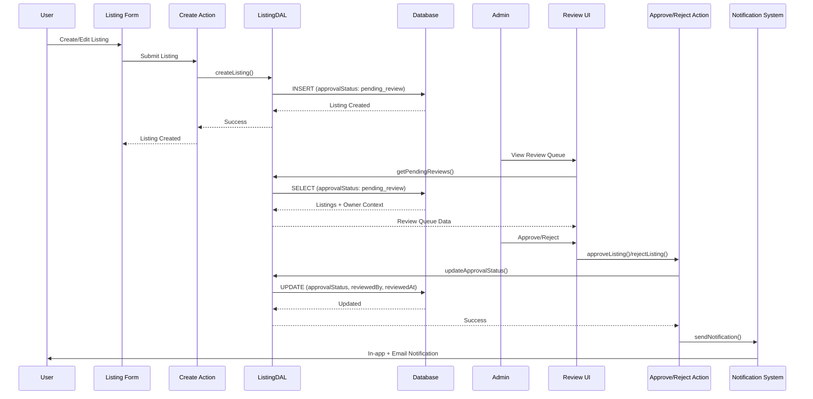

# Listing Review Design

## Overview

This design document outlines the technical architecture and implementation approach for the admin listing review feature. The design integrates seamlessly with the existing Hoador codebase architecture, following established patterns for database migrations, Data Access Layer (DAL), server actions, and component structure.

The implementation will add an approval workflow that requires admin review before listings become visible in public search results, while maintaining backward compatibility with existing listings through a grandfathering migration strategy.

## Architecture

### High-Level Architecture

The listing review feature follows a layered architecture consistent with the existing codebase:

```
┌─────────────────────────────────────────────────────────┐
│              Presentation Layer                          │
│  - Admin Review UI (Next.js Server/Client Components)   │
│  - User Garage UI (Enhanced with Status Badges)         │
│  - Dashboard Widget (Pending Count)                     │
│  - Listing Form (Review Notice)                         │
└────────────────────┬────────────────────────────────────┘
                     │
┌────────────────────▼────────────────────────────────────┐
│              Application Layer                           │
│  - Server Actions (approve/reject listings)             │
│  - API Routes (review queue data)                       │
│  - Notification Handlers                                │
└────────────────────┬────────────────────────────────────┘
                     │
┌────────────────────▼────────────────────────────────────┐
│              Data Access Layer (DAL)                     │
│  - ListingDAL (extended methods)                        │
│  - Review-specific query methods                        │
│  - Permission checks                                    │
└────────────────────┬────────────────────────────────────┘
                     │
┌────────────────────▼────────────────────────────────────┐
│              Database Layer                              │
│  - listings table (new columns)                         │
│  - approvalStatusEnum (new enum)                        │
│  - Indexes for performance                              │
└─────────────────────────────────────────────────────────┘
```

### Data Flow



### Component Architecture

The feature consists of the following key components:

1. **Database Schema** (`src/db/schemas/listings.schema.ts`)
   - New enum: `approvalStatusEnum`
   - New fields: `approvalStatus`, `rejectionReason`, `reviewedBy`, `reviewedAt`
   - Index on `approvalStatus`

2. **Migration** (`src/db/migrations/XXXX_add_listing_approval.sql`)
   - Adds enum type
   - Adds columns to listings table
   - Sets existing listings to `approved`
   - Creates indexes

3. **DAL Extensions** (`src/dal/listing.dal.ts`)
   - `getPendingReviews()` - Fetch listings awaiting review with owner context
   - `getReviewHistory()` - Fetch reviewed listings (approved/rejected)
   - `updateApprovalStatus()` - Update approval status and audit fields
   - `countPendingReviews()` - Get count of pending reviews
   - Enhanced `searchListings()` - Filter by `approvalStatus: approved`
   - Enhanced `createListing()` - Set default `approvalStatus: pending_review`
   - Enhanced `updateListing()` - Detect significant edits and trigger re-review

4. **Server Actions** (`src/features/admin/actions/listing-review.ts`)
   - `approveListing()` - Approve a listing
   - `rejectListing()` - Reject a listing with reason
   - Both use `requireAdmin()` for authentication
   - Use transactions for atomicity

5. **Admin UI Components** (`src/features/admin/components/listing-review/`)
   - `listing-review-page.tsx` - Main review page with tabs
   - `pending-review-queue.tsx` - Queue of pending listings
   - `review-history.tsx` - History of reviewed listings
   - `listing-review-card.tsx` - Individual listing card with context
   - `approve-reject-dialog.tsx` - Modal for approve/reject actions

6. **User UI Components** (`src/features/listings/components/`)
   - Enhanced `garage-tabs-client.tsx` - Add "Pending Review" tab
   - `pending-review-listings.tsx` - Display pending/rejected listings
   - Enhanced listing cards - Status badges
   - Enhanced `add-listing-form.tsx` - Review notice text

7. **Dashboard Component** (`src/app/dashboard/page.tsx`)
   - Widget showing pending review count

## Components and Interfaces

### Database Schema

#### New Enum: `approvalStatusEnum`

Location: `src/db/schemas/_enums.ts`

```typescript
export const approvalStatusEnum = pgEnum("approval_status", [
  "pending_review",
  "approved",
  "rejected",
]);
```

#### Updated Listings Schema

Location: `src/db/schemas/listings.schema.ts`

```typescript
export const listings = pgTable(
  "listings",
  {
    // ... existing fields ...

    // New approval fields
    approvalStatus: approvalStatusEnum("approval_status")
      .default("pending_review")
      .notNull(),
    rejectionReason: text("rejection_reason"),
    reviewedBy: text("reviewed_by").references(() => user.id, {
      onDelete: "set null",
    }),
    reviewedAt: timestamp("reviewed_at"),

    // ... rest of fields ...
  },
  (table) => ({
    // ... existing indexes ...
    approvalStatusIdx: index("listings_approval_status_idx").on(
      table.approvalStatus,
    ),
    // Composite index for common queries
    statusApprovalIdx: index("listings_status_approval_idx").on(
      table.status,
      table.approvalStatus,
    ),
  }),
);
```

### Data Access Layer (DAL)

#### New Methods in ListingDAL

Location: `src/dal/listing.dal.ts`

```typescript
export class ListingDAL extends BaseDAL {
  /**
   * Get listings pending review with owner context
   * Returns listings ordered by createdAt (oldest first)
   */
  async getPendingReviews(
    pagination: PaginationOptions,
  ): Promise<PaginatedResult<PendingReviewListing>> {
    // Requires admin auth (handled in DAL)
    // Returns listings with:
    // - Full listing details
    // - Owner profile (name, email, verification, join date)
    // - Owner's other listings count
    // - Owner's rental history summary
    // - Listing images
  }

  /**
   * Get review history (approved/rejected listings)
   * Returns listings ordered by reviewedAt (most recent first)
   */
  async getReviewHistory(
    status: "approved" | "rejected" | "all",
    pagination: PaginationOptions,
  ): Promise<PaginatedResult<ReviewedListing>> {
    // Similar structure to getPendingReviews but includes review metadata
  }

  /**
   * Update listing approval status
   * Sets approvalStatus, reviewedBy, reviewedAt, and optionally rejectionReason
   */
  async updateApprovalStatus(
    listingId: string,
    status: "approved" | "rejected",
    rejectionReason?: string,
  ): Promise<void> {
    // Requires admin auth
    // Updates in transaction
    // Returns void or throws error
  }

  /**
   * Count listings pending review
   */
  async countPendingReviews(): Promise<number> {
    // Quick count query for sidebar badge
  }

  /**
   * Get user's listings by approval status
   */
  async getUserListingsByApprovalStatus(
    userId: string,
    approvalStatus: "pending_review" | "rejected" | "approved",
  ): Promise<ListingDetails[]> {
    // For Garage page "Pending Review" tab
  }

  /**
   * Check if listing edit requires re-review
   */
  private hasSignificantChanges(
    oldListing: UpdateListingDTO,
    newListing: UpdateListingDTO,
  ): boolean {
    // Compares significant fields:
    // - name, description, category, condition
    // - dailyRate, weeklyRate, monthlyRate
    // - images (count/order changes)
    // Returns true if any significant field changed
  }
}
```

#### Enhanced Existing Methods

```typescript
// Enhanced createListing() - automatically sets approvalStatus: pending_review
async createListing(data: CreateListingDTO): Promise<ListingDetails> {
  // ... existing logic ...
  // Ensure approvalStatus is set to pending_review (default handles this)
}

// Enhanced updateListing() - detects significant changes
async updateListing(
  listingId: string,
  data: UpdateListingDTO,
): Promise<ListingDetails> {
  // Get current listing
  // Check for significant changes
  // If significant AND currently approved -> set approvalStatus: pending_review
  // Clear reviewedBy, reviewedAt, rejectionReason if triggering re-review
}

// Enhanced searchListings() - filter by approvalStatus: approved
async searchListings(
  filters: ListingSearchFilters,
  pagination: PaginationOptions,
  currentUserId?: string,
): Promise<PaginatedResult<UserListing>> {
  // Add filter: approvalStatus = 'approved' unless owner or admin
  // WHERE clause: AND (approvalStatus = 'approved' OR ownerId = currentUserId OR isAdmin)
}
```

### Server Actions

#### Approve Listing Action

Location: `src/features/admin/actions/listing-review.ts`

```typescript
"use server";

import { tryCatch } from "@walkup/walkup-utils";
import { requireAdmin } from "@/features/auth/utils/guards";
import { listingDAL } from "@/dal";
import { sendNotification } from "@/features/notifications/utils/send-notification";
import { revalidatePath } from "next/cache";

export interface ApproveListingState {
  success?: boolean;
  error?: string;
}

export async function approveListingAction(
  listingId: string,
): Promise<ApproveListingState> {
  try {
    await requireAdmin();

    const { error } = await tryCatch(
      listingDAL.updateApprovalStatus(listingId, "approved"),
    );

    if (error) {
      return { error: error.message };
    }

    // Get listing for notification
    const { data: listing } = await tryCatch(
      listingDAL.getListingById(listingId),
    );

    if (listing) {
      // Send notification
      await sendNotification({
        userId: listing.ownerId,
        type: "listing_approved",
        title: "Listing Approved",
        message: `Your listing "${listing.name}" has been approved and is now visible on the platform.`,
        data: { listingId: listing.id },
        linkUrl: `/dashboard/garage?tab=pending_review`,
        email: {
          // ... email template ...
        },
      });
    }

    revalidatePath("/admin/dashboard/listings/review");
    revalidatePath("/dashboard/garage");

    return { success: true };
  } catch (error) {
    return {
      error:
        error instanceof Error ? error.message : "Failed to approve listing",
    };
  }
}
```

#### Reject Listing Action

Similar structure but requires `rejectionReason` parameter and sends rejection notification with reason.

### API Routes

#### Review Queue API

Location: `src/app/api/admin/listings/review/pending/route.ts`

```typescript
import { NextRequest } from "next/server";
import { requireAdmin } from "@/features/auth/utils/guards";
import { listingDAL } from "@/dal";

export async function GET(request: NextRequest) {
  try {
    await requireAdmin();

    const searchParams = request.nextUrl.searchParams;
    const page = parseInt(searchParams.get("page") || "1");
    const limit = parseInt(searchParams.get("limit") || "20");

    const result = await listingDAL.getPendingReviews({
      page,
      limit,
    });

    return Response.json(result);
  } catch (error) {
    return Response.json(
      { error: "Failed to fetch pending reviews" },
      { status: 500 },
    );
  }
}
```

### UI Components

#### Admin Review Page

Location: `src/app/admin/dashboard/listings/review/page.tsx`

```typescript
export default async function ListingReviewPage() {
  await requireAdmin();

  return (
    <div className="container">
      <PageHeader
        title="Listing Review"
        description="Review and approve listings before they go live"
      />
      <ListingReviewTabs />
    </div>
  );
}
```

#### Listing Review Tabs Component

Location: `src/features/admin/components/listing-review/listing-review-tabs.tsx`

```typescript
"use client";

export function ListingReviewTabs() {
  const [activeTab, setActiveTab] = useState<"pending" | "history">("pending");

  return (
    <Tabs value={activeTab} onValueChange={setActiveTab}>
      <TabsList>
        <TabsTrigger value="pending">
          Pending Review
          <Badge variant="secondary">{pendingCount}</Badge>
        </TabsTrigger>
        <TabsTrigger value="history">Review History</TabsTrigger>
      </TabsList>

      <TabsContent value="pending">
        <PendingReviewQueue />
      </TabsContent>

      <TabsContent value="history">
        <ReviewHistory />
      </TabsContent>
    </Tabs>
  );
}
```

#### Enhanced Garage Tabs

Location: `src/features/listings/components/garage-page/garage-tabs-client.tsx`

```typescript
// Add new tab
<TabsList className="max-w-48">
  <TabsTrigger value="active">Active</TabsTrigger>
  <TabsTrigger value="inactive">Inactive</TabsTrigger>
  <TabsTrigger value="pending_review">
    Pending Review
    {pendingCount > 0 && (
      <Badge variant="secondary">{pendingCount}</Badge>
    )}
  </TabsTrigger>
</TabsList>

<TabsContent value="pending_review" className="mt-6">
  <PendingReviewListings filters={filters} />
</TabsContent>
```

### Notification Types

Location: `src/db/schemas/_enums.ts`

```typescript
export const notificationTypeEnum = pgEnum("notification_type", [
  // ... existing types ...
  "listing_approved",
  "listing_rejected",
]);
```

## Data Models

### PendingReviewListing

```typescript
interface PendingReviewListing {
  // Listing fields
  id: string;
  name: string;
  description: string;
  category: { id: string; name: string };
  condition: string;
  dailyRate: number;
  weeklyRate?: number;
  monthlyRate?: number;
  deliveryMode: string;
  images: Array<{ id: string; imageUrl: string; orderIndex: number }>;
  createdAt: Date;

  // Owner context
  owner: {
    id: string;
    name: string;
    email: string;
    firstName?: string;
    lastName?: string;
    profileImageUrl?: string;
    status: string;
    createdAt: Date;
    idVerified: boolean;
    addressVerified: boolean;
  };

  // Owner's other listings
  ownerOtherListings: {
    total: number;
    approved: number;
    pending: number;
  };

  // Owner's rental history
  ownerRentalHistory: {
    totalRentals: number;
    averageRating: number;
    totalEarnings?: number;
  };
}
```

### ReviewedListing

Extends `PendingReviewListing` with:

```typescript
interface ReviewedListing extends PendingReviewListing {
  approvalStatus: "approved" | "rejected";
  rejectionReason?: string;
  reviewedBy: {
    id: string;
    name: string;
  };
  reviewedAt: Date;
  currentStatus: string; // available, rented, etc.
}
```

## Error Handling

### DAL Error Handling

The DAL methods follow the existing pattern:

- Use `tryCatch` wrapper for error handling
- Throw `UnauthorizedError` if non-admin tries to access admin methods
- Throw `NotFoundError` if listing doesn't exist
- Use `handleError()` from BaseDAL for database errors

### Server Action Error Handling

Server actions return state objects:

```typescript
{ success: true } | { error: string }
```

Errors are caught and returned as error state, never thrown.

### Concurrent Review Handling

To handle concurrent review attempts:

1. Use database-level locking (SELECT FOR UPDATE) when fetching listing for review
2. Check approvalStatus before updating
3. Return error if listing already reviewed

```typescript
async updateApprovalStatus(listingId: string, status: string) {
  // Use transaction with row lock
  return await this.db.transaction(async (tx) => {
    const [listing] = await tx
      .select()
      .from(listings)
      .where(eq(listings.id, listingId))
      .for("update"); // Row lock

    if (listing.approvalStatus !== "pending_review") {
      throw new ValidationError("Listing already reviewed");
    }

    // Update approval status
    // ...
  });
}
```

## Testing Strategy

### Unit Tests

1. **DAL Methods** (`src/dal/__tests__/listing.dal.test.ts`)
   - `getPendingReviews()` - Returns pending listings with context
   - `updateApprovalStatus()` - Updates status and audit fields
   - `countPendingReviews()` - Returns correct count
   - `hasSignificantChanges()` - Detects significant edits correctly
   - Error cases (unauthorized, not found, concurrent reviews)

2. **Server Actions** (`src/features/admin/actions/__tests__/listing-review.test.ts`)
   - `approveListing()` - Success and error cases
   - `rejectListing()` - Success, error, validation cases
   - Admin authorization checks
   - Notification sending verification

### Integration Tests

1. **Review Workflow** (`src/features/admin/__tests__/integration/listing-review.test.ts`)
   - Create listing → appears in pending queue
   - Admin approves → listing visible in search
   - Admin rejects → listing hidden, owner notified
   - Owner edits rejected listing → status back to pending

2. **Edit Re-Review** (`src/features/listings/__tests__/integration/edit-rereview.test.ts`)
   - Edit significant field → triggers re-review
   - Edit non-significant field → no re-review
   - Edit pending listing → stays pending

### E2E Tests

1. **Admin Review Flow** (`src/features/admin/__tests__/e2e/listing-review-workflow.test.ts`)
   - Admin logs in
   - Views pending review queue
   - Reviews listing with full context
   - Approves/rejects listing
   - Verifies notification sent

2. **User Experience Flow**
   - User creates listing
   - Sees "Pending Review" status
   - Receives approval notification
   - Listing appears in search

## Security Considerations

1. **Authorization**
   - All admin actions use `requireAdmin()` guard
   - DAL methods check admin permissions internally
   - API routes verify admin status

2. **Input Validation**
   - Rejection reasons sanitized to prevent XSS
   - Listing IDs validated before queries
   - Pagination limits enforced (max 100)

3. **Data Exposure**
   - Review queue only accessible to admins
   - Owner context limited to relevant fields
   - No sensitive payment information exposed

4. **Audit Trail**
   - All approvals/rejections logged with admin ID and timestamp
   - Rejection reasons stored securely
   - Historical data preserved for accountability

## Performance Considerations

1. **Database Indexes**
   - Index on `approvalStatus` for fast filtering
   - Composite index on `(status, approvalStatus)` for search queries
   - Index on `reviewedAt` for history sorting

2. **Query Optimization**
   - Use JOINs efficiently for owner context
   - Limit owner context queries (aggregate counts instead of full lists)
   - Pagination to limit result sets

3. **Caching Strategy**
   - Pending review count cached (invalidate on approve/reject)
   - Review queue can use React Query caching with short stale time
   - Dashboard widget cached with revalidation on path invalidation

4. **Loading States**
   - Skeleton loaders for review queue
   - Optimistic UI updates for approve/reject actions
   - Progressive loading for images

## Migration Strategy

### Database Migration

The migration will:

1. Create `approval_status` enum type
2. Add new columns to `listings` table (nullable initially)
3. Update all existing listings to `approvalStatus: 'approved'`
4. Set NOT NULL constraint on `approvalStatus`
5. Create indexes
6. Set default value for future inserts

### Rollback Strategy

Migration includes rollback:

1. Drop indexes
2. Drop columns
3. Drop enum type

### Backward Compatibility

- Code handles null `approvalStatus` as `approved` during transition
- Migration ensures no nulls before deployment completes
- Existing queries continue to work with new filter logic

## Design Decisions

### 1. Separate Approval Status from Listing Status

**Decision**: Use separate `approvalStatus` field instead of adding to existing `listingStatusEnum`.

**Rationale**:

- Keeps operational status (available/rented) separate from approval workflow
- Allows approved listings to be in any operational status
- Clearer semantics and easier querying

### 2. Grandfather Existing Listings

**Decision**: Mark all existing listings as `approved` during migration.

**Rationale**:

- Prevents disruption to existing listings
- Only new listings require review
- Reduces migration risk

### 3. Significant Edits Trigger Re-Review

**Decision**: Significant edits (name, description, price, images, category, condition) require re-review.

**Rationale**:

- Ensures quality standards maintained
- Prevents bypassing review through edits
- Balances user experience with content quality

### 4. Store Rejection Reasons in Listing Table

**Decision**: Store rejection reason directly in listings table rather than separate review history table.

**Rationale**:

- Simpler schema and queries
- One-to-one relationship (one rejection reason per listing)
- Easier to display to owners
- Future: Can migrate to history table if needed for multiple review cycles

### 5. Review History in Same Interface

**Decision**: Show review history in admin panel alongside pending queue.

**Rationale**:

- Admins can see what they've reviewed
- Provides context for similar listings
- Supports accountability and learning

### 6. Notifications for All Status Changes

**Decision**: Send both in-app and email notifications for approvals and rejections.

**Rationale**:

- Users may not check app frequently
- Email ensures important status updates are seen
- Provides audit trail
- Follows existing notification patterns

## Implementation Notes

1. **Following Existing Patterns**
   - Use DAL pattern with authentication handled internally
   - Use `tryCatch` wrapper for error handling
   - Follow server action patterns from admin/legal-documents
   - Use existing UI component library (shadcn/ui)

2. **File Organization**
   - Admin components: `src/features/admin/components/listing-review/`
   - Admin actions: `src/features/admin/actions/listing-review.ts`
   - DAL methods: `src/dal/listing.dal.ts` (extend existing)
   - Migration: `src/db/migrations/XXXX_add_listing_approval.sql`

3. **Type Safety**
   - Use TypeScript types for all interfaces
   - Leverage Drizzle ORM inferred types
   - Add runtime validation with Zod schemas for server actions

4. **Accessibility**
   - Status badges use semantic HTML and ARIA labels
   - Rejection reasons displayed with proper contrast
   - Keyboard navigation for review actions
   - Screen reader announcements for status changes
