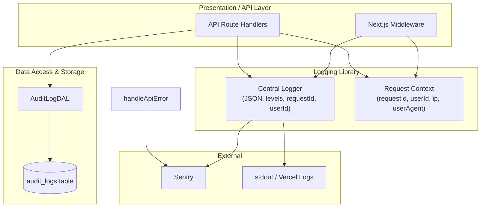
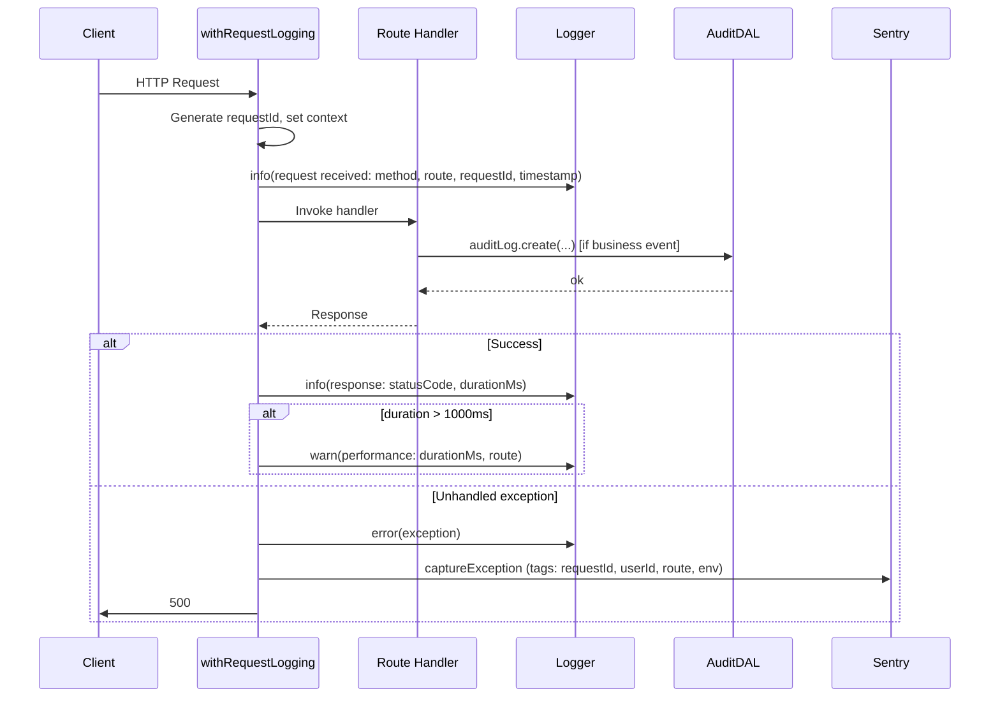

# Production Logging - Design Document

## Overview

This design implements the Production Logging requirements (specs/logging/1-requirements.md) by introducing a centralized structured logger, request/response and performance logging, a new durable `audit_logs` table with a dedicated DAL, integration points at booking, payment, dispute, and admin flows, security and webhook logging, and enhanced Sentry context. The application already uses Sentry, Drizzle, and request-context utilities; this design extends them and adds a single shared logging module used by all server-side code.

**Requirements coverage:** Req 1 (LOG-001–006), Req 2 (LOG-REQ-001–004), Req 3–4 (LOG-AUD-_), Req 5 (LOG-SEC-_), Req 6 (LOG-PAY-_), Req 7 (LOG-OBS-_), Req 8 (LOG-PRIV-_), Req 9 (LOG-RET-_), and non-functional LOG-PERF-001/002.

## Architecture

### High-Level Architecture

Logging fits into the existing Hoador layers as follows: a **logging library** (logger + request context) is used by **API route wrappers** and **middleware** for request/response and performance logging; **AuditLogDAL** persists to the new **audit_logs** table; **domain flows** (rentals, payments, disputes, auth, admin, Stripe webhooks) call the logger and/or AuditLogDAL at defined events; **Sentry** is configured with requestId, userId, route, and environment.



### Request Logging Flow

Request/response and duration logging are implemented via a **withRequestLogging** wrapper (or equivalent) around API route handlers: generate/attach requestId, log request (LOG-REQ-001), run handler, log response and duration (LOG-REQ-002), and if duration > 1000ms log a warning (LOG-REQ-003). Unhandled exceptions are caught, logged at error level, and reported to Sentry (LOG-REQ-004) with requestId, userId, route, and environment (LOG-OBS-\*).



### Log Output and Correlation

- **Structured JSON:** Every log line is a single JSON object (LOG-001). Keys include at least: `level`, `message`, `timestamp`, `requestId` (when in request context), `userId` (when authenticated), and any event-specific fields. No authentication tokens, passwords, or full payment payloads are ever logged (LOG-PRIV-\*).
- **Central logger:** All server-side logs go through one logging utility (LOG-002). The utility reads requestId and userId from async context or passed-in context so that every log entry in a request can include them (LOG-003, LOG-004).
- **Levels:** trace, debug, info, warn, error, fatal (LOG-005). Production default is `info` (LOG-006), configurable via `LOG_LEVEL` (or similar) so that in non-production we can use `debug` without code changes.

## Components and Interfaces

### 1. Central Logging Utility

**Location:** `src/lib/logger/` (or `src/lib/logging/`).

**Responsibilities:**

- Emit structured JSON logs to stdout (so Vercel captures them).
- Support log levels: trace, debug, info, warn, error, fatal.
- Accept optional context: `requestId`, `userId`, and arbitrary safe key-value pairs.
- Never log tokens, passwords, or full payment details; redact or omit sensitive fields if they appear in metadata (LOG-PRIV-\*).
- In production, default to `info`; level controlled by env so that LOG-006 and optional LOG-PERF-001 (async) can be satisfied.

**Interface (conceptual):**

```ts
// getLogger() uses AsyncLocalStorage or passed context for requestId/userId
function getLogger(context?: { requestId?: string; userId?: string | null }): Logger;

type LogLevel = "trace" | "debug" | "info" | "warn" | "error" | "fatal";

interface Logger {
  child(bindings: Record<string, unknown>): Logger;
  [level: string](msg: string, data?: Record<string, unknown>): void;
}
```

**Technology choice:** Use **Pino** for structured JSON logging. It is fast, supports child loggers and levels, and is widely used in Node/Next.js; output is written to stdout so Vercel runtime logs will show structured logs. Alternative: a thin wrapper around `console` that formats objects as JSON and respects level—acceptable for MVP if we want zero new dependencies, but Pino is recommended for performance and consistency (LOG-PERF-001: if we need to reduce latency later, we can use pino’s async flushing).

**Requirement mapping:** LOG-001, LOG-002, LOG-003, LOG-004, LOG-005, LOG-006, LOG-PRIV-\*.

### 2. Request Context (requestId, userId, ip, userAgent)

**Location:** Extend or use alongside `src/lib/utils/request-context.ts` and ensure one place that provides per-request identity for logging.

**Responsibilities:**

- **requestId:** Generate a unique ID per request (e.g. UUID or nanoid). Store in AsyncLocalStorage (or similar) so the logger and any code in the request chain can access it without passing parameters. If no request (e.g. cron, worker), requestId may be null or a job identifier.
- **userId:** Set from auth (e.g. `getCurrentUserId()`) when the request is authenticated; otherwise null. Exposed to the logger and to Sentry (LOG-OBS-002).
- **ipAddress / userAgent:** Already available via `getClientIP(request)` and `getUserAgent(request)`; pass into audit log and into logger context when present (LOG-AUD-002, LOG-AUD-020).

**Implementation note:** Next.js App Router does not have a single middleware that wraps API route execution. So requestId and context can be set in a **withRequestLogging** (or similar) wrapper that each API route uses, or in a shared wrapper used by all route handlers. Middleware can set requestId on a header (e.g. `x-request-id`) and the wrapper reads it (or generates it if missing) and stores it in AsyncLocalStorage for the duration of the handler. This satisfies LOG-003 and LOG-004 for request-scoped logs.

**Requirement mapping:** LOG-003, LOG-004, LOG-AUD-002, LOG-AUD-020.

### 3. Request/Response and Performance Logging Wrapper

**Location:** `src/lib/api/` (e.g. next to `route-helpers.ts`) or `src/lib/logger/`.

**Responsibilities:**

- Wrap the actual handler so that:
  - On entry: ensure requestId (and optionally userId, ip, userAgent) are set in context; log “request received” with method, route, requestId, timestamp (LOG-REQ-001).
  - On exit: log “response sent” with status code and duration (LOG-REQ-002).
  - If duration &gt; 1000 ms: log a warning-level performance event (LOG-REQ-003).
  - On unhandled exception: log error-level entry and call Sentry with requestId, userId, route, environment (LOG-REQ-004, LOG-OBS-001, LOG-OBS-002, LOG-OBS-010).
- Use the central logger for all of the above; do not log request/response bodies (to avoid tokens or PII). Route is the path or pattern (e.g. `/api/rentals/[id]/approve`).

**Interface:** A function that takes a route handler and returns a wrapped handler that performs the above. All API routes that should be logged use this wrapper (or a single wrapper is applied at a higher level if the framework allows).

**Requirement mapping:** LOG-REQ-001, LOG-REQ-002, LOG-REQ-003, LOG-REQ-004, LOG-OBS-001, LOG-OBS-002, LOG-OBS-010.

### 4. Audit Log Data Model and DAL

**Location:** `src/db/schemas/audit-logs.schema.ts`, `src/dal/audit-log.dal.ts`.

**Responsibilities:**

- **Schema:** Persist business-critical events in a single `audit_logs` table (LOG-AUD-001) with columns: id, entityType, entityId, action, userId (nullable), metadata (jsonb), ipAddress (nullable), userAgent (nullable), createdAt (LOG-AUD-002). No update/delete; append-only (LOG-RET-003).
- **AuditLogDAL:** Provide `create(entry)` that inserts one row. No update or delete methods. Used by rental, payment, dispute, admin, and webhook success flows to record the events required by LOG-AUD-010 through LOG-AUD-014 and LOG-AUD-020, and LOG-PAY-003.
- **Indexes:** Support efficient querying by entityType, entityId, userId, action, and createdAt (e.g. composite and single-column indexes) for compliance and support (scalability NFR).

**Requirement mapping:** LOG-AUD-001, LOG-AUD-002, LOG-RET-002, LOG-RET-003, NFR (query performance, scalability).

### 5. Sentry Integration

**Location:** Existing `sentry.server.config.ts`, `src/lib/api/route-helpers.ts`, and optional `src/lib/sentry/context.ts`.

**Responsibilities:**

- **Unhandled exceptions:** Already reported via `handleApiError` and instrumentation; ensure all unhandled API errors go through a path that calls Sentry (LOG-OBS-001).
- **Tags:** When capturing an exception, set tags: `requestId`, `userId`, `route`, `environment` (LOG-OBS-002, LOG-OBS-010). Release is already set from package version (LOG-OBS-003); verify it is correct in deployment.
- **No PII in logs:** Sentry may receive user id and optionally non-sensitive context; do not attach tokens, passwords, or full payment details (LOG-PRIV-\*).

**Requirement mapping:** LOG-OBS-001, LOG-OBS-002, LOG-OBS-003, LOG-OBS-010, LOG-PRIV-\*.

### 6. Integration Points for Audit and Security Events

**Booking (rental) events**

- **booking.created:** When a rental request is successfully created, call AuditLogDAL.create with entityType `rental_request` (or `booking`), entityId = rentalRequestId, action `rental_request.created`, userId from session, metadata minimal (e.g. listingId, start/end dates if needed for support), ipAddress and userAgent from request (LOG-AUD-010). Use the same convention as the rest of the app (e.g. “booking” in requirements = rental request in code).
- **booking.cancelled:** When a rental request or rental is cancelled, call AuditLogDAL.create with action `rental_request.cancelled` or `rental.cancelled`, entityId, userId, ip, userAgent (LOG-AUD-011).

**Payment events**

- **payment state transition:** When a payment is captured, refunded, or fails, call AuditLogDAL.create with entityType `payment`, entityId = paymentId (or equivalent), action e.g. `payment.captured` / `payment.refunded` / `payment.failed`, userId nullable if system-initiated, metadata without full card or payment method details (LOG-AUD-012, LOG-PRIV-003).

**Dispute events**

- **dispute lifecycle:** When a dispute is opened, escalated, or resolved, call AuditLogDAL.create with entityType `dispute`, entityId = disputeId, action e.g. `dispute.opened` / `dispute.escalated` / `dispute.resolved`, userId, metadata minimal (LOG-AUD-013). The existing `dispute_audit_logs` table can continue to be used for the dispute UI timeline; the global `audit_logs` table is the single durable store required by LOG-AUD-001 for queryability and compliance.

**Admin actions**

- When an admin modifies user roles, permissions, or account status, call AuditLogDAL.create with entityType `user`, entityId = target userId, action e.g. `admin.role_change` / `admin.permission_change` / `admin.account_status_change`, userId = admin id, metadata as needed (LOG-AUD-014).

**Security events**

- **Failed authentication:** On each failed auth attempt (e.g. in auth API or middleware), use the central logger to record a security event (e.g. info or warn level, message “auth.failed”, no password or token), and optionally call AuditLogDAL.create with entityType `auth`, action `auth.failed`, userId null, metadata e.g. identifier used (LOG-SEC-001).
- **Role change / account status:** Already covered under admin audit (LOG-SEC-002, LOG-SEC-003); ensure those admin actions call AuditLogDAL with the appropriate action.
- **Repeated failures:** Implement a simple in-memory or short-lived store (or existing rate-limit mechanism) to count failed attempts per identifier (e.g. IP or email) in a time window; when count exceeds a threshold (e.g. 5 in 15 minutes), log a warning-level security event (LOG-SEC-004). Threshold and window are configurable (e.g. env).

**Stripe webhooks**

- **On receive:** Log event ID and event type with the central logger (LOG-PAY-001). Do not log the full body (LOG-PAY-004).
- **Signature verification failure:** Log error-level security event and return 400 (LOG-PAY-002).
- **On success:** After the webhook handler has successfully processed the event, call AuditLogDAL.create with entityType `payment` or `webhook`, entityId = Stripe event id, action e.g. `webhook.processed`, userId null, metadata = { eventType } only (LOG-PAY-003). Do not persist full payload (LOG-PAY-004).

**Requirement mapping:** LOG-AUD-010 through LOG-AUD-014, LOG-AUD-020, LOG-SEC-001–004, LOG-PAY-001–004.

## Data Models

### audit_logs Table

**File:** `src/db/schemas/audit-logs.schema.ts`.

| Column     | Type         | Nullable | Description                                                     |
| ---------- | ------------ | -------- | --------------------------------------------------------------- |
| id         | uuid         | no       | Primary key, default gen_random_uuid()                          |
| entityType | varchar(64)  | no       | e.g. rental_request, payment, dispute, user, auth, webhook      |
| entityId   | varchar(255) | no       | ID of the entity (e.g. rental request id, payment id)           |
| action     | varchar(128) | no       | e.g. rental_request.created, payment.captured, dispute.resolved |
| userId     | text         | yes      | FK to user.id; null for unauthenticated or system               |
| metadata   | jsonb        | yes      | Additional safe context (no tokens, no full payment details)    |
| ipAddress  | varchar(45)  | yes      | Client IP when available                                        |
| userAgent  | text         | yes      | User-Agent when available                                       |
| createdAt  | timestamp    | no       | default now()                                                   |

**Constraints and indexes:**

- No updates or deletes; table is append-only (LOG-RET-003). No `updatedAt`; no update/delete in DAL.
- Indexes: `(entityType, entityId)`, `(userId, createdAt)`, `(action, createdAt)`, `(createdAt)` to support efficient querying and retention/archiving by date (LOG-RET-002, scalability).
- Optional: CHECK or application rule that `metadata` does not contain known sensitive keys (e.g. token, password, card number); primary enforcement is in application code (LOG-PRIV-\*).

**Drizzle example (conceptual):**

```ts
// audit-logs.schema.ts
export const auditLogs = pgTable(
  "audit_logs",
  {
    id: uuid("id").defaultRandom().primaryKey(),
    entityType: varchar("entity_type", { length: 64 }).notNull(),
    entityId: varchar("entity_id", { length: 255 }).notNull(),
    action: varchar("action", { length: 128 }).notNull(),
    userId: text("user_id").references(() => user.id, { onDelete: "set null" }),
    metadata: jsonb("metadata"),
    ipAddress: varchar("ip_address", { length: 45 }),
    userAgent: text("user_agent"),
    createdAt: timestamp("created_at").defaultNow().notNull(),
  },
  (table) => [
    index("audit_logs_entity_type_entity_id_idx").on(
      table.entityType,
      table.entityId,
    ),
    index("audit_logs_user_id_created_at_idx").on(
      table.userId,
      table.createdAt,
    ),
    index("audit_logs_action_created_at_idx").on(table.action, table.createdAt),
    index("audit_logs_created_at_idx").on(table.createdAt),
  ],
);
```

**Requirement mapping:** LOG-AUD-001, LOG-AUD-002, LOG-RET-002, LOG-RET-003.

### metadata (jsonb) Conventions

- **booking/rental:** e.g. `{ listingId?, rentalRequestId?, startDate?, endDate? }` — IDs and dates only, no PII beyond what is already in entityId/userId.
- **payment:** e.g. `{ amount?, currency?, status? }` — no card numbers or full payment method details.
- **dispute:** e.g. `{ previousStatus?, newStatus?, resolutionOutcome? }`.
- **admin:** e.g. `{ targetUserId, previousRole?, newRole? }` or similar.
- **webhook:** e.g. `{ eventType }` — no raw payload.

This keeps metadata useful for support and compliance while satisfying LOG-PRIV-\*.

## Error Handling

- **Logger failure:** If the logging utility throws (e.g. serialization error), catch and fall back to a safe no-op or minimal console.error so the primary business operation does not fail (NFR: logging is best-effort where not critical).
- **Audit log insert failure:** Audit writes are part of the same request flow; if the insert fails, log the error and consider whether to fail the request or continue. For strict compliance, the design prefers: critical audit events (e.g. booking.created, payment.captured) are written in the same transaction as the business write where possible, so that a failure rolls back the whole operation; where audit is written after the fact (e.g. after Stripe webhook processing), log the failure and optionally retry or alert, but do not drop the business outcome (NFR: durability vs. availability trade-off documented).
- **Sentry failure:** If Sentry.captureException fails, log the error locally and do not block the response (LOG-REQ-004, edge case “Partial failures”).
- **Request context missing:** When there is no request (cron, worker), requestId and userId may be null; the logger and audit DAL still function with nulls (LOG-AUD-020, edge case “Missing requestId”).

## Testing Strategy

- **Unit:** Logger outputs valid JSON and respects level (e.g. debug not emitted when level is info); redaction or omission of sensitive keys in metadata.
- **Unit:** AuditLogDAL.create inserts a row with the expected columns; no update/delete methods exist.
- **Integration:** WithRequestLogging (or equivalent) logs request and response and, when handler throws, logs error and calls Sentry with expected tags; when handler takes &gt; 1000 ms, warning is logged.
- **Integration:** Stripe webhook route: on success, one audit row with entityId = event.id, action webhook.processed; on signature failure, error-level log and no audit row for the payload.
- **Integration:** One booking creation and one cancellation each produce the expected audit_logs row (entityType/action and entityId).
- **Manual/exploratory:** Confirm structured logs appear in Vercel runtime logs; confirm Sentry events have requestId, userId, route, environment, and release.

**Requirement mapping:** Ensures LOG-001–006, LOG-REQ-001–004, LOG-AUD-_, LOG-PAY-_, LOG-OBS-_, and LOG-PRIV-_ are testable.

## Configuration and Constants

- **LOG_LEVEL:** default `info` in production; `debug` or `trace` in development (LOG-006).
- **SLOW_REQUEST_MS:** 1000 (LOG-REQ-003); configurable if needed.
- **FAILED_AUTH_THRESHOLD:** e.g. 5 attempts in 15 minutes for LOG-SEC-004; configurable (env).
- **Sentry:** Release from `package.json` or env (LOG-OBS-003); DSN and environment already configured.

## Performance and Scalability (LOG-PERF-001, LOG-PERF-002)

- **Async logging:** If measurement shows logging adds unacceptable latency, the central logger can use async flush (e.g. Pino’s async mode) or a fire-and-forget write so that the request path does not block on I/O (LOG-PERF-001).
- **Audit volume:** If audit_logs grows very large, use partitioning by createdAt (e.g. monthly) or archiving of old partitions to cold storage; indexes and query patterns above support this (LOG-PERF-002, scalability NFR).

## Security and Access (NFR)

- **Audit log access:** Only authorized roles (e.g. admin, support) should be able to read audit_logs; implement via API and DAL layer (no public API for raw audit table). Immutability is enforced by not exposing update/delete (LOG-RET-003).
- **Sensitive data:** Enforced in application code and code review: logger and audit metadata never include tokens, passwords, or full payment details (LOG-PRIV-\*).

## Summary and Requirement Traceability

| Requirement                            | Design Element                                                                                  |
| -------------------------------------- | ----------------------------------------------------------------------------------------------- |
| LOG-001 – LOG-006                      | Central logger (Pino), request context, LOG_LEVEL                                               |
| LOG-REQ-001 – LOG-REQ-004              | withRequestLogging wrapper, Sentry in error path                                                |
| LOG-AUD-001, LOG-AUD-002, LOG-AUD-020  | audit_logs schema, AuditLogDAL.create, context with nullable userId                             |
| LOG-AUD-010 – LOG-AUD-014              | Integration points: rental create/cancel, payment transitions, dispute lifecycle, admin actions |
| LOG-SEC-001 – LOG-SEC-004              | Auth failure logging, admin audit, failed-auth threshold + warning                              |
| LOG-PAY-001 – LOG-PAY-004              | Webhook route: log event id/type, signature failure log, audit on success, no full payload      |
| LOG-OBS-001 – LOG-OBS-003, LOG-OBS-010 | Sentry tags: requestId, userId, route, environment; release from package                        |
| LOG-PRIV-001 – LOG-PRIV-004            | Logger and audit metadata conventions; no tokens/passwords/full payment in logs                 |
| LOG-RET-001 – LOG-RET-003              | stdout retention by host; audit_logs append-only, 5-year retention policy                       |
| LOG-PERF-001, LOG-PERF-002             | Async logger option; partitioning/archiving strategy for audit_logs                             |

This design satisfies the Production Logging requirements and the Definition of Done when implemented: structured logs in Vercel, errors in Sentry with context, audit events queryable in Postgres, Stripe webhooks traceable by event ID, no sensitive data logged, and booking/payment/dispute transitions generating audit entries.
