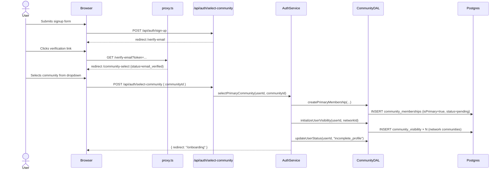
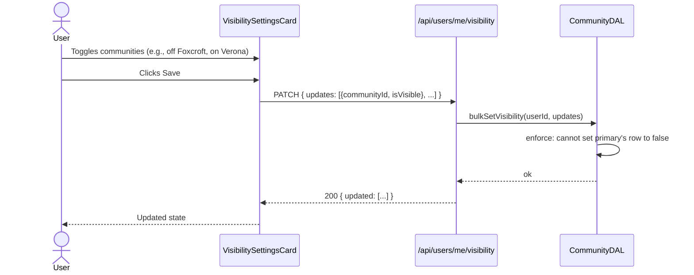

# Design Document: Multi-Community Marketplace Expansion

## 1. Overview

This design implements the multi-community marketplace expansion defined in
[1-requirements.md](./1-requirements.md). It introduces:

- A new **Kansas City Metro** community network with 8 seeded communities.
- A **community-selection** signup step (dropdown) replacing the join-code
  prompt as the canonical path.
- A **per-community visibility** model (single `community_visibility` table)
  driving symmetric, all-or-nothing exposure between users and communities.
- An **admin verification queue** for manual residency verification.
- A **listing search** rewrite that filters by visibility instead of by
  exact community match.

The feature ships in additive migrations with no destructive changes; all
existing data is preserved via backfill SQL.

### Design Constraints (from Requirements)

Reproduced here as the design's input contract — not re-litigated:

| #   | Decision                                                                                                                                                                 | Source              |
| --- | ------------------------------------------------------------------------------------------------------------------------------------------------------------------------ | ------------------- |
| D1  | Replace `/join-code` with `/community-select` (dropdown)                                                                                                                 | R1, AD#1            |
| D2  | `listings.community_id` / `service_listings.community_id` = the listing's home community; it's the visibility key (symmetric: owner + viewer must both be visible there) | R5, AD#2            |
| D3  | Single-layer visibility table; symmetric; all-or-nothing                                                                                                                 | R4, AD#11           |
| D4  | Pending users have full marketplace access                                                                                                                               | R2.7, AD#5          |
| D5  | `join_code` becomes nullable; legacy path preserved                                                                                                                      | R1.5, AD#6          |
| D6  | Lat/lng on communities; no polygon column in MVP                                                                                                                         | R7, AD#7            |
| D7  | One network per community (single `network_id` FK)                                                                                                                       | R6, AD#9            |
| D8  | Eager creation of `community_visibility` rows                                                                                                                            | resolved this phase |
| D9  | Schema migration + separate backfill migration                                                                                                                           | resolved this phase |
| D10 | Extend existing `CommunityDAL` (do not split)                                                                                                                            | resolved this phase |
| D11 | Pre-compute viewer's visible community IDs per-request via React `cache()`                                                                                               | resolved this phase |
| D12 | New `POST /api/auth/select-community`; deprecate-but-keep join-community                                                                                                 | resolved this phase |
| D13 | New `PATCH /api/users/me/visibility` (bulk)                                                                                                                              | resolved this phase |
| D14 | Visibility settings = dedicated card on `/dashboard/profile`                                                                                                             | resolved this phase |
| D15 | Admin verification queue = new tab in `/admin/dashboard/users`                                                                                                           | resolved this phase |
| D16 | Inline migration SQL seeds the network + 8 KC communities                                                                                                                | resolved this phase |
| D17 | Dev seeds keep the 3 existing communities as a separate "Test Network"                                                                                                   | resolved this phase |

---

## 2. Architecture

### 2.1 High-Level Flows

#### Signup → Community Select → Onboarding → Dashboard



#### Listing Search Path (the hot path)

```mermaid
flowchart TD
    A[GET /api/listings/search] --> B{Resolve viewer}
    B --> C[getCurrentUserVisibleCommunityIds<br/>React cache: 1 query/request]
    C -->|visible_ids: UUID[]| D[listingDAL.searchListings<br/>visibleCommunityIds]
    D --> E[SELECT listings l JOIN community_visibility cv<br/>ON cv.user_id = l.owner_id AND cv.community_id = l.community_id<br/>WHERE l.community_id IN :visible_ids<br/>AND cv.is_visible = true]
    E --> F[DISTINCT l.id]
    F --> G[paginate + sort]
    G --> H[Response]
```

#### Visibility Toggle Path



### 2.2 Layer Responsibilities

| Layer                 | Files                                                                                                                                                    | Responsibilities                                                                                                                              |
| --------------------- | -------------------------------------------------------------------------------------------------------------------------------------------------------- | --------------------------------------------------------------------------------------------------------------------------------------------- |
| **Schema**            | [src/db/schemas/communities.schema.ts](src/db/schemas/communities.schema.ts)                                                                             | Table + relation definitions for `community_networks`, `community_visibility`, modified `communities`, modified `community_memberships`.      |
| **DAL**               | [src/dal/community.dal.ts](src/dal/community.dal.ts)                                                                                                     | All read/write logic for communities, networks, memberships, verification, and visibility. Single class per D10.                              |
| **DAL**               | [src/dal/listing.dal.ts](src/dal/listing.dal.ts)                                                                                                         | `searchListings` rewritten to accept `visibleCommunityIds: string[]` and join through `community_visibility`.                                 |
| **DAL**               | [src/dal/service-listing.dal.ts](src/dal/service-listing.dal.ts)                                                                                         | Mirror change for service listings.                                                                                                           |
| **Service**           | [src/features/auth/services/auth-service.ts](src/features/auth/services/auth-service.ts)                                                                 | New `selectPrimaryCommunity` orchestrating membership + visibility init + status transition. Existing `joinCommunity` (code-based) preserved. |
| **Per-request cache** | [src/features/community/utils/membership.ts](src/features/community/utils/membership.ts)                                                                 | New `getCurrentUserVisibleCommunityIds()` wrapped in React `cache()`.                                                                         |
| **API Routes**        | `src/app/api/auth/select-community/route.ts`, `src/app/api/users/me/visibility/route.ts`, `src/app/api/admin/community-memberships/[id]/verify/route.ts` | Thin handlers; delegate to services/DAL.                                                                                                      |
| **Middleware**        | [src/proxy.ts](src/proxy.ts)                                                                                                                             | Update `email_verified` redirect target from `/join-code` to `/community-select`; preserve `/join-code` as accessible route.                  |
| **UI**                | `src/features/auth/components/community-select-form.tsx` (new)                                                                                           | Dropdown form for primary community selection.                                                                                                |
| **UI**                | `src/features/users/components/visibility-settings-card.tsx` (new)                                                                                       | Profile-page card with toggle list.                                                                                                           |
| **UI**                | `src/features/admin/components/user-management/pending-verifications-tab.tsx` (new)                                                                      | Admin queue tab.                                                                                                                              |
| **Hooks**             | `src/features/auth/hooks/use-auth-mutations.ts` (extend)                                                                                                 | Add `useSelectCommunity()` mutation.                                                                                                          |
| **Hooks**             | `src/features/users/hooks/use-visibility.ts` (new)                                                                                                       | `useVisibility()`, `useUpdateVisibility()`.                                                                                                   |
| **Hooks**             | `src/features/admin/hooks/use-admin-mutations.ts` (extend)                                                                                               | Add `useVerifyMembership()`.                                                                                                                  |

---

## 3. Components and Interfaces

### 3.1 Database Schema (Drizzle definitions)

Added to [src/db/schemas/communities.schema.ts](src/db/schemas/communities.schema.ts):

```ts
// New: community_networks
export const communityNetworks = pgTable(
  "community_networks",
  {
    id: uuid("id").defaultRandom().primaryKey(),
    name: varchar("name", { length: 255 }).notNull(),
    slug: varchar("slug", { length: 100 }).notNull(),
    description: text("description"),
    isActive: boolean("is_active").default(true).notNull(),
    createdAt: timestamp("created_at").defaultNow().notNull(),
    updatedAt: timestamp("updated_at").defaultNow().notNull(),
  },
  (t) => ({
    nameIdx: uniqueIndex("community_networks_name_idx").on(t.name),
    slugIdx: uniqueIndex("community_networks_slug_idx").on(t.slug),
  }),
);

// Modified: communities (added fields)
//   networkId UUID NULL FK -> community_networks.id
//   latitude  DECIMAL(10,8) NULL
//   longitude DECIMAL(11,8) NULL
//   isActive  BOOLEAN NOT NULL DEFAULT true
//   joinCode  -> NULLABLE (drop NOT NULL)

// Modified: community_memberships (added fields)
//   isPrimary           BOOLEAN NOT NULL DEFAULT false
//   verificationStatus  verification_status NOT NULL DEFAULT 'pending'
//   verifiedAt          TIMESTAMP NULL
//   verifiedBy          TEXT NULL FK -> user.id
//   adminNotes          TEXT NULL
//   Partial unique index: (user_id) WHERE is_primary = true

// New: community_visibility
export const communityVisibility = pgTable(
  "community_visibility",
  {
    id: uuid("id").defaultRandom().primaryKey(),
    userId: text("user_id")
      .references(() => user.id, { onDelete: "cascade" })
      .notNull(),
    communityId: uuid("community_id")
      .references(() => communities.id, { onDelete: "cascade" })
      .notNull(),
    isVisible: boolean("is_visible").notNull().default(true),
    createdAt: timestamp("created_at").defaultNow().notNull(),
    updatedAt: timestamp("updated_at").defaultNow().notNull(),
  },
  (t) => ({
    userCommunityIdx: uniqueIndex("community_visibility_user_community_idx").on(
      t.userId,
      t.communityId,
    ),
    visibleByUserIdx: index("community_visibility_user_visible_idx")
      .on(t.userId)
      .where(sql`is_visible = true`),
    visibleByCommunityIdx: index("community_visibility_community_visible_idx")
      .on(t.communityId)
      .where(sql`is_visible = true`),
  }),
);
```

### 3.2 DAL Surface (additions to `CommunityDAL`)

```ts
// === Networks ===
getNetworkById(id: string): Promise<CommunityNetwork | null>
getNetworkBySlug(slug: string): Promise<CommunityNetwork | null>
listNetworks(): Promise<CommunityNetwork[]>
listCommunitiesByNetwork(
  networkId: string,
  opts?: { activeOnly?: boolean }
): Promise<Community[]>

// === Primary community selection ===
selectPrimaryCommunity(
  userId: string,
  communityId: string,
): Promise<UserCommunityInfo>
// - inserts community_memberships row (isPrimary=true, status=pending)
// - throws ConflictError if user already has primary

// === Verification queue (admin) ===
listPendingVerifications(opts: {
  page: number;
  limit: number;
  communityId?: string;
}): Promise<PaginatedResult<MembershipWithUserAndAddress>>

verifyMembership(
  membershipId: string,
  adminUserId: string,
  adminNotes?: string,
): Promise<CommunityMembership>

denyMembership(
  membershipId: string,
  adminUserId: string,
  adminNotes: string, // required on denial
): Promise<CommunityMembership>

// === Visibility ===
getVisibilityForUser(userId: string): Promise<CommunityVisibility[]>
getVisibleCommunityIds(userId: string): Promise<string[]>  // hot path
initializeUserVisibility(
  userId: string,
  networkId: string,
): Promise<void>
// - bulk insert one row per community in network with isVisible=true

bulkSetVisibility(
  userId: string,
  updates: Array<{ communityId: string; isVisible: boolean }>,
): Promise<CommunityVisibility[]>
// - enforces: cannot set isVisible=false on user's primary community
// - upserts (in case lazy creation is enabled later)
```

### 3.3 ListingDAL changes

```ts
// signature change
async searchListings(
  filters: ListingSearchFilters,
  pagination: PaginationOptions,
  userId: string,
- communityId: string,
+ visibleCommunityIds: string[], // [] => empty result
  isAdmin: boolean,
  skipDistance = false,
): Promise<PaginatedResult<UserListing>>

// internal change — gate on the listing's own community (symmetric, R5):
- eq(listings.communityId, communityId)
+ // viewer side: the listing's home community is in the viewer's visible set
+ inArray(listings.communityId, visibleCommunityIds),
+ // owner side: pinned by the JOIN to (owner, listing.communityId) below
+ eq(communityVisibility.isVisible, true),
+ // JOIN ON: communityVisibility.userId = listings.ownerId
+ //      AND communityVisibility.communityId = listings.communityId  (1:1)
+ // SELECT DISTINCT listings.id  (guards only the primary-address leftJoin)
```

Service-listing DAL gets the equivalent change (`findByCommunityForBrowse`):
`inArray(serviceListings.communityId, visibleCommunityIds)` plus the join
pinned to `(communityVisibility.userId = serviceListings.providerId AND
communityVisibility.communityId = serviceListings.communityId)`.

### 3.4 Service Layer

```ts
// AuthService — additions
class AuthService {
  // Existing: joinCommunity(userId, joinCode) — UNCHANGED, legacy path

  // New
  static async selectPrimaryCommunity(
    userId: string,
    communityId: string,
  ): Promise<{ redirect: string }> {
    // 1. ConflictError if user already has primary
    // 2. ValidationError if community is inactive
    // 3. CommunityDAL.selectPrimaryCommunity (creates membership)
    // 4. Resolve community.networkId
    // 5. CommunityDAL.initializeUserVisibility(userId, networkId)
    // 6. userDAL.updateUserStatus(userId, "incomplete_profile")
    // 7. return { redirect: "/onboarding" }
  }
}
```

### 3.5 Per-request Cache Helper (extends existing pattern)

In [src/features/community/utils/membership.ts](src/features/community/utils/membership.ts):

```ts
// New helper, mirroring getCurrentUserCommunityId pattern
export const getCurrentUserVisibleCommunityIds = cache(
  async (): Promise<string[]> => {
    const userId = await getCurrentUserId();
    if (!userId) return [];
    return communityDAL.getVisibleCommunityIds(userId);
  },
);
```

Used by every consumer of the listing search hot path:

```ts
// route.ts (search endpoint)
const visibleIds = await getCurrentUserVisibleCommunityIds();
if (visibleIds.length === 0) {
  return Response.json(emptyPaginatedResult());
}
const results = await listingDAL.searchListings(
  filters,
  pagination,
  userId,
  visibleIds,
  isAdmin,
);
```

### 3.6 API Routes

| Method  | Path                                          | Body / Query                                     | Returns                                               |
| ------- | --------------------------------------------- | ------------------------------------------------ | ----------------------------------------------------- |
| `POST`  | `/api/auth/select-community`                  | `{ communityId: string }`                        | `{ redirect: string }`                                |
| `POST`  | `/api/auth/join-community` (legacy)           | `{ joinCode: string }`                           | `{ redirect: string }` — kept                         |
| `GET`   | `/api/communities`                            | `?networkSlug=kansas-city-metro&active=true`     | `Community[]`                                         |
| `GET`   | `/api/users/me/visibility`                    | —                                                | `Array<{ community: Community; isVisible: boolean }>` |
| `PATCH` | `/api/users/me/visibility`                    | `{ updates: Array<{ communityId, isVisible }> }` | `{ updated: CommunityVisibility[] }`                  |
| `GET`   | `/api/admin/community-memberships/pending`    | `?page&limit&communityId?`                       | paginated queue rows (admin only)                     |
| `POST`  | `/api/admin/community-memberships/:id/verify` | `{ adminNotes?: string }`                        | updated membership (admin only)                       |
| `POST`  | `/api/admin/community-memberships/:id/deny`   | `{ adminNotes: string }`                         | updated membership (admin only)                       |
| `GET`   | `/api/admin/communities` (CRUD)               | —                                                | paginated communities                                 |
| `POST`  | `/api/admin/communities`                      | `Partial<Community>`                             | created community                                     |
| `PATCH` | `/api/admin/communities/:id`                  | `Partial<Community>`                             | updated community                                     |

All `/api/admin/*` routes gated by `getAdminUser` (existing pattern).

### 3.7 UI Components

#### `CommunitySelectForm` (`/community-select` page)

```
+-------------------------------------------+
|         Find your community               |
|                                           |
|  Select your community                    |
|  +------------------------------------+   |
|  | Foxcroft                       v  |   |
|  +------------------------------------+   |
|                                           |
|  [        Continue →          ]           |
|                                           |
|  Don't see yours? Request your community  |
|  Have a private invite code? /join-code   |
+-------------------------------------------+
```

- shadcn `Select` (already used in onboarding for state) populated with
  the active communities in the default network.
- Uses `useSelectCommunity()` mutation; on success router-pushes to
  `/onboarding`.
- "Request your community" opens existing `RequestHoadorModal`.
- "Have a private invite code?" link routes to `/join-code` (legacy).

#### `VisibilitySettingsCard` (profile page section)

```
+-----------------------------------------------+
| Community Visibility                          |
| Choose which communities you appear in.       |
| Toggling off hides your listings from that    |
| community AND hides that community's listings |
| from you.                                     |
|-----------------------------------------------|
|                                               |
| Foxcroft   (Home community — always visible)  |
|   Switch [✓] (locked)                         |
|                                               |
| Glen Arbor Estates                            |
|   Switch [✓]                                  |
|                                               |
| Timber Trace                                  |
|   Switch [✗]                                  |
|                                               |
| ... (8 communities total)                     |
|                                               |
| [ Save changes ]    (disabled if no diff)     |
+-----------------------------------------------+
```

- Card sits in [src/app/dashboard/profile/page.tsx](src/app/dashboard/profile/page.tsx) (or
  the equivalent profile sub-component) under existing profile sections.
- Pulls visibility from `useVisibility()` query.
- Save calls `useUpdateVisibility()` mutation with bulk array.

#### `PendingVerificationsTab` (admin)

Inside [src/app/admin/dashboard/users/page.tsx](src/app/admin/dashboard/users/page.tsx) — add a Tabs container:

```
[ All Users (245) ] [ Pending Verifications (12) ]

(Tab 2 selected:)

Address                         Community         Submitted   Actions
123 Main St, Overland Park, KS  Foxcroft          2d ago      [View] [Verify] [Deny]
456 Elm St, Lenexa, KS          Timber Trace      4d ago      [View] [Verify] [Deny]
...
```

- "View" opens a side dialog with full address + admin notes textarea.
- "Verify" / "Deny" trigger the respective DAL methods.
- Deny requires non-empty admin notes (form validation).

### 3.8 Middleware Update

In [src/proxy.ts](src/proxy.ts):

```diff
  if (user.status === "email_verified") {
    if (pathname.startsWith("/dashboard")) return NextResponse.next();
-   if (pathname !== "/join-code") {
-     const joinCodeUrl = new URL("/join-code", request.url);
-     return NextResponse.redirect(joinCodeUrl);
-   }
+   // Allow both /community-select (canonical) and /join-code (legacy) for
+   // email_verified users.
+   if (pathname === "/community-select" || pathname === "/join-code") {
+     return NextResponse.next();
+   }
+   const selectUrl = new URL("/community-select", request.url);
+   return NextResponse.redirect(selectUrl);
-   return NextResponse.next();
  }
```

---

## 4. Data Models

Inputs / outputs for each new or modified table.

### 4.1 `community_networks` (new)

| Column      | Type         | Constraints            |
| ----------- | ------------ | ---------------------- |
| id          | uuid         | PK, default random     |
| name        | varchar(255) | NOT NULL, UNIQUE       |
| slug        | varchar(100) | NOT NULL, UNIQUE       |
| description | text         | NULL                   |
| is_active   | boolean      | NOT NULL, default true |
| created_at  | timestamp    | NOT NULL, default now  |
| updated_at  | timestamp    | NOT NULL, default now  |

### 4.2 `communities` (modified — added columns)

| Column     | Type          | Notes                             |
| ---------- | ------------- | --------------------------------- |
| network_id | uuid          | NULL FK → `community_networks.id` |
| latitude   | decimal(10,8) | NULL                              |
| longitude  | decimal(11,8) | NULL                              |
| is_active  | boolean       | NOT NULL default true             |
| join_code  | varchar(100)  | **NOW NULLABLE** (drop NOT NULL)  |

### 4.3 `community_memberships` (modified — added columns)

| Column              | Type                       | Notes                                  |
| ------------------- | -------------------------- | -------------------------------------- |
| is_primary          | boolean                    | NOT NULL default false                 |
| verification_status | enum `verification_status` | NOT NULL default `'pending'`           |
| verified_at         | timestamp                  | NULL                                   |
| verified_by         | text                       | NULL FK → `user.id` ON DELETE SET NULL |
| admin_notes         | text                       | NULL                                   |

Plus partial unique index: `(user_id) WHERE is_primary = true`.

### 4.4 `community_visibility` (new)

| Column       | Type      | Notes                                            |
| ------------ | --------- | ------------------------------------------------ |
| id           | uuid      | PK                                               |
| user_id      | text      | NOT NULL FK → `user.id` ON DELETE CASCADE        |
| community_id | uuid      | NOT NULL FK → `communities.id` ON DELETE CASCADE |
| is_visible   | boolean   | NOT NULL default true                            |
| created_at   | timestamp | NOT NULL default now                             |
| updated_at   | timestamp | NOT NULL default now                             |

Indexes:

- Unique `(user_id, community_id)` — also serves the owner-side point lookup
  in listing search (`cv.user_id = owner AND cv.community_id = listing.community_id`)
- `(user_id) WHERE is_visible = true` — for `getVisibleCommunityIds`
- `(community_id) WHERE is_visible = true` — secondary lookups by community

---

## 5. Migration Strategy

Two migrations, in order. Each is its own Drizzle migration file, each
runs in a transaction.

### 5.1 Migration A — Schema

`migrations/00XX_multi_community_schema.sql`

```sql
-- Networks
CREATE TABLE community_networks (
  id UUID PRIMARY KEY DEFAULT gen_random_uuid(),
  name VARCHAR(255) NOT NULL UNIQUE,
  slug VARCHAR(100) NOT NULL UNIQUE,
  description TEXT,
  is_active BOOLEAN NOT NULL DEFAULT true,
  created_at TIMESTAMP NOT NULL DEFAULT now(),
  updated_at TIMESTAMP NOT NULL DEFAULT now()
);

-- communities additions
ALTER TABLE communities
  ADD COLUMN network_id UUID REFERENCES community_networks(id),
  ADD COLUMN latitude DECIMAL(10,8),
  ADD COLUMN longitude DECIMAL(11,8),
  ADD COLUMN is_active BOOLEAN NOT NULL DEFAULT true,
  ALTER COLUMN join_code DROP NOT NULL;

CREATE INDEX communities_network_id_idx ON communities(network_id);

-- community_memberships additions
ALTER TABLE community_memberships
  ADD COLUMN is_primary BOOLEAN NOT NULL DEFAULT false,
  ADD COLUMN verification_status verification_status NOT NULL DEFAULT 'pending',
  ADD COLUMN verified_at TIMESTAMP,
  ADD COLUMN verified_by TEXT REFERENCES "user"(id) ON DELETE SET NULL,
  ADD COLUMN admin_notes TEXT;

CREATE UNIQUE INDEX community_memberships_user_primary_idx
  ON community_memberships(user_id) WHERE is_primary = true;

CREATE INDEX community_memberships_verification_status_idx
  ON community_memberships(verification_status);

-- Visibility
CREATE TABLE community_visibility (
  id UUID PRIMARY KEY DEFAULT gen_random_uuid(),
  user_id TEXT NOT NULL REFERENCES "user"(id) ON DELETE CASCADE,
  community_id UUID NOT NULL REFERENCES communities(id) ON DELETE CASCADE,
  is_visible BOOLEAN NOT NULL DEFAULT true,
  created_at TIMESTAMP NOT NULL DEFAULT now(),
  updated_at TIMESTAMP NOT NULL DEFAULT now()
);

CREATE UNIQUE INDEX community_visibility_user_community_idx
  ON community_visibility(user_id, community_id);

CREATE INDEX community_visibility_user_visible_idx
  ON community_visibility(user_id) WHERE is_visible = true;

CREATE INDEX community_visibility_community_visible_idx
  ON community_visibility(community_id) WHERE is_visible = true;
```

### 5.2 Migration B — Data Backfill

`migrations/00XX_multi_community_backfill.sql` — idempotent.

```sql
BEGIN;

-- 1. Insert KC Metro network (idempotent on slug)
INSERT INTO community_networks (name, slug, description)
VALUES (
  'Kansas City Metro',
  'kansas-city-metro',
  'Connected neighborhood marketplace network across the Kansas City metro area.'
)
ON CONFLICT (slug) DO NOTHING;

-- 2. Insert the 8 KC Metro communities (idempotent on name)
WITH kc AS (SELECT id FROM community_networks WHERE slug = 'kansas-city-metro')
INSERT INTO communities (name, city, state, network_id, is_active)
SELECT name, city, state, kc.id, true
FROM kc, (VALUES
  ('Glen Arbor Estates',  'Overland Park',   'KS'),
  ('Foxcroft',            'Overland Park',   'KS'),
  ('Timber Trace',        'Lenexa',          'KS'),
  ('Blue Hills Estates',  'Kansas City',     'MO'),
  ('Redbridge North',     'Kansas City',     'MO'),
  ('Verona Gardens',      'Lee''s Summit',   'MO'),
  ('Redbridge Estates',   'Kansas City',     'MO'),
  ('Leawood Estates',     'Leawood',         'KS')
) AS new_communities(name, city, state)
ON CONFLICT (name) DO NOTHING;
-- NB: requires a UNIQUE index on communities.name; if not present, use a
-- guard SELECT ... WHERE NOT EXISTS pattern instead.

-- 3. Backfill existing memberships
UPDATE community_memberships
   SET is_primary = true,
       verification_status = 'verified',
       verified_at = COALESCE(verified_at, created_at)
 WHERE is_primary = false
   AND verification_status = 'pending';

-- 4. Backfill community_visibility rows for existing users.
--    For each user with a primary membership, insert N visibility rows
--    (one per community in their primary's network, all is_visible=true).
INSERT INTO community_visibility (user_id, community_id, is_visible)
SELECT m.user_id, c.id, true
  FROM community_memberships m
  JOIN communities mc ON mc.id = m.community_id
  JOIN communities c  ON c.network_id = mc.network_id AND c.is_active = true
 WHERE m.is_primary = true
   AND mc.network_id IS NOT NULL
ON CONFLICT (user_id, community_id) DO NOTHING;

COMMIT;
```

**Idempotency notes:**

- All inserts use `ON CONFLICT DO NOTHING` so re-running is safe.
- Update (#3) is gated by `is_primary = false AND status = 'pending'` so
  it only touches un-backfilled rows.
- The visibility insert (#4) uses the unique index to skip duplicates.

### 5.3 Seed-data updates

#### `src/db/seeds/communities.seed.ts`

- Insert "Kansas City Metro" network.
- Insert "Test Network" network (for the existing 3 dev communities, per D17).
- Attach the 3 existing dev communities to "Test Network".
- Add the 8 KC Metro communities, attached to "Kansas City Metro".
- For seeded users: attach to a community as primary with status `verified`.
- For each seeded user × every community in their network: insert a
  `community_visibility` row with `is_visible = true`.

#### `src/db/seeds/e2e.seed.ts`

- Same shape as above for the e2e environment.
- Preserve `E2E_JOIN_CODE` on a community in "Test Network" for the legacy
  /join-code spec.
- Add a constant `E2E_PRIMARY_COMMUNITY_NAME = "Foxcroft"` for the
  community-select e2e test.

---

## 6. Error Handling

Inherits the existing DAL error model ([src/dal/base.ts](src/dal/base.ts), [src/dal/errors.ts](src/dal/errors.ts)).

| Scenario                                   | Where                              | Handling                                                                                              |
| ------------------------------------------ | ---------------------------------- | ----------------------------------------------------------------------------------------------------- |
| User selects an inactive community         | `selectPrimaryCommunity` (Service) | `ValidationError("Community is not active")`                                                          |
| User already has a primary membership      | `selectPrimaryCommunity` (Service) | `ConflictError("User already has a primary community. Contact support to change it.")`                |
| Community ID does not exist                | `selectPrimaryCommunity` (DAL)     | FK violation → mapped to `ValidationError` by base DAL                                                |
| User toggles primary visibility off        | `bulkSetVisibility` (DAL)          | `ValidationError("Cannot hide your home community")`                                                  |
| Admin denies without notes                 | `denyMembership` (DAL)             | `ValidationError("admin_notes required when denying")`                                                |
| Concurrent verify/deny on same membership  | DAL                                | Handled by row-level UPDATE; second writer's update is no-op or wins last; no special locking for MVP |
| Backfill SQL re-run                        | Migration B                        | Idempotent — `ON CONFLICT DO NOTHING` and gated UPDATE                                                |
| Visibility rows missing for user           | `getVisibleCommunityIds`           | Returns `[]`; consumer returns empty results (R4.8 fail-closed)                                       |
| New user signup race: status flipped twice | Auth service                       | `userDAL.updateUserStatus` uses idempotent set-if-current-status pattern (existing)                   |

---

## 7. Testing Strategy

### 7.1 Unit Tests

New / modified test files:

- `src/dal/__tests__/community.dal.test.ts` — extend with:
  - `selectPrimaryCommunity` (success, conflict, inactive community)
  - `initializeUserVisibility` (creates correct N rows)
  - `bulkSetVisibility` (rejects primary toggle-off; upsert behavior)
  - `getVisibleCommunityIds` (returns empty for unknown user)
  - `listPendingVerifications`, `verifyMembership`, `denyMembership`
- `src/dal/__tests__/listing.dal.test.ts` — extend `searchListings`:
  - empty `visibleCommunityIds` → empty result (no DB hit)
  - listing whose `community_id` is NOT in the viewer's visible set → excluded
  - listing whose owner has `is_visible = false` for the listing's
    `community_id` → excluded (fail-closed; absent owner row also excluded)
  - listing whose `community_id` IS visible to the viewer AND whose owner is
    visible there → included
  - `selectDistinct`/`countDistinct` retained as a guard for the
    primary-address leftJoin (the visibility join is now 1:1 with the listing)
- `src/features/auth/services/auth-service.test.ts` — add:
  - `selectPrimaryCommunity` orchestration: status transitions, visibility init
- `src/features/community/utils/__tests__/membership.test.ts` — add:
  - `getCurrentUserVisibleCommunityIds` cache memoization
- `src/features/auth/components/__tests__/community-select-form.test.tsx`
- `src/features/users/components/__tests__/visibility-settings-card.test.tsx`
- `src/features/admin/components/__tests__/pending-verifications-tab.test.tsx`

### 7.2 Integration Tests

- DAL methods tested against the real test DB (existing pattern).
- API route handlers: at least one happy-path + one auth-fail per new
  endpoint.

### 7.3 E2E Tests (per R13)

Already specified in requirements — see [1-requirements.md](./1-requirements.md) R13.
Summary:

- Update [signup-funnel.spec.ts](e2e/auth/signup-funnel.spec.ts) for new flow.
- Update [status-redirect.spec.ts](e2e/auth/status-redirect.spec.ts).
- Add new community-selection e2e test (filter, select, request modal).
- Keep legacy join-code e2e test for `/join-code`.
- Update [e2e.seed.ts](src/db/seeds/e2e.seed.ts) to seed networks + KC Metro communities + visibility rows.

### 7.4 Migration Test Plan

Pre-merge checklist:

1. Run schema migration on a clone of production DB; verify schema.
2. Run backfill migration twice in a row; assert no errors and no duplicate
   visibility rows (idempotency).
3. `EXPLAIN ANALYZE` the new listing search query against seeded data;
   record baseline timing.
4. Run the existing search e2e flow against the migrated DB; compare result
   set against pre-migration snapshot.

---

## 8. Performance Notes

### 8.1 Indexes (re-stated from §3.1)

| Index                                                             | Purpose                                        |
| ----------------------------------------------------------------- | ---------------------------------------------- |
| `community_visibility(user_id, community_id)` (unique)            | Constraint + owner-side point lookup in search |
| `community_visibility(user_id) WHERE is_visible = true`           | `getVisibleCommunityIds` hot path              |
| `community_visibility(community_id) WHERE is_visible = true`      | Secondary lookups by community                 |
| `listings(community_id)`, `service_listings(community_id)`        | Viewer-side `community_id IN (...)` in search  |
| `community_memberships(user_id) WHERE is_primary = true` (unique) | One-primary invariant + primary lookup         |
| `community_memberships(verification_status)`                      | Admin queue                                    |

### 8.2 Per-request cache

`getCurrentUserVisibleCommunityIds` is wrapped in React `cache()`; one DB
call per request regardless of how many call sites consume it. Mirrors
[getCurrentUserCommunityId](src/features/community/utils/membership.ts#L31).

### 8.3 Query budget (R14)

Pre-deploy: `EXPLAIN ANALYZE` the rewritten search query at MVP scale. Capture
p50 / p95. Targets: <50ms p95 at MVP scale, <200ms p95 at 10× scale.

### 8.4 No N+1

Listing search: viewer's visible IDs are computed once and passed in as a
single `IN (...)` clause. Per-listing visibility lookups are forbidden by
construction.

---

## 9. Open Items / TBD During Implementation

- Exact React Query key shape for visibility (`["visibility", userId]` vs
  `["users", userId, "visibility"]`); align with existing conventions.
- Whether to ship the admin community-CRUD UI in the same PR as the
  verification queue, or split into two PRs. (Tasks phase will resolve.)
- Pagination defaults for the verification queue (probably `limit=25`).
- Whether the `/community-select` dropdown is a shadcn `Select` or a
  `Combobox` (Combobox supports search; Select is simpler — start with
  Select since `<10` items).
- Telemetry events to emit (signup completion, visibility toggle, admin
  verification decisions) — defer to implementation.
