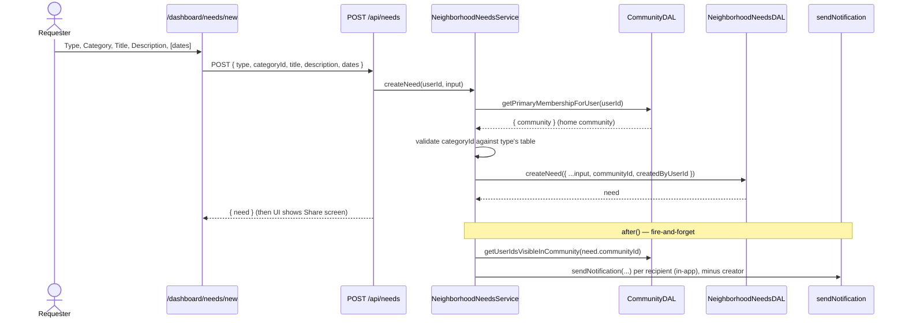
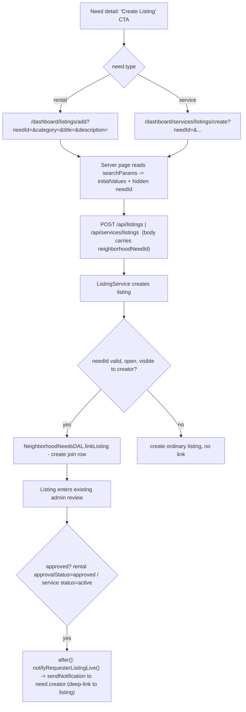
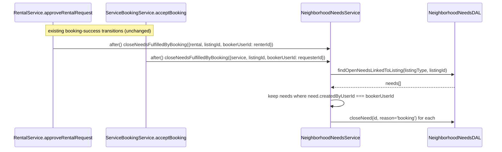

# Design Document: Neighborhood Needs (MVP)

## 1. Overview

This design implements the Neighborhood Needs feature defined in
[1-requirements.md](./1-requirements.md). It adds a **demand-side surface** to
the marketplace: users post a request (a "need") for a rental or service; the
need surfaces to the network as a demand signal; providers create a listing in
response; the listing links back to the need; the requester is notified and
proceeds through the **existing** listing/booking flows.

The feature is the demand-side mirror of a listing. It introduces:

- Two new tables — `neighborhood_needs` and `neighborhood_need_listings`.
- Three new enums (`need_type`, `need_status`, `need_close_reason`) and two new
  notification types + one new notification category.
- A `NeighborhoodNeedsDAL` (extends `BaseDAL`) and a `NeighborhoodNeedsService`.
- Network-scoped feed/detail/create/edit/close pages + thin API routes.
- Three integration hooks into existing flows: **listing-create** (link),
  **listing-approval** (notify requester), and **booking-success** (auto-close).
- A `DashboardPulseData` extension and reusable empty-state CTAs.

It reuses, unchanged: the `community_visibility` model and
`getVisibleCommunityIds`, `sendNotification()`, the listing-creation forms, the
booking/approval services, route-helpers, and the BaseDAL error model. **No new
booking flow, payment lifecycle, or proposal/quote system is introduced.**

### Design Constraints (from Requirements)

Reproduced here as the design's input contract — not re-litigated:

| #   | Decision                                                                                                                                       | Source        |
| --- | ---------------------------------------------------------------------------------------------------------------------------------------------- | ------------- |
| D1  | A need's `community_id` = creator's **primary** community; feed visibility uses the **same symmetric `community_visibility` rule as listings** | R1, AD#1, R5  |
| D2  | Notifications: in-app default, push opt-in, email off; new mutable `neighborhood_needs` category; **no interest matching**                     | R12, AD#2     |
| D3  | Analytics deferred entirely; schema keeps metrics derivable but nothing computed/surfaced                                                      | AD#3          |
| D4  | Two category tables; `type` + `category_id` with **no DB FK**; validated in the service layer                                                  | AD#4, R2/R4   |
| D5  | Auto-close only when the need's **creator** books a linked listing                                                                             | AD#5, R10     |
| D6  | Reuse existing flows; add 2 tables, 1 category, a few routes/pages, 3 hooks                                                                    | AD#6          |
| D7  | Polymorphic listing reference disambiguated by `listing_type` on the join table                                                                | R3            |
| D8  | Link row created at listing creation; requester notified when the listing goes **live/approved**                                               | R9.4, R9.5    |
| D9  | Admin delete = **soft delete** (`deleted_at`); linked rows preserved                                                                           | R16.4         |
| D10 | New `NeighborhoodNeedsDAL` + `NeighborhoodNeedsService` (do not overload Community/Listing DALs)                                               | resolved here |
| D11 | App-Router **server pages read `searchParams`** for listing pre-fill (not client `useSearchParams`)                                            | resolved here |
| D12 | Fan-out + auto-close + notify all run in Next.js `after()` blocks, fire-and-forget, `captureNonCriticalError`                                  | resolved here |

---

## 2. Architecture

### 2.1 High-Level Flows

#### Post a Need → Fan-out → Share



#### Create Listing From Need → Link → Notify on Approval



#### Auto-Close on Creator's Booking (the demand-met signal)



### 2.2 Layer Responsibilities

| Layer               | Files                                                                                                                                                                          | Responsibilities                                                                                           |
| ------------------- | ------------------------------------------------------------------------------------------------------------------------------------------------------------------------------ | ---------------------------------------------------------------------------------------------------------- |
| **Schema**          | `src/db/schemas/neighborhood-needs.schema.ts` (new)                                                                                                                            | `neighborhood_needs`, `neighborhood_need_listings`, relations, inferred types.                             |
| **Schema**          | [src/db/schemas/\_enums.ts](src/db/schemas/_enums.ts)                                                                                                                          | Add `need_type`, `need_status`, `need_close_reason`; extend `notification_type` + `notification_category`. |
| **DAL**             | `src/dal/neighborhood-needs.dal.ts` (new)                                                                                                                                      | All read/write for needs + link rows + feed query + counts. No auth logic.                                 |
| **DAL**             | [src/dal/community.dal.ts](src/dal/community.dal.ts)                                                                                                                           | Add `getUserIdsVisibleInCommunity(communityId)` for fan-out audience.                                      |
| **Service**         | `src/features/neighborhood-needs/services/neighborhood-needs-service.ts` (new)                                                                                                 | Orchestration: create (+fan-out), edit, close, soft-delete, link, notify-on-approval, auto-close.          |
| **Notifications**   | [src/features/notifications/lib/notification-type-map.ts](src/features/notifications/lib/notification-type-map.ts), `preference-service.ts`                                    | Map new types → `neighborhood_needs`; default channel matrix (in-app on, push/email off).                  |
| **Hook (rental)**   | [src/features/rentals/services/rental-service.ts](src/features/rentals/services/rental-service.ts)                                                                             | In `approveRentalRequest` `after()` block: fire-and-forget `closeNeedsFulfilledByBooking`.                 |
| **Hook (service)**  | [src/features/services/services/service-booking-service.ts](src/features/services/services/service-booking-service.ts)                                                         | In `acceptBooking` `after()` block: fire-and-forget `closeNeedsFulfilledByBooking`.                        |
| **Hook (create)**   | [src/features/listings/services/listing-service.ts](src/features/listings/services/listing-service.ts) + service-listing create path                                           | Accept optional `neighborhoodNeedId`; call `linkListingToNeed` after listing insert.                       |
| **Hook (approval)** | listing-approval transitions (rental `approvalStatus→approved`, service listing `status→active`)                                                                               | Fire-and-forget `notifyRequesterListingLive`. (Exact method confirmed in Tasks — see §9.)                  |
| **API Routes**      | `src/app/api/needs/route.ts`, `src/app/api/needs/[id]/route.ts`, `src/app/api/needs/[id]/close/route.ts` (new)                                                                 | Thin handlers; auth via route-helpers; delegate to service/DAL.                                            |
| **Pages**           | `src/app/dashboard/needs/{page,[id]/page,new/page}.tsx` (new)                                                                                                                  | Feed (`What Your Neighbors Need`), detail, create + share screen.                                          |
| **Pages (edit)**    | [src/app/dashboard/listings/add/page.tsx](src/app/dashboard/listings/add/page.tsx), [service create page](src/app/dashboard/services/listings/create/page.tsx)                 | Read `searchParams` → pass pre-fill + hidden `neighborhoodNeedId` into existing forms.                     |
| **Nav**             | [src/constants/navbar.ts](src/constants/navbar.ts)                                                                                                                             | Add "Neighborhood Needs" item to `MAIN_NAV`.                                                               |
| **Dashboard**       | [src/features/dashboard/lib/pulse-data.ts](src/features/dashboard/lib/pulse-data.ts), `types.ts`, [dashboard-pulse.tsx](src/features/dashboard/components/dashboard-pulse.tsx) | Add open-needs count to `DashboardPulseData` + render.                                                     |
| **UI**              | `src/features/neighborhood-needs/components/*` (new)                                                                                                                           | Feed cards, filters, detail, create form, share success, empty-state CTA.                                  |
| **Hooks (RQ)**      | `src/features/neighborhood-needs/hooks/*` (new)                                                                                                                                | `useNeedsFeed`, `useNeed`, `useCreateNeed`, `useUpdateNeed`, `useCloseNeed`, `useDeleteNeed`.              |

---

## 3. Components and Interfaces

### 3.1 Database Schema (Drizzle definitions)

New file `src/db/schemas/neighborhood-needs.schema.ts`:

```ts
import {
  pgTable,
  uuid,
  text,
  varchar,
  timestamp,
  date,
  index,
  uniqueIndex,
} from "drizzle-orm/pg-core";
import { relations } from "drizzle-orm";
import { user } from "./user.schema";
import { communities } from "./communities.schema";
import { needTypeEnum, needStatusEnum, needCloseReasonEnum } from "./_enums";

export const neighborhoodNeeds = pgTable(
  "neighborhood_needs",
  {
    id: uuid("id").defaultRandom().primaryKey(),
    createdByUserId: text("created_by_user_id")
      .references(() => user.id, { onDelete: "cascade" })
      .notNull(),
    communityId: uuid("community_id")
      .references(() => communities.id, { onDelete: "cascade" })
      .notNull(),
    type: needTypeEnum("type").notNull(),
    // No DB FK — references listing_categories OR service_listing_categories
    // based on `type`; validated in the service layer (D4).
    categoryId: uuid("category_id").notNull(),
    title: varchar("title", { length: 120 }).notNull(),
    description: text("description").notNull(),
    neededStartDate: date("needed_start_date"),
    neededEndDate: date("needed_end_date"),
    status: needStatusEnum("status").default("open").notNull(),
    closeReason: needCloseReasonEnum("close_reason"),
    closedAt: timestamp("closed_at"),
    deletedAt: timestamp("deleted_at"),
    createdAt: timestamp("created_at").defaultNow().notNull(),
    updatedAt: timestamp("updated_at").defaultNow().notNull(),
  },
  (t) => ({
    // Default feed: community_id IN (...) AND status='open'
    communityStatusIdx: index("neighborhood_needs_community_status_idx").on(
      t.communityId,
      t.status,
    ),
    creatorIdx: index("neighborhood_needs_creator_idx").on(t.createdByUserId),
  }),
);

export const neighborhoodNeedListings = pgTable(
  "neighborhood_need_listings",
  {
    id: uuid("id").defaultRandom().primaryKey(),
    neighborhoodNeedId: uuid("neighborhood_need_id")
      .references(() => neighborhoodNeeds.id, { onDelete: "cascade" })
      .notNull(),
    // Polymorphic: 'rental' -> listings.id, 'service' -> service_listings.id
    listingType: needTypeEnum("listing_type").notNull(),
    listingId: uuid("listing_id").notNull(),
    createdAt: timestamp("created_at").defaultNow().notNull(),
  },
  (t) => ({
    needIdx: index("neighborhood_need_listings_need_idx").on(
      t.neighborhoodNeedId,
    ),
    // A listing belongs to at most ONE originating need (R3.2)
    listingUniqueIdx: uniqueIndex("neighborhood_need_listings_listing_idx").on(
      t.listingType,
      t.listingId,
    ),
  }),
);

export const neighborhoodNeedsRelations = relations(
  neighborhoodNeeds,
  ({ one, many }) => ({
    creator: one(user, {
      fields: [neighborhoodNeeds.createdByUserId],
      references: [user.id],
    }),
    community: one(communities, {
      fields: [neighborhoodNeeds.communityId],
      references: [communities.id],
    }),
    linkedListings: many(neighborhoodNeedListings),
  }),
);

export type NeighborhoodNeed = typeof neighborhoodNeeds.$inferSelect;
export type NewNeighborhoodNeed = typeof neighborhoodNeeds.$inferInsert;
export type NeighborhoodNeedListing =
  typeof neighborhoodNeedListings.$inferSelect;
```

Added to [src/db/schemas/\_enums.ts](src/db/schemas/_enums.ts):

```ts
export const needTypeEnum = pgEnum("need_type", ["rental", "service"]);
export const needStatusEnum = pgEnum("need_status", ["open", "closed"]);
export const needCloseReasonEnum = pgEnum("need_close_reason", [
  "manual",
  "booking",
  "admin",
]);

// Extend EXISTING enums (append values — Postgres ALTER TYPE ... ADD VALUE):
// notification_type   += 'neighborhood_need_created', 'neighborhood_need_listing_created'
// notification_category += 'neighborhood_needs'
```

> **Migration note:** adding values to an existing `pgEnum` uses
> `ALTER TYPE ... ADD VALUE`, which **cannot run inside a transaction block** in
> Postgres. The notification enum additions therefore go in their **own**
> migration file, separate from the table-creation migration (see §5).

### 3.2 `NeighborhoodNeedsDAL` (new)

```ts
class NeighborhoodNeedsDAL extends BaseDAL {
  // --- CRUD ---
  createNeed(data: NewNeighborhoodNeed): Promise<NeighborhoodNeed>
  getNeedById(id: string): Promise<NeighborhoodNeed | null>          // ignores deleted
  getNeedByIdIncludingDeleted(id: string): Promise<NeighborhoodNeed | null> // admin
  updateNeed(id: string, data: Partial<...>): Promise<NeighborhoodNeed>
  closeNeed(id: string, reason: "manual" | "booking" | "admin"): Promise<NeighborhoodNeed>
  softDeleteNeed(id: string): Promise<void>                          // sets deleted_at

  // --- Feed / detail (symmetric visibility, mirrors listing search) ---
  listFeed(
    visibleCommunityIds: string[],                                   // [] => empty
    filters: { type?: NeedType; categoryId?: string; openOnly?: boolean },
    pagination: PaginationOptions,
  ): Promise<PaginatedResult<NeedFeedRow>>                           // row carries linkedListingCount
  getNeedDetail(id: string): Promise<NeedDetail | null>             // need + linked listings
  listNeedsByUser(userId: string, p: PaginationOptions): Promise<PaginatedResult<NeighborhoodNeed>>
  countOpenVisibleNeeds(visibleCommunityIds: string[]): Promise<number> // pulse

  // --- Linking ---
  linkListing(args: { neighborhoodNeedId: string; listingType: NeedType; listingId: string }): Promise<NeighborhoodNeedListing>
  getLinkByListing(listingType: NeedType, listingId: string): Promise<NeighborhoodNeedListing | null>
  findOpenNeedsLinkedToListing(listingType: NeedType, listingId: string): Promise<NeighborhoodNeed[]>
  listLinkedListings(needId: string): Promise<LinkedListingSummary[]>
}
```

The **feed query** (the visibility hot path) mirrors `searchListings` exactly —
gating on the listing's home community, owner-side via join, viewer-side via
`IN (...)`:

```sql
SELECT n.*, COALESCE(l.cnt, 0) AS linked_listing_count
FROM neighborhood_needs n
JOIN community_visibility cv
  ON cv.user_id = n.created_by_user_id     -- creator (owner) side
 AND cv.community_id = n.community_id
 AND cv.is_visible = true
LEFT JOIN LATERAL (
  SELECT count(*) AS cnt FROM neighborhood_need_listings nl
  WHERE nl.neighborhood_need_id = n.id
) l ON true
WHERE n.community_id = ANY(:visibleCommunityIds)   -- viewer side
  AND n.deleted_at IS NULL
  AND (:openOnly IS false OR n.status = 'open')
  AND (:type     IS NULL  OR n.type = :type)
  AND (:category IS NULL  OR n.category_id = :category)
ORDER BY n.created_at DESC
LIMIT :limit OFFSET :offset;
```

- Viewer side: `n.community_id = ANY(visibleCommunityIds)` (precomputed set).
- Creator side: the `community_visibility` JOIN pinned to
  `(creator, n.community_id)` requiring `is_visible = true`. A missing row →
  excluded (fail-closed).
- `visibleCommunityIds = []` short-circuits to an empty result with no DB hit
  (checked in the route before calling the DAL).
- `linked_listing_count` counts join rows. (Open item §9: whether to count only
  live/visible linked listings — needs a polymorphic join; deferred to a service
  refinement, counts all links for MVP.)

### 3.3 `CommunityDAL` addition

```ts
// Fan-out audience: every user for whom the need's home community is visible.
// (Creator is excluded by the service.)  Reuses community_visibility.
getUserIdsVisibleInCommunity(communityId: string): Promise<string[]>
// SELECT user_id FROM community_visibility
//  WHERE community_id = :communityId AND is_visible = true
```

### 3.4 `NeighborhoodNeedsService` (new)

```ts
class NeighborhoodNeedsService {
  // Create + fan-out
  static async createNeed(
    userId: string,
    input: CreateNeedInput,
  ): Promise<NeighborhoodNeed> {
    // 1. CommunityDAL.getPrimaryMembershipForUser(userId)
    //    -> ValidationError if none (R2.4)
    // 2. validateCategoryForType(input.type, input.categoryId)
    //    rental -> listingDAL.getListingCategories(); service -> serviceListingDAL.listCategories()
    //    -> ValidationError if categoryId not in the implied table (R4.4)
    // 3. validate date order (R4.5)
    // 4. NeighborhoodNeedsDAL.createNeed({ ...input, communityId: community.id, createdByUserId: userId })
    // 5. after(() => fanOutNewNeed(need))   // fire-and-forget, captureNonCriticalError
    // returns need
  }

  static async updateNeed(
    userId,
    isAdmin,
    needId,
    patch,
  ): Promise<NeighborhoodNeed>;
  // owner-or-admin; reject type/community change; re-validate category vs existing type;
  // reject if closed/deleted (R7.5)

  static async closeNeed(userId, isAdmin, needId): Promise<NeighborhoodNeed>;
  // owner-or-admin; idempotent; close_reason = isAdmin ? 'admin' : 'manual'

  static async deleteNeed(needId): Promise<void>; // admin only; soft delete

  // Listing-create hook
  static async linkListingToNeed(args: {
    neighborhoodNeedId: string;
    listingType: NeedType;
    listingId: string;
    creatorUserId: string;
  }): Promise<void> {
    // best-effort: load need; if missing/deleted/closed OR not visible to creator -> no-op (R9.6/9.7)
    // ensure listingType === need.type (R3.4)
    // linkListing(); on UNIQUE violation -> swallow to a clean no-op (R9.8)
  }

  // Listing-approval hook
  static async notifyRequesterListingLive(
    listingType: NeedType,
    listingId: string,
  ): Promise<void> {
    // link = getLinkByListing(listingType, listingId); if none -> return
    // need = getNeedById(link.neighborhoodNeedId); if none -> return
    // sendNotification({ userId: need.createdByUserId, type:'neighborhood_need_listing_created',
    //   linkUrl: <listing deep link>, sendEmail:false? (respects prefs) })
  }

  // Booking-success hook (auto-close, D5)
  static async closeNeedsFulfilledByBooking(args: {
    listingType: NeedType;
    listingId: string;
    bookerUserId: string;
  }): Promise<void> {
    // needs = findOpenNeedsLinkedToListing(listingType, listingId)
    // for each need where need.createdByUserId === bookerUserId:
    //   closeNeed(reason='booking')   // stranger's booking -> no-op (R10.2)
  }

  // Fan-out (in-app, opt-out category)
  private static async fanOutNewNeed(need: NeighborhoodNeed): Promise<void> {
    // recipients = CommunityDAL.getUserIdsVisibleInCommunity(need.communityId)
    //   .filter(id => id !== need.createdByUserId)
    // for each: sendNotification({ type:'neighborhood_need_created',
    //   linkUrl:`/dashboard/needs/${need.id}`, /* no email payload */ })
    //   category 'neighborhood_needs' default push=off -> push only for opt-in users
  }
}
```

### 3.5 Notification wiring

- **New types** in `notification_type`: `neighborhood_need_created` (fan-out),
  `neighborhood_need_listing_created` (to requester).
- **New category** `neighborhood_needs`; both new types map to it in
  `NOTIFICATION_TYPE_TO_CATEGORY`.
- **Default channel matrix** for the new category: `inApp: true, email: false,
push: false` — set in the preference-service defaults
  ([preference-service.ts](src/features/notifications/lib/preference-service.ts)).
  Fan-out passes **no `email` payload** (so email never sends) and relies on the
  push default (`false`) so push reaches only opt-in users → satisfies R12.3.
- The requester "listing created" notification (R11) may carry email (it's a
  direct, low-volume, high-signal event); channel still governed by the user's
  category preference.

### 3.6 API Routes

| Method   | Path                   | Auth                    | Body / Query                                                                 | Returns                        |
| -------- | ---------------------- | ----------------------- | ---------------------------------------------------------------------------- | ------------------------------ |
| `POST`   | `/api/needs`           | authenticated           | `{ type, categoryId, title, description, neededStartDate?, neededEndDate? }` | `{ need }`                     |
| `GET`    | `/api/needs`           | authenticated           | `?type=&categoryId=&openOnly=true&page=&limit=`                              | `PaginatedResult<NeedFeedRow>` |
| `GET`    | `/api/needs/:id`       | authenticated + visible | —                                                                            | `NeedDetail` or 404            |
| `PATCH`  | `/api/needs/:id`       | owner or admin          | `{ title?, description?, categoryId?, neededStartDate?, neededEndDate? }`    | `{ need }`                     |
| `POST`   | `/api/needs/:id/close` | owner or admin          | —                                                                            | `{ need }`                     |
| `DELETE` | `/api/needs/:id`       | admin only              | —                                                                            | `{ ok: true }` (soft delete)   |

Linking is **not** a new route — it rides on the existing listing-create
endpoints, which gain an optional `neighborhoodNeedId` in the request body:

- `POST /api/listings` and the service-listing create route accept
  `neighborhoodNeedId?: string`. After the listing is inserted, the service
  calls `linkListingToNeed(...)` (best-effort, never fails the create).

All handlers use `getAuthenticatedUserResponse()` / `requireAdminResponse()`,
validate bodies with Zod, and route errors through `handleApiError()`. The
feed/detail routes compute the viewer's visible set once via
`getCurrentUserVisibleCommunityIds()` (the React-`cache()` helper from
multi-community) and short-circuit on `[]`.

### 3.7 Pre-fill of the listing-create forms (D11)

The two create pages are **server components**, so they receive `searchParams`
directly — no client `useSearchParams` needed:

```tsx
// src/app/dashboard/listings/add/page.tsx  (rental — analogous for service)
export default async function Page({
  searchParams,
}: {
  searchParams: Promise<Record<string, string>>;
}) {
  const sp = await searchParams;
  const prefill = parseNeedPrefill(sp); // { categoryId?, name?, description?, neighborhoodNeedId? }
  // existing category + legal fetches ...
  return (
    <CreateListingClient
      categories={categories}
      initialValues={{
        categoryId: prefill.categoryId,
        name: prefill.name,
        description: prefill.description,
      }}
      neighborhoodNeedId={prefill.neighborhoodNeedId} // hidden; included in submit body
    />
  );
}
```

- `CreateListingClient` already accepts `initialValues: Partial<...>` merged into
  react-hook-form `defaultValues` via `useListingForm` — pre-fill needs only the
  new `neighborhoodNeedId` pass-through into the submit payload.
- `ServiceListingForm` already accepts an `initial` prop; the service create page
  maps `prefill` into it and threads `neighborhoodNeedId` into its submit body.
- **Listing Type is fixed** by the route the CTA chose (rental vs service page);
  pre-filled fields are editable suggestions (R/​Usability).

### 3.8 Booking-success hooks (exact insertion points)

Both target services already use Next.js `after()` for post-response side
effects — the auto-close is added there, consistent with D12:

```ts
// rental-service.ts — approveRentalRequest(rentalId, userId, input, context)
// after the approval succeeds (rentalDAL.approveRentalRequest resolved):
after(() => {
  NeighborhoodNeedsService.closeNeedsFulfilledByBooking({
    listingType: "rental",
    listingId: rentalRequest.listingId,
    bookerUserId: rentalRequest.renterId,
  }).catch(captureNonCriticalError);
});
```

```ts
// service-booking-service.ts — acceptBooking(bookingId, providerId, context)
// after status -> 'accepted' + payment recorded (detail in scope):
after(() => {
  NeighborhoodNeedsService.closeNeedsFulfilledByBooking({
    listingType: "service",
    listingId: detail.listingId,
    bookerUserId: detail.requesterId,
  }).catch(captureNonCriticalError);
});
```

`renterId` / `requesterId` are the **booker** — the auto-close only fires when
that equals `need.createdByUserId` (D5/R10.2).

### 3.9 UI Components (new, under `src/features/neighborhood-needs/components/`)

- **`NeedsFeed`** — list of `NeedCard`s + `NeedFilters` (Rental/Service/Category/
  Open-Only). Page heading **"What Your Neighbors Need"**. Newest-first.
- **`NeedCard`** — Type, Title, truncated Description, needed dates, created date,
  linked-listing count, "View Details".
- **`NeedDetail`** — full need + linked listings (deep links). Owner sees
  Edit / Close; non-owner on an open need sees **Create Listing** (routes to the
  pre-filled create page); closed needs render read-only.
- **`CreateNeedForm`** — Type (rental/service) drives the Category source; Title,
  Description, optional dates. On success → `NeedShareSuccess`.
- **`NeedShareSuccess`** — "Your request has been posted…" with **Copy Link** and
  **Native Share** (`navigator.share` when available; deep link to the need).
- **`EmptyStateNeedCTA`** — reusable "Can't find what you need? … [Create
  Neighborhood Need]"; dropped into browse zero-results and empty category pages,
  best-effort pre-seeding Type/Category from context (R15.3).

```
Feed card                              Detail (non-owner, open)
+-----------------------------+        +-------------------------------+
| [Rental]   2d ago           |        | Need a pressure washer        |
| Need a pressure washer      |        | Rental · Cleaning             |
| For my driveway this wkend  |        | Needed Jun 28 – Jun 29        |
| Needed Jun 28–29            |        | "For my driveway this wkend"  |
| 2 listings linked           |        |                               |
|            [ View Details ] |        | Linked listings (2):          |
+-----------------------------+        |  • Sun Joe SPX3000  →         |
                                       |  • Ryobi 2300 PSI   →         |
                                       |                               |
                                       |     [ Create Listing ]        |
                                       +-------------------------------+
```

### 3.10 React Query hooks

`useNeedsFeed(filters)`, `useNeed(id)`, `useCreateNeed()`, `useUpdateNeed(id)`,
`useCloseNeed(id)`, `useDeleteNeed(id)` — query keys
`["needs", "feed", filters]`, `["needs", id]`. Mutations invalidate the feed and
the affected detail. No server actions (project convention).

### 3.11 Navigation & Pulse

- `MAIN_NAV` gains `{ title: "Neighborhood Needs", url: "/dashboard/needs", icon }`
  in [navbar.ts](src/constants/navbar.ts).
- `DashboardPulseData` (`src/features/dashboard/types.ts`) gains
  `needs: { open: number }`. `getDashboardPulseData` adds one `safe()` fetch:
  ```ts
  const visibleIds = await safe(
    () => communityDAL.getVisibleCommunityIds(userId),
    [],
  );
  const openNeeds = await safe(
    () => neighborhoodNeedsDAL.countOpenVisibleNeeds(visibleIds),
    0,
  );
  // ... return { ..., needs: { open: openNeeds } }
  ```
  `dashboard-pulse.tsx` renders "Neighborhood Needs (N)" linking to
  `/dashboard/needs`.

---

## 4. Data Models

### 4.1 `neighborhood_needs` (new)

| Column             | Type                     | Notes                                                             |
| ------------------ | ------------------------ | ----------------------------------------------------------------- |
| id                 | uuid                     | PK, default random                                                |
| created_by_user_id | text                     | NOT NULL FK → `user.id` ON DELETE CASCADE                         |
| community_id       | uuid                     | NOT NULL FK → `communities.id` ON DELETE CASCADE (home community) |
| type               | enum `need_type`         | NOT NULL (`rental` \| `service`)                                  |
| category_id        | uuid                     | NOT NULL, **no FK** (resolved per `type`)                         |
| title              | varchar(120)             | NOT NULL                                                          |
| description        | text                     | NOT NULL                                                          |
| needed_start_date  | date                     | NULL                                                              |
| needed_end_date    | date                     | NULL                                                              |
| status             | enum `need_status`       | NOT NULL default `'open'`                                         |
| close_reason       | enum `need_close_reason` | NULL (`manual`\|`booking`\|`admin`)                               |
| closed_at          | timestamp                | NULL                                                              |
| deleted_at         | timestamp                | NULL (admin soft delete)                                          |
| created_at         | timestamp                | NOT NULL default now                                              |
| updated_at         | timestamp                | NOT NULL default now                                              |

Indexes: `(community_id, status)` (feed), `(created_by_user_id)` (my-needs).

### 4.2 `neighborhood_need_listings` (new)

| Column               | Type             | Notes                                                   |
| -------------------- | ---------------- | ------------------------------------------------------- |
| id                   | uuid             | PK                                                      |
| neighborhood_need_id | uuid             | NOT NULL FK → `neighborhood_needs.id` ON DELETE CASCADE |
| listing_type         | enum `need_type` | NOT NULL (disambiguates the polymorphic ref)            |
| listing_id           | uuid             | NOT NULL (no cross-table FK)                            |
| created_at           | timestamp        | NOT NULL default now                                    |

Indexes: `(neighborhood_need_id)`; **UNIQUE `(listing_type, listing_id)`** (a
listing belongs to at most one need).

### 4.3 Derived/transport types

```ts
type NeedFeedRow = NeighborhoodNeed & { linkedListingCount: number };
type LinkedListingSummary = {
  listingType: NeedType;
  listingId: string;
  title: string;
  href: string;
  isLive: boolean;
};
type NeedDetail = NeighborhoodNeed & { linkedListings: LinkedListingSummary[] };
type CreateNeedInput = {
  type: NeedType;
  categoryId: string;
  title: string;
  description: string;
  neededStartDate?: string;
  neededEndDate?: string;
};
```

---

## 5. Migration Strategy

Three ordered Drizzle migration files (the enum split is required by Postgres):

**Migration A — new enums + tables** (single transaction):

```sql
CREATE TYPE need_type AS ENUM ('rental','service');
CREATE TYPE need_status AS ENUM ('open','closed');
CREATE TYPE need_close_reason AS ENUM ('manual','booking','admin');

CREATE TABLE neighborhood_needs ( ... per §4.1 ... );
CREATE INDEX neighborhood_needs_community_status_idx ON neighborhood_needs(community_id, status);
CREATE INDEX neighborhood_needs_creator_idx ON neighborhood_needs(created_by_user_id);

CREATE TABLE neighborhood_need_listings ( ... per §4.2 ... );
CREATE INDEX neighborhood_need_listings_need_idx ON neighborhood_need_listings(neighborhood_need_id);
CREATE UNIQUE INDEX neighborhood_need_listings_listing_idx
  ON neighborhood_need_listings(listing_type, listing_id);
```

**Migration B — notification enum additions** (NOT in a transaction — `ALTER
TYPE ... ADD VALUE` restriction):

```sql
ALTER TYPE notification_category ADD VALUE IF NOT EXISTS 'neighborhood_needs';
ALTER TYPE notification_type ADD VALUE IF NOT EXISTS 'neighborhood_need_created';
ALTER TYPE notification_type ADD VALUE IF NOT EXISTS 'neighborhood_need_listing_created';
```

**No backfill.** This is a net-new feature with no existing rows to migrate.

**Seed data:** add a couple of sample needs to dev/e2e seeds
(`src/db/seeds/*`) anchored to seeded communities/users so the feed renders
locally and the e2e feed test has data.

---

## 6. Error Handling

Inherits the DAL error model ([base.ts](src/dal/base.ts), [errors.ts](src/dal/errors.ts)) mapped by `handleApiError`.

| Scenario                                         | Where                        | Handling                                                                 |
| ------------------------------------------------ | ---------------------------- | ------------------------------------------------------------------------ |
| Creator has no primary community                 | `createNeed` (Service)       | `ValidationError("You must have a home community to post a need")` → 400 |
| `categoryId` not in the table implied by `type`  | `createNeed`/`updateNeed`    | `ValidationError("Invalid category for the selected type")` → 400        |
| `neededEndDate` before `neededStartDate`         | `createNeed`/`updateNeed`    | `ValidationError("End date must be after start date")` → 400             |
| Non-owner, non-admin edits/closes                | Route + Service              | 403 (route-helper auth)                                                  |
| Edit/close on a closed or deleted need           | `updateNeed`                 | `ValidationError`/`ConflictError` (closed is terminal, R7.5/R8.5)        |
| Viewer cannot see the need (not in visible set)  | detail route/DAL             | `notFound()` / 404 (creator + admin exempt, R6.2)                        |
| Listing already linked to another need           | `linkListing` (UNIQUE 23505) | base DAL → `ConflictError`; service **swallows to a no-op** (R9.8)       |
| Need closed/deleted between pre-fill and publish | `linkListingToNeed`          | no-op; ordinary listing created (R9.7)                                   |
| Tampered/invalid `neighborhoodNeedId` on create  | `linkListingToNeed`          | no-op (best-effort); listing still created (R9.6)                        |
| Fan-out / auto-close / notify failure            | `after()` blocks             | `captureNonCriticalError`; **never** fails create/approve/accept (R-NFR) |
| Empty visible-community set                      | feed/pulse route             | short-circuit → empty result / count 0, no DB hit (R5.8)                 |

---

## 7. Testing Strategy

### 7.1 Unit Tests

- `src/dal/__tests__/neighborhood-needs.dal.test.ts`
  - `createNeed`, `closeNeed` (idempotent), `softDeleteNeed`
  - `listFeed`: empty `visibleCommunityIds` → empty (no DB hit); need whose
    `community_id` ∉ viewer set → excluded; need whose **creator** has
    `is_visible=false` for its community → excluded (fail-closed); both-visible →
    included; filters (type/category/openOnly); newest-first
  - `linkListing` UNIQUE on `(listing_type, listing_id)`
  - `findOpenNeedsLinkedToListing`, `countOpenVisibleNeeds`
- `src/features/neighborhood-needs/services/__tests__/neighborhood-needs-service.test.ts`
  - `createNeed`: no-primary-community → ValidationError; category/type mismatch
    → ValidationError; date-order; fan-out invoked (mock `sendNotification`)
  - `linkListingToNeed`: closed/deleted/invalid need → no-op; type mismatch →
    no-op; duplicate link → clean no-op
  - `closeNeedsFulfilledByBooking`: booker === creator → closes (reason
    `'booking'`); booker ≠ creator → no-op; multiple own needs → all close
  - `notifyRequesterListingLive`: link present → notifies creator; no link →
    no-op
- `src/dal/__tests__/community.dal.test.ts` — `getUserIdsVisibleInCommunity`
- Component tests: `CreateNeedForm` (type switches category source; validation),
  `NeedCard`, `NeedDetail` (owner vs non-owner CTAs), `NeedShareSuccess`
  (copy-link / `navigator.share` guard), `EmptyStateNeedCTA`.

### 7.2 Integration Tests (route handlers, real test DB)

- `POST/GET/PATCH /api/needs`, `POST /api/needs/:id/close`,
  `DELETE /api/needs/:id`: one happy-path + one auth-fail (401/403) each.
- Route tests mock `@/features/auth/utils/session` (per CLAUDE.md), not
  route-helpers.
- Visibility: a need created by a user in community X is **absent** from the feed
  of a viewer who has toggled X off, and vice-versa (symmetric).
- Listing-create with `neighborhoodNeedId`: link row created; with a
  closed/invalid id: listing created, no link.

### 7.3 Hook-integration Tests

- Rental approval (`approveRentalRequest`) by the **need's creator** on a linked
  listing → need auto-closes; by a **different renter** → need stays open.
- Service accept (`acceptBooking`) symmetric cases.
- Listing approval transition → requester receives
  `neighborhood_need_listing_created`; a still-pending or rejected listing → no
  notification.
- Assert all three hooks are wrapped so a thrown error does **not** fail the
  host operation (mock the service to throw; host still succeeds).

### 7.4 E2E (Playwright)

- Post a need (rental) → land on the share screen → need appears in the feed.
- From a second seeded user in the same network, open the need → "Create
  Listing" → pre-filled form → submit → (admin-approve via seed/helper) →
  requester sees the "listing created" notification → opens the listing.
- Update [seed files](src/db/seeds/) with sample needs + linked listings.

---

## 8. Performance Notes

1. **Single visibility computation per request** — feed, detail, and the Pulse
   count all consume `getCurrentUserVisibleCommunityIds()` / a single
   `getVisibleCommunityIds` call; never a per-need lookup (mirrors the listing
   feed budget, R-NFR Perf.1).
2. **Indexes**: `neighborhood_needs(community_id, status)` serves the feed
   filter+sort; the `community_visibility(user_id, community_id)` unique index
   (already present) serves the creator-side join point lookup;
   `(neighborhood_need_id)` serves linked-listing fan-in;
   `(listing_type, listing_id)` unique serves `findOpenNeedsLinkedToListing` and
   the link uniqueness check.
3. **Fan-out off the hot path** — dispatched in `after()`, fire-and-forget. MVP
   networks are ~8 communities, so the visible-member set is small and an inline
   loop of `sendNotification` is acceptable; if a network grows large this moves
   to a batched/queued send (flagged §9).
4. **No N+1** — the feed counts linked listings via a single LATERAL subquery,
   not per-row queries.

---

## 9. Open Items / TBD During Implementation

- **Exact listing-approval method names** for the `notifyRequesterListingLive`
  hook (rental `approvalStatus → 'approved'` and service listing
  `status → 'active'`). Located in the listing-review / service-listing approval
  path; confirm the precise service method in Tasks before wiring.
- **Linked-listing count semantics** — count all link rows (MVP) vs. only
  live/visible listings (needs a polymorphic join to `listings` /
  `service_listings`). Default: all rows; refine if the count misleads.
- **Preference-service default matrix** — confirm where category defaults live so
  `neighborhood_needs` defaults to `{ inApp:true, email:false, push:false }`
  without a per-user backfill (new category → absent row should read as the
  default, not as "all on").
- **Fan-out scale ceiling** — inline loop vs. batched send threshold; revisit
  when a network exceeds a few hundred visible members.
- **Need route base path** — `/dashboard/needs` assumed; confirm against nav/IA.
- **`navigator.share` availability** copy/fallback on desktop (Copy Link always
  shown).
- **Empty-state CTA pre-seed** — how reliably Type/Category can be inferred from
  each browse/category context (best-effort, non-blocking).

```

```
