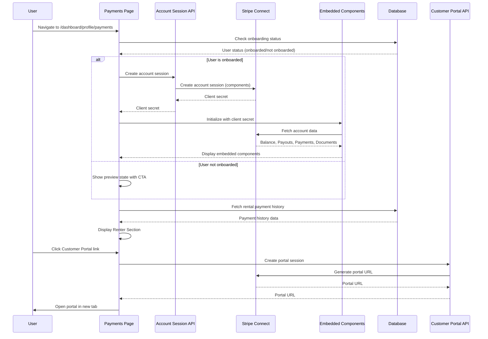

# Payments Page Design

## Overview

This design document outlines the technical architecture and implementation approach for the Payments page feature. The design integrates Stripe Connect embedded components into the Hoador application, providing tool owners with in-app access to their earnings, payouts, and financial documents while maintaining a seamless user experience.

The implementation follows a hybrid approach where common features (balance, payouts, payments, documents) are embedded directly in the app using Stripe's Connect embedded components, while advanced features (account management, disputes) link to Stripe's Express Dashboard. This balances user experience with development complexity.

## Architecture

### High-Level Architecture

The Payments page feature follows a layered architecture consistent with the existing Hoador codebase:

```
┌─────────────────────────────────────────────────────────┐
│              Presentation Layer                          │
│  - Payments Page (Next.js Server/Client Components)    │
│  - Stripe Embedded Components (Client-side)            │
│  - Global Notification Banner (Header)                  │
│  - Renter Payment History (Server Component)           │
└────────────────────┬────────────────────────────────────┘
                     │
┌────────────────────▼────────────────────────────────────┐
│              Application Layer                           │
│  - API Routes (account sessions, customer portal)      │
│  - Server Components (data fetching)                     │
│  - Client Components (Stripe Connect integration)      │
└────────────────────┬────────────────────────────────────┘
                     │
┌────────────────────▼────────────────────────────────────┐
│              Service Layer                                │
│  - Stripe Connect Service (extended)                    │
│  - Stripe Customer Portal Service (new)                 │
│  - Account Session Management                            │
└────────────────────┬────────────────────────────────────┘
                     │
┌────────────────────▼────────────────────────────────────┐
│              Data Access Layer (DAL)                     │
│  - UserDAL (existing methods)                          │
│  - PaymentDAL (rental payment queries)                 │
│  - Onboarding status checks                            │
└────────────────────┬────────────────────────────────────┘
                     │
┌────────────────────▼────────────────────────────────────┐
│              Database Layer                              │
│  - user table (existing Stripe fields)                  │
│  - payments table (rental payment history)              │
│  - rentals table (linked to payments)                    │
└─────────────────────────────────────────────────────────┘
```

### Data Flow



### Component Architecture

The feature consists of the following key components:

1. **Payments Page** (`src/app/dashboard/profile/payments/page.tsx`)
   - Server component that fetches user onboarding status
   - Renders page layout and sections
   - Passes data to client components

2. **Payments Page Client** (`src/features/users/components/payments/payments-page-client.tsx`)
   - Client component that manages Stripe Connect initialization
   - Handles account session creation
   - Renders embedded components conditionally

3. **Owner Section** (`src/features/users/components/payments/owner-section.tsx`)
   - Displays embedded Stripe components (Balance, Payouts, Payments, Documents)
   - Shows onboarding CTA for non-onboarded users
   - Includes Express Dashboard link

4. **Renter Section** (`src/features/users/components/payments/renter-section.tsx`)
   - Displays rental payment history
   - Includes Customer Portal link
   - Shows empty state when no payments exist

5. **Global Notification Banner** (`src/components/layout/stripe-notification-banner.tsx`)
   - Embedded Stripe notification banner component
   - Displays in global header/navbar
   - Shows required actions from Stripe

6. **Stripe Connect Service Extensions** (`src/services/stripe/connect.ts`)
   - Extended `createAccountSession()` to support multiple components
   - New `createCustomerPortalSession()` function

7. **API Routes**:
   - Extended `/api/stripe/create-account-session` - supports new components
   - New `/api/stripe/create-customer-portal-session` - generates portal links

## Components and Interfaces

### Payments Page Structure

```typescript
// src/app/dashboard/profile/payments/page.tsx
export default async function PaymentsPage() {
  const user = await getCurrentUser();
  const isOnboarded = user
    ? await userDAL.isConnectOnboardingComplete(user.id)
    : false;

  // Fetch rental payment history
  const paymentHistory = await paymentDAL.getUserRentalPayments(user?.id);

  return (
    <div className="container pb-6">
      <PageHeader
        title="Payments"
        description="Manage your earnings, payouts, and payment history"
      />
      <ProfileTabs>
        <PaymentsPageClient
          isOnboarded={isOnboarded}
          paymentHistory={paymentHistory}
        />
      </ProfileTabs>
    </div>
  );
}
```

### Client Component with Stripe Connect

```typescript
// src/features/users/components/payments/payments-page-client.tsx
"use client";

import { useEffect, useState } from "react";
import { loadConnectAndInitialize } from "@stripe/connect-js";
import { ConnectComponentsProvider } from "@stripe/react-connect-js";
import type { StripeConnectInstance } from "@stripe/connect-js";
import { OwnerSection } from "./owner-section";
import { RenterSection } from "./renter-section";

interface PaymentsPageClientProps {
  isOnboarded: boolean;
  paymentHistory: RentalPayment[];
}

export function PaymentsPageClient({
  isOnboarded,
  paymentHistory,
}: PaymentsPageClientProps) {
  const [connectInstance, setConnectInstance] =
    useState<StripeConnectInstance | null>(null);
  const [isLoading, setIsLoading] = useState(true);
  const [error, setError] = useState<string | null>(null);

  useEffect(() => {
    if (!isOnboarded) {
      setIsLoading(false);
      return;
    }

    const initializeConnect = async () => {
      try {
        const fetchClientSecret = async (): Promise<string> => {
          const response = await fetch("/api/stripe/create-account-session", {
            method: "POST",
          });

          if (!response.ok) {
            const errorData = await response.json();
            throw new Error(
              errorData.error || "Failed to create account session",
            );
          }

          const data = await response.json();
          return data.clientSecret;
        };

        const connect = await loadConnectAndInitialize({
          publishableKey: process.env.NEXT_PUBLIC_STRIPE_PUBLISHABLE_KEY!,
          fetchClientSecret,
        });

        setConnectInstance(connect);
        setIsLoading(false);
      } catch (err) {
        console.error("Error initializing Stripe Connect:", err);
        setError(err instanceof Error ? err.message : "Failed to initialize");
        setIsLoading(false);
      }
    };

    initializeConnect();
  }, [isOnboarded]);

  if (isLoading) {
    return <PaymentsPageSkeleton />;
  }

  if (error) {
    return <PaymentsPageError error={error} />;
  }

  return (
    <div className="space-y-8">
      {isOnboarded && connectInstance ? (
        <ConnectComponentsProvider connectInstance={connectInstance}>
          <OwnerSection />
        </ConnectComponentsProvider>
      ) : (
        <OwnerSectionPreview onStartOnboarding={handleStartOnboarding} />
      )}
      <RenterSection paymentHistory={paymentHistory} />
    </div>
  );
}
```

### Owner Section with Embedded Components

```typescript
// src/features/users/components/payments/owner-section.tsx
"use client";

import {
  ConnectBalances,
  ConnectPayouts,
  ConnectPayments,
  ConnectDocuments,
} from "@stripe/react-connect-js";
import { Card, CardContent, CardHeader, CardTitle } from "@/components/ui/card";
import { Button } from "@/components/ui/button";
import { ExternalLink } from "lucide-react";

interface OwnerSectionProps {
  isOnboarded?: boolean;
}

export function OwnerSection({ isOnboarded = false }: OwnerSectionProps) {
  const handleOpenExpressDashboard = async () => {
    // Open Express Dashboard in new tab
    const response = await fetch("/api/stripe/create-login-link", {
      method: "POST",
    });
    const data = await response.json();
    window.open(data.url, "_blank", "noopener,noreferrer");
  };

  return (
    <div className="space-y-6">
      <div>
        <h2 className="text-2xl font-semibold">Earnings & Payouts</h2>
        <p className="text-muted-foreground text-sm">
          Manage your earnings from tool rentals
        </p>
      </div>

      <div className="grid gap-6 lg:grid-cols-2">
        <Card>
          <CardHeader>
            <CardTitle>Balance</CardTitle>
          </CardHeader>
          <CardContent>
            <ConnectBalances />
          </CardContent>
        </Card>

        <Card>
          <CardHeader>
            <CardTitle>Payouts</CardTitle>
          </CardHeader>
          <CardContent>
            <ConnectPayouts />
          </CardContent>
        </Card>

        <Card className="lg:col-span-2">
          <CardHeader>
            <CardTitle>Payment History</CardTitle>
          </CardHeader>
          <CardContent>
            <ConnectPayments />
          </CardContent>
        </Card>

        <Card className="lg:col-span-2">
          <CardHeader>
            <CardTitle>Tax Documents</CardTitle>
          </CardHeader>
          <CardContent>
            <ConnectDocuments />
          </CardContent>
        </Card>
      </div>

      <div className="flex justify-end">
        <Button
          variant="ghost"
          size="sm"
          onClick={handleOpenExpressDashboard}
          className="text-muted-foreground"
        >
          <ExternalLink className="mr-2 h-4 w-4" />
          Advanced settings
        </Button>
      </div>
    </div>
  );
}
```

### Renter Section

```typescript
// src/features/users/components/payments/renter-section.tsx
import { Card, CardContent, CardHeader, CardTitle } from "@/components/ui/card";
import { Button } from "@/components/ui/button";
import { ExternalLink, CreditCard } from "lucide-react";
import Link from "next/link";

interface RentalPayment {
  id: string;
  rentalId: string;
  listingName: string;
  amount: number;
  status: "succeeded" | "pending" | "failed";
  paymentDate: Date;
  rentalStartDate: Date;
  rentalEndDate: Date;
}

interface RenterSectionProps {
  paymentHistory: RentalPayment[];
}

export function RenterSection({ paymentHistory }: RenterSectionProps) {
  const handleOpenCustomerPortal = async () => {
    const response = await fetch("/api/stripe/create-customer-portal-session", {
      method: "POST",
    });
    const data = await response.json();
    window.open(data.url, "_blank", "noopener,noreferrer");
  };

  return (
    <div className="space-y-6">
      <div className="flex items-center justify-between">
        <div>
          <h2 className="text-2xl font-semibold">Payment History</h2>
          <p className="text-muted-foreground text-sm">
            View your rental payment history
          </p>
        </div>
        <Button
          variant="outline"
          size="sm"
          onClick={handleOpenCustomerPortal}
        >
          <CreditCard className="mr-2 h-4 w-4" />
          Manage Payment Methods
        </Button>
      </div>

      <Card>
        <CardHeader>
          <CardTitle>Rental Payments</CardTitle>
        </CardHeader>
        <CardContent>
          {paymentHistory.length === 0 ? (
            <div className="py-8 text-center">
              <p className="text-muted-foreground">
                You haven't made any rental payments yet.
              </p>
            </div>
          ) : (
            <div className="space-y-3">
              {paymentHistory.map((payment) => (
                <PaymentHistoryItem key={payment.id} payment={payment} />
              ))}
            </div>
          )}
        </CardContent>
      </Card>
    </div>
  );
}
```

### Global Notification Banner

```typescript
// src/components/layout/stripe-notification-banner.tsx
"use client";

import { useEffect, useState } from "react";
import { ConnectNotificationBanner } from "@stripe/react-connect-js";
import { ConnectComponentsProvider } from "@stripe/react-connect-js";
import { loadConnectAndInitialize } from "@stripe/connect-js";
import type { StripeConnectInstance } from "@stripe/connect-js";

export function StripeNotificationBanner() {
  const [connectInstance, setConnectInstance] =
    useState<StripeConnectInstance | null>(null);
  const [isOnboarded, setIsOnboarded] = useState(false);

  useEffect(() => {
    // Check if user is onboarded
    // Initialize Connect if onboarded
    // Only show banner if user is onboarded
  }, []);

  if (!isOnboarded || !connectInstance) {
    return null;
  }

  return (
    <ConnectComponentsProvider connectInstance={connectInstance}>
      <div className="border-b bg-amber-50 dark:bg-amber-950">
        <div className="container py-2">
          <ConnectNotificationBanner />
        </div>
      </div>
  );
}
```

## Data Models

### Account Session Request/Response

```typescript
// Extended account session creation
interface AccountSessionRequest {
  // No body needed - uses authenticated user
}

interface AccountSessionResponse {
  clientSecret: string;
}
```

### Customer Portal Session Request/Response

```typescript
interface CustomerPortalSessionRequest {
  // No body needed - uses authenticated user
}

interface CustomerPortalSessionResponse {
  url: string;
}
```

### Rental Payment Data

```typescript
interface RentalPayment {
  id: string;
  rentalId: string;
  listingId: string;
  listingName: string;
  amount: number; // in cents
  status: "succeeded" | "pending" | "failed" | "refunded";
  paymentDate: Date;
  rentalStartDate: Date;
  rentalEndDate: Date;
  stripePaymentIntentId: string | null;
}
```

## API Routes

### Extended Account Session Route

```typescript
// src/app/api/stripe/create-account-session/route.ts
export async function POST() {
  const userId = await getCurrentUserId();
  if (!userId) {
    return NextResponse.json({ error: "Unauthorized" }, { status: 401 });
  }

  const { data: accountId } = await tryCatch(
    userDAL.getOrCreateConnectedAccount(userId),
  );

  if (!accountId) {
    return NextResponse.json(
      { error: "Failed to create connected account" },
      { status: 500 },
    );
  }

  // Create account session with all required components
  const { data: clientSecret } = await tryCatch(
    createAccountSession(accountId, {
      components: {
        balances: { enabled: true },
        payouts: { enabled: true },
        payouts_list: { enabled: true },
        payments: { enabled: true },
        documents: { enabled: true },
        notification_banner: { enabled: true },
      },
    }),
  );

  return NextResponse.json({ clientSecret });
}
```

### New Customer Portal Session Route

```typescript
// src/app/api/stripe/create-customer-portal-session/route.ts
export async function POST() {
  const userId = await getCurrentUserId();
  if (!userId) {
    return NextResponse.json({ error: "Unauthorized" }, { status: 401 });
  }

  const user = await userDAL.getById(userId);
  if (!user?.stripeCustomerId) {
    return NextResponse.json(
      { error: "No customer account found. Make a payment first." },
      { status: 404 },
    );
  }

  const { data: portalUrl } = await tryCatch(
    createCustomerPortalSession(user.stripeCustomerId, {
      return_url: `${process.env.NEXT_PUBLIC_APP_URL}/dashboard/profile/payments`,
    }),
  );

  return NextResponse.json({ url: portalUrl });
}
```

## Service Layer Extensions

### Extended Connect Service

```typescript
// src/services/stripe/connect.ts

interface AccountSessionComponents {
  balances?: { enabled: boolean };
  payouts?: { enabled: boolean };
  payouts_list?: { enabled: boolean };
  payments?: { enabled: boolean };
  documents?: { enabled: boolean };
  notification_banner?: { enabled: boolean };
}

export async function createAccountSession(
  accountId: string,
  options?: { components?: AccountSessionComponents },
): Promise<string> {
  const accountSession = await PAYMENT_SERVER_INSTANCE.accountSessions.create({
    account: accountId,
    components: {
      account_onboarding: {
        enabled: false, // Not needed for payments page
      },
      ...options?.components,
    },
  });

  return accountSession.client_secret;
}

// New function for customer portal
export async function createCustomerPortalSession(
  customerId: string,
  options: { return_url: string },
): Promise<string> {
  const session = await PAYMENT_SERVER_INSTANCE.billingPortal.sessions.create({
    customer: customerId,
    return_url: options.return_url,
  });

  return session.url;
}
```

## Data Access Layer Extensions

### Payment DAL Methods

```typescript
// src/dal/payment.dal.ts (new file or extend existing)

export class PaymentDAL extends BaseDAL {
  /**
   * Get all rental payments for a user (as renter)
   * Ordered by most recent first
   */
  async getUserRentalPayments(userId: string): Promise<RentalPayment[]> {
    // Query payments table joined with rentals and listings
    // Filter by renterId = userId
    // Order by paymentDate DESC
    // Return formatted payment data
  }
}
```

## Error Handling

### Error States

1. **Account Session Creation Failure**
   - Display error message in Owner Section
   - Provide retry button
   - Fallback to Express Dashboard link

2. **Component Loading Failure**
   - Show error message for specific component
   - Allow retry for that component
   - Other components continue to function

3. **Customer Portal Creation Failure**
   - Display error message
   - Hide or disable Customer Portal link
   - Log error for debugging

4. **No Connected Account**
   - Show onboarding CTA (already handled in preview state)
   - Prevent account session creation

5. **No Customer ID**
   - Hide Customer Portal link
   - Show message if user tries to access

### Error Components

```typescript
// src/features/users/components/payments/payments-page-error.tsx
export function PaymentsPageError({ error }: { error: string }) {
  return (
    <Card>
      <CardHeader>
        <CardTitle>Error Loading Payments</CardTitle>
      </CardHeader>
      <CardContent>
        <p className="text-destructive mb-4">{error}</p>
        <Button onClick={() => window.location.reload()}>
          Retry
        </Button>
      </CardContent>
    </Card>
  );
}
```

## Testing Strategy

### Unit Tests

1. **Service Layer**
   - `createAccountSession()` with various component configurations
   - `createCustomerPortalSession()` with valid/invalid customer IDs
   - Error handling for Stripe API failures

2. **DAL Methods**
   - `getUserRentalPayments()` with various user scenarios
   - Empty state handling
   - Data formatting and ordering

3. **Component Logic**
   - Onboarding status checks
   - Component initialization logic
   - Error state handling

### Integration Tests

1. **API Routes**
   - Account session creation with authentication
   - Customer portal creation with/without customer ID
   - Error responses for unauthorized users

2. **Page Rendering**
   - Server-side data fetching
   - Client-side component initialization
   - Conditional rendering based on onboarding status

### E2E Tests

1. **Onboarded User Flow**
   - Navigate to Payments page
   - Verify embedded components load
   - Test Express Dashboard link
   - Test Customer Portal link

2. **Non-Onboarded User Flow**
   - Navigate to Payments page
   - Verify preview state displays
   - Test onboarding CTA

3. **Renter Section**
   - Verify payment history displays
   - Test empty state
   - Test Customer Portal access

### Manual Testing Scenarios

1. Test with various Stripe account states (active, restricted, suspended)
2. Test with users who have no payment history
3. Test with users who have many payments (pagination if needed)
4. Test mobile responsiveness
5. Test error recovery (network failures, API errors)
6. Test notification banner display/hiding

## Security Considerations

1. **Authentication**: All API routes verify user authentication
2. **Authorization**: Account sessions only created for user's own account
3. **Customer Portal**: Only accessible for user's own customer ID
4. **Server-Side API Keys**: All Stripe API calls use server-side keys
5. **Session Secrets**: Client secrets never exposed in client code
6. **Input Validation**: All user inputs validated before use
7. **Error Messages**: Generic error messages to avoid information leakage

## Performance Considerations

1. **Server-Side Rendering**: Initial page load uses SSR for fast display
2. **Lazy Loading**: Embedded components load after page render
3. **Caching**: Account session data cached appropriately
4. **Pagination**: Payment history paginated if large datasets
5. **Component Initialization**: Components initialize in parallel where possible

## Migration Strategy

1. **Update Profile Navigation**: Replace "Billing" with "Payments" in constants
2. **Create New Page**: Add `/dashboard/profile/payments` page
3. **Deprecate Old Page**: Keep billing page temporarily, redirect to payments
4. **Update Components**: Migrate any billing-specific logic to payments page
5. **Remove Old Page**: After migration period, remove billing page
