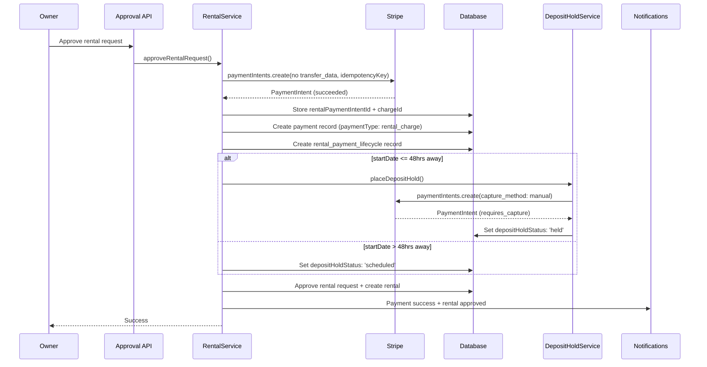
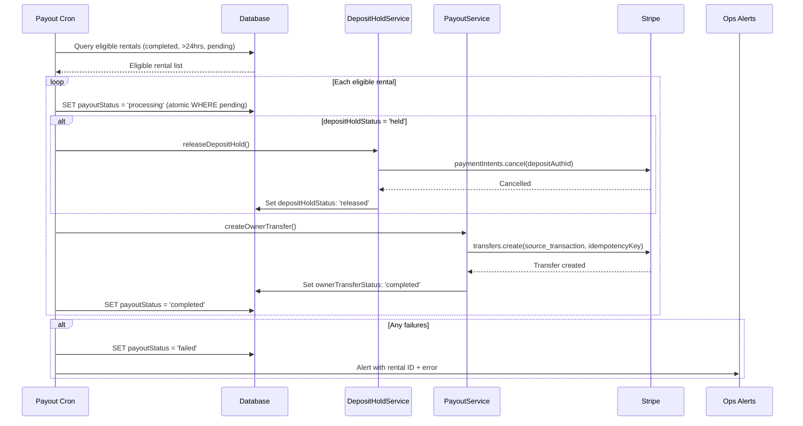
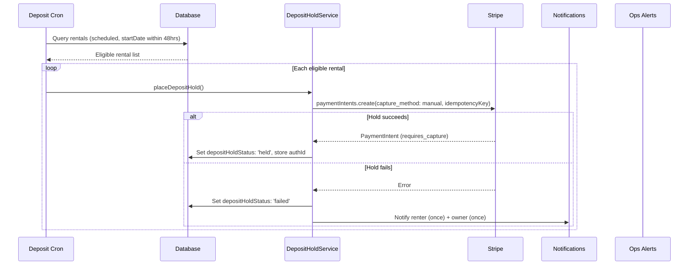

# Stripe Connect Payment Lifecycle (Phase 1) - Design Document

## Overview

This document details the technical design for restructuring Hoador's Stripe Connect payment lifecycle. The implementation replaces destination charges with a platform-hold model, introduces deposit auth hold scheduling, adds three cron jobs for automated financial operations, and extends the webhook handler for payment lifecycle events.

The design follows the existing layered architecture (Presentation → Application → Service → DAL → Database) and reuses established patterns from the codebase: `withRequestLogging`, `tryCatch`, `captureNonCriticalError`, `BaseDAL`, audit logging, and the notification service.

## Architecture

### High-Level Architecture

```
┌─────────────────────────────────────────────────────────┐
│              Presentation Layer                          │
│  - Existing Rental Approval UI (modified)               │
│  - Existing Payment Methods UI (reused)                 │
│  - Return Confirmation Action (new)                     │
└────────────────────┬────────────────────────────────────┘
                     │
┌────────────────────▼────────────────────────────────────┐
│              Application Layer                           │
│  - Rental Approval API (modified)                       │
│  - Return Confirmation API (new)                        │
│  - Stripe Webhook Handler (extended)                    │
│  - Cron Endpoints x3 (new)                              │
└────────────────────┬────────────────────────────────────┘
                     │
┌────────────────────▼────────────────────────────────────┐
│              Service Layer                               │
│  - RentalService (modified: approval flow)              │
│  - PayoutService (new: transfer + deposit release)      │
│  - DepositHoldService (new: schedule, place, release)   │
│  - Notification Service (extended: new event types)     │
└────────────────────┬────────────────────────────────────┘
                     │
┌────────────────────▼────────────────────────────────────┐
│              Data Access Layer                           │
│  - PaymentLifecycleDAL (new)                            │
│  - PaymentDAL (extended: paymentType)                   │
│  - RentalDAL (extended: returnConfirmedAt)              │
└────────────────────┬────────────────────────────────────┘
                     │
┌────────────────────▼────────────────────────────────────┐
│              Database Layer                              │
│  - rental_payment_lifecycle (new table)                 │
│  - payments (extended: paymentType column)              │
│  - rentals (extended: returnConfirmedAt column)         │
│  - New enums in _enums.ts                               │
└────────────────────┬────────────────────────────────────┘
                     │
┌────────────────────▼────────────────────────────────────┐
│              External Services                           │
│  - Stripe API (PaymentIntents, Transfers, Refunds)      │
│  - Vercel Cron (3 scheduled endpoints)                  │
└─────────────────────────────────────────────────────────┘
```

### Data Flow: Rental Approval (Modified)



### Data Flow: Payout Processing (Cron)



### Data Flow: Deposit Hold Scheduling (Cron)



## Database Schema Design

### New Table: rental_payment_lifecycle

```typescript
// src/db/schemas/rental-payment-lifecycle.schema.ts
import {
  pgTable,
  uuid,
  varchar,
  timestamp,
  index,
  uniqueIndex,
} from "drizzle-orm/pg-core";
import { rentals } from "./rentals.schema";
import {
  depositHoldStatusEnum,
  ownerTransferStatusEnum,
  payoutStatusEnum,
} from "./_enums";

export const rentalPaymentLifecycle = pgTable(
  "rental_payment_lifecycle",
  {
    id: uuid("id").defaultRandom().primaryKey(),
    rentalId: uuid("rental_id")
      .references(() => rentals.id, { onDelete: "cascade" })
      .notNull(),
    rentalChargeId: varchar("rental_charge_id", { length: 255 }), // Stripe Charge ID for source_transaction
    depositHoldStatus: depositHoldStatusEnum("deposit_hold_status")
      .default("scheduled")
      .notNull(),
    depositHoldPlacedAt: timestamp("deposit_hold_placed_at"),
    depositReleasedAt: timestamp("deposit_released_at"),
    ownerTransferStatus: ownerTransferStatusEnum("owner_transfer_status")
      .default("pending")
      .notNull(),
    payoutStatus: payoutStatusEnum("payout_status")
      .default("pending")
      .notNull(),
    stripeTransferId: varchar("stripe_transfer_id", { length: 255 }),
    ownerTransferredAt: timestamp("owner_transferred_at"),
    createdAt: timestamp("created_at").defaultNow().notNull(),
    updatedAt: timestamp("updated_at").defaultNow().notNull(),
  },
  (table) => ({
    rentalIdIdx: uniqueIndex("rpl_rental_id_idx").on(table.rentalId),
    payoutStatusIdx: index("rpl_payout_status_idx").on(table.payoutStatus),
    depositHoldStatusIdx: index("rpl_deposit_hold_status_idx").on(
      table.depositHoldStatus,
    ),
  }),
);
```

### New Enums

```typescript
// Added to src/db/schemas/_enums.ts

export const depositHoldStatusEnum = pgEnum("deposit_hold_status", [
  "scheduled", // Hold scheduled, waiting for 48hrs-before-pickup cron
  "held", // Auth hold placed successfully
  "released", // Hold cancelled on clean return
  "expired", // Hold expired (>7 days) — detected by monitoring cron
  "release_failed", // Attempted release failed
  "failed", // Hold placement failed — awaiting renter payment method update
  "captured", // Hold captured for damage (Phase 3)
  "not_applicable", // No security deposit on this rental
]);

export const ownerTransferStatusEnum = pgEnum("owner_transfer_status", [
  "pending", // Awaiting transfer after dispute window
  "processing", // Transfer in progress
  "completed", // Transfer succeeded
  "failed", // Transfer failed — ops notified
  "frozen", // Frozen due to open dispute
]);

export const payoutStatusEnum = pgEnum("payout_status", [
  "pending", // Awaiting payout processing
  "processing", // Cron has claimed this rental — concurrency lock
  "completed", // All payout operations succeeded
  "failed", // One or more operations failed
]);

export const paymentTypeEnum = pgEnum("payment_type", [
  "rental_charge", // Main rental payment
  "security_deposit_hold", // Deposit auth hold
]);
```

### Modified Table: rentals

```typescript
// Add to existing rentals table in src/db/schemas/rentals.schema.ts
returnConfirmedAt: timestamp("return_confirmed_at"), // Owner confirmed return
```

### Modified Table: payments

```typescript
// Add to existing payments table in src/db/schemas/payments.schema.ts
paymentType: paymentTypeEnum("payment_type").default("rental_charge").notNull(),
```

### Migration Strategy

1. Add new enums via `ALTER TYPE` or Drizzle migration
2. Create `rental_payment_lifecycle` table
3. Add `returnConfirmedAt` to `rentals` table (nullable, no data migration needed)
4. Add `paymentType` to `payments` table with default `'rental_charge'` (existing rows auto-populated)
5. All migrations are additive — no destructive changes, backward-compatible

## Components and Interfaces

### Service Layer

#### DepositHoldService (New)

```typescript
// src/services/stripe/deposit-hold.ts

interface PlaceDepositHoldParams {
  rentalId: string;
  customerId: string;
  paymentMethodId: string;
  amount: number; // dollars
  metadata: {
    rentalRequestId: string;
    rentalId: string;
    listingId: string;
    renterId: string;
  };
}

interface DepositHoldResult {
  success: true;
  paymentIntentId: string;
} | {
  success: false;
  error: string;
}

/** Place an authorization hold for a security deposit. */
export async function placeDepositHold(params: PlaceDepositHoldParams): Promise<DepositHoldResult>;

/** Release (cancel) a previously placed deposit hold. */
export async function releaseDepositHold(paymentIntentId: string): Promise<void>;
```

**Implementation notes:**

- `placeDepositHold` creates a PaymentIntent with `capture_method: 'manual'`, `off_session: true`, `confirm: true`
- Includes idempotency key: `deposit-hold-{rentalId}`
- `releaseDepositHold` calls `stripe.paymentIntents.cancel()` — existing `releaseSecurityDeposit()` in `rental-payments.ts` does this already and should be reused

#### PayoutService (New)

```typescript
// src/services/stripe/payout.ts

interface CreateOwnerTransferParams {
  rentalId: string;
  rentalRequestId: string;
  ownerId: string;
  ownerConnectedAccountId: string;
  rentalChargeId: string; // Stripe Charge ID for source_transaction
  totalAmount: number; // dollars — the rental charge amount
  platformFeePercentage: number; // e.g., 0.2
}

interface TransferResult {
  success: true;
  transferId: string;
} | {
  success: false;
  error: string;
}

/** Create a manual transfer to the owner's connected account. */
export async function createOwnerTransfer(params: CreateOwnerTransferParams): Promise<TransferResult>;
```

**Implementation notes:**

- Calls `stripe.transfers.create()` with `source_transaction`, `destination`, `amount` (charge minus platform fee in cents)
- Idempotency key: `transfer-owner-{rentalId}`
- Platform fee: `Math.round(totalAmount * platformFeePercentage * 100)` in cents
- Transfer amount: `Math.round(totalAmount * 100) - platformFeeCents`

#### RentalService (Modified)

Changes to `approveRentalRequest()` in `src/features/rentals/services/rental-service.ts`:

1. **Remove** `ownerAccountId` and `applicationFeeAmount` from `chargeRentalPayment()` call — no `transfer_data`
2. **Remove** `trackActivity(rentalRequest.ownerId, "payout_received")` — payout happens later via cron
3. **Store** `rentalChargeId` from `paymentIntent.latest_charge` (string) on the lifecycle record
4. **Create** `rental_payment_lifecycle` record after successful charge
5. **Deposit hold**: if `startDate <= 48hrs`, call `placeDepositHold()` immediately; otherwise set `depositHoldStatus: 'scheduled'`
6. **Add** idempotency key `rental-charge-{rentalRequestId}` to charge call

### Data Access Layer

#### PaymentLifecycleDAL (New)

```typescript
// src/dal/payment-lifecycle.dal.ts
export class PaymentLifecycleDAL extends BaseDAL {
  /** Create a lifecycle record when a rental is approved. */
  async create(data: {
    rentalId: string;
    rentalChargeId: string | null;
    depositHoldStatus: DepositHoldStatus;
    ownerTransferStatus?: string;
    payoutStatus?: string;
  }): Promise<RentalPaymentLifecycle>;

  /** Get lifecycle record by rental ID. */
  async getByRentalId(rentalId: string): Promise<RentalPaymentLifecycle | null>;

  /** Atomically claim a rental for payout processing (concurrency lock). */
  async claimForProcessing(rentalId: string): Promise<boolean>;

  /** Update deposit hold status. */
  async updateDepositHoldStatus(
    rentalId: string,
    status: DepositHoldStatus,
    extra?: { depositHoldPlacedAt?: Date; depositReleasedAt?: Date },
  ): Promise<void>;

  /** Update owner transfer status. */
  async updateOwnerTransferStatus(
    rentalId: string,
    status: OwnerTransferStatus,
    extra?: { stripeTransferId?: string; ownerTransferredAt?: Date },
  ): Promise<void>;

  /** Update payout status. */
  async updatePayoutStatus(
    rentalId: string,
    status: PayoutStatus,
  ): Promise<void>;

  /** Find rentals eligible for payout processing. */
  async findEligibleForPayout(limit: number): Promise<PayoutEligibleRental[]>;

  /** Find rentals with scheduled deposits approaching pickup. */
  async findScheduledDepositsNearPickup(
    limit: number,
  ): Promise<DepositScheduleRental[]>;

  /** Find rentals with deposits held > N days (expiry check). */
  async findExpiringDeposits(daysHeld: number): Promise<DepositExpiryRental[]>;
}
```

**Key query: `findEligibleForPayout`**

```sql
SELECT rpl.*, r.*, rr.status as request_status, r.return_confirmed_at
FROM rental_payment_lifecycle rpl
JOIN rentals r ON rpl.rental_id = r.id
JOIN rental_requests rr ON r.request_id = rr.id
LEFT JOIN disputes d ON d.rental_id = r.id AND d.status IN ('open', 'evidence_requested', 'under_review')
WHERE rr.status = 'completed'
  AND r.return_confirmed_at < NOW() - INTERVAL '24 hours'
  AND rpl.payout_status = 'pending'
  AND d.id IS NULL
ORDER BY r.return_confirmed_at ASC
LIMIT $1;
```

**Key query: `findScheduledDepositsNearPickup`**

```sql
SELECT rpl.*, r.*, rr.*
FROM rental_payment_lifecycle rpl
JOIN rentals r ON rpl.rental_id = r.id
JOIN rental_requests rr ON r.request_id = rr.id
WHERE rpl.deposit_hold_status = 'scheduled'
  AND r.start_date <= NOW() + INTERVAL '48 hours'
  AND r.start_date > NOW()
ORDER BY r.start_date ASC
LIMIT $1;
```

**Key query: `claimForProcessing` (atomic lock)**

```sql
UPDATE rental_payment_lifecycle
SET payout_status = 'processing', updated_at = NOW()
WHERE rental_id = $1 AND payout_status = 'pending'
RETURNING *;
```

Returns `true` if the update affected a row (claim succeeded), `false` if not (another process already claimed it).

### Cron Endpoints

#### Deposit Hold Scheduling

```typescript
// src/app/api/cron/schedule-deposit-holds/route.ts
// Schedule: 0 * * * * (hourly)

async function getHandler(request: NextRequest) {
  // 1. Verify CRON_SECRET
  // 2. Find rentals: depositHoldStatus='scheduled', startDate within 48hrs
  // 3. For each: resolve payment method, call placeDepositHold()
  // 4. On success: update depositHoldStatus='held', store authId
  // 5. On failure: update depositHoldStatus='failed', notify renter+owner once
  // 6. Return { processedCount, successCount, failureCount }
}
```

#### Payout Processing

```typescript
// src/app/api/cron/process-payouts/route.ts
// Schedule: 0 * * * * (hourly)

async function getHandler(request: NextRequest) {
  // 1. Verify CRON_SECRET
  // 2. Find eligible rentals (completed, >24hrs, pending, no disputes)
  // 3. For each: claimForProcessing() (atomic lock)
  // 4. If depositHoldStatus='held': releaseDepositHold()
  // 5. If ownerTransferStatus='pending': createOwnerTransfer()
  // 6. On all success: payoutStatus='completed'
  // 7. On failure: payoutStatus='failed', alert ops
  // 8. Return { processedCount, successCount, failureCount }
}
```

#### Deposit Expiry Monitoring

```typescript
// src/app/api/cron/monitor-deposit-expiry/route.ts
// Schedule: 0 * * * * (hourly)

async function getHandler(request: NextRequest) {
  // 1. Verify CRON_SECRET
  // 2. Find rentals: depositHoldStatus='held', held > 6 days
  // 3. For each: stripe.paymentIntents.retrieve() to check actual status
  // 4. If PI status='canceled': set depositHoldStatus='expired'
  // 5. Alert ops for each expiration (internal only, no user notification)
  // 6. Return { checkedCount, expiredCount }
}
```

### Vercel Cron Configuration

```json
// vercel.json (updated)
{
  "crons": [
    {
      "path": "/api/cron/cleanup-notifications",
      "schedule": "0 2 * * *"
    },
    {
      "path": "/api/cron/schedule-deposit-holds",
      "schedule": "0 * * * *"
    },
    {
      "path": "/api/cron/process-payouts",
      "schedule": "0 * * * *"
    },
    {
      "path": "/api/cron/monitor-deposit-expiry",
      "schedule": "0 * * * *"
    }
  ]
}
```

### Webhook Handler Extensions

```typescript
// Extended src/app/api/stripe/webhooks/route.ts
// Add cases alongside existing account.updated / account.closed

if (eventType === "payment_intent.succeeded") {
  const pi = event.data.object as Stripe.PaymentIntent;
  // Look up payment by stripePaymentIntentId
  // Update status to 'succeeded', set paidAt if not set
} else if (eventType === "payment_intent.payment_failed") {
  const pi = event.data.object as Stripe.PaymentIntent;
  // Look up payment by stripePaymentIntentId
  // Update status to 'failed'
  // Send notification to renter
} else if (eventType === "payment_intent.canceled") {
  const pi = event.data.object as Stripe.PaymentIntent;
  if (pi.metadata?.paymentType === "security_deposit_hold") {
    // Check lifecycle record: if depositHoldStatus !== 'released'
    // → set depositHoldStatus = 'expired', alert ops
  }
} else if (eventType === "transfer.failed") {
  const transfer = event.data.object as Stripe.Transfer;
  // Look up lifecycle by stripeTransferId
  // Set ownerTransferStatus = 'failed'
  // Alert ops
}
```

### Stripe rental-payments.ts Modifications

```typescript
// src/services/stripe/rental-payments.ts — changes to chargeRentalPayment()

export async function chargeRentalPayment(
  customerId: string,
  paymentMethodId: string,
  amount: number,
  metadata: RentalPaymentMetadata,
  // REMOVED: ownerConnectedAccountId parameter
  // REMOVED: applicationFeeAmount parameter
  idempotencyKey: string, // NEW: required idempotency key
): Promise<Stripe.PaymentIntent> {
  const paymentIntentParams: Stripe.PaymentIntentCreateParams = {
    amount: Math.round(amount * 100),
    currency: "usd",
    customer: customerId,
    payment_method: paymentMethodId,
    off_session: true,
    confirm: true,
    metadata: {
      ...metadata,
      paymentType: "rental_charge",
    },
    // NO transfer_data
    // NO application_fee_amount
  };

  const paymentIntent = await PAYMENT_SERVER_INSTANCE.paymentIntents.create(
    paymentIntentParams,
    { idempotencyKey },
  );

  return paymentIntent;
}
```

The existing `authorizeSecurityDeposit()` function is reused for deposit holds — it already creates a PaymentIntent with `capture_method: 'manual'`. It needs one modification: accept an `idempotencyKey` parameter.

The existing `releaseSecurityDeposit()` function is reused for deposit hold release — it already calls `paymentIntents.cancel()`.

### Deposit Hold Failure Recovery

When the renter updates their payment method via the existing `/dashboard/profile/payments` UI:

```typescript
// In the attach-payment-method or set-default-payment-method API route
// After successfully updating the payment method:

// Check if the renter has any rentals with depositHoldStatus='failed'
const failedDeposits =
  await paymentLifecycleDAL.findFailedDepositsForRenter(renterId);
for (const deposit of failedDeposits) {
  // Only reset if the rental hasn't started yet
  if (deposit.startDate > new Date()) {
    await paymentLifecycleDAL.updateDepositHoldStatus(
      deposit.rentalId,
      "scheduled",
    );
  }
}
```

### Return Confirmation

```typescript
// New API route or server action
// POST /api/rentals/[id]/confirm-return  (or server action)

async function confirmReturn(rentalId: string, ownerId: string) {
  // 1. Verify owner is the rental owner
  // 2. Check returnConfirmedAt is not already set (idempotent)
  // 3. Set returnConfirmedAt = now on rentals table
  // 4. Set rental_requests.status = 'completed'
  // 5. Audit log: rental.return_confirmed
  // 6. Notify renter: return acknowledged
  // Note: NO payout/deposit operations here — cron handles those
}
```

## Idempotency Design

### Idempotency Keys

| Operation      | Key Format                        | When Generated                       |
| -------------- | --------------------------------- | ------------------------------------ |
| Rental charge  | `rental-charge-{rentalRequestId}` | At approval                          |
| Deposit hold   | `deposit-hold-{rentalId}`         | At hold placement (approval or cron) |
| Owner transfer | `transfer-owner-{rentalId}`       | At payout processing (cron)          |

### Status Gates (Defense in Depth)

Every Stripe call is gated by a DB status check:

| Stripe Call              | Required Status                  | Set Before Call         | Set After Success | Set After Failure  |
| ------------------------ | -------------------------------- | ----------------------- | ----------------- | ------------------ |
| Place deposit hold       | `depositHoldStatus: 'scheduled'` | —                       | `'held'`          | `'failed'`         |
| Release deposit hold     | `depositHoldStatus: 'held'`      | —                       | `'released'`      | `'release_failed'` |
| Create owner transfer    | `ownerTransferStatus: 'pending'` | —                       | `'completed'`     | `'failed'`         |
| Payout processing (cron) | `payoutStatus: 'pending'`        | `'processing'` (atomic) | `'completed'`     | `'failed'`         |

## Operations Alerting

Phase 1 uses two channels: **structured logging** for all events + **email** for critical failures.

### Structured Logging

All ops-relevant events use `getLogger().error()` with an `alertType: "ops"` tag for searchability:

```typescript
getLogger().error(
  { alertType: "ops", event: "transfer.failed", rentalId, error: message },
  "Owner transfer failed — manual intervention required",
);
```

### Email Alerts

Critical failures also send an email to a configured ops address. Uses the existing email/notification infrastructure.

```typescript
// src/features/notifications/lib/ops-alerts.ts

const OPS_ALERT_EMAIL = process.env.OPS_ALERT_EMAIL; // e.g. ops@hoador.com

interface OpsAlertParams {
  event: string; // e.g. "deposit_hold_failed", "transfer_failed"
  rentalId: string;
  message: string;
  metadata?: Record<string, unknown>;
}

export async function sendOpsAlert(params: OpsAlertParams): Promise<void> {
  // 1. Always log with structured logger
  getLogger().error(
    {
      alertType: "ops",
      event: params.event,
      rentalId: params.rentalId,
      ...params.metadata,
    },
    params.message,
  );

  // 2. Send email if OPS_ALERT_EMAIL is configured
  if (OPS_ALERT_EMAIL) {
    await sendOpsAlertEmail({
      to: OPS_ALERT_EMAIL,
      subject: `[Hoador Ops] ${params.event} — Rental ${params.rentalId}`,
      body: params.message,
      metadata: params.metadata,
    });
  }
}
```

### Environment Variable

```
OPS_ALERT_EMAIL=ops@hoador.com  # configured in all Vercel environments
```

### Events That Trigger Alerts

| Event                                           | Log | Email   |
| ----------------------------------------------- | --- | ------- |
| Deposit hold placement failure (first attempt)  | Yes | No      |
| Deposit hold placement failure (second attempt) | Yes | **Yes** |
| Deposit hold expiration detected                | Yes | **Yes** |
| Deposit hold release failure                    | Yes | **Yes** |
| Owner transfer failure                          | Yes | **Yes** |
| Cron processing error (unexpected)              | Yes | **Yes** |

## Error Handling

### Stripe Errors

Reuse the existing `isRetryablePaymentError()` and `getPaymentErrorMessage()` from `src/services/stripe/rental-payments.ts`.

| Error Type                  | Retryable? | Action                                  |
| --------------------------- | ---------- | --------------------------------------- |
| `StripeCardError`           | No         | Notify renter, set status to `'failed'` |
| `StripeRateLimitError`      | Yes        | Retry once after 1s                     |
| `StripeAPIError`            | Yes        | Retry once after 1s                     |
| `StripeConnectionError`     | Yes        | Retry once after 1s                     |
| `StripeInvalidRequestError` | No         | Log, alert ops                          |
| `StripeAuthenticationError` | No         | Log, alert ops (config issue)           |

### Cron Error Handling

- Each rental is processed independently — one failure does not block others
- Failed rentals get `payoutStatus: 'failed'` and are excluded from future runs
- Cron wraps each rental in try/catch and continues to next on failure
- Summary logged at end: `{ eligible, processed, succeeded, failed }`

## Testing Strategy

### Unit Tests

- `DepositHoldService`: mock Stripe, test hold placement, release, idempotency key format
- `PayoutService`: mock Stripe, test transfer creation, fee calculation, idempotency
- `PaymentLifecycleDAL`: test queries (eligible payouts, scheduled deposits, expiring holds), atomic claim
- `chargeRentalPayment()`: test without `transfer_data`, with idempotency key
- Fee calculations: verify platform fee deduction matches existing constants

### Integration Tests

- Full approval flow: charge → lifecycle record → scheduled deposit
- Cron: deposit placement → hold → return → payout processing → transfer
- Webhook: event → DB state update → idempotent replay
- Deposit failure recovery: fail → renter updates PM → status reset → retry

### Key Test Scenarios

- Concurrent cron executions: verify atomic `claimForProcessing` prevents double-processing
- Deposit hold for rental starting in <48hrs: immediate placement
- Deposit hold for rental starting in >48hrs: scheduled, cron places later
- Deposit expiry on long rental: monitoring detects, alerts ops, no user impact
- Owner confirms return → 24hr wait → cron releases hold + transfers

## File Structure

```
src/
├── app/api/
│   ├── cron/
│   │   ├── cleanup-notifications/route.ts  (existing)
│   │   ├── schedule-deposit-holds/route.ts  (NEW)
│   │   ├── process-payouts/route.ts         (NEW)
│   │   └── monitor-deposit-expiry/route.ts  (NEW)
│   ├── stripe/webhooks/route.ts             (MODIFIED)
│   └── rentals/[id]/confirm-return/route.ts (NEW, or server action)
├── dal/
│   ├── payment.dal.ts                       (MODIFIED: paymentType)
│   └── payment-lifecycle.dal.ts             (NEW)
├── db/schemas/
│   ├── _enums.ts                            (MODIFIED: 4 new enums)
│   ├── rentals.schema.ts                    (MODIFIED: returnConfirmedAt)
│   ├── payments.schema.ts                   (MODIFIED: paymentType column)
│   └── rental-payment-lifecycle.schema.ts   (NEW)
├── services/stripe/
│   ├── rental-payments.ts                   (MODIFIED: remove transfer_data, add idempotency)
│   ├── deposit-hold.ts                      (NEW)
│   └── payout.ts                            (NEW)
└── features/
    ├── notifications/lib/
    │   └── ops-alerts.ts                    (NEW: logging + email alerts)
    └── rentals/services/
        └── rental-service.ts               (MODIFIED: approval flow)

vercel.json                                  (MODIFIED: 3 new cron entries)
```

## Design Decisions

| Decision                                        | Rationale                                                                                                      |
| ----------------------------------------------- | -------------------------------------------------------------------------------------------------------------- |
| Separate `rental_payment_lifecycle` table       | Clean separation from rental/payment tables; 1:1 with rentals; avoids widening the already-large rentals table |
| Three separate cron endpoints                   | Each has distinct query logic and Stripe operations; easier to debug, monitor, and disable independently       |
| Reuse existing `releaseSecurityDeposit()`       | Already implements `paymentIntents.cancel()` correctly; avoids duplication                                     |
| Structured logging for ops alerts               | Simplest Phase 1 approach; no new infrastructure; upgradable to Slack/email later                              |
| `claimForProcessing` with atomic UPDATE         | Prevents race conditions between overlapping cron runs without external locking                                |
| Store `rentalChargeId` (Charge ID) on lifecycle | `stripe.transfers.create()` requires Charge ID as `source_transaction`, not PaymentIntent ID                   |
| Deposit hold at cron vs approval                | Most holds are scheduled via cron; immediate placement only for <48hr edge case                                |

---

_Last updated: March 12, 2026 | Internal use only_
