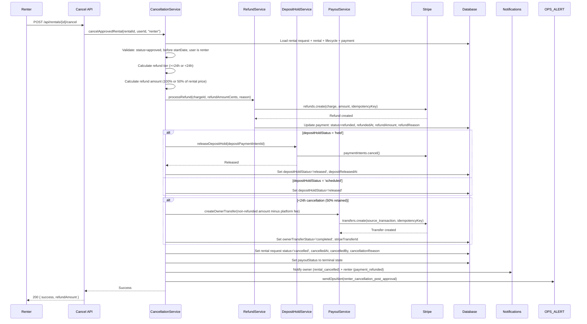
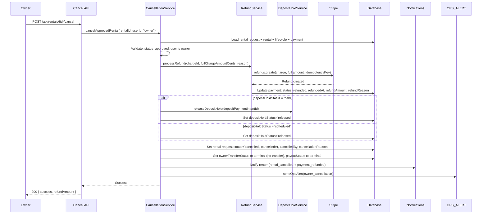
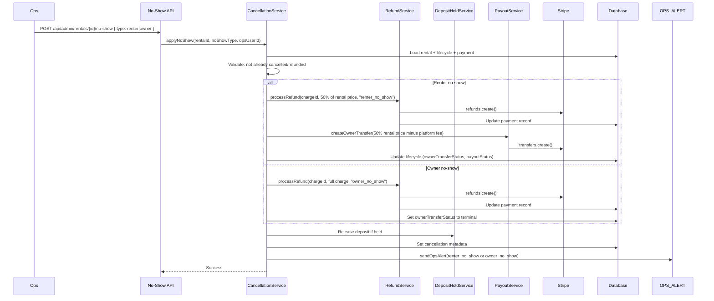

# Stripe Connect Payment Lifecycle (Phase 2) - Cancellation Policies - Design Document

## Overview

This document details the technical design for Phase 2 cancellation policies. The implementation adds automated cancellation paths for approved rentals (renter and owner), tiered refund processing, deposit hold release on cancellation, owner transfer for non-refunded balances, and no-show financial flows triggered by ops.

The design follows the layered architecture established in Phase 1 (Presentation → Application → Service → DAL → Database). **Route handlers are thin** — they handle auth, validation, and HTTP concerns only, delegating all business logic to the service layer. All database interactions go through the DAL. React Query hooks call `/api` routes using the established `useCreateMutation` and `useQuery` patterns.

## Architecture

### High-Level Architecture

```
┌─────────────────────────────────────────────────────────┐
│              Presentation Layer                          │
│  - Rental Detail UI (cancel actions)                    │
│  - React Query hooks (useCancelRental, etc.)            │
└────────────────────┬────────────────────────────────────┘
                     │
┌────────────────────▼────────────────────────────────────┐
│              Application Layer (thin route handlers)     │
│  - POST /api/rentals/[id]/cancel (modified)             │
│  - Stripe Webhook Handler (extended: charge.refunded)   │
│  - Admin/Ops no-show API (new)                          │
└────────────────────┬────────────────────────────────────┘
                     │
┌────────────────────▼────────────────────────────────────┐
│              Service Layer                               │
│  - CancellationService (new)                            │
│  - RefundService (new)                                  │
│  - Existing: DepositHoldService, PayoutService          │
│  - Existing: Notification Service, Ops Alerts           │
└────────────────────┬────────────────────────────────────┘
                     │
┌────────────────────▼────────────────────────────────────┐
│              Data Access Layer                           │
│  - RentalDAL (extended: cancellation methods)           │
│  - PaymentDAL (extended: refund methods)                │
│  - PaymentLifecycleDAL (extended: cancel transitions)   │
└────────────────────┬────────────────────────────────────┘
                     │
┌────────────────────▼────────────────────────────────────┐
│              Database Layer                              │
│  - rental_requests (extended: cancellation fields)      │
│  - payments (existing refund columns used)              │
│  - rental_payment_lifecycle (existing, status changes)  │
│  - New enum: cancellation_reason                        │
└────────────────────┬────────────────────────────────────┘
                     │
┌────────────────────▼────────────────────────────────────┐
│              External Services                           │
│  - Stripe API (Refunds, Transfers)                      │
└─────────────────────────────────────────────────────────┘
```

### Data Flow: Renter Cancellation After Approval (Pre-Pickup)



### Data Flow: Owner Cancellation



### Data Flow: No-Show (Ops-Triggered)



## Database Schema Changes

### Modified Table: rental_requests

Add cancellation tracking fields:

```typescript
// Add to existing rental_requests table in src/db/schemas/rentals.schema.ts
cancelledAt: timestamp("cancelled_at"),
cancelledBy: uuid("cancelled_by").references(() => user.id),
cancellationReason: cancellationReasonEnum("cancellation_reason"),
```

### New Enum: cancellation_reason

```typescript
// Added to src/db/schemas/_enums.ts
export const cancellationReasonEnum = pgEnum("cancellation_reason", [
  "renter_cancellation",
  "owner_cancellation",
  "renter_no_show",
  "owner_no_show",
]);
```

### Existing Columns Used (No Changes Needed)

The `payments` table already has the refund columns from Phase 1:

- `refundedAt` (timestamp) — when the refund was processed
- `refundAmount` (decimal) — amount refunded
- `refundReason` (text) — free-text reason string (e.g. "renter_cancellation_24h")
- `status` — includes `'refunded'` value

The `rental_payment_lifecycle` table already has:

- `depositHoldStatus` — supports `'released'` for cancellation release
- `ownerTransferStatus` — supports `'completed'` for partial-refund transfers
- `payoutStatus` — used to mark terminal state on cancellation
- `stripeTransferId`, `ownerTransferredAt` — for owner transfer on partial refund

### Migration Strategy

1. Add `cancellationReasonEnum` enum
2. Add `cancelledAt`, `cancelledBy`, `cancellationReason` columns to `rental_requests` (all nullable, no data migration needed)
3. All migrations are additive — no destructive changes, backward-compatible

## Components and Interfaces

### Service Layer

#### CancellationService (New)

```typescript
// src/features/rentals/services/cancellation-service.ts

interface CancelApprovedRentalResult {
  success: true;
  refundAmount: number; // dollars
  ownerTransferAmount?: number; // dollars, only if partial refund
} | {
  success: false;
  error: string;
}

interface ApplyNoShowResult {
  success: true;
  refundAmount: number;
  ownerTransferAmount?: number; // only for renter no-show
} | {
  success: false;
  error: string;
}

/**
 * Orchestrates cancellation flows: refund, deposit release, owner transfer, notifications.
 * All DB access goes through DALs. Stripe calls go through RefundService / existing services.
 */
export class CancellationService {
  /**
   * Cancel a pending rental request (renter only, no payment involved).
   * Extracted from the current cancel route handler to follow service layer pattern.
   */
  static async cancelPendingRequest(
    rentalId: string,
    userId: string,
    context: { ipAddress?: string; userAgent?: string },
  ): Promise<void>;

  /**
   * Cancel an approved rental (pre-pickup).
   * Handles both renter and owner cancellation with appropriate refund logic.
   *
   * Renter: tiered refund (100% or 50% of rental price, no service fee refund).
   *   - >=24h: full rental price refund, no owner transfer
   *   - <24h: 50% rental price refund, owner transfer for remainder minus platform fee
   *
   * Owner: full refund (rental price + service fee), no owner transfer.
   */
  static async cancelApprovedRental(
    rentalId: string,
    userId: string,
    cancelledBy: "renter" | "owner",
    context: { ipAddress?: string; userAgent?: string },
  ): Promise<CancelApprovedRentalResult>;

  /**
   * Apply a no-show outcome (ops-triggered).
   * Renter no-show: 50% rental price refund, owner transfer for remainder.
   * Owner no-show: full refund (rental price + service fee).
   */
  static async applyNoShow(
    rentalId: string,
    noShowType: "renter_no_show" | "owner_no_show",
    opsUserId: string,
  ): Promise<ApplyNoShowResult>;
}
```

**Implementation details for `cancelApprovedRental`:**

1. Load rental request, rental, payment lifecycle, and payment via DAL
2. Validate: correct status, user authorization, rental not started (for pre-pickup)
3. Determine refund tier and amount:
   - Renter cancel: compare `now` to `startDate - 24h`
   - Owner cancel: full charge amount
4. Call `RefundService.processRefund()` for the Stripe refund
5. Handle deposit: release if held, mark released if scheduled
6. Handle owner transfer (renter &lt;24h cancel only): call `createOwnerTransfer()` for non-refunded balance minus platform fee
7. Update rental request via DAL: status='cancelled', cancellation metadata
8. Update payment lifecycle via DAL: terminal statuses
9. Send notifications + OPS_ALERT
10. Audit log

#### RefundService (New)

```typescript
// src/services/stripe/refund.ts

interface ProcessRefundParams {
  rentalId: string;
  chargeId: string; // Stripe Charge ID (from rentalChargeId on lifecycle)
  refundAmountCents: number;
  reason: string; // e.g. "renter_cancellation_24h"
  metadata?: Record<string, string>;
}

type RefundResult =
  | { success: true; refundId: string }
  | { success: false; error: string };

/**
 * Process a refund via Stripe.
 * Uses deterministic idempotency key: refund-rental-{rentalId}.
 */
export async function processRefund(
  params: ProcessRefundParams,
): Promise<RefundResult>;
```

**Implementation:**

```typescript
// src/services/stripe/refund.ts
import { PAYMENT_SERVER_INSTANCE } from "./server";

export async function processRefund(
  params: ProcessRefundParams,
): Promise<RefundResult> {
  try {
    const idempotencyKey = `refund-rental-${params.rentalId}`;

    const refund = await PAYMENT_SERVER_INSTANCE.refunds.create(
      {
        charge: params.chargeId,
        amount: params.refundAmountCents,
        metadata: {
          rentalId: params.rentalId,
          reason: params.reason,
          ...params.metadata,
        },
      },
      { idempotencyKey },
    );

    return { success: true, refundId: refund.id };
  } catch (error) {
    const message =
      error instanceof Error ? error.message : "Unknown refund error";
    console.error("Error processing refund:", message);
    return { success: false, error: message };
  }
}
```

#### Refund Amount Calculation

```typescript
// src/features/rentals/services/cancellation-service.ts (internal helper)

import { calculateServiceFee } from "@/constants/payments";
import { PLATFORM_FEE_PERCENTAGE } from "@/constants/payments";

interface RefundCalculation {
  refundAmountCents: number;
  ownerTransferAmountCents: number; // 0 if no transfer
  refundReason: string;
}

function calculateRenterCancellationRefund(
  rentalPriceDollars: number,
  startDate: Date,
  now: Date = new Date(),
): RefundCalculation {
  const hoursUntilPickup =
    (startDate.getTime() - now.getTime()) / (1000 * 60 * 60);

  const rentalPriceCents = Math.round(rentalPriceDollars * 100);
  const platformFeeCents = Math.round(
    rentalPriceDollars * PLATFORM_FEE_PERCENTAGE * 100,
  );

  if (hoursUntilPickup >= 24) {
    return {
      refundAmountCents: rentalPriceCents,
      ownerTransferAmountCents: 0,
      refundReason: "renter_cancellation_24h",
    };
  }

  const halfRentalPriceCents = Math.round(rentalPriceCents / 2);
  const retainedCents = rentalPriceCents - halfRentalPriceCents;
  const ownerTransferCents = retainedCents - platformFeeCents;

  return {
    refundAmountCents: halfRentalPriceCents,
    ownerTransferAmountCents: Math.max(ownerTransferCents, 0),
    refundReason: "renter_cancellation_under_24h",
  };
}

function calculateOwnerCancellationRefund(
  totalChargeDollars: number, // rental price + service fee
): RefundCalculation {
  return {
    refundAmountCents: Math.round(totalChargeDollars * 100),
    ownerTransferAmountCents: 0,
    refundReason: "owner_cancellation",
  };
}

function calculateNoShowRefund(
  rentalPriceDollars: number,
  totalChargeDollars: number,
  noShowType: "renter_no_show" | "owner_no_show",
): RefundCalculation {
  if (noShowType === "owner_no_show") {
    return {
      refundAmountCents: Math.round(totalChargeDollars * 100),
      ownerTransferAmountCents: 0,
      refundReason: "owner_no_show",
    };
  }

  const rentalPriceCents = Math.round(rentalPriceDollars * 100);
  const halfRentalPriceCents = Math.round(rentalPriceCents / 2);
  const retainedCents = rentalPriceCents - halfRentalPriceCents;
  const platformFeeCents = Math.round(
    rentalPriceDollars * PLATFORM_FEE_PERCENTAGE * 100,
  );
  const ownerTransferCents = retainedCents - platformFeeCents;

  return {
    refundAmountCents: halfRentalPriceCents,
    ownerTransferAmountCents: Math.max(ownerTransferCents, 0),
    refundReason: "renter_no_show",
  };
}
```

### Data Access Layer

#### RentalDAL Extensions

```typescript
// Add to existing src/dal/rentals.dal.ts

/**
 * Cancel an approved rental request with cancellation metadata.
 * Sets status to 'cancelled' and records who cancelled and why.
 */
async cancelApprovedRental(
  requestId: string,
  cancelledBy: string,
  cancellationReason: CancellationReason,
): Promise<void>;

/**
 * Get full cancellation context: rental request + rental + listing details.
 * Returns rental price, total charge, startDate, securityDepositAuthId, etc.
 */
async getRentalCancellationContext(
  rentalId: string,
): Promise<RentalCancellationContext | null>;
```

**`cancelApprovedRental` implementation:**

```sql
UPDATE rental_requests
SET status = 'cancelled',
    cancelled_at = NOW(),
    cancelled_by = $1,
    cancellation_reason = $2
WHERE id = $3
  AND status IN ('approved')
RETURNING *;
```

**`getRentalCancellationContext` query:**

Joins `rental_requests`, `rentals`, `rental_payment_lifecycle`, `payments`, and `listings` to return all data needed for cancellation: rental price, total charge amount, startDate, depositHoldStatus, securityDepositAuthId, rentalChargeId, payment status, owner connected account ID, etc.

#### PaymentDAL Extensions

```typescript
// Add to existing src/dal/payment.dal.ts

/**
 * Record a refund on a payment.
 */
async recordRefund(
  paymentId: string,
  data: {
    refundedAt: Date;
    refundAmount: string; // decimal as string
    refundReason: string;
  },
): Promise<void>;

/**
 * Get payment by rental ID with charge ID for refund processing.
 * Returns the payment record including stripePaymentIntentId.
 */
// Already exists: getByRentalId(rentalId)
```

#### PaymentLifecycleDAL Extensions

```typescript
// Add to existing src/dal/payment-lifecycle.dal.ts

/**
 * Set terminal statuses on cancellation.
 * Called when a rental is cancelled to prevent payout cron from picking it up.
 */
async markCancelled(
  rentalId: string,
  extra?: {
    depositHoldStatus?: DepositHoldStatus;
    ownerTransferStatus?: OwnerTransferStatus;
    stripeTransferId?: string;
    ownerTransferredAt?: Date;
  },
): Promise<void>;
```

This method updates the lifecycle record to a terminal state so the payout cron skips it:

- `payoutStatus` → `'completed'` (or a new value if we want to distinguish cancelled from completed — design decision: use `'completed'` since the financial operations are done)
- `depositHoldStatus` → passed value (typically `'released'`)
- `ownerTransferStatus` → `'completed'` if transfer was made, otherwise stays `'pending'` or is set to a no-op terminal value

### Route Handlers (Thin)

#### Modified Cancel Route

```typescript
// src/app/api/rentals/[id]/cancel/route.ts
// Thin handler — delegates ALL logic to CancellationService

async function postHandler(
  request: NextRequest,
  { params }: { params: Promise<{ id: string }> },
) {
  try {
    const authError = await requireAuthResponse();
    if (authError) return authError;

    const { id: rentalId } = await params;

    const { getCurrentUserId } = await import("@/features/auth/utils/session");
    const currentUserId = await getCurrentUserId();
    if (!currentUserId) {
      return NextResponse.json(
        { error: "Authentication required" },
        { status: 401 },
      );
    }

    const ipAddress = getClientIP(request);
    const userAgent = getUserAgent(request);

    const result = await tryCatch(
      CancellationService.cancelRental(rentalId, currentUserId, {
        ipAddress,
        userAgent,
      }),
    );

    if (result.error) {
      if (result.error instanceof NotFoundError) {
        return NextResponse.json(
          { error: "Rental not found" },
          { status: 404 },
        );
      }
      if (result.error instanceof ForbiddenError) {
        return NextResponse.json(
          { error: result.error.message },
          { status: 403 },
        );
      }
      if (result.error instanceof BadRequestError) {
        return NextResponse.json(
          { error: result.error.message },
          { status: 400 },
        );
      }
      return handleApiError(result.error);
    }

    return NextResponse.json(result.data);
  } catch (error) {
    return handleApiError(error);
  }
}

export const POST = withRequestLogging(
  postHandler,
  "POST /api/rentals/[id]/cancel",
);
```

The service method `cancelRental` internally determines whether this is a pending cancellation (no payment) or an approved cancellation (with refund), and whether the user is the renter or the owner.

#### New No-Show API (Admin/Ops)

```typescript
// src/app/api/admin/rentals/[id]/no-show/route.ts
// Thin handler for ops to trigger no-show outcomes

const noShowSchema = z.object({
  type: z.enum(["renter_no_show", "owner_no_show"]),
});

async function postHandler(
  request: NextRequest,
  { params }: { params: Promise<{ id: string }> },
) {
  try {
    const authError = await requireAuthResponse();
    if (authError) return authError;

    // TODO: Admin/ops role check

    const { id: rentalId } = await params;
    const body = await request.json();
    const parseResult = noShowSchema.safeParse(body);
    if (!parseResult.success) {
      return NextResponse.json({ error: "Invalid data" }, { status: 400 });
    }

    const { getCurrentUserId } = await import("@/features/auth/utils/session");
    const opsUserId = await getCurrentUserId();

    const result = await tryCatch(
      CancellationService.applyNoShow(
        rentalId,
        parseResult.data.type,
        opsUserId!,
      ),
    );

    if (result.error) {
      return handleApiError(result.error);
    }

    return NextResponse.json(result.data);
  } catch (error) {
    return handleApiError(error);
  }
}

export const POST = withRequestLogging(
  postHandler,
  "POST /api/admin/rentals/[id]/no-show",
);
```

### Webhook Handler Extension

```typescript
// Extended src/app/api/stripe/webhooks/route.ts
// Add charge.refunded alongside existing handlers

} else if (eventType === "charge.refunded") {
  const charge = event.data.object as Stripe.Charge;
  const paymentIntentId =
    typeof charge.payment_intent === "string"
      ? charge.payment_intent
      : charge.payment_intent?.id;

  if (paymentIntentId) {
    const payment = await paymentDAL.getByPaymentIntentId(paymentIntentId);
    if (payment && payment.status !== "refunded") {
      const refundAmountDollars = (charge.amount_refunded / 100).toFixed(2);
      await paymentDAL.recordRefund(payment.id, {
        refundedAt: new Date(),
        refundAmount: refundAmountDollars,
        refundReason: charge.metadata?.reason || "stripe_webhook",
      });
    }
    // If already refunded, no-op (idempotent)
  }
}
```

### React Query Hooks

#### Updated Cancel Mutation

```typescript
// In src/features/rentals/hooks/use-rental-mutations.ts
// Update existing useCancelRentalRequest to handle the richer response

/**
 * Hook for canceling a rental request or approved rental.
 * The API determines whether this is a pending cancel (no refund)
 * or an approved cancel (with refund) based on current rental status.
 */
export function useCancelRentalRequest() {
  const queryClient = useQueryClient();

  return useCreateMutation({
    mutationFn: async (rentalId: string) => {
      const response = await fetch(`/api/rentals/${rentalId}/cancel`, {
        method: "POST",
      });

      if (!response.ok) {
        const error = await response.json();
        throw new Error(error.error || "Failed to cancel rental request");
      }

      return response.json();
    },
    successMessage: "Rental cancelled successfully",
    invalidateQueryKeys: [
      rentalKeys.all,
      rentalKeys.renting(),
      rentalKeys.lending(),
    ],
    onSuccess: (_data, variables) => {
      queryClient.invalidateQueries({
        queryKey: rentalKeys.detail(variables),
      });
    },
  });
}
```

The existing hook already calls `POST /api/rentals/{id}/cancel` and invalidates the right queries. The only change is that the API response now includes `refundAmount` for approved cancellations, which the UI can optionally display. The `successMessage` could be made dynamic based on the response in a future UI enhancement.

No new hooks are needed for Phase 2 — the cancel hook covers both pending and approved cancellations via the same endpoint. The no-show API is admin-only and will be called from an admin UI (out of scope for Phase 2 hooks).

## Idempotency Design

### New Idempotency Key

| Operation      | Key Format                  | When Generated                   |
| -------------- | --------------------------- | -------------------------------- |
| Refund         | `refund-rental-{rentalId}`  | At cancellation / no-show        |
| Owner transfer | `transfer-owner-{rentalId}` | At cancellation (reuses Phase 1) |

### Status Gates

| Stripe Call          | Required Pre-State              | Set After Success | Set After Failure  |
| -------------------- | ------------------------------- | ----------------- | ------------------ |
| Create refund        | payment.status != 'refunded'    | `'refunded'`      | Logged, ops alert  |
| Release deposit hold | depositHoldStatus = 'held'      | `'released'`      | `'release_failed'` |
| Owner transfer       | ownerTransferStatus = 'pending' | `'completed'`     | `'failed'`         |

Before every Stripe call, the service checks the DB status. If already in a post-operation state, the call is skipped (idempotent).

## Operations Alerting

### New Events

| Event                                       | Log | Email |
| ------------------------------------------- | --- | ----- |
| Renter cancellation post-approval           | Yes | Yes   |
| Owner cancellation                          | Yes | Yes   |
| Renter no-show                              | Yes | Yes   |
| Owner no-show                               | Yes | Yes   |
| Deposit release failure during cancellation | Yes | Yes   |
| Refund failure                              | Yes | Yes   |

All alerts use the existing `sendOpsAlert()` from `src/features/notifications/lib/ops-alerts.ts` with `sendEmailAlert: true`.

## Error Handling

### Cancellation Error Scenarios

| Scenario                    | Behavior                                                     |
| --------------------------- | ------------------------------------------------------------ |
| Rental not found            | Return 404                                                   |
| User not authorized         | Return 403                                                   |
| Rental status is `active`   | Return 400 "Cancellation not allowed for active rentals"     |
| Rental already cancelled    | Return 400 or idempotent 200 (design decision: reject)       |
| Refund fails (Stripe error) | Log, OPS_ALERT; rental status may or may not be cancelled    |
| Deposit release fails       | Set `release_failed`, OPS_ALERT; continue with refund/cancel |
| Owner transfer fails        | Set `ownerTransferStatus='failed'`, OPS_ALERT                |

### Partial Failure Strategy

Cancellation involves multiple steps (refund → deposit release → owner transfer → status update). If one step fails:

1. **Refund fails**: Do NOT mark rental as cancelled. Return error. Ops can retry.
2. **Deposit release fails**: Continue with the rest. Set `depositHoldStatus='release_failed'`. OPS_ALERT. The deposit will eventually expire.
3. **Owner transfer fails**: Mark rental as cancelled, refund is done. Set `ownerTransferStatus='failed'`. OPS_ALERT for manual resolution.

## Testing Strategy

### Unit Tests

- `CancellationService.cancelApprovedRental`: mock DALs and Stripe services, test all tiers and scenarios
- `RefundService.processRefund`: mock Stripe, test idempotency key, error handling
- Refund calculation helpers: test boundary conditions (exactly 24h, rounding, zero amounts)
- `CancellationService.cancelPendingRequest`: test existing behavior moved to service

### Integration Tests

- Full renter cancellation flow (>=24h): refund + deposit release + notifications + OPS_ALERT
- Full renter cancellation flow (<24h): partial refund + owner transfer + deposit release
- Full owner cancellation flow: full refund + deposit release + renter notification + OPS_ALERT
- No-show flows: renter no-show (partial refund + owner transfer), owner no-show (full refund)
- `charge.refunded` webhook: verify payment status sync
- Idempotency: double-cancel returns error/idempotent response
- Active rental rejection: verify 400 error

### Key Test Scenarios

- Renter cancels exactly 24h before pickup (boundary: >=24h, full refund)
- Renter cancels 23h59m before pickup (boundary: <24h, 50% refund)
- Owner cancels approved rental before deposit is placed (depositHoldStatus='scheduled')
- Cancellation when deposit already expired
- Cancellation when deposit release fails (partial failure)
- Double cancellation attempt (idempotency)
- No-show on already-cancelled rental (rejected)

## File Structure

```
src/
├── app/api/
│   ├── rentals/[id]/cancel/route.ts              (MODIFIED: thin handler → CancellationService)
│   ├── admin/rentals/[id]/no-show/route.ts       (NEW: ops no-show trigger)
│   └── stripe/webhooks/route.ts                   (MODIFIED: add charge.refunded)
├── features/rentals/
│   ├── services/
│   │   ├── rental-service.ts                      (EXISTING: unchanged)
│   │   └── cancellation-service.ts                (NEW: cancellation orchestration)
│   └── hooks/
│       └── use-rental-mutations.ts                (MODIFIED: enhanced cancel hook)
├── services/stripe/
│   ├── refund.ts                                  (NEW: Stripe refund wrapper)
│   ├── rental-payments.ts                         (EXISTING: unchanged)
│   ├── deposit-hold.ts                            (EXISTING: reused for release)
│   └── payout.ts                                  (EXISTING: reused for owner transfer)
├── dal/
│   ├── rentals.dal.ts                             (MODIFIED: cancelApprovedRental, getRentalCancellationContext)
│   ├── payment.dal.ts                             (MODIFIED: recordRefund)
│   └── payment-lifecycle.dal.ts                   (MODIFIED: markCancelled)
└── db/
    ├── schemas/_enums.ts                          (MODIFIED: add cancellationReasonEnum)
    ├── schemas/rentals.schema.ts                  (MODIFIED: add cancellation columns)
    └── migrations/                                (NEW: migration for schema changes)
```

## Design Decisions

| Decision                                                            | Rationale                                                                                                   |
| ------------------------------------------------------------------- | ----------------------------------------------------------------------------------------------------------- |
| New `CancellationService` (not extending RentalService)             | Single responsibility; cancellation has its own complex flow distinct from create/approve                   |
| Single cancel endpoint for renter + owner                           | Service determines actor role from user ID; simpler API surface; UI calls same endpoint regardless          |
| Refund service as standalone module                                 | Reusable for future dispute refunds (Phase 3); clean interface with idempotency key baked in                |
| `cancelledAt`/`cancelledBy`/`cancellationReason` on rental_requests | Cancellation is a rental_request lifecycle event; keeps audit trail on the primary record                   |
| `payoutStatus` set to `'completed'` on cancel                       | Signals "no further payout processing needed"; payout cron already skips non-pending; avoids new enum value |
| Existing `useCancelRentalRequest` hook reused                       | Same endpoint, same mutation pattern; response now richer but hook is backward-compatible                   |
| No-show as separate admin API                                       | Distinct authorization (ops-only); different flow from user-initiated cancel; clear separation of concerns  |
| OPS_ALERT for all post-approval cancellations                       | Per requirements; uses existing `sendOpsAlert()` with `sendEmailAlert: true`                                |

---

_Last updated: March 12, 2026 | Internal use only_
