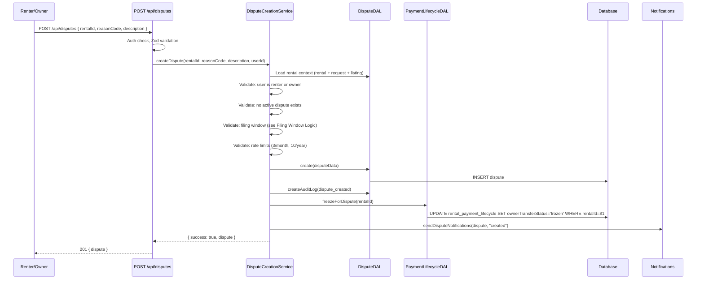
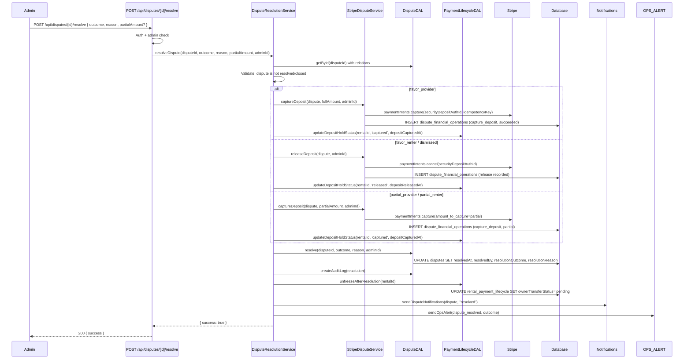
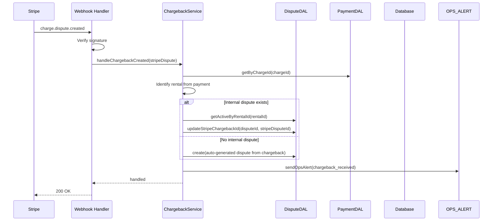

# Stripe Connect Payment Lifecycle (Phase 3) - Dispute Resolution & Chargebacks - Design Document

## Overview

This document details the technical design for Phase 3 dispute resolution and chargebacks. The implementation corrects the dispute filing UX (unified 24-hour filing window, button visibility from start date, new no-show reason codes), integrates disputes with the payment lifecycle (`ownerTransferStatus` freeze/unfreeze), wires resolution outcomes to Stripe financial operations (deposit capture, deposit release), and adds Stripe chargeback webhook handling and evidence submission.

The design follows the layered architecture established in Phase 1 and Phase 2 (Presentation → Application → Service → DAL → Database). **Route handlers are thin** — they handle auth, request parsing, and HTTP concerns only, delegating all business logic to the service layer. All database interactions go through the DAL. Stripe API calls go through dedicated service modules. React Query hooks call `/api` routes using the established `useCreateMutation` and `useQuery` patterns.

**Key architectural note:** The current dispute creation route (`POST /api/disputes`) and resolve route (`POST /api/disputes/[id]/resolve`) contain inline business logic. Phase 3 refactors these to follow the slim-route pattern established by Phase 2's `cancel/route.ts` and `no-show/route.ts` — each route makes a single service call, and the service orchestrates DALs, Stripe, and notifications.

## Architecture

### High-Level Architecture

```
┌─────────────────────────────────────────────────────────┐
│              Presentation Layer                          │
│  - Rental Detail UI (dispute button visibility)         │
│  - Create Dispute Form (contextual reason codes)        │
│  - Admin Resolution Panel (existing)                    │
│  - React Query hooks (useCreateDispute, etc.)           │
└────────────────────┬────────────────────────────────────┘
                     │
┌────────────────────▼────────────────────────────────────┐
│              Application Layer (thin route handlers)     │
│  - POST /api/disputes (refactored: slim)                │
│  - POST /api/disputes/[id]/resolve (refactored: slim)   │
│  - Stripe Webhook Handler (extended: charge.dispute.*)  │
│  - POST /api/admin/disputes/[id]/chargeback-evidence    │
└────────────────────┬────────────────────────────────────┘
                     │
┌────────────────────▼────────────────────────────────────┐
│              Service Layer                               │
│  - DisputeCreationService (new)                         │
│  - DisputeResolutionService (new)                       │
│  - StripeDisputeService (modified: idempotency, lifecycle) │
│  - ChargebackService (new)                              │
│  - Existing: DeadlineEnforcementService                 │
│  - Existing: Notification Service, Ops Alerts           │
└────────────────────┬────────────────────────────────────┘
                     │
┌────────────────────▼────────────────────────────────────┐
│              Data Access Layer                           │
│  - DisputeDAL (modified: filing window, freeze)         │
│  - PaymentLifecycleDAL (modified: freeze/unfreeze)      │
│  - PaymentDAL (existing, used for charge lookups)       │
│  - RentalDAL (existing, used for rental context)        │
└────────────────────┬────────────────────────────────────┘
                     │
┌────────────────────▼────────────────────────────────────┐
│              Database Layer                              │
│  - disputes (existing; stripeChargebackId populated)    │
│  - dispute_financial_operations (existing)              │
│  - rental_payment_lifecycle (extended: depositCapturedAt)│
│  - _enums: disputeReasonCodeEnum extended               │
└────────────────────┬────────────────────────────────────┘
                     │
┌────────────────────▼────────────────────────────────────┐
│              External Services                           │
│  - Stripe API (PaymentIntents.capture, disputes.update) │
│  - Stripe Webhooks (charge.dispute.*)                   │
└─────────────────────────────────────────────────────────┘
```

### Data Flow: Dispute Creation (with Payout Freeze)



### Data Flow: Dispute Resolution (with Financial Operations)



### Data Flow: Stripe Chargeback Webhook



## Database Schema Changes

### New Enum Values: dispute_reason_code

```typescript
// Modified in src/db/schemas/_enums.ts
export const disputeReasonCodeEnum = pgEnum("dispute_reason_code", [
  "damage",
  "non_delivery",
  "quality_issue",
  "cancellation",
  "payment_issue",
  "renter_no_show", // NEW
  "owner_no_show", // NEW
  "other",
]);
```

### Modified Table: rental_payment_lifecycle

Add `depositCapturedAt` to track when a deposit was captured for damage (distinct from `depositReleasedAt` which tracks release on clean return):

```typescript
// Add to rental_payment_lifecycle in src/db/schemas/rentals.schema.ts
depositCapturedAt: timestamp("deposit_captured_at"),
```

### Existing Columns Used (No Changes Needed)

The `disputes` table already has:

- `stripeChargebackId` (varchar) — populated when a Stripe chargeback is linked
- `resolutionOutcome` — supports all outcome values
- `resolvedAt`, `resolvedBy`, `resolutionReason`

The `dispute_financial_operations` table already has:

- `operationType` — supports `capture_deposit`, `hold_payout`, `refund_full`, `refund_partial`
- `stripePaymentIntentId`, `stripeOperationId`, `stripeTransferId`
- `status` — supports `pending`, `succeeded`, `failed`

The `rental_payment_lifecycle` table already has:

- `depositHoldStatus` — includes `'captured'` value
- `ownerTransferStatus` — includes `'frozen'` value
- `depositReleasedAt` — used for clean release; `depositCapturedAt` is added for capture

### Migration Strategy

1. Add `renter_no_show` and `owner_no_show` to `disputeReasonCodeEnum` enum type
2. Add `depositCapturedAt` (timestamp, nullable) to `rental_payment_lifecycle`
3. All migrations are additive — no destructive changes, backward-compatible

## Components and Interfaces

### Service Layer

#### DisputeCreationService (New)

Replaces the inline business logic currently in `POST /api/disputes` route.

```typescript
// src/features/disputes/services/dispute-creation-service.ts

interface CreateDisputeParams {
  rentalId: string;
  reasonCode: DisputeReasonCode;
  description: string;
  userId: string;
}

interface CreateDisputeResult {
  dispute: DisputeWithRelations;
}

/**
 * Orchestrates dispute creation: validation, filing window check, rate limits,
 * dispute insert, payout freeze, audit log, and notifications.
 * All DB access goes through DALs. Route handler is thin.
 */
export class DisputeCreationService {
  /**
   * Create a dispute for a rental.
   *
   * 1. Load rental context (rental + request + listing)
   * 2. Validate: user is renter or owner, no active dispute, filing window open
   * 3. Check rate limits (3/month, 10/year)
   * 4. Insert dispute via DisputeDAL.create()
   * 5. Freeze payout via PaymentLifecycleDAL.freezeForDispute()
   * 6. Create audit log
   * 7. Send notifications (non-blocking)
   *
   * @throws NotFoundError if rental not found
   * @throws ForbiddenError if user is not renter or owner
   * @throws ValidationError if filing window expired, active dispute exists, or rate limit hit
   */
  static async createDispute(
    params: CreateDisputeParams,
  ): Promise<CreateDisputeResult>;
}
```

**Filing window validation (internal to service):**

```typescript
/**
 * Unified filing window logic (replaces per-reason-code TimeWindowValidation).
 *
 * Rules:
 * - If returnConfirmedAt is set: now <= returnConfirmedAt + 24h
 * - If returnConfirmedAt is NOT set: now >= startDate
 *
 * This supports:
 * - Post-completion disputes: 24h window after return confirmed
 * - No-show disputes: from startDate onward (before completion)
 * - Active rental disputes: always allowed (startDate has passed)
 */
function validateFilingWindow(rental: {
  startDate: Date;
  returnConfirmedAt: Date | null;
}): { valid: boolean; message?: string } {
  const now = new Date();

  if (rental.returnConfirmedAt) {
    const deadline = new Date(rental.returnConfirmedAt);
    deadline.setHours(deadline.getHours() + 24);
    if (now > deadline) {
      return {
        valid: false,
        message:
          "The dispute filing window closed 24 hours after the return was confirmed",
      };
    }
    return { valid: true };
  }

  // No return confirmed yet — allow from startDate onward
  if (now < rental.startDate) {
    return {
      valid: false,
      message: "Disputes can be filed starting from the rental start date",
    };
  }

  return { valid: true };
}
```

#### DisputeResolutionService (New)

Replaces the inline orchestration currently in `POST /api/disputes/[id]/resolve` route.

```typescript
// src/features/disputes/services/dispute-resolution-service.ts

interface ResolveDisputeParams {
  disputeId: string;
  outcome: DisputeResolutionOutcome;
  reason: string;
  partialAmount?: number; // dollars, for partial_provider/partial_renter
  adminId: string;
}

interface ResolveDisputeResult {
  success: true;
}

/**
 * Orchestrates dispute resolution: financial operations (deposit capture/release),
 * dispute status update, lifecycle unfreeze, audit log, and notifications.
 *
 * Financial outcome mapping:
 * - favor_provider: capture full deposit → unfreeze
 * - favor_renter / dismissed: release deposit → unfreeze
 * - partial_provider / partial_renter: capture partial → unfreeze
 */
export class DisputeResolutionService {
  /**
   * Resolve a dispute and execute financial operations.
   *
   * 1. Load dispute with relations
   * 2. Validate: not already resolved/closed
   * 3. Execute financial operations based on outcome
   * 4. Update depositHoldStatus on lifecycle
   * 5. Resolve dispute via DisputeDAL.resolve()
   * 6. Unfreeze ownerTransferStatus via PaymentLifecycleDAL
   * 7. Create audit logs and financial operation records
   * 8. Send notifications + OPS_ALERT
   *
   * @throws NotFoundError if dispute not found
   * @throws ValidationError if dispute already resolved
   * @throws Error if financial operation fails (does not unfreeze)
   */
  static async resolveDispute(
    params: ResolveDisputeParams,
  ): Promise<ResolveDisputeResult>;
}
```

**Resolution outcome → financial operation mapping:**

```typescript
function getFinancialOperationsForOutcome(
  outcome: DisputeResolutionOutcome,
  depositHoldStatus: DepositHoldStatus,
  partialAmount?: number,
): FinancialOperationInput[] {
  const isHeld = depositHoldStatus === "held";

  switch (outcome) {
    case "favor_provider":
      return isHeld ? [{ type: "capture_deposit" }] : [];
    case "favor_renter":
    case "dismissed":
      return isHeld ? [{ type: "release_deposit" }] : [];
    case "partial_provider":
    case "partial_renter":
      return isHeld && partialAmount
        ? [{ type: "capture_deposit", amount: partialAmount }]
        : [];
    default:
      return [];
  }
}
```

#### StripeDisputeService (Modified)

The existing `StripeDisputeService` in `src/services/stripe/dispute-financial.ts` is extended:

```typescript
// Modifications to src/services/stripe/dispute-financial.ts

// 1. Add idempotency key to captureDeposit
private static async captureDeposit(
  dispute: DisputeWithRelations,
  performedBy: string,
  amountToCapture?: number, // cents, for partial capture
): Promise<FinancialOperationRecord> {
  const idempotencyKey = `deposit-capture-${dispute.id}`;

  // ... existing logic, but:
  // - Pass idempotencyKey to Stripe capture call
  // - Support amountToCapture for partial capture
  // - Update depositHoldStatus to 'captured' via PaymentLifecycleDAL
  // - Set depositCapturedAt timestamp
}

// 2. Add releaseDeposit method (for resolution release)
static async releaseDeposit(
  dispute: DisputeWithRelations,
  performedBy: string,
): Promise<FinancialOperationRecord> {
  // Cancel the deposit PaymentIntent
  // Update depositHoldStatus to 'released' via PaymentLifecycleDAL
  // Record in dispute_financial_operations
}
```

The key changes are:

- Idempotency key `deposit-capture-{disputeId}` on all capture calls
- Partial capture support via `amount_to_capture` parameter
- Lifecycle updates (`depositHoldStatus`, `depositCapturedAt`) as part of the operation
- New `releaseDeposit` method for resolution-time release

#### ChargebackService (New)

```typescript
// src/services/stripe/chargeback-service.ts

/**
 * Handles Stripe chargeback (charge.dispute) events and evidence submission.
 */
export class ChargebackService {
  /**
   * Handle charge.dispute.created webhook.
   * Links Stripe chargeback to internal dispute or creates one.
   */
  static async handleChargebackCreated(
    stripeDispute: Stripe.Dispute,
  ): Promise<void>;

  /**
   * Handle charge.dispute.updated webhook.
   * Updates internal state based on Stripe dispute status.
   */
  static async handleChargebackUpdated(
    stripeDispute: Stripe.Dispute,
  ): Promise<void>;

  /**
   * Handle charge.dispute.closed webhook.
   * Records outcome (won/lost) and adjusts financial state.
   */
  static async handleChargebackClosed(
    stripeDispute: Stripe.Dispute,
  ): Promise<void>;

  /**
   * Submit evidence to Stripe for a chargeback.
   * Maps internal dispute evidence to Stripe evidence format.
   * Uses idempotency key: chargeback-evidence-{disputeId}
   */
  static async submitEvidence(
    disputeId: string,
    adminId: string,
  ): Promise<void>;
}
```

**`handleChargebackCreated` implementation outline:**

```typescript
static async handleChargebackCreated(
  stripeDispute: Stripe.Dispute,
): Promise<void> {
  const chargeId = typeof stripeDispute.charge === "string"
    ? stripeDispute.charge
    : stripeDispute.charge?.id;

  // Look up payment by charge ID or payment intent
  const payment = await paymentDAL.getByChargeId(chargeId);
  if (!payment) {
    getLogger().error("Chargeback for unknown charge", { chargeId });
    return;
  }

  const rentalId = payment.rentalId;

  // Check if internal dispute exists
  const existingDispute = await disputeDAL.getActiveByRentalId(rentalId);

  if (existingDispute) {
    await disputeDAL.updateStripeChargebackId(
      existingDispute.id,
      stripeDispute.id,
    );
  } else {
    // Auto-create internal dispute for the chargeback
    await disputeDAL.create({
      rentalId,
      createdBy: "system",
      createdByRole: "renter", // chargebacks are renter-initiated via their bank
      reasonCode: "payment_issue",
      description: `Stripe chargeback received: ${stripeDispute.reason}`,
      stripeChargebackId: stripeDispute.id,
    });
  }

  // Freeze payout if not already frozen
  await paymentLifecycleDAL.freezeForDispute(rentalId);

  // Alert ops
  await sendOpsAlert({
    type: "chargeback_received",
    rentalId,
    stripeDisputeId: stripeDispute.id,
    amount: stripeDispute.amount,
    reason: stripeDispute.reason,
    sendEmailAlert: true,
  });
}
```

**`submitEvidence` implementation outline:**

```typescript
static async submitEvidence(
  disputeId: string,
  adminId: string,
): Promise<void> {
  const dispute = await disputeDAL.getById(disputeId);
  if (!dispute?.stripeChargebackId) {
    throw new ValidationError("Dispute has no linked Stripe chargeback");
  }

  // Gather internal evidence
  const evidence = await disputeDAL.getEvidenceByDisputeId(disputeId);
  const rental = await rentalDAL.getRentalDetailsById(dispute.rentalId);

  // Map to Stripe evidence format
  const stripeEvidence: Stripe.DisputeUpdateParams.Evidence = {
    product_description: `Tool rental: ${rental.listingName}`,
    service_date: rental.startDate,
    // customer_communication: extracted from messages
    // receipt: rental agreement link
    // Additional evidence from dispute_evidence records
  };

  const idempotencyKey = `chargeback-evidence-${disputeId}`;

  await PAYMENT_SERVER_INSTANCE.disputes.update(
    dispute.stripeChargebackId,
    { evidence: stripeEvidence, submit: true },
    { idempotencyKey },
  );

  await disputeDAL.createAuditLog({
    disputeId,
    actionType: "financial_operation",
    userId: adminId,
    details: { type: "chargeback_evidence_submitted" },
  });
}
```

### Data Access Layer

#### DisputeDAL Extensions

```typescript
// Add to existing src/dal/dispute.dal.ts

/**
 * Update stripeChargebackId on a dispute.
 * Called when a Stripe chargeback is linked to an internal dispute.
 */
async updateStripeChargebackId(
  disputeId: string,
  stripeChargebackId: string,
): Promise<void>;

/**
 * Unified filing window validation (replaces per-reason-code validateTimeWindow).
 * Returns { valid, message?, deadline? }.
 *
 * Rules:
 * - If returnConfirmedAt is set: now <= returnConfirmedAt + 24h
 * - If returnConfirmedAt is NOT set: now >= startDate
 */
async validateFilingWindowUnified(
  rentalId: string,
): Promise<{ valid: boolean; message?: string }>;
```

The existing `validateTimeWindow` method (per-reason-code) is replaced or bypassed by the new `validateFilingWindowUnified` which applies the strict 24-hour rule. The old method remains for backward compatibility but is not called from the Phase 3 creation flow.

#### PaymentLifecycleDAL Extensions

```typescript
// Add to existing src/dal/payment-lifecycle.dal.ts

/**
 * Freeze the owner transfer for a rental due to a dispute.
 * Sets ownerTransferStatus to 'frozen'.
 * If no lifecycle record exists, creates one (edge case).
 */
async freezeForDispute(rentalId: string): Promise<void> {
  const existing = await this.getByRentalId(rentalId);
  if (existing) {
    await this.db
      .update(rentalPaymentLifecycle)
      .set({ ownerTransferStatus: "frozen", updatedAt: new Date() })
      .where(eq(rentalPaymentLifecycle.rentalId, rentalId));
  } else {
    // Edge case: create lifecycle with frozen status
    await this.create({
      rentalId,
      ownerTransferStatus: "frozen",
      depositHoldStatus: "not_applicable",
      payoutStatus: "pending",
    });
  }
}

/**
 * Unfreeze the owner transfer after dispute resolution.
 * Sets ownerTransferStatus back to 'pending' so the payout cron picks it up.
 * Only unfreezes if currently 'frozen'.
 */
async unfreezeAfterResolution(rentalId: string): Promise<void> {
  await this.db
    .update(rentalPaymentLifecycle)
    .set({ ownerTransferStatus: "pending", updatedAt: new Date() })
    .where(
      and(
        eq(rentalPaymentLifecycle.rentalId, rentalId),
        eq(rentalPaymentLifecycle.ownerTransferStatus, "frozen"),
      ),
    );
}

/**
 * Update deposit hold status to 'captured' with timestamp.
 * Called when deposit is captured for damage on dispute resolution.
 */
async markDepositCaptured(rentalId: string): Promise<void> {
  await this.db
    .update(rentalPaymentLifecycle)
    .set({
      depositHoldStatus: "captured",
      depositCapturedAt: new Date(),
      updatedAt: new Date(),
    })
    .where(eq(rentalPaymentLifecycle.rentalId, rentalId));
}
```

#### PaymentDAL Extensions

```typescript
// Add to existing src/dal/payment.dal.ts

/**
 * Get payment by Stripe Charge ID.
 * Used for chargeback webhook to identify the rental.
 */
async getByChargeId(chargeId: string): Promise<Payment | null>;
```

### Route Handlers (Thin)

#### Refactored Dispute Creation Route

```typescript
// src/app/api/disputes/route.ts
// Refactored: slim handler → DisputeCreationService

async function postHandler(request: NextRequest) {
  try {
    const authResult = await getAuthenticatedUserResponse();
    if ("response" in authResult) return authResult.response;
    const { userId } = authResult;

    const body = await request.json();
    const parseResult = createDisputeSchema.safeParse(body);
    if (!parseResult.success) {
      return NextResponse.json(
        { error: "Invalid data", details: parseResult.error.flatten() },
        { status: 400 },
      );
    }

    const { rentalId, reasonCode, description } = parseResult.data;

    const result = await tryCatch(
      DisputeCreationService.createDispute({
        rentalId,
        reasonCode,
        description,
        userId,
      }),
    );

    if (result.error) {
      if (result.error instanceof NotFoundError) {
        return NextResponse.json(
          { error: "Rental not found" },
          { status: 404 },
        );
      }
      if (result.error instanceof ForbiddenError) {
        return NextResponse.json(
          { error: result.error.message },
          { status: 403 },
        );
      }
      if (result.error instanceof ValidationError) {
        return NextResponse.json(
          { error: result.error.message },
          { status: 400 },
        );
      }
      return handleApiError(result.error);
    }

    return NextResponse.json(result.data, { status: 201 });
  } catch (error) {
    return handleApiError(error);
  }
}

export const POST = withRequestLogging(postHandler, "POST /api/disputes");
```

#### Refactored Dispute Resolution Route

```typescript
// src/app/api/disputes/[id]/resolve/route.ts
// Refactored: slim handler → DisputeResolutionService

async function postHandler(
  request: NextRequest,
  { params }: { params: Promise<{ id: string }> },
) {
  try {
    const authResult = await getAuthenticatedUserResponse();
    if ("response" in authResult) return authResult.response;
    const { userId, isAdmin } = authResult;

    if (!isAdmin) {
      return NextResponse.json(
        { error: "Admin access required" },
        { status: 403 },
      );
    }

    const { id: disputeId } = await params;
    const body = await request.json();
    const parseResult = resolveDisputeSchema.safeParse(body);
    if (!parseResult.success) {
      return NextResponse.json(
        { error: "Invalid data", details: parseResult.error.flatten() },
        { status: 400 },
      );
    }

    const { outcome, reason, partialAmount } = parseResult.data;

    const result = await tryCatch(
      DisputeResolutionService.resolveDispute({
        disputeId,
        outcome,
        reason,
        partialAmount,
        adminId: userId,
      }),
    );

    if (result.error) {
      if (result.error instanceof NotFoundError) {
        return NextResponse.json(
          { error: "Dispute not found" },
          { status: 404 },
        );
      }
      if (result.error instanceof ValidationError) {
        return NextResponse.json(
          { error: result.error.message },
          { status: 400 },
        );
      }
      return handleApiError(result.error);
    }

    return NextResponse.json(result.data);
  } catch (error) {
    return handleApiError(error);
  }
}

export const POST = withRequestLogging(
  postHandler,
  "POST /api/disputes/[id]/resolve",
);
```

#### New Chargeback Evidence Route (Admin)

```typescript
// src/app/api/admin/disputes/[id]/chargeback-evidence/route.ts

async function postHandler(
  request: NextRequest,
  { params }: { params: Promise<{ id: string }> },
) {
  try {
    const authError = await requireAdminResponse();
    if (authError) return authError;

    const { id: disputeId } = await params;

    const { getCurrentUserId } = await import("@/features/auth/utils/session");
    const adminId = await getCurrentUserId();

    const result = await tryCatch(
      ChargebackService.submitEvidence(disputeId, adminId!),
    );

    if (result.error) {
      if (result.error instanceof NotFoundError) {
        return NextResponse.json(
          { error: "Dispute not found" },
          { status: 404 },
        );
      }
      if (result.error instanceof ValidationError) {
        return NextResponse.json(
          { error: result.error.message },
          { status: 400 },
        );
      }
      return handleApiError(result.error);
    }

    return NextResponse.json({ success: true });
  } catch (error) {
    return handleApiError(error);
  }
}

export const POST = withRequestLogging(
  postHandler,
  "POST /api/admin/disputes/[id]/chargeback-evidence",
);
```

### Webhook Handler Extension

```typescript
// Extended src/services/stripe/webhook-handlers.ts
// Add charge.dispute.* alongside existing handlers

case "charge.dispute.created": {
  const stripeDispute = event.data.object as Stripe.Dispute;
  await ChargebackService.handleChargebackCreated(stripeDispute);
  break;
}

case "charge.dispute.updated": {
  const stripeDispute = event.data.object as Stripe.Dispute;
  await ChargebackService.handleChargebackUpdated(stripeDispute);
  break;
}

case "charge.dispute.closed": {
  const stripeDispute = event.data.object as Stripe.Dispute;
  await ChargebackService.handleChargebackClosed(stripeDispute);
  break;
}
```

### Client-Side Changes

#### Updated Dispute Button Visibility

```typescript
// src/features/rentals/components/detail-page/rental-actions.tsx

// REPLACE the existing canFileDispute logic:

const canFileDispute = useMemo(() => {
  if (!isRenter && !isOwner) return false;
  if (activeDispute) return false;

  const now = new Date();
  const startDate = new Date(rentalDetails.startDate);
  const status = rentalDetails.status;

  // Approved rental: allow from startDate (no-show window)
  if (status === "approved") {
    return now >= startDate;
  }

  // Active rental: always allowed
  if (status === "active") {
    return true;
  }

  // Completed rental: allow within 24h of returnConfirmedAt
  if (status === "completed" && rentalDetails.returnConfirmedAt) {
    const deadline = new Date(rentalDetails.returnConfirmedAt);
    deadline.setHours(deadline.getHours() + 24);
    return now <= deadline;
  }

  return false;
}, [isRenter, isOwner, activeDispute, rentalDetails]);
```

#### Updated Time Window Validation

```typescript
// src/features/disputes/lib/time-window-validation.ts
// Replace or extend with unified filing window

export class TimeWindowValidation {
  /**
   * Unified filing window check for Phase 3.
   * Replaces per-reason-code windows.
   *
   * - If returnConfirmedAt is set: now <= returnConfirmedAt + 24h
   * - If returnConfirmedAt is NOT set: now >= startDate
   */
  static isDisputeFilingWindowOpen(
    startDate: Date,
    returnConfirmedAt: Date | null,
  ): boolean {
    const now = new Date();

    if (returnConfirmedAt) {
      const deadline = new Date(returnConfirmedAt);
      deadline.setHours(deadline.getHours() + 24);
      return now <= deadline;
    }

    return now >= startDate;
  }

  // Keep old methods for backward compatibility but mark as deprecated
  /** @deprecated Use isDisputeFilingWindowOpen instead */
  static isDisputeFilingWindowExpired(startDate: Date, endDate: Date): boolean {
    // ... existing implementation unchanged
  }
}
```

#### Updated Create Dispute Form

```typescript
// src/features/disputes/components/create-dispute-form.tsx
// Add contextual reason codes

const REASON_CODES = [
  { value: "damage", label: "Damage to item" },
  { value: "non_delivery", label: "Item not delivered" },
  { value: "quality_issue", label: "Quality issue" },
  { value: "cancellation", label: "Cancellation dispute" },
  { value: "payment_issue", label: "Payment issue" },
  { value: "other", label: "Other" },
];

const NO_SHOW_REASON_CODES = [
  { value: "renter_no_show", label: "Renter did not show up" },
  { value: "owner_no_show", label: "Owner/tool not available" },
];

// In the component, determine available codes based on rental context:
const availableReasonCodes = useMemo(() => {
  const codes = [...REASON_CODES];

  // Show no-show codes when rental is approved and past start date
  if (rentalStatus === "approved" && new Date() >= new Date(startDate)) {
    codes.push(...NO_SHOW_REASON_CODES);
  }

  return codes;
}, [rentalStatus, startDate]);
```

## Idempotency Design

### New Idempotency Keys

| Operation           | Key Format                        | When Generated          |
| ------------------- | --------------------------------- | ----------------------- |
| Deposit capture     | `deposit-capture-{disputeId}`     | At resolution (capture) |
| Chargeback evidence | `chargeback-evidence-{disputeId}` | At evidence submission  |

### Status Gates

| Stripe Call               | Required Pre-State         | Set After Success | Set After Failure  |
| ------------------------- | -------------------------- | ----------------- | ------------------ |
| Capture deposit           | depositHoldStatus = 'held' | `'captured'`      | Logged, ops alert  |
| Release deposit (resolve) | depositHoldStatus = 'held' | `'released'`      | `'release_failed'` |
| Chargeback evidence       | stripeChargebackId is set  | Audit logged      | Logged, ops alert  |

Before every Stripe call, the service checks the DB status. If already in a post-operation state, the call is skipped (idempotent).

## Operations Alerting

### New Events

| Event                                        | Log | Email |
| -------------------------------------------- | --- | ----- |
| Dispute created (any)                        | Yes | No    |
| Dispute resolved (any outcome)               | Yes | Yes   |
| Deposit capture failed during resolution     | Yes | Yes   |
| Deposit hold expired at resolution time      | Yes | Yes   |
| Chargeback received (charge.dispute.created) | Yes | Yes   |
| Chargeback evidence submission failed        | Yes | Yes   |

All alerts use the existing `sendOpsAlert()` from `src/features/notifications/lib/ops-alerts.ts` with `sendEmailAlert: true` for critical events.

## Error Handling

### Dispute Creation Error Scenarios

| Scenario               | Behavior                                                      |
| ---------------------- | ------------------------------------------------------------- |
| Rental not found       | Return 404                                                    |
| User not authorized    | Return 403                                                    |
| Active dispute exists  | Return 400 "An active dispute already exists for this rental" |
| Filing window expired  | Return 400 "The dispute filing window has closed"             |
| Rate limit exceeded    | Return 429 "Dispute rate limit exceeded"                      |
| Lifecycle freeze fails | Log error; dispute still created; ops alerted                 |

### Resolution Error Scenarios

| Scenario                 | Behavior                                                  |
| ------------------------ | --------------------------------------------------------- |
| Dispute not found        | Return 404                                                |
| Dispute already resolved | Return 400 "Dispute is already resolved"                  |
| Deposit hold expired     | Skip capture; record as skipped; unfreeze for rental only |
| Deposit capture fails    | Record failed; do NOT unfreeze; alert ops                 |
| Deposit release fails    | Record failed; set release_failed; still unfreeze         |

### Partial Failure Strategy

Resolution involves multiple steps (financial operation → resolve dispute → unfreeze lifecycle → notifications). If one step fails:

1. **Financial operation fails:** Do NOT mark dispute as resolved. Do NOT unfreeze. Return error. Ops can retry.
2. **Dispute resolve DB update fails:** Financial operation is recorded. Return error. Ops can retry resolve.
3. **Unfreeze fails:** Dispute is resolved. Financial operation succeeded. Lifecycle stuck frozen. Ops alerted.
4. **Notifications fail:** Non-critical. Captured via `captureNonCriticalError`. Dispute is resolved.

## Testing Strategy

### Unit Tests

- `DisputeCreationService.createDispute`: mock DALs; test filing window (24h after return, from startDate), authorization, rate limits, payout freeze
- `DisputeResolutionService.resolveDispute`: mock DALs and Stripe; test each outcome (favor*renter, favor_provider, partial*\*, dismissed), deposit expired edge case, unfreeze
- `StripeDisputeService.captureDeposit`: mock Stripe; test idempotency key, partial capture, failure recording
- `ChargebackService.handleChargebackCreated`: mock DALs; test with/without existing internal dispute
- `ChargebackService.submitEvidence`: mock Stripe; test evidence mapping, idempotency
- Filing window helper: boundary conditions (exactly 24h, before/after startDate)
- `canFileDispute` client logic: test all status/date combinations

### Integration Tests

- Full dispute creation flow: filing → freeze → audit log → notification
- Full resolution flow (favor_provider): capture deposit → resolve → unfreeze → payout cron picks up
- Full resolution flow (favor_renter): release deposit → resolve → unfreeze
- Resolution with expired deposit: skip capture → resolve → unfreeze (rental amount only)
- Chargeback webhook flow: receive event → link to dispute → freeze → ops alert
- Chargeback evidence submission: gather evidence → submit to Stripe
- Filing window enforcement: reject after 24h, accept at 23h59m, accept from startDate
- Double dispute creation: second attempt rejected

### Key Test Scenarios

- Dispute filed exactly 24h after return confirmation (boundary: just within window)
- Dispute filed 24h01m after return (boundary: rejected)
- No-show dispute filed on startDate (accepted)
- No-show dispute filed before startDate (rejected)
- Resolution favor_provider with deposit held: full capture + unfreeze
- Resolution favor_provider with deposit expired: skip capture + unfreeze + ops alert
- Resolution favor_renter: release + unfreeze
- Partial capture: correct amount sent to Stripe, remainder released
- Chargeback on rental with existing internal dispute: links via stripeChargebackId
- Chargeback on rental with no internal dispute: auto-creates dispute

## File Structure

```
src/
├── app/api/
│   ├── disputes/
│   │   ├── route.ts                                    (MODIFIED: slim → DisputeCreationService)
│   │   └── [id]/
│   │       ├── resolve/route.ts                        (MODIFIED: slim → DisputeResolutionService)
│   │       ├── state/route.ts                          (EXISTING: unchanged)
│   │       └── evidence/route.ts                       (EXISTING: unchanged)
│   ├── admin/disputes/[id]/
│   │   └── chargeback-evidence/route.ts                (NEW: admin chargeback evidence)
│   └── stripe/webhooks/route.ts                        (MODIFIED: add charge.dispute.* cases)
├── features/disputes/
│   ├── services/
│   │   ├── dispute-creation-service.ts                 (NEW: dispute creation orchestration)
│   │   └── dispute-resolution-service.ts               (NEW: resolution orchestration)
│   ├── lib/
│   │   ├── time-window-validation.ts                   (MODIFIED: unified 24h window)
│   │   ├── state-machine.ts                            (EXISTING: unchanged)
│   │   └── deadline-enforcement.ts                     (EXISTING: unchanged)
│   ├── components/
│   │   └── create-dispute-form.tsx                     (MODIFIED: contextual reason codes)
│   ├── notifications/
│   │   └── dispute-notifications.ts                    (EXISTING: unchanged)
│   └── hooks/
│       └── use-create-dispute.ts                       (EXISTING: unchanged)
├── features/rentals/components/detail-page/
│   └── rental-actions.tsx                              (MODIFIED: canFileDispute logic)
├── services/stripe/
│   ├── dispute-financial.ts                            (MODIFIED: idempotency, partial capture, lifecycle)
│   ├── chargeback-service.ts                           (NEW: chargeback webhooks + evidence)
│   ├── webhook-handlers.ts                             (MODIFIED: add charge.dispute.* handlers)
│   └── server.ts                                       (EXISTING: Stripe instance)
├── dal/
│   ├── dispute.dal.ts                                  (MODIFIED: filing window, stripeChargebackId)
│   ├── payment-lifecycle.dal.ts                        (MODIFIED: freeze/unfreeze/markDepositCaptured)
│   ├── payment.dal.ts                                  (MODIFIED: getByChargeId)
│   └── rentals.dal.ts                                  (EXISTING: unchanged)
└── db/
    ├── schemas/_enums.ts                               (MODIFIED: add renter_no_show, owner_no_show)
    ├── schemas/rentals.schema.ts                       (MODIFIED: add depositCapturedAt)
    └── migrations/                                     (NEW: migration for enum + column)
```

## Design Decisions

| Decision                                                      | Rationale                                                                                                            |
| ------------------------------------------------------------- | -------------------------------------------------------------------------------------------------------------------- |
| New `DisputeCreationService` (extract from route)             | Route currently has inline business logic; refactoring to service follows Phase 2 slim-route pattern                 |
| New `DisputeResolutionService` (extract from route)           | Resolution orchestrates financial ops + freeze/unfreeze; service keeps route thin and logic testable                 |
| Unified 24h filing window (replaces per-reason-code windows)  | Simpler mental model for users; consistent deadline; no-show filing from startDate is a separate rule                |
| Payout freeze at dispute creation (not just cron exclusion)   | Lifecycle record should reflect actual state; enables reporting and clear unfreeze on resolution                     |
| `depositCapturedAt` separate from `depositReleasedAt`         | Capture (damage claim) and release (clean return) are semantically different events; separate timestamps are clearer |
| Partial capture via `amount_to_capture` on same PaymentIntent | Stripe supports partial capture natively; no need for separate charge                                                |
| Chargeback auto-creates internal dispute if none exists       | Ensures every chargeback has a tracking record; ops can then manage resolution                                       |
| Existing `StripeDisputeService` extended (not replaced)       | Service already has capture/refund logic; adding idempotency and lifecycle updates is incremental                    |
| No-show codes shown contextually in form                      | Prevents users from selecting no-show when rental hasn't started; reduces invalid disputes                           |
| Admin-only chargeback evidence submission                     | Evidence quality needs ops review; automated submission deferred to future phase                                     |

---

_Last updated: March 15, 2026 | Internal use only_
