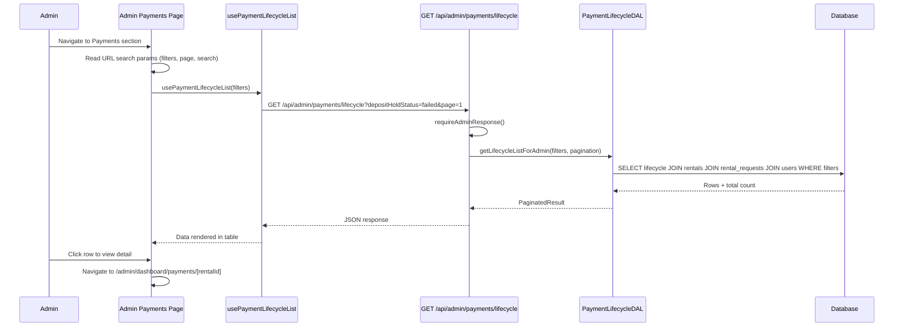
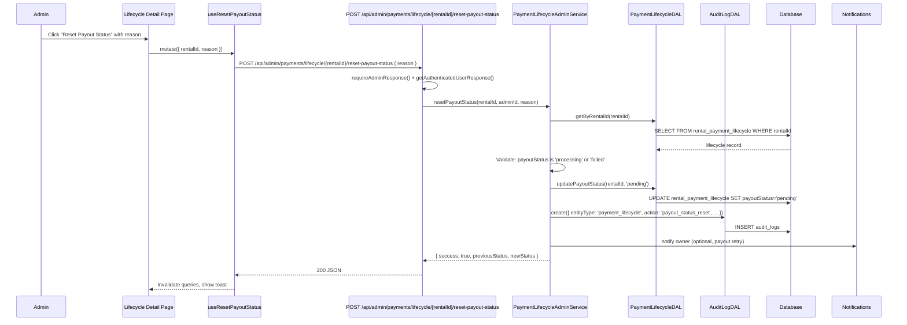
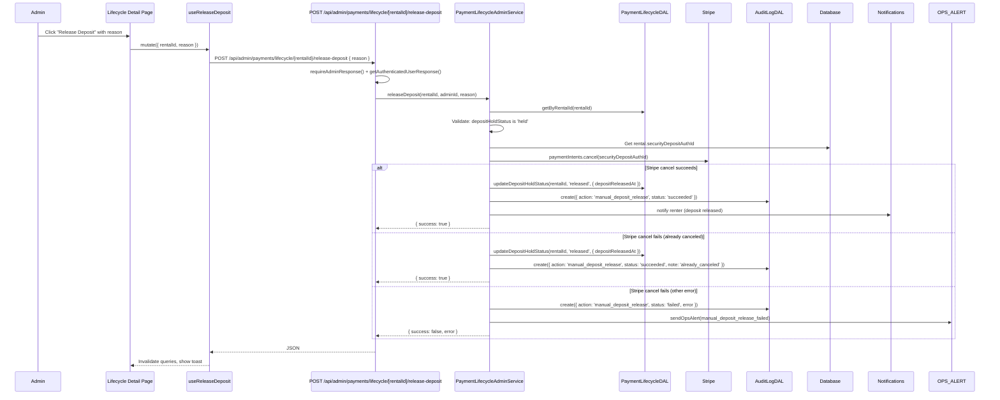
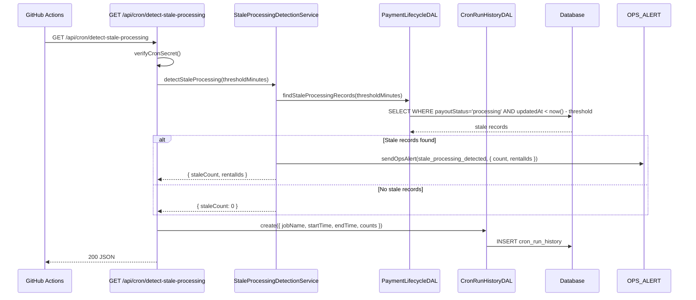

# Stripe Connect Payment Lifecycle (Phase 4) - Operational Tooling - Design Document

## Overview

This document details the technical design for Phase 4 operational tooling. The implementation adds an admin payment lifecycle dashboard (list, detail, metrics), stale processing detection with ops alerts, manual override APIs (reset payout status, reset transfer status, force-release deposit), cron run history persistence and viewing, admin audit logging for all overrides, and notifications for manual actions that affect renters or owners.

The design follows the layered architecture established in Phases 1–3 (Presentation → Application → Service → DAL → Database). **Route handlers are thin** — they handle auth, request parsing, and HTTP concerns only, delegating all business logic to the service layer. All database interactions go through the DAL. Stripe API calls go through dedicated service modules. React Query hooks call `/api` routes using the established `useQuery` and `useCreateMutation` patterns. Admin list filtering uses URL state sync following the pattern in the admin users page.

## Architecture

### High-Level Architecture

```
┌─────────────────────────────────────────────────────────┐
│              Presentation Layer                          │
│  - Admin Payments sidebar section (new)                 │
│  - Payment Lifecycle List (filters, search, pagination) │
│  - Payment Lifecycle Detail (timeline, overrides)       │
│  - Payment Metrics Cards                                │
│  - Cron Run History List                                │
│  - React Query hooks (usePaymentLifecycleList, etc.)    │
└────────────────────┬────────────────────────────────────┘
                     │
┌────────────────────▼────────────────────────────────────┐
│              Application Layer (thin route handlers)     │
│  - GET  /api/admin/payments/lifecycle                   │
│  - GET  /api/admin/payments/lifecycle/[rentalId]        │
│  - GET  /api/admin/payments/metrics                     │
│  - POST /api/admin/payments/lifecycle/[rentalId]/reset-payout-status    │
│  - POST /api/admin/payments/lifecycle/[rentalId]/reset-transfer-status  │
│  - POST /api/admin/payments/lifecycle/[rentalId]/release-deposit        │
│  - GET  /api/admin/payments/cron-history                │
│  - GET  /api/cron/detect-stale-processing (new cron)    │
└────────────────────┬────────────────────────────────────┘
                     │
┌────────────────────▼────────────────────────────────────┐
│              Service Layer                               │
│  - PaymentLifecycleAdminService (new)                   │
│  - StaleProcessingDetectionService (new)                │
│  - CronRunHistoryService (new)                          │
│  - Existing: PaymentLifecycleService                    │
│  - Existing: Notification Service, Ops Alerts           │
└────────────────────┬────────────────────────────────────┘
                     │
┌────────────────────▼────────────────────────────────────┐
│              Data Access Layer                           │
│  - PaymentLifecycleDAL (extended: admin queries)        │
│  - CronRunHistoryDAL (new)                              │
│  - AuditLogDAL (existing, used for overrides)           │
└────────────────────┬────────────────────────────────────┘
                     │
┌────────────────────▼────────────────────────────────────┐
│              Database Layer                              │
│  - rental_payment_lifecycle (existing, read + update)   │
│  - cron_run_history (new table)                         │
│  - audit_logs (existing, new action types)              │
└────────────────────┬────────────────────────────────────┘
                     │
┌────────────────────▼────────────────────────────────────┐
│              External Services                           │
│  - Stripe API (paymentIntents.cancel for deposit release)│
│  - GitHub Actions (cron trigger — unchanged)            │
└─────────────────────────────────────────────────────────┘
```

### Data Flow: Admin Views Payment Lifecycle List



### Data Flow: Admin Resets Payout Status



### Data Flow: Admin Force-Releases Deposit Hold



### Data Flow: Stale Processing Detection Cron



## Database Schema Changes

### New Table: cron_run_history

Tracks execution results for each cron run so admins can see recent activity and detect missed runs.

```typescript
// src/db/schemas/cron-run-history.schema.ts
import {
  pgTable,
  uuid,
  varchar,
  timestamp,
  integer,
  text,
} from "drizzle-orm/pg-core";

export const cronRunHistory = pgTable("cron_run_history", {
  id: uuid("id").defaultRandom().primaryKey(),
  jobName: varchar("job_name", { length: 100 }).notNull(),
  startedAt: timestamp("started_at").notNull(),
  completedAt: timestamp("completed_at").notNull(),
  status: varchar("status", { length: 20 }).notNull(), // 'success' | 'failure' | 'partial'
  recordsEligible: integer("records_eligible").default(0),
  recordsSucceeded: integer("records_succeeded").default(0),
  recordsFailed: integer("records_failed").default(0),
  errorMessage: text("error_message"),
  metadata: text("metadata"), // JSON string for additional details
  createdAt: timestamp("created_at").defaultNow().notNull(),
});
```

**Indexes:**

```typescript
import { index } from "drizzle-orm/pg-core";

export const cronRunHistoryJobNameIdx = index("crh_job_name_idx").on(
  cronRunHistory.jobName,
);
export const cronRunHistoryStartedAtIdx = index("crh_started_at_idx").on(
  cronRunHistory.startedAt,
);
```

**Retention:** The design does not enforce automatic retention in Phase 4. If the table grows large, a future cleanup cron or manual SQL can prune old records (e.g. older than 90 days).

### Existing Tables Used (No Schema Changes)

**`rental_payment_lifecycle`** — read for admin list/detail/metrics; updated by manual override APIs (payout status reset, transfer status reset, deposit release). No new columns needed. The existing `updatedAt` column is used for stale detection (records stuck in `payoutStatus: 'processing'` with `updatedAt` older than the threshold).

**`audit_logs`** — used to record all manual override actions. The existing schema (`entityType`, `entityId`, `action`, `userId`, `metadata`) is sufficient. New `action` values are defined below (no enum change needed — `action` is a varchar).

**`rentals`** — read for `securityDepositAuthId` (needed for deposit release) and join context.

**`rental_requests`** — read for rental status and join context (renter, owner, listing).

**`payments`** — read for Stripe IDs in the detail view.

**`disputes`** — read for linked dispute status in the detail view.

### Migration Strategy

1. Create `cron_run_history` table with indexes
2. All migrations are additive — no destructive changes, backward-compatible

## Components and Interfaces

### Service Layer

#### PaymentLifecycleAdminService (New)

Orchestrates admin read and override operations on the payment lifecycle. All overrides validate current state, update via DAL, create audit logs, and optionally send notifications.

```typescript
// src/features/admin/services/payment-lifecycle-admin-service.ts

interface LifecycleListFilters {
  depositHoldStatus?: string[];
  ownerTransferStatus?: string[];
  payoutStatus?: string[];
  search?: string; // matches rentalId, rentalRequestId, renterId, ownerId
  page: number;
  limit: number;
}

interface LifecycleListItem {
  id: string;
  rentalId: string;
  rentalRequestId: string;
  renterId: string;
  renterName: string;
  ownerId: string;
  ownerName: string;
  listingName: string;
  depositHoldStatus: string;
  ownerTransferStatus: string;
  payoutStatus: string;
  depositHoldPlacedAt: Date | null;
  ownerTransferredAt: Date | null;
  updatedAt: Date;
  createdAt: Date;
}

interface LifecycleDetail extends LifecycleListItem {
  rentalChargeId: string | null;
  stripeTransferId: string | null;
  depositReleasedAt: Date | null;
  returnConfirmedAt: Date | null;
  rentalStatus: string;
  securityDepositAuthId: string | null;
  totalAmount: string;
  securityDeposit: string;
  startDate: Date;
  endDate: Date;
  dispute: {
    id: string;
    status: string;
    reasonCode: string;
    createdAt: Date;
  } | null;
  auditLogs: AuditLogEntry[];
}

interface PaymentMetrics {
  payoutPending: number;
  payoutProcessing: number;
  payoutCompleted: number;
  payoutFailed: number;
  transferPending: number;
  transferCompleted: number;
  transferFailed: number;
  transferFrozen: number;
  depositScheduled: number;
  depositHeld: number;
  depositReleased: number;
  depositExpired: number;
  depositFailed: number;
  depositCaptured: number;
  depositNotApplicable: number;
}

interface OverrideResult {
  success: boolean;
  previousStatus: string;
  newStatus: string;
  error?: string;
}

/**
 * Admin operations for payment lifecycle: listing, detail, metrics, and overrides.
 * All DB access goes through DALs. Route handlers are thin.
 */
export class PaymentLifecycleAdminService {
  /**
   * Get paginated lifecycle records with filters and search.
   * Joins rental_payment_lifecycle with rentals, rental_requests, and users.
   */
  static async getLifecycleList(
    filters: LifecycleListFilters,
  ): Promise<PaginatedResult<LifecycleListItem>>;

  /**
   * Get full detail for a single rental's payment lifecycle.
   * Includes Stripe IDs, timestamps, linked dispute, and audit log entries.
   */
  static async getLifecycleDetail(rentalId: string): Promise<LifecycleDetail>;

  /**
   * Get aggregate counts of lifecycle statuses.
   */
  static async getPaymentMetrics(): Promise<PaymentMetrics>;

  /**
   * Reset payoutStatus from 'processing' or 'failed' to 'pending'.
   * Does NOT call Stripe. Creates audit log entry. Optionally notifies owner.
   *
   * @throws ValidationError if payoutStatus is not 'processing' or 'failed'
   * @throws NotFoundError if lifecycle record not found
   */
  static async resetPayoutStatus(
    rentalId: string,
    adminId: string,
    reason?: string,
  ): Promise<OverrideResult>;

  /**
   * Reset ownerTransferStatus from 'failed' to 'pending'.
   * Also resets payoutStatus to 'pending' if it was 'failed'.
   * Does NOT call Stripe. Creates audit log entry. Optionally notifies owner.
   *
   * @throws ValidationError if ownerTransferStatus is not 'failed'
   * @throws NotFoundError if lifecycle record not found
   */
  static async resetTransferStatus(
    rentalId: string,
    adminId: string,
    reason?: string,
  ): Promise<OverrideResult>;

  /**
   * Force-release a deposit hold via Stripe and update lifecycle.
   * Calls stripe.paymentIntents.cancel(). Creates audit log entry.
   * Notifies renter that deposit has been released.
   *
   * If Stripe reports the PaymentIntent is already canceled, treats as success
   * and updates local state.
   *
   * @throws ValidationError if depositHoldStatus is not 'held'
   * @throws NotFoundError if lifecycle record or rental not found
   */
  static async releaseDeposit(
    rentalId: string,
    adminId: string,
    reason?: string,
  ): Promise<OverrideResult>;
}
```

**`resetPayoutStatus` implementation outline:**

```typescript
static async resetPayoutStatus(
  rentalId: string,
  adminId: string,
  reason?: string,
): Promise<OverrideResult> {
  const lifecycle = await paymentLifecycleDAL.getByRentalId(rentalId);
  if (!lifecycle) throw new NotFoundError("Lifecycle record not found");

  const currentStatus = lifecycle.payoutStatus;
  if (currentStatus !== "processing" && currentStatus !== "failed") {
    throw new ValidationError(
      `Cannot reset payout status from '${currentStatus}' — only 'processing' or 'failed' can be reset`,
    );
  }

  await paymentLifecycleDAL.updatePayoutStatus(rentalId, "pending");

  await auditLogDAL.create({
    entityType: "payment_lifecycle",
    entityId: rentalId,
    action: "payout_status_reset",
    userId: adminId,
    metadata: {
      previousStatus: currentStatus,
      newStatus: "pending",
      reason,
    },
  });

  return {
    success: true,
    previousStatus: currentStatus,
    newStatus: "pending",
  };
}
```

**`resetTransferStatus` implementation outline:**

```typescript
static async resetTransferStatus(
  rentalId: string,
  adminId: string,
  reason?: string,
): Promise<OverrideResult> {
  const lifecycle = await paymentLifecycleDAL.getByRentalId(rentalId);
  if (!lifecycle) throw new NotFoundError("Lifecycle record not found");

  if (lifecycle.ownerTransferStatus !== "failed") {
    throw new ValidationError(
      `Cannot reset transfer status from '${lifecycle.ownerTransferStatus}' — only 'failed' can be reset`,
    );
  }

  await paymentLifecycleDAL.updateOwnerTransferStatus(rentalId, "pending");

  // Also reset payoutStatus if it's 'failed' so the cron picks it up
  if (lifecycle.payoutStatus === "failed") {
    await paymentLifecycleDAL.updatePayoutStatus(rentalId, "pending");
  }

  await auditLogDAL.create({
    entityType: "payment_lifecycle",
    entityId: rentalId,
    action: "owner_transfer_status_reset",
    userId: adminId,
    metadata: {
      previousTransferStatus: lifecycle.ownerTransferStatus,
      previousPayoutStatus: lifecycle.payoutStatus,
      newTransferStatus: "pending",
      newPayoutStatus: lifecycle.payoutStatus === "failed" ? "pending" : lifecycle.payoutStatus,
      reason,
    },
  });

  return {
    success: true,
    previousStatus: lifecycle.ownerTransferStatus,
    newStatus: "pending",
  };
}
```

**`releaseDeposit` implementation outline:**

```typescript
static async releaseDeposit(
  rentalId: string,
  adminId: string,
  reason?: string,
): Promise<OverrideResult> {
  const lifecycle = await paymentLifecycleDAL.getByRentalId(rentalId);
  if (!lifecycle) throw new NotFoundError("Lifecycle record not found");

  if (lifecycle.depositHoldStatus !== "held") {
    throw new ValidationError(
      `Cannot release deposit — status is '${lifecycle.depositHoldStatus}', expected 'held'`,
    );
  }

  // Get the deposit PaymentIntent ID from the rental
  const rental = await rentalDAL.getById(rentalId);
  if (!rental?.securityDepositAuthId) {
    throw new NotFoundError("No deposit PaymentIntent found for this rental");
  }

  try {
    await PAYMENT_SERVER_INSTANCE.paymentIntents.cancel(
      rental.securityDepositAuthId,
    );
  } catch (stripeError: any) {
    // If already canceled by Stripe (e.g. expired), treat as success
    if (
      stripeError.code === "payment_intent_unexpected_state" &&
      stripeError.message?.includes("canceled")
    ) {
      // Fall through to update local state
    } else {
      // Real failure
      await auditLogDAL.create({
        entityType: "payment_lifecycle",
        entityId: rentalId,
        action: "manual_deposit_release",
        userId: adminId,
        metadata: { status: "failed", error: stripeError.message, reason },
      });

      await sendOpsAlert({
        event: "manual_deposit_release_failed",
        rentalId,
        message: `Admin deposit release failed: ${stripeError.message}`,
        sendEmailAlert: true,
      });

      return {
        success: false,
        previousStatus: "held",
        newStatus: "held",
        error: stripeError.message,
      };
    }
  }

  await paymentLifecycleDAL.updateDepositHoldStatus(rentalId, "released", {
    depositReleasedAt: new Date(),
  });

  await auditLogDAL.create({
    entityType: "payment_lifecycle",
    entityId: rentalId,
    action: "manual_deposit_release",
    userId: adminId,
    metadata: { status: "succeeded", reason },
  });

  // Notify renter that deposit hold has been released
  // (uses existing notification infrastructure)

  return {
    success: true,
    previousStatus: "held",
    newStatus: "released",
  };
}
```

#### StaleProcessingDetectionService (New)

```typescript
// src/features/admin/services/stale-processing-detection-service.ts

interface StaleDetectionResult {
  staleCount: number;
  rentalIds: string[];
  thresholdMinutes: number;
}

const DEFAULT_STALE_THRESHOLD_MINUTES = 60;

/**
 * Detects rental_payment_lifecycle records stuck in 'processing' state.
 * Does NOT modify records — only reads and alerts.
 */
export class StaleProcessingDetectionService {
  /**
   * Find records where payoutStatus = 'processing' and updatedAt is older
   * than the threshold. Send ops alert if any found.
   *
   * Threshold is read from STALE_PROCESSING_THRESHOLD_MINUTES env var,
   * defaulting to 60 minutes.
   */
  static async detectStaleProcessing(
    thresholdMinutes?: number,
  ): Promise<StaleDetectionResult> {
    const threshold =
      (thresholdMinutes ??
        parseInt(process.env.STALE_PROCESSING_THRESHOLD_MINUTES || "")) ||
      DEFAULT_STALE_THRESHOLD_MINUTES;

    const staleRecords =
      await paymentLifecycleDAL.findStaleProcessingRecords(threshold);

    if (staleRecords.length > 0) {
      const rentalIds = staleRecords.map((r) => r.rentalId);

      await sendOpsAlert({
        event: "stale_processing_detected",
        rentalId: rentalIds[0], // Primary rental for subject line
        message: `${staleRecords.length} rental(s) stuck in 'processing' for >${threshold} minutes: ${rentalIds.join(", ")}`,
        metadata: {
          count: staleRecords.length,
          rentalIds,
          thresholdMinutes: threshold,
        },
        sendEmailAlert: true,
      });

      return {
        staleCount: staleRecords.length,
        rentalIds,
        thresholdMinutes: threshold,
      };
    }

    return { staleCount: 0, rentalIds: [], thresholdMinutes: threshold };
  }
}
```

#### CronRunHistoryService (New)

```typescript
// src/features/admin/services/cron-run-history-service.ts

interface RecordCronRunParams {
  jobName: string;
  startedAt: Date;
  completedAt: Date;
  status: "success" | "failure" | "partial";
  recordsEligible?: number;
  recordsSucceeded?: number;
  recordsFailed?: number;
  errorMessage?: string;
  metadata?: Record<string, unknown>;
}

/**
 * Manages cron run history persistence and retrieval.
 */
export class CronRunHistoryService {
  /**
   * Record a cron run result. Best-effort — failures are logged but do not
   * propagate (cron operations are not blocked by history write failures).
   */
  static async recordRun(params: RecordCronRunParams): Promise<void> {
    try {
      await cronRunHistoryDAL.create({
        ...params,
        metadata: params.metadata ? JSON.stringify(params.metadata) : null,
      });
    } catch (error) {
      getLogger().error("Failed to record cron run history", {
        jobName: params.jobName,
        error: (error as Error).message,
      });
    }
  }

  /**
   * Get recent cron run history for admin viewing.
   */
  static async getRecentRuns(
    jobName?: string,
    limit: number = 50,
  ): Promise<CronRunRecord[]> {
    return cronRunHistoryDAL.getRecent(jobName, limit);
  }
}
```

### Data Access Layer

#### PaymentLifecycleDAL Extensions

```typescript
// Add to existing src/dal/payment-lifecycle.dal.ts

/**
 * Get paginated lifecycle records with filters and search for admin list view.
 * Joins with rentals, rental_requests, and users.
 */
async getLifecycleListForAdmin(
  filters: {
    depositHoldStatus?: string[];
    ownerTransferStatus?: string[];
    payoutStatus?: string[];
    search?: string;
  },
  pagination: { page: number; limit: number },
): Promise<PaginatedResult<LifecycleListItem>> {
  // Build WHERE conditions from filters
  // depositHoldStatus IN (...), ownerTransferStatus IN (...), payoutStatus IN (...)
  // search: OR (rentalId ILIKE %, rentalRequestId ILIKE %, renterId ILIKE %, ownerId ILIKE %)
  // JOIN rentals ON lifecycle.rentalId = rentals.id
  // JOIN rental_requests ON rentals.rentalRequestId = rental_requests.id
  // JOIN users AS renter ON rental_requests.userId = renter.id
  // JOIN users AS owner ON rental_requests.ownerId = owner.id
  // ORDER BY lifecycle.updatedAt DESC
  // LIMIT/OFFSET for pagination
  // Also return totalCount for pagination metadata
}

/**
 * Get full lifecycle detail for a single rental, including related data.
 * Used by admin detail view.
 */
async getLifecycleDetailForAdmin(
  rentalId: string,
): Promise<LifecycleDetail | null> {
  // Same joins as list, plus:
  // JOIN payments ON payments.rentalId = rentals.id AND paymentType = 'rental_charge'
  // LEFT JOIN disputes ON disputes.rentalId = rentals.id AND status NOT IN ('closed')
  // Return full lifecycle + rental details + Stripe IDs + dispute summary
}

/**
 * Get aggregate counts of all lifecycle statuses.
 */
async getPaymentMetrics(): Promise<PaymentMetrics> {
  // SELECT
  //   COUNT(*) FILTER (WHERE payoutStatus = 'pending') AS payoutPending,
  //   COUNT(*) FILTER (WHERE payoutStatus = 'processing') AS payoutProcessing,
  //   COUNT(*) FILTER (WHERE payoutStatus = 'completed') AS payoutCompleted,
  //   COUNT(*) FILTER (WHERE payoutStatus = 'failed') AS payoutFailed,
  //   COUNT(*) FILTER (WHERE ownerTransferStatus = 'pending') AS transferPending,
  //   ... etc for all enum values
  // FROM rental_payment_lifecycle
}

/**
 * Find lifecycle records stuck in 'processing' state longer than threshold.
 * Used by stale processing detection cron.
 */
async findStaleProcessingRecords(
  thresholdMinutes: number,
): Promise<Array<{ rentalId: string; payoutStatus: string; updatedAt: Date }>> {
  const cutoff = new Date();
  cutoff.setMinutes(cutoff.getMinutes() - thresholdMinutes);

  return this.db
    .select({
      rentalId: rentalPaymentLifecycle.rentalId,
      payoutStatus: rentalPaymentLifecycle.payoutStatus,
      updatedAt: rentalPaymentLifecycle.updatedAt,
    })
    .from(rentalPaymentLifecycle)
    .where(
      and(
        eq(rentalPaymentLifecycle.payoutStatus, "processing"),
        lte(rentalPaymentLifecycle.updatedAt, cutoff),
      ),
    );
}
```

#### CronRunHistoryDAL (New)

```typescript
// src/dal/cron-run-history.dal.ts
import { desc, eq } from "drizzle-orm";
import { cronRunHistory } from "@/db/schemas/cron-run-history.schema";
import { BaseDAL } from "./base";

export class CronRunHistoryDAL extends BaseDAL {
  async create(data: {
    jobName: string;
    startedAt: Date;
    completedAt: Date;
    status: string;
    recordsEligible?: number;
    recordsSucceeded?: number;
    recordsFailed?: number;
    errorMessage?: string | null;
    metadata?: string | null;
  }): Promise<void> {
    await this.db.insert(cronRunHistory).values(data);
  }

  async getRecent(
    jobName?: string,
    limit: number = 50,
  ): Promise<Array<typeof cronRunHistory.$inferSelect>> {
    const conditions = jobName
      ? eq(cronRunHistory.jobName, jobName)
      : undefined;

    return this.db
      .select()
      .from(cronRunHistory)
      .where(conditions)
      .orderBy(desc(cronRunHistory.startedAt))
      .limit(limit);
  }
}
```

**Export from DAL index:**

```typescript
// Add to src/dal/index.ts
import { CronRunHistoryDAL } from "./cron-run-history.dal";
export const cronRunHistoryDAL = new CronRunHistoryDAL();
```

### Route Handlers (Thin)

#### Payment Lifecycle List

```typescript
// src/app/api/admin/payments/lifecycle/route.ts

async function getHandler(request: NextRequest) {
  try {
    const adminError = await requireAdminResponse();
    if (adminError) return adminError;

    const searchParams = request.nextUrl.searchParams;
    const filters = {
      depositHoldStatus: searchParams
        .get("depositHoldStatus")
        ?.split(",")
        .filter(Boolean),
      ownerTransferStatus: searchParams
        .get("ownerTransferStatus")
        ?.split(",")
        .filter(Boolean),
      payoutStatus: searchParams
        .get("payoutStatus")
        ?.split(",")
        .filter(Boolean),
      search: searchParams.get("search") || undefined,
      page: parseInt(searchParams.get("page") || "1"),
      limit: parseInt(searchParams.get("limit") || "20"),
    };

    const result = await PaymentLifecycleAdminService.getLifecycleList(filters);
    return NextResponse.json(result);
  } catch (error) {
    return handleApiError(error);
  }
}

export const GET = withRequestLogging(
  getHandler,
  "GET /api/admin/payments/lifecycle",
);
```

#### Payment Lifecycle Detail

```typescript
// src/app/api/admin/payments/lifecycle/[rentalId]/route.ts

async function getHandler(
  request: NextRequest,
  { params }: { params: Promise<{ rentalId: string }> },
) {
  try {
    const adminError = await requireAdminResponse();
    if (adminError) return adminError;

    const { rentalId } = await params;
    const result =
      await PaymentLifecycleAdminService.getLifecycleDetail(rentalId);
    return NextResponse.json(result);
  } catch (error) {
    if (error instanceof NotFoundError) {
      return NextResponse.json({ error: "Not found" }, { status: 404 });
    }
    return handleApiError(error);
  }
}

export const GET = withRequestLogging(
  getHandler,
  "GET /api/admin/payments/lifecycle/[rentalId]",
);
```

#### Payment Metrics

```typescript
// src/app/api/admin/payments/metrics/route.ts

async function getHandler() {
  try {
    const adminError = await requireAdminResponse();
    if (adminError) return adminError;

    const metrics = await PaymentLifecycleAdminService.getPaymentMetrics();
    return NextResponse.json(metrics);
  } catch (error) {
    return handleApiError(error);
  }
}

export const GET = withRequestLogging(
  getHandler,
  "GET /api/admin/payments/metrics",
);
```

#### Reset Payout Status

```typescript
// src/app/api/admin/payments/lifecycle/[rentalId]/reset-payout-status/route.ts

async function postHandler(
  request: NextRequest,
  { params }: { params: Promise<{ rentalId: string }> },
) {
  try {
    const adminError = await requireAdminResponse();
    if (adminError) return adminError;

    const authResult = await getAuthenticatedUserResponse();
    if (authResult instanceof NextResponse) return authResult;
    const { userId: adminId } = authResult;

    const { rentalId } = await params;
    const body = await request.json().catch(() => ({}));
    const reason = body.reason as string | undefined;

    const result = await tryCatch(
      PaymentLifecycleAdminService.resetPayoutStatus(rentalId, adminId, reason),
    );

    if (result.error) {
      if (result.error instanceof NotFoundError) {
        return NextResponse.json({ error: "Not found" }, { status: 404 });
      }
      if (result.error instanceof ValidationError) {
        return NextResponse.json(
          { error: result.error.message },
          { status: 400 },
        );
      }
      return handleApiError(result.error);
    }

    return NextResponse.json(result.data);
  } catch (error) {
    return handleApiError(error);
  }
}

export const POST = withRequestLogging(
  postHandler,
  "POST /api/admin/payments/lifecycle/[rentalId]/reset-payout-status",
);
```

#### Reset Transfer Status

```typescript
// src/app/api/admin/payments/lifecycle/[rentalId]/reset-transfer-status/route.ts
// Same pattern as reset-payout-status, calling resetTransferStatus
```

#### Release Deposit

```typescript
// src/app/api/admin/payments/lifecycle/[rentalId]/release-deposit/route.ts
// Same pattern as reset-payout-status, calling releaseDeposit
```

#### Cron Run History

```typescript
// src/app/api/admin/payments/cron-history/route.ts

async function getHandler(request: NextRequest) {
  try {
    const adminError = await requireAdminResponse();
    if (adminError) return adminError;

    const jobName = request.nextUrl.searchParams.get("jobName") || undefined;
    const limit = parseInt(request.nextUrl.searchParams.get("limit") || "50");

    const runs = await CronRunHistoryService.getRecentRuns(jobName, limit);
    return NextResponse.json({ runs });
  } catch (error) {
    return handleApiError(error);
  }
}

export const GET = withRequestLogging(
  getHandler,
  "GET /api/admin/payments/cron-history",
);
```

#### Stale Processing Detection Cron

```typescript
// src/app/api/cron/detect-stale-processing/route.ts

async function getHandler(request: NextRequest) {
  const auth = verifyCronSecret(request);
  if (!auth.authorized) return auth.response;

  const startedAt = new Date();

  try {
    const result =
      await StaleProcessingDetectionService.detectStaleProcessing();

    const completedAt = new Date();
    await CronRunHistoryService.recordRun({
      jobName: "detect-stale-processing",
      startedAt,
      completedAt,
      status: "success",
      recordsEligible: result.staleCount,
      recordsSucceeded: result.staleCount, // detection only, no mutations
      recordsFailed: 0,
    });

    return NextResponse.json({
      success: true,
      ...result,
      timestamp: new Date().toISOString(),
    });
  } catch (error) {
    const completedAt = new Date();
    await CronRunHistoryService.recordRun({
      jobName: "detect-stale-processing",
      startedAt,
      completedAt,
      status: "failure",
      errorMessage: (error as Error).message,
    });

    return NextResponse.json(
      { success: false, error: (error as Error).message },
      { status: 500 },
    );
  }
}

export const GET = withRequestLogging(
  getHandler,
  "GET /api/cron/detect-stale-processing",
);
```

### Existing Cron Routes: Add History Recording

Each existing payment cron route is modified to record its run in `cron_run_history` after completion. The pattern is identical for all three:

```typescript
// Modified: src/app/api/cron/process-payouts/route.ts (pattern for all crons)

async function getHandler(request: NextRequest) {
  const auth = verifyCronSecret(request);
  if (!auth.authorized) return auth.response;

  const startedAt = new Date();

  try {
    const result = await PaymentLifecycleService.processPayouts(20);

    await CronRunHistoryService.recordRun({
      jobName: "process-payouts",
      startedAt,
      completedAt: new Date(),
      status: result.failed > 0 ? "partial" : "success",
      recordsEligible: result.eligible,
      recordsSucceeded: result.succeeded,
      recordsFailed: result.failed,
    });

    return NextResponse.json({
      success: true,
      ...result,
      timestamp: new Date().toISOString(),
    });
  } catch (error) {
    await CronRunHistoryService.recordRun({
      jobName: "process-payouts",
      startedAt,
      completedAt: new Date(),
      status: "failure",
      errorMessage: (error as Error).message,
    });

    return NextResponse.json(
      { success: false, error: (error as Error).message },
      { status: 500 },
    );
  }
}
```

### Client-Side: Hooks

#### usePaymentLifecycleList

```typescript
// src/features/admin/hooks/use-payment-lifecycle.ts

export interface UsePaymentLifecycleListParams {
  depositHoldStatus?: string[];
  ownerTransferStatus?: string[];
  payoutStatus?: string[];
  search?: string;
  page?: number;
  limit?: number;
}

/**
 * Fetch paginated payment lifecycle list for admin dashboard.
 * Follows the useAdminUsers pattern.
 */
export function usePaymentLifecycleList({
  depositHoldStatus,
  ownerTransferStatus,
  payoutStatus,
  search,
  page = 1,
  limit = 20,
}: UsePaymentLifecycleListParams = {}) {
  const params = new URLSearchParams();
  params.set("page", String(page));
  params.set("limit", String(limit));
  if (depositHoldStatus?.length)
    params.set("depositHoldStatus", depositHoldStatus.join(","));
  if (ownerTransferStatus?.length)
    params.set("ownerTransferStatus", ownerTransferStatus.join(","));
  if (payoutStatus?.length) params.set("payoutStatus", payoutStatus.join(","));
  if (search?.trim()) params.set("search", search.trim());

  return useQuery({
    queryKey: [
      "admin",
      "payment-lifecycle",
      depositHoldStatus ?? [],
      ownerTransferStatus ?? [],
      payoutStatus ?? [],
      search ?? "",
      page,
      limit,
    ],
    queryFn: async () => {
      const response = await fetch(
        `/api/admin/payments/lifecycle?${params.toString()}`,
      );
      if (!response.ok) {
        const error = await response.json();
        throw new Error(error.error || "Failed to fetch payment lifecycle");
      }
      return response.json();
    },
    staleTime: 30 * 1000,
  });
}
```

#### usePaymentLifecycleDetail

```typescript
// src/features/admin/hooks/use-payment-lifecycle.ts (same file)

export function usePaymentLifecycleDetail(rentalId: string | null) {
  return useQuery({
    queryKey: ["admin", "payment-lifecycle-detail", rentalId],
    queryFn: async () => {
      if (!rentalId) return null;
      const response = await fetch(`/api/admin/payments/lifecycle/${rentalId}`);
      if (!response.ok) {
        const error = await response.json();
        throw new Error(error.error || "Failed to fetch lifecycle detail");
      }
      return response.json();
    },
    enabled: !!rentalId,
    staleTime: 30 * 1000,
  });
}
```

#### usePaymentMetrics

```typescript
// src/features/admin/hooks/use-payment-lifecycle.ts (same file)

export function usePaymentMetrics() {
  return useQuery({
    queryKey: ["admin", "payment-metrics"],
    queryFn: async () => {
      const response = await fetch("/api/admin/payments/metrics");
      if (!response.ok) {
        const error = await response.json();
        throw new Error(error.error || "Failed to fetch payment metrics");
      }
      return response.json();
    },
    staleTime: 60 * 1000, // 1 minute
  });
}
```

#### Override Mutations

```typescript
// src/features/admin/hooks/use-payment-lifecycle-mutations.ts

export function useResetPayoutStatus() {
  return useCreateMutation({
    mutationFn: async ({
      rentalId,
      reason,
    }: {
      rentalId: string;
      reason?: string;
    }) => {
      const response = await fetch(
        `/api/admin/payments/lifecycle/${rentalId}/reset-payout-status`,
        {
          method: "POST",
          headers: { "Content-Type": "application/json" },
          body: JSON.stringify({ reason }),
        },
      );
      if (!response.ok) {
        const error = await response.json();
        throw new Error(error.error || "Failed to reset payout status");
      }
      return response.json();
    },
    successMessage: "Payout status reset to pending",
    invalidateQueryKeys: [
      ["admin", "payment-lifecycle"],
      ["admin", "payment-lifecycle-detail"],
      ["admin", "payment-metrics"],
    ],
  });
}

export function useResetTransferStatus() {
  return useCreateMutation({
    mutationFn: async ({
      rentalId,
      reason,
    }: {
      rentalId: string;
      reason?: string;
    }) => {
      const response = await fetch(
        `/api/admin/payments/lifecycle/${rentalId}/reset-transfer-status`,
        {
          method: "POST",
          headers: { "Content-Type": "application/json" },
          body: JSON.stringify({ reason }),
        },
      );
      if (!response.ok) {
        const error = await response.json();
        throw new Error(error.error || "Failed to reset transfer status");
      }
      return response.json();
    },
    successMessage: "Transfer status reset to pending",
    invalidateQueryKeys: [
      ["admin", "payment-lifecycle"],
      ["admin", "payment-lifecycle-detail"],
      ["admin", "payment-metrics"],
    ],
  });
}

export function useReleaseDeposit() {
  return useCreateMutation({
    mutationFn: async ({
      rentalId,
      reason,
    }: {
      rentalId: string;
      reason?: string;
    }) => {
      const response = await fetch(
        `/api/admin/payments/lifecycle/${rentalId}/release-deposit`,
        {
          method: "POST",
          headers: { "Content-Type": "application/json" },
          body: JSON.stringify({ reason }),
        },
      );
      if (!response.ok) {
        const error = await response.json();
        throw new Error(error.error || "Failed to release deposit");
      }
      return response.json();
    },
    successMessage: "Deposit hold released",
    invalidateQueryKeys: [
      ["admin", "payment-lifecycle"],
      ["admin", "payment-lifecycle-detail"],
      ["admin", "payment-metrics"],
    ],
  });
}
```

#### useCronRunHistory

```typescript
// src/features/admin/hooks/use-cron-run-history.ts

export function useCronRunHistory(jobName?: string, limit: number = 50) {
  return useQuery({
    queryKey: ["admin", "cron-history", jobName ?? "all", limit],
    queryFn: async () => {
      const params = new URLSearchParams();
      if (jobName) params.set("jobName", jobName);
      params.set("limit", String(limit));
      const response = await fetch(
        `/api/admin/payments/cron-history?${params.toString()}`,
      );
      if (!response.ok) {
        const error = await response.json();
        throw new Error(error.error || "Failed to fetch cron history");
      }
      return response.json();
    },
    staleTime: 30 * 1000,
  });
}
```

### Client-Side: URL State Sync for Lifecycle List

The lifecycle list page uses URL search params for filters and pagination, following the admin users pattern:

```typescript
// src/features/admin/components/payments/payment-lifecycle-list-client.tsx
"use client";

export function PaymentLifecycleListClient() {
  const router = useRouter();
  const pathname = usePathname();
  const searchParams = useSearchParams();

  // Read filter state from URL
  const page = parseInt(searchParams.get("page") || "1");
  const depositHoldStatus = searchParams
    .get("depositHoldStatus")
    ?.split(",")
    .filter(Boolean);
  const ownerTransferStatus = searchParams
    .get("ownerTransferStatus")
    ?.split(",")
    .filter(Boolean);
  const payoutStatus = searchParams
    .get("payoutStatus")
    ?.split(",")
    .filter(Boolean);
  const search = searchParams.get("search") ?? "";

  // Debounced search
  const [localSearch, setLocalSearch] = useState(search);
  const debouncedSearch = useMemo(
    () =>
      debounce((value: string) => updateUrl({ search: value, page: "1" }), 300),
    [],
  );

  // URL update helper
  const updateUrl = useCallback(
    (updates: Record<string, string | undefined>) => {
      const params = new URLSearchParams(searchParams);
      Object.entries(updates).forEach(([key, value]) => {
        if (value === undefined || value === "") {
          params.delete(key);
        } else {
          params.set(key, value);
        }
      });
      // Reset page when filters change (unless page is being set explicitly)
      if (!("page" in updates)) {
        params.delete("page");
      }
      router.push(`${pathname}?${params.toString()}`);
    },
    [router, pathname, searchParams],
  );

  // Fetch data with URL-synced filters
  const { data, isLoading, error } = usePaymentLifecycleList({
    depositHoldStatus,
    ownerTransferStatus,
    payoutStatus,
    search,
    page,
    limit: 20,
  });

  // Render filters, table, and pagination
  // ...
}
```

### Client-Side: Admin Pages

#### Payments Landing Page

```typescript
// src/app/admin/dashboard/payments/page.tsx
export const dynamic = "force-dynamic";

export default function AdminPaymentsPage() {
  return (
    <div className="page-container space-y-6">
      <PageHeader title="Payment Lifecycle" description="Monitor and manage payment states" />
      <PaymentMetricsCards />
      <PaymentLifecycleListClient />
    </div>
  );
}
```

#### Lifecycle Detail Page

```typescript
// src/app/admin/dashboard/payments/[rentalId]/page.tsx
export const dynamic = "force-dynamic";

export default async function PaymentLifecycleDetailPage({
  params,
}: {
  params: Promise<{ rentalId: string }>;
}) {
  const { rentalId } = await params;
  return (
    <div className="page-container space-y-6">
      <PageHeader title="Payment Detail" />
      <PaymentLifecycleDetailClient rentalId={rentalId} />
    </div>
  );
}
```

#### Cron History Page

```typescript
// src/app/admin/dashboard/payments/cron-history/page.tsx
export const dynamic = "force-dynamic";

export default function CronHistoryPage() {
  return (
    <div className="page-container space-y-6">
      <PageHeader title="Cron Run History" description="Recent payment cron executions" />
      <CronRunHistoryClient />
    </div>
  );
}
```

### Client-Side: Key Components

#### PaymentMetricsCards

Displays aggregate counts as a grid of metric cards. Uses `usePaymentMetrics()` hook.

```typescript
// src/features/admin/components/payments/payment-metrics-cards.tsx
"use client";

// Renders a grid of cards showing:
// - Payouts: pending | processing | completed | failed
// - Transfers: pending | completed | failed | frozen
// - Deposits: scheduled | held | released | expired | failed | captured
// Each card shows the count and a color-coded status indicator
// Cards with failed/frozen/expired counts are highlighted
```

#### PaymentLifecycleDetailClient

Displays the full payment timeline for a rental with override action buttons.

```typescript
// src/features/admin/components/payments/payment-lifecycle-detail-client.tsx
"use client";

// Sections:
// 1. Status summary bar (deposit, transfer, payout statuses with badges)
// 2. Payment timeline (vertical timeline of events with timestamps):
//    - Rental charge captured (amount, Stripe charge ID)
//    - Deposit hold placed/scheduled/failed (amount, Stripe PI ID)
//    - Return confirmed (timestamp)
//    - Dispute filed (if any, link to dispute review)
//    - Deposit released/captured/expired
//    - Owner transfer completed/failed (Stripe transfer ID)
// 3. Override actions panel (contextual, shown on detail view):
//    - "Reset Payout Status" button (visible when payoutStatus is 'processing' or 'failed')
//    - "Reset Transfer Status" button (visible when ownerTransferStatus is 'failed')
//    - "Release Deposit" button (visible when depositHoldStatus is 'held')
//    - Each action opens a confirmation dialog with optional reason input
// 4. Audit log section (recent audit entries for this rental)
```

#### CronRunHistoryClient

Table of recent cron runs with job name filter.

```typescript
// src/features/admin/components/payments/cron-run-history-client.tsx
"use client";

// - Filter by job name (dropdown: all, process-payouts, schedule-deposit-holds,
//   monitor-deposit-expiry, detect-stale-processing)
// - Table columns: Job, Started, Completed, Duration, Status, Eligible, Succeeded, Failed
// - Status badge: success (green), partial (yellow), failure (red)
// - Click to expand row for error message/metadata
```

### Admin Sidebar Update

Add "Payments" as a new top-level item in the admin sidebar, below "Dispute Review":

```typescript
// Modified: src/features/admin/components/admin-sidebar.tsx (or equivalent)
// Add new nav items:
{
  title: "Payments",
  url: "/admin/dashboard/payments",
  icon: CreditCard, // from lucide-react
  items: [
    { title: "Lifecycle", url: "/admin/dashboard/payments" },
    { title: "Cron History", url: "/admin/dashboard/payments/cron-history" },
  ],
}
```

## Audit Log Actions

All manual overrides use the existing `audit_logs` table via `auditLogDAL.create()`. The `action` field (varchar) uses these new values:

| Action                        | Entity Type         | Trigger                      |
| ----------------------------- | ------------------- | ---------------------------- |
| `payout_status_reset`         | `payment_lifecycle` | Admin resets payout status   |
| `owner_transfer_status_reset` | `payment_lifecycle` | Admin resets transfer status |
| `manual_deposit_release`      | `payment_lifecycle` | Admin force-releases deposit |

Each entry includes `metadata` with `previousStatus`, `newStatus`, `reason`, and for deposit release, `status` (succeeded/failed) and `error` if applicable.

## Operations Alerting

### New Events

| Event                           | Log | Email | Trigger                                  |
| ------------------------------- | --- | ----- | ---------------------------------------- |
| `stale_processing_detected`     | Yes | Yes   | Stale detection cron finds stuck records |
| `manual_deposit_release_failed` | Yes | Yes   | Admin deposit release Stripe call fails  |

All alerts use the existing `sendOpsAlert()` from `src/features/notifications/lib/ops-alerts.ts` with `sendEmailAlert: true`.

## Error Handling

### Admin API Error Scenarios

| Scenario                              | Behavior                                                   |
| ------------------------------------- | ---------------------------------------------------------- |
| Lifecycle record not found            | Return 404                                                 |
| Payout status not resettable          | Return 400 "Cannot reset payout status from 'completed'"   |
| Transfer status not resettable        | Return 400 "Cannot reset transfer status from 'pending'"   |
| Deposit not in 'held' state           | Return 400 "Cannot release deposit — status is 'released'" |
| Stripe cancel fails (already expired) | Treat as success, update local state to 'released'         |
| Stripe cancel fails (other error)     | Return 500, audit log failure, alert ops                   |
| Non-admin user                        | Return 403                                                 |
| Cron history write fails              | Log error, do not fail cron operation                      |

### Partial Failure Strategy

Override operations are single-step (DB update or Stripe call + DB update), so partial failure is limited:

1. **Payout/transfer reset:** Single DB update. If it fails, return error.
2. **Deposit release:** Stripe call → DB update → audit log → notification. If Stripe succeeds but DB update fails, the record is inconsistent (held in DB, canceled in Stripe). The next stale detection or manual review will catch this. Audit log is best-effort.
3. **Cron history write failure:** Logged, does not block cron operations.

## Testing Strategy

### Unit Tests

- `PaymentLifecycleAdminService.resetPayoutStatus`: mock DAL; test valid states (processing, failed), invalid states (pending, completed), not-found
- `PaymentLifecycleAdminService.resetTransferStatus`: mock DAL; test failed → pending, also resets payoutStatus if failed
- `PaymentLifecycleAdminService.releaseDeposit`: mock DAL + Stripe; test held → released, already-canceled handling, Stripe failure
- `PaymentLifecycleAdminService.getPaymentMetrics`: mock DAL; verify aggregate shape
- `StaleProcessingDetectionService.detectStaleProcessing`: mock DAL; test with stale records, no stale records, ops alert called
- `CronRunHistoryService.recordRun`: mock DAL; test success, write failure (should not throw)

### Integration Tests

- Full lifecycle list: create lifecycle records with various statuses, fetch via admin API, verify filter results
- Full detail view: create lifecycle + rental + payment + dispute, verify all fields in detail response
- Payout status reset flow: set payoutStatus to 'processing', reset via API, verify 'pending', verify audit log created
- Transfer status reset flow: set ownerTransferStatus to 'failed', reset, verify both transfer and payout status reset
- Deposit release flow: mock Stripe cancel, verify lifecycle updated, audit log created, renter notified
- Stale detection: create record with old updatedAt, run detection, verify ops alert sent
- Cron history: trigger cron, verify history record created with correct counts

### Key Test Scenarios

- Admin can filter lifecycle list by multiple statuses simultaneously
- Search by partial rental ID returns matching records
- Reset payout status from 'completed' is rejected with 400
- Release deposit when status is 'expired' is rejected with 400
- Stripe cancel returns "already canceled" — local state still updated to 'released'
- Stale detection with 0 stale records sends no alert
- Cron history write failure does not prevent cron completion

## File Structure

```
src/
├── app/
│   ├── api/
│   │   ├── admin/payments/
│   │   │   ├── lifecycle/
│   │   │   │   ├── route.ts                              (NEW: list API)
│   │   │   │   └── [rentalId]/
│   │   │   │       ├── route.ts                          (NEW: detail API)
│   │   │   │       ├── reset-payout-status/route.ts      (NEW: override API)
│   │   │   │       ├── reset-transfer-status/route.ts    (NEW: override API)
│   │   │   │       └── release-deposit/route.ts          (NEW: override API)
│   │   │   ├── metrics/route.ts                          (NEW: metrics API)
│   │   │   └── cron-history/route.ts                     (NEW: cron history API)
│   │   └── cron/
│   │       ├── detect-stale-processing/route.ts          (NEW: stale detection cron)
│   │       ├── process-payouts/route.ts                  (MODIFIED: add history recording)
│   │       ├── schedule-deposit-holds/route.ts           (MODIFIED: add history recording)
│   │       └── monitor-deposit-expiry/route.ts           (MODIFIED: add history recording)
│   └── admin/dashboard/payments/
│       ├── page.tsx                                      (NEW: payments landing page)
│       ├── [rentalId]/page.tsx                           (NEW: lifecycle detail page)
│       └── cron-history/page.tsx                         (NEW: cron history page)
├── features/admin/
│   ├── services/
│   │   ├── payment-lifecycle-admin-service.ts            (NEW: admin read + overrides)
│   │   ├── stale-processing-detection-service.ts         (NEW: stale detection)
│   │   └── cron-run-history-service.ts                   (NEW: cron history)
│   ├── hooks/
│   │   ├── use-payment-lifecycle.ts                      (NEW: list, detail, metrics hooks)
│   │   ├── use-payment-lifecycle-mutations.ts            (NEW: override mutation hooks)
│   │   └── use-cron-run-history.ts                       (NEW: cron history hook)
│   └── components/
│       ├── payments/
│       │   ├── payment-lifecycle-list-client.tsx          (NEW: list with URL filters)
│       │   ├── payment-lifecycle-detail-client.tsx        (NEW: detail + overrides)
│       │   ├── payment-metrics-cards.tsx                  (NEW: metrics summary)
│       │   └── cron-run-history-client.tsx                (NEW: cron history table)
│       └── admin-sidebar.tsx                             (MODIFIED: add Payments nav)
├── dal/
│   ├── payment-lifecycle.dal.ts                          (MODIFIED: admin queries + stale)
│   ├── cron-run-history.dal.ts                           (NEW: cron history DAL)
│   └── index.ts                                          (MODIFIED: export cronRunHistoryDAL)
└── db/
    ├── schemas/
    │   └── cron-run-history.schema.ts                    (NEW: cron_run_history table)
    └── migrations/                                       (NEW: migration for cron_run_history)
```

## Design Decisions

| Decision                                                     | Rationale                                                                                                  |
| ------------------------------------------------------------ | ---------------------------------------------------------------------------------------------------------- |
| Admin methods live in existing DALs (no separate admin DAL)  | Follows the established pattern — `UserDAL.getUsersForAdmin`, `DisputeDAL.getAdminDisputes`, etc.          |
| New `PaymentLifecycleAdminService` (not in existing service) | Separates admin operations from cron/payment-flow operations in `PaymentLifecycleService`                  |
| URL state sync for lifecycle list filters                    | Follows the admin users page pattern — shareable URLs, browser back/forward, debounced search              |
| Override actions on the detail view (not list)               | Detail view provides full context for safe override decisions; list is for discovery                       |
| Stale detection as a dedicated cron endpoint                 | Clean separation from payment processing logic; can be scheduled independently via GitHub Actions          |
| `updatedAt` used for stale threshold (no new column)         | `claimForProcessing` sets `updatedAt` when status changes to `'processing'`; avoids schema change          |
| `cron_run_history` as a new table (not audit_logs)           | Different data shape (counts, durations, job names) doesn't fit the entity-based audit log pattern         |
| Audit logs use existing `audit_logs` table                   | Override actions are entity-scoped (payment_lifecycle, rental) and fit the existing audit pattern          |
| Deposit release handles "already canceled" from Stripe       | Stripe may have auto-canceled (expired) the hold; treating this as success prevents admin from being stuck |
| No automatic retry for stale records                         | Stale records may indicate a deeper issue; admin judgment is needed before retrying                        |

---

_Last updated: March 15, 2026 | Internal use only_
