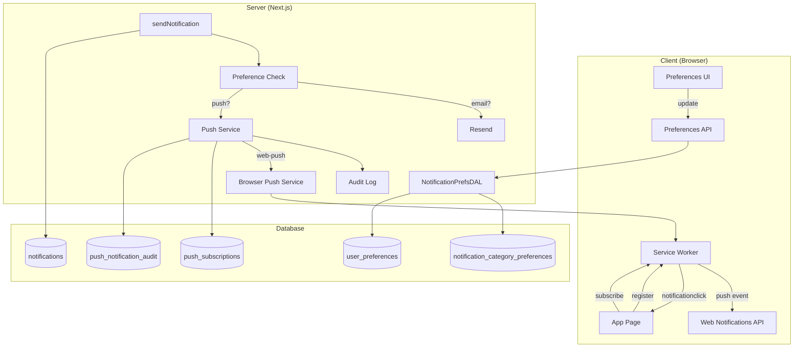
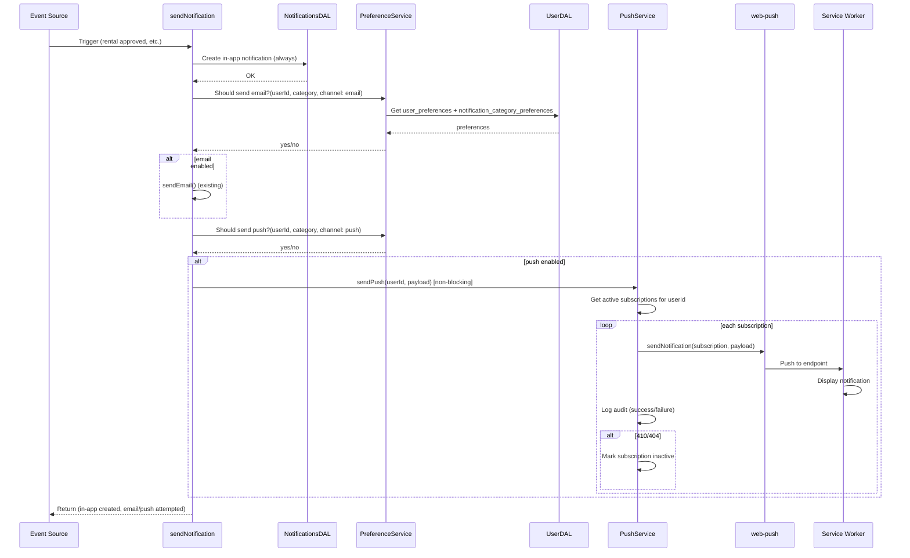
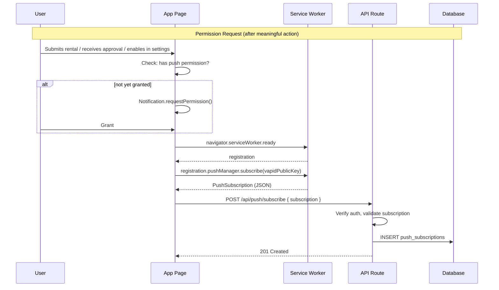

# PWA Push Notifications - Design Document

## Overview

This design document outlines the technical architecture for PWA push notifications in the Hoador web application. The implementation delivers real-time transactional notifications via the Web Push API, integrates a unified notification preferences system (email + push with category granularity), and implements a minimal service worker required for push receipt and notification click handling.

**Key Design Decisions:**

- **Web Push delivery**: Use `web-push` library with VAPID keys for web. The standard Web Push protocol delivers through browser push services (Chrome uses FCM under the hood). This avoids a Firebase project dependency for web while remaining compatible with future native FCM tokens. _Alternative considered_: Firebase Admin SDK + Firebase Web SDK (`firebase/messaging`) for FCM tokens—unifies web/native send path but requires Firebase project setup; deferred to future phase when React Native is introduced.
- **Service worker**: Minimal service worker handles only `push` and `notificationclick` events—no offline caching.
- **Preferences**: New `notification_category_preferences` table with per-category, per-channel toggles; master switches remain in `user_preferences`.
- **Integration**: Extend `sendNotification()` with preference checks and push dispatch; push is non-blocking.

## Architecture

### High-Level Architecture



### Notification Flow (Event to Delivery)



### Client-Side Push Subscription Flow



## Components and Interfaces

### 1. Service Worker

**Location**: `public/sw.js` or `src/lib/pwa/sw.js` (build output to `public/`)

**Responsibilities**:

- Handle `push` event: parse payload, show notification via `registration.showNotification()`
- Handle `notificationclick`: close notification, open `linkUrl` (or focus existing window)
- Scope: `/` (application root)

**Implementation Notes**:

- Service worker must be a separate file (cannot be bundled with app code)
- Use Workbox or plain JS; keep minimal (push + click only)
- Payload from push event: `event.data.json()` gives `{ title, body, linkUrl, data }`
- `linkUrl` from data: `event.notification.data?.linkUrl` for click handler

**Reference**: Req 2, Req 7

### 2. Push Subscription API

**Endpoints**:

| Method | Path                  | Purpose                                                    |
| ------ | --------------------- | ---------------------------------------------------------- |
| POST   | `/api/push/subscribe` | Register a push subscription (body: PushSubscription JSON) |
| DELETE | `/api/push/subscribe` | Unregister subscription (body: `{ endpoint }`)             |

**POST /api/push/subscribe**:

- Auth: Required
- Body: `{ endpoint, keys: { p256dh, auth }, expirationTime? }` (standard Web Push subscription)
- Response: 201 on success, 400 on invalid payload, 401 if unauthenticated
- Validates subscription shape; stores with userId from session

**Reference**: Req 3

### 3. Notification Preferences API

**Endpoints**:

| Method | Path                             | Purpose                                   |
| ------ | -------------------------------- | ----------------------------------------- |
| GET    | `/api/notifications/preferences` | Get category preferences for current user |
| PATCH  | `/api/notifications/preferences` | Update category preferences               |

**GET Response**:

```json
{
  "master": { "email": true, "push": true },
  "categories": {
    "bookings": { "email": true, "push": true },
    "payments": { "email": true, "push": true },
    "messages": { "email": true, "push": true },
    "disputes": { "email": true, "push": true },
    "reminders": { "email": true, "push": true }
  }
}
```

**PATCH Body**:

```json
{
  "categories": {
    "bookings": { "email": true, "push": false },
    "messages": { "email": true, "push": true }
  }
}
```

- Partial updates supported; unspecified categories unchanged

**Reference**: Req 1, Req 6. DAL: `NotificationCategoryPreferencesDAL` in `notifications.dal.ts`.

### 4. Preference Service

**Location**: `src/features/notifications/lib/preference-service.ts`

**Interface**:

```typescript
interface PreferenceService {
  shouldSendEmail(
    userId: string,
    category: NotificationCategory,
  ): Promise<boolean>;
  shouldSendPush(
    userId: string,
    category: NotificationCategory,
  ): Promise<boolean>;
  getCategoryPreferences(userId: string): Promise<CategoryPreferences>;
}
```

**Logic**:

1. Check `user_preferences.email_notifications` / `push_notifications` (master)
2. If master off → return false
3. Look up `notification_category_preferences` for (userId, category)
4. If no row → default true for both channels
5. Return category.email / category.push

**Reference**: Req 1, Req 9

### 5. Push Service

**Location**: `src/features/notifications/lib/push-service.ts`

**Interface**:

```typescript
interface PushService {
  sendPush(userId: string, payload: PushPayload): Promise<void>; // Fire-and-forget, non-blocking
  sendToSubscription(
    subscription: PushSubscriptionDb,
    payload: PushPayload,
  ): Promise<boolean>;
}
```

**Payload Shape** (no PII, reference IDs only):

```typescript
interface PushPayload {
  title: string;
  body: string;
  linkUrl: string; // e.g. /dashboard/rental/abc123
  data: {
    type: string; // notification type for analytics
    rentalId?: string;
    conversationId?: string;
    disputeId?: string;
  };
}
```

**Implementation**:

- Use `web-push` library: `webpush.sendNotification(subscription, JSON.stringify(payload), { VAPID keys })`
- Get subscriptions: `PushSubscriptionDAL.getActiveByUserId(userId)` (in `notifications.dal.ts`)
- On 410/404: call `PushSubscriptionDAL.deactivate(id)` or delete
- Log to `push_notification_audit` (userId, subscriptionId, type, success, error)
- Retry: 1 retry with backoff for 5xx; no retry for 4xx

**Reference**: Req 3, Req 7, Req 8, Req 10, Req 11

### 6. Extended sendNotification()

**Location**: `src/features/notifications/utils/send-notification.ts`

**Changes**:

1. Add optional `category: NotificationCategory` (infer from `type` if not provided)
2. Before email: call `preferenceService.shouldSendEmail(userId, category)`; if false, skip email
3. After in-app creation: call `preferenceService.shouldSendPush(userId, category)`; if true, `pushService.sendPush(userId, payload)` (non-blocking, do not await)
4. Add mapping: `notificationTypeToCategory: Record<NotificationType, NotificationCategory>`

**Reference**: Req 9

### 7. Notification Type to Category Mapping

| Notification Type                                                                                                                       | Category                                                             |
| --------------------------------------------------------------------------------------------------------------------------------------- | -------------------------------------------------------------------- |
| rental_request_created, rental_approved, rental_denied, rental_started, rental_ended, rental_cancelled, rental_overdue                  | bookings                                                             |
| payment_succeeded, payment_failed, payment_refunded                                                                                     | payments                                                             |
| message_received                                                                                                                        | messages                                                             |
| dispute_created, dispute_evidence_requested, dispute_evidence_deadline_approaching, dispute_evidence_deadline_expired, dispute_resolved | disputes                                                             |
| rental_reminder                                                                                                                         | reminders                                                            |
| listing_approved, listing_rejected, review_received, system                                                                             | (no push; or map to bookings/listings as appropriate—refine in impl) |

Note: `listing_approved`/`listing_rejected`/`review_received` may map to a future category or be excluded from push; for MVP, can map `listing_*` to a "listings" category or skip push. Requirements specify: booking, payment, message, dispute, reminder. Listing and review are lower priority; design allows exclusion.

### 8. Permission Prompt Triggers

**Location**: Client components + hooks

**Triggers**:

- After rental request submit: `POST /api/rentals` success → show prompt if not yet granted
- After first rental approval: When `rental_approved` notification would be sent to renter, and renter has never had push permission → show prompt (requires server or client flag for "first approval")
- Account settings: Manual "Enable Push" button always available

**Implementation**:

- Track "has been prompted" in localStorage: `push-permission-prompted`
- Check `Notification.permission` before showing custom prompt
- Custom prompt is an in-app modal/banner; actual permission comes from `Notification.requestPermission()`

**Reference**: Req 4, Req 5

### 9. Event Trigger Integration Points

Some events currently do not call `sendNotification`. These must be added or extended:

| Event       | Current Trigger                         | Action                                                                                      |
| ----------- | --------------------------------------- | ------------------------------------------------------------------------------------------- |
| New message | `messagesDAL.sendMessageInConversation` | Add `sendNotification` call for recipient with type `message_received` after message insert |
| (Others)    | Rental, dispute, payment flows          | Already call `sendNotification`; extend to pass category and apply preference checks        |

**Reference**: Req 8

### 10. Reminder Scheduler (Pickup/Return)

**Location**: Cron job or scheduled function (Vercel Cron, external scheduler)

**Logic**:

- Query rentals where: startDate - 24h ≤ now ≤ startDate (pickup), or endDate - 24h ≤ now ≤ endDate (return)
- For each: get renter, check preferences (reminders, push), get subscriptions, send push (and email/in-app via sendNotification)
- Use user timezone from `user_preferences.timezone`
- Configurable lead times via env or config table

**Reference**: Req 13

## Data Models

All notification-related tables (category preferences, push subscriptions, push audit) are defined in `src/db/schemas/notifications.schema.ts`. New enums go in `src/db/schemas/_enums.ts`.

### 1. notification_category_preferences

```typescript
// Add to src/db/schemas/notifications.schema.ts
// Add enum to src/db/schemas/_enums.ts

export const notificationCategoryEnum = pgEnum("notification_category", [
  "bookings",
  "payments",
  "messages",
  "disputes",
  "reminders",
]);

export const notificationCategoryPreferences = pgTable(
  "notification_category_preferences",
  {
    id: uuid("id").defaultRandom().primaryKey(),
    userId: text("user_id")
      .references(() => user.id, { onDelete: "cascade" })
      .notNull(),
    category: notificationCategoryEnum("category").notNull(),
    email: boolean("email").default(true).notNull(),
    push: boolean("push").default(true).notNull(),
    createdAt: timestamp("created_at").defaultNow().notNull(),
    updatedAt: timestamp("updated_at")
      .defaultNow()
      .$onUpdate(() => new Date())
      .notNull(),
  },
  (table) => ({
    userIdIdx: index("notification_category_preferences_user_id_idx").on(
      table.userId,
    ),
    uniqueUserCategory: unique(
      "notification_category_preferences_user_category_unique",
    ).on(table.userId, table.category),
  }),
);
```

### 2. push_subscriptions

```typescript
// Add to src/db/schemas/notifications.schema.ts
// Add enum to src/db/schemas/_enums.ts

export const pushSubscriptionPlatformEnum = pgEnum(
  "push_subscription_platform",
  [
    "web", // Web Push subscription
    "ios", // Future: FCM token
    "android", // Future: FCM token
  ],
);

export const pushSubscriptions = pgTable(
  "push_subscriptions",
  {
    id: uuid("id").defaultRandom().primaryKey(),
    userId: text("user_id")
      .references(() => user.id, { onDelete: "cascade" })
      .notNull(),
    endpoint: text("endpoint").notNull(), // Web Push endpoint URL
    p256dh: text("p256dh").notNull(), // Public key (Web Push)
    auth: text("auth").notNull(), // Auth secret (Web Push)
    platform: pushSubscriptionPlatformEnum("platform").default("web").notNull(),
    // For future native: store FCM token in 'token' column, endpoint/key columns null
    token: text("token"), // FCM token (ios/android); null for web
    userAgent: text("user_agent"),
    createdAt: timestamp("created_at").defaultNow().notNull(),
    updatedAt: timestamp("updated_at")
      .defaultNow()
      .$onUpdate(() => new Date())
      .notNull(),
    isActive: boolean("is_active").default(true).notNull(),
  },
  (table) => ({
    userIdIdx: index("push_subscriptions_user_id_idx").on(table.userId),
    endpointIdx: index("push_subscriptions_endpoint_idx").on(table.endpoint),
    activeUserIdIdx: index("push_subscriptions_active_user_idx").on(
      table.userId,
      table.isActive,
    ),
  }),
);
```

For Web Push: `endpoint`, `p256dh`, `auth` are required. For future native: `token` and `platform` are used; `endpoint`/`p256dh`/`auth` can be null.

### 3. push_notification_audit

```typescript
// Add to src/db/schemas/notifications.schema.ts

export const pushNotificationAudit = pgTable(
  "push_notification_audit",
  {
    id: uuid("id").defaultRandom().primaryKey(),
    userId: text("user_id")
      .references(() => user.id, { onDelete: "cascade" })
      .notNull(),
    subscriptionId: uuid("subscription_id").references(
      () => pushSubscriptions.id,
      { onDelete: "set null" },
    ),
    eventType: varchar("event_type", { length: 100 }).notNull(),
    success: boolean("success").notNull(),
    errorMessage: text("error_message"),
    sentAt: timestamp("sent_at").defaultNow().notNull(),
  },
  (table) => ({
    userIdIdx: index("push_notification_audit_user_id_idx").on(table.userId),
    sentAtIdx: index("push_notification_audit_sent_at_idx").on(table.sentAt),
    eventTypeIdx: index("push_notification_audit_event_type_idx").on(
      table.eventType,
    ),
  }),
);
```

Do not store payload content. Retention: configurable (e.g., 90 days); consider a cleanup job.

### 4. push_permission_prompts (Optional)

Track when user was prompted to avoid duplicate prompts:

```typescript
// Optional: could use localStorage only; DB allows cross-device
export const pushPermissionPrompts = pgTable(
  "push_permission_prompts",
  {
    id: uuid("id").defaultRandom().primaryKey(),
    userId: text("user_id").references(() => user.id, { onDelete: "cascade" }).notNull(),
    promptedAt: timestamp("prompted_at").defaultNow().notNull(),
    context: varchar("context", { length: 50 }), // 'rental_submit' | 'rental_approved' | 'settings'
  },
  ...
);
```

For MVP, localStorage (`push-permission-prompted`) may suffice. DB table enables cross-device consistency.

## Error Handling

| Scenario                                           | Behavior                                                         |
| -------------------------------------------------- | ---------------------------------------------------------------- |
| Service worker registration fails                  | Log error; app continues; push disabled for session              |
| PushManager.subscribe fails                        | Show user message; do not crash                                  |
| POST /api/push/subscribe with invalid subscription | 400 with message                                                 |
| Preference lookup fails (DB error)                 | Fail closed: do not send email or push                           |
| web-push send returns 410/404                      | Mark subscription inactive; log; continue to other subscriptions |
| web-push send returns 5xx                          | Retry once with backoff; then log and skip                       |
| FCM/Web Push service down                          | Log; skip push; in-app and email unaffected                      |
| Missing VAPID keys in env                          | Push service no-op; log warning at startup                       |

## Testing Strategy

| Test Type   | Scope                                                               |
| ----------- | ------------------------------------------------------------------- |
| Unit        | PreferenceService (shouldSendEmail, shouldSendPush with mocked DAL) |
| Unit        | Notification type → category mapping                                |
| Unit        | Push payload construction (no PII)                                  |
| Integration | POST /api/push/subscribe (auth, validation, persistence)            |
| Integration | GET/PATCH /api/notifications/preferences                            |
| Integration | sendNotification with mocked push/preferences                       |
| E2E         | Subscribe → receive push (with mocked push send or test endpoint)   |
| E2E         | Notification click opens correct URL                                |
| Manual      | Service worker push/click on real device                            |

## Technology Choices

| Choice                   | Rationale                                                             |
| ------------------------ | --------------------------------------------------------------------- |
| `web-push` (npm)         | Standard Web Push; VAPID support; no Firebase required for web        |
| VAPID keys               | Required for Web Push; generate via `web-push generate-vapid-keys`    |
| Minimal service worker   | Req: push + notificationclick only; no caching to reduce scope        |
| Drizzle for new tables   | Consistency with existing schema                                      |
| Non-blocking push send   | Do not slow response; push is best-effort                             |
| Preference default: true | When no row exists, allow both channels (align with current behavior) |

## File Structure

```
src/
├── features/
│   └── notifications/
│       ├── lib/
│       │   ├── preference-service.ts
│       │   ├── push-service.ts
│       │   ├── notification-type-map.ts   # type → category
│       │   └── push-payload.ts            # Build payload from notification
│       ├── utils/
│       │   └── send-notification.ts       # Extended
│       └── ...
├── lib/
│   └── pwa/
│       ├── register-service-worker.ts     # Client registration
│       ├── subscribe-push.ts              # Subscribe logic
│       └── use-push-permission.ts         # Hook for permission flow
├── app/
│   └── api/
│       ├── push/
│       │   └── subscribe/
│       │       └── route.ts
│       └── notifications/
│           └── preferences/
│               └── route.ts
├── db/
│   └── schemas/
│       ├── notifications.schema.ts        # notifications + notification_category_preferences + push_subscriptions + push_notification_audit
│       └── _enums.ts                      # + notificationCategoryEnum, pushSubscriptionPlatformEnum
├── dal/
│   └── notifications.dal.ts               # NotificationDAL + NotificationCategoryPreferencesDAL + PushSubscriptionDAL
public/
└── sw.js                                 # Service worker (push + click)
```

**Note**: Schema consolidation: All notification-related tables live in `notifications.schema.ts`. DAL consolidation: Category preferences and push subscription logic are added to `notifications.dal.ts`—either as methods on `NotificationDAL` or as separate classes in the same file (e.g. `NotificationCategoryPreferencesDAL`, `PushSubscriptionDAL`) exported alongside `NotificationDAL`.

## Requirements Traceability

| Req  | Design Element                                                        |
| ---- | --------------------------------------------------------------------- |
| 1    | notification_category_preferences, PreferenceService, Preferences API |
| 2    | Service worker (sw.js), register-service-worker.ts                    |
| 3    | push_subscriptions, POST /api/push/subscribe, PushSubscriptionDAL     |
| 4, 5 | use-push-permission, permission triggers in rental flow + settings    |
| 6    | Category preferences UI wiring, GET/PATCH preferences API             |
| 7    | Push payload, service worker notificationclick                        |
| 8    | notification-type-map, PushService, event triggers                    |
| 9    | sendNotification extension, PreferenceService integration             |
| 10   | PushService 410/404 handling, subscription deactivation               |
| 11   | push_notification_audit, PushService logging                          |
| 12   | push_subscriptions.platform, token column for future                  |
| 13   | Reminder scheduler (cron), timezone-aware logic                       |
