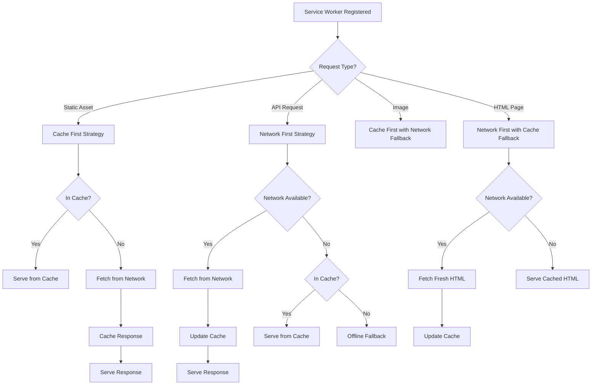

# PWA Implementation Design

## Overview

This design document outlines the technical architecture and implementation approach for transforming the Hoador Next.js application into a Progressive Web App (PWA). The design follows PWA best practices and integrates seamlessly with Next.js 16's App Router architecture.

The implementation will use a service worker-based approach with strategic caching, enabling offline functionality, faster load times, and native app-like installation capabilities. The design prioritizes performance, reliability, and user experience while maintaining compatibility with the existing React Query-based data fetching architecture.

## Architecture

### High-Level Architecture

The PWA implementation follows a layered architecture:

```
┌─────────────────────────────────────────────────────────┐
│                    User Interface                        │
│  (Next.js App Router, React Components, React Query)    │
└────────────────────┬────────────────────────────────────┘
                     │
┌────────────────────▼────────────────────────────────────┐
│              PWA Client Layer                            │
│  - Service Worker Registration                         │
│  - Install Prompt Handler                              │
│  - Network Status Detection                            │
│  - Update Notification                                 │
└────────────────────┬────────────────────────────────────┘
                     │
┌────────────────────▼────────────────────────────────────┐
│            Service Worker (Background)                  │
│  - Cache Management                                    │
│  - Request Interception                               │
│  - Offline Fallback                                    │
│  - Background Sync (Future)                            │
└────────────────────┬────────────────────────────────────┘
                     │
┌────────────────────▼────────────────────────────────────┐
│              Cache Storage (Browser)                     │
│  - Static Assets Cache                                 │
│  - API Response Cache                                  │
│  - Image Cache                                         │
└─────────────────────────────────────────────────────────┘
```

### Service Worker Architecture

The service worker implements a multi-strategy caching approach:



### Component Architecture

The PWA implementation consists of the following components:

1. **Service Worker** (`public/sw.js`)
   - Handles caching strategies
   - Manages offline functionality
   - Implements update logic

2. **PWA Client Module** (`src/lib/pwa/`)
   - Service worker registration
   - Install prompt handling
   - Update notifications
   - Network status detection

3. **PWA Components** (`src/components/pwa/`)
   - Install prompt component
   - Offline indicator
   - Update notification banner

4. **Web App Manifest** (`public/site.webmanifest`)
   - App metadata
   - Icon definitions
   - Display configuration

5. **Next.js Configuration**
   - Service worker integration
   - Manifest linking
   - PWA metadata

## Components and Interfaces

### 1. Service Worker (`public/sw.js`)

**Purpose**: Background script that handles caching and offline functionality.

**Key Features**:

- Cache versioning for updates
- Multiple caching strategies
- Offline fallback handling
- Background sync preparation

**Cache Names**:

- `hoador-static-v{version}`: Static assets (CSS, JS, fonts)
- `hoador-images-v{version}`: Image assets
- `hoador-api-v{version}`: API responses
- `hoador-pages-v{version}`: HTML pages

**Lifecycle Events**:

- `install`: Pre-cache critical resources
- `activate`: Clean up old caches
- `fetch`: Intercept and handle requests
- `message`: Handle messages from client

**Interface**:

```typescript
// Service Worker Event Handlers
self.addEventListener("install", (event) => {
  // Pre-cache critical resources
});

self.addEventListener("activate", (event) => {
  // Clean up old caches
});

self.addEventListener("fetch", (event) => {
  // Intercept requests and apply caching strategy
});
```

### 2. PWA Client Module (`src/lib/pwa/`)

#### 2.1 Service Worker Registration (`src/lib/pwa/register-service-worker.ts`)

**Purpose**: Register and manage service worker lifecycle.

**Functions**:

```typescript
export async function registerServiceWorker(): Promise<ServiceWorkerRegistration | null>;

export function checkForServiceWorkerUpdate(): Promise<void>;

export function unregisterServiceWorker(): Promise<boolean>;
```

**Behavior**:

- Registers service worker only in browser environment
- Handles registration errors gracefully
- Checks for updates on each page load
- Provides update notification mechanism

#### 2.2 Install Prompt Handler (`src/lib/pwa/install-prompt.ts`)

**Purpose**: Handle PWA installation prompts.

**Functions**:

```typescript
export function getInstallPrompt(): Promise<BeforeInstallPromptEvent | null>;

export function showInstallPrompt(): Promise<{
  outcome: "accepted" | "dismissed";
}>;

export function isAppInstalled(): boolean;

export function trackInstallation(): void;
```

**Behavior**:

- Captures `beforeinstallprompt` event
- Stores prompt event for later use
- Tracks installation status
- Provides manual install trigger

#### 2.3 Network Status (`src/lib/pwa/network-status.ts`)

**Purpose**: Monitor network connectivity.

**Functions**:

```typescript
export function useNetworkStatus(): {
  isOnline: boolean;
  isOffline: boolean;
  wasOffline: boolean;
};

export function onNetworkStatusChange(
  callback: (isOnline: boolean) => void,
): () => void;
```

**Behavior**:

- Monitors `navigator.onLine`
- Listens to online/offline events
- Provides React hook for components
- Tracks offline state transitions

#### 2.4 Update Manager (`src/lib/pwa/update-manager.ts`)

**Purpose**: Manage service worker updates.

**Functions**:

```typescript
export function useServiceWorkerUpdate(): {
  updateAvailable: boolean;
  updateServiceWorker: () => Promise<void>;
  skipWaiting: () => Promise<void>;
};

export function checkForUpdates(): Promise<boolean>;
```

**Behavior**:

- Detects service worker updates
- Notifies user of available updates
- Handles update installation
- Manages skipWaiting strategy

### 3. PWA Components

#### 3.1 Install Prompt Component (`src/components/pwa/install-prompt.tsx`)

**Purpose**: UI component for PWA installation.

**Props**:

```typescript
interface InstallPromptProps {
  onInstall?: () => void;
  onDismiss?: () => void;
  variant?: "banner" | "button" | "modal";
}
```

**Behavior**:

- Shows install prompt when available
- Handles user interaction
- Tracks dismissal to avoid repeated prompts
- Provides different UI variants

#### 3.2 Offline Indicator (`src/components/pwa/offline-indicator.tsx`)

**Purpose**: Visual indicator for offline status.

**Props**:

```typescript
interface OfflineIndicatorProps {
  position?: "top" | "bottom";
  showWhenOnline?: boolean;
}
```

**Behavior**:

- Displays when offline
- Shows connection status
- Provides visual feedback
- Non-intrusive design

#### 3.3 Update Notification (`src/components/pwa/update-notification.tsx`)

**Purpose**: Notify users of app updates.

**Props**:

```typescript
interface UpdateNotificationProps {
  onUpdate?: () => void;
  onDismiss?: () => void;
}
```

**Behavior**:

- Shows when service worker update is available
- Allows user to update immediately
- Can be dismissed temporarily
- Auto-updates on next navigation

#### 3.4 Offline Fallback Page (`src/app/offline/page.tsx`)

**Purpose**: Fallback page for offline navigation.

**Features**:

- Custom offline page design
- Link to cached content
- Retry connection button
- List of available cached pages

### 4. Web App Manifest (`public/site.webmanifest`)

**Structure**:

```json
{
  "name": "Hoador - Tool Rental Marketplace",
  "short_name": "Hoador",
  "description": "Your neighborhood tool rental marketplace",
  "start_url": "/",
  "display": "standalone",
  "background_color": "#ffffff",
  "theme_color": "#000000",
  "orientation": "portrait-primary",
  "scope": "/",
  "icons": [
    {
      "src": "/web-app-manifest-192x192.png",
      "sizes": "192x192",
      "type": "image/png",
      "purpose": "any maskable"
    },
    {
      "src": "/web-app-manifest-512x512.png",
      "sizes": "512x512",
      "type": "image/png",
      "purpose": "any maskable"
    }
  ],
  "categories": ["shopping", "marketplace"],
  "screenshots": [],
  "shortcuts": []
}
```

**Configuration**:

- Proper MIME type: `application/manifest+json`
- Linked in HTML head
- iOS-specific meta tags
- Theme colors matching app design

## Data Models

### Cache Configuration

```typescript
interface CacheConfig {
  version: string;
  staticCacheName: string;
  imageCacheName: string;
  apiCacheName: string;
  pageCacheName: string;
  maxCacheSize: number;
  maxCacheAge: number;
}

interface CacheStrategy {
  name: "cache-first" | "network-first" | "stale-while-revalidate";
  cacheName: string;
  networkTimeout?: number;
  matchOptions?: CacheQueryOptions;
}
```

### Service Worker State

```typescript
interface ServiceWorkerState {
  registration: ServiceWorkerRegistration | null;
  updateAvailable: boolean;
  installing: boolean;
  waiting: boolean;
  active: boolean;
  error: Error | null;
}
```

### Install Prompt State

```typescript
interface InstallPromptState {
  deferredPrompt: BeforeInstallPromptEvent | null;
  isInstallable: boolean;
  isInstalled: boolean;
  userChoice: "accepted" | "dismissed" | null;
}
```

### Network Status

```typescript
interface NetworkStatus {
  isOnline: boolean;
  wasOffline: boolean;
  effectiveType?: "slow-2g" | "2g" | "3g" | "4g";
  downlink?: number;
  rtt?: number;
}
```

## Caching Strategies

### 1. Cache-First Strategy

**Use Case**: Static assets (CSS, JS, fonts, images)

**Implementation**:

```typescript
async function cacheFirst(
  request: Request,
  cacheName: string,
): Promise<Response> {
  const cache = await caches.open(cacheName);
  const cached = await cache.match(request);

  if (cached) {
    return cached;
  }

  try {
    const response = await fetch(request);
    if (response.ok) {
      cache.put(request, response.clone());
    }
    return response;
  } catch (error) {
    // Return offline fallback if available
    return new Response("Offline", { status: 503 });
  }
}
```

**When to Use**:

- Static assets that rarely change
- Images
- Font files
- CSS/JS bundles

### 2. Network-First Strategy

**Use Case**: API requests, dynamic content

**Implementation**:

```typescript
async function networkFirst(
  request: Request,
  cacheName: string,
): Promise<Response> {
  const cache = await caches.open(cacheName);

  try {
    const response = await fetch(request);
    if (response.ok) {
      cache.put(request, response.clone());
    }
    return response;
  } catch (error) {
    const cached = await cache.match(request);
    if (cached) {
      return cached;
    }
    throw error;
  }
}
```

**When to Use**:

- API endpoints
- User-specific data
- Real-time content
- Search results

### 3. Stale-While-Revalidate Strategy

**Use Case**: HTML pages, frequently accessed content

**Implementation**:

```typescript
async function staleWhileRevalidate(
  request: Request,
  cacheName: string,
): Promise<Response> {
  const cache = await caches.open(cacheName);
  const cached = await cache.match(request);

  const fetchPromise = fetch(request).then((response) => {
    if (response.ok) {
      cache.put(request, response.clone());
    }
    return response;
  });

  return cached || fetchPromise;
}
```

**When to Use**:

- HTML pages
- Dashboard content
- Frequently accessed data
- Content that benefits from fast initial load

### 4. Cache Versioning

**Strategy**: Use versioned cache names to enable clean updates.

**Implementation**:

- Cache version in service worker: `const CACHE_VERSION = 'v1.0.0'`
- Cache names include version: `hoador-static-${CACHE_VERSION}`
- On update, create new cache with new version
- Delete old caches in `activate` event

## Error Handling

### Service Worker Registration Errors

**Scenarios**:

1. Service worker not supported
2. Registration fails
3. Service worker script error
4. Cache API unavailable

**Handling**:

```typescript
try {
  const registration = await navigator.serviceWorker.register("/sw.js");
  // Handle success
} catch (error) {
  // Log error for monitoring
  console.error("Service worker registration failed:", error);
  // Continue without service worker (graceful degradation)
  // App should function normally without PWA features
}
```

### Cache Errors

**Scenarios**:

1. Cache quota exceeded
2. Cache write fails
3. Cache read fails

**Handling**:

- Implement cache size limits
- Use LRU eviction strategy
- Fall back to network when cache fails
- Log errors for monitoring

### Network Errors

**Scenarios**:

1. Network unavailable
2. Request timeout
3. Server error (5xx)

**Handling**:

- Serve from cache when available
- Show offline fallback page
- Provide retry mechanism
- Display user-friendly error messages

### Update Errors

**Scenarios**:

1. Service worker update fails
2. SkipWaiting fails
3. Cache cleanup fails

**Handling**:

- Retry update on next page load
- Notify user of update issues
- Maintain current service worker version
- Log errors for debugging

## Security Considerations

### HTTPS Requirement

- Service workers only work over HTTPS (except localhost)
- Ensure production uses HTTPS
- Validate HTTPS in service worker registration

### Service Worker Scope

- Restrict service worker scope to app domain
- Prevent cross-origin service worker registration
- Validate service worker script origin

### Cache Security

- Don't cache sensitive data (passwords, tokens)
- Implement cache expiration for sensitive content
- Clear cache on logout
- Use secure cache storage

### Content Security Policy

- Ensure CSP allows service worker scripts
- Configure CSP headers for service worker
- Test CSP compatibility

## Performance Optimization

### Service Worker Registration

- Register service worker as early as possible
- Use async registration to avoid blocking
- Minimize service worker script size
- Lazy load service worker if needed

### Cache Management

- Limit cache size to prevent quota issues
- Implement cache eviction (LRU)
- Use appropriate cache strategies per resource type
- Monitor cache hit rates

### Resource Preloading

- Preload critical resources in service worker install
- Use `<link rel="preload">` for critical assets
- Implement resource hints (dns-prefetch, preconnect)
- Lazy load non-critical resources

### Bundle Optimization

- Code split service worker logic
- Minimize service worker dependencies
- Use tree-shaking for unused code
- Compress service worker script

## Testing Strategy

### Unit Tests

**Components to Test**:

- Service worker registration logic
- Install prompt handling
- Network status detection
- Cache management utilities

**Tools**: Vitest, React Testing Library

### Integration Tests

**Scenarios to Test**:

- Service worker registration flow
- Cache strategies with mocked requests
- Offline/online state transitions
- Update notification flow

**Tools**: Vitest with service worker mocks

### E2E Tests

**Scenarios to Test**:

- PWA installation flow
- Offline functionality
- Cache behavior
- Update mechanism

**Tools**: Playwright (supports service workers)

### Manual Testing

**Scenarios**:

- Install on Android Chrome
- Install on iOS Safari
- Offline browsing
- Cache invalidation
- Update flow

### Lighthouse Testing

**Metrics to Verify**:

- PWA score ≥ 90
- Installability
- Offline support
- Service worker registration
- Manifest configuration

## Technology Choices

### Service Worker

**Choice**: Native Service Worker API

**Rationale**:

- Standard web API, no dependencies
- Full control over caching strategies
- Better performance than libraries
- Direct integration with Next.js

### Caching Strategy Library

**Choice**: Custom implementation

**Rationale**:

- Lightweight, no external dependencies
- Full control over cache logic
- Easier to debug and maintain
- Better performance

### PWA Detection

**Choice**: Native APIs (`beforeinstallprompt`, `navigator.serviceWorker`)

**Rationale**:

- Standard browser APIs
- No library overhead
- Better browser support
- Direct integration

### Next.js Integration

**Approach**: Manual service worker registration in client component

**Rationale**:

- Next.js doesn't have built-in PWA support in App Router
- Full control over registration timing
- Better error handling
- Easier to customize

## File Structure

```
public/
├── sw.js                          # Service worker script
├── site.webmanifest              # Web app manifest
├── web-app-manifest-192x192.png  # PWA icon (192x192)
└── web-app-manifest-512x512.png  # PWA icon (512x512)

src/
├── lib/
│   └── pwa/
│       ├── register-service-worker.ts
│       ├── install-prompt.ts
│       ├── network-status.ts
│       ├── update-manager.ts
│       └── cache-config.ts
├── components/
│   └── pwa/
│       ├── install-prompt.tsx
│       ├── offline-indicator.tsx
│       └── update-notification.tsx
└── app/
    ├── layout.tsx                 # Manifest link, meta tags
    └── offline/
        └── page.tsx               # Offline fallback page
```

## Implementation Phases

### Phase 1: Foundation

- Web app manifest configuration
- Service worker registration
- Basic cache-first strategy

### Phase 2: Caching

- Implement multiple caching strategies
- Cache static assets
- Cache API responses
- Offline fallback page

### Phase 3: User Experience

- Install prompt component
- Offline indicator
- Update notifications
- Network status detection

### Phase 4: Optimization

- Cache versioning
- Cache eviction
- Performance tuning
- Error handling improvements

### Phase 5: Testing & Polish

- Comprehensive testing
- Lighthouse optimization
- Cross-browser testing
- Documentation

## Dependencies

### Required Dependencies

None - using native browser APIs

### Optional Dependencies (Future)

- `workbox-window`: Service worker lifecycle management (if needed)
- `idb`: IndexedDB wrapper for complex offline storage (if needed)

### Development Dependencies

- Service worker testing utilities (to be added)
- Lighthouse CI for automated PWA testing (to be added)

## Browser Compatibility

### Service Worker Support

- Chrome/Edge: ✅ Full support
- Firefox: ✅ Full support
- Safari: ✅ iOS 11.3+, macOS Safari 11.1+
- Samsung Internet: ✅ Full support

### Install Prompt Support

- Chrome/Edge: ✅ Full support
- Firefox: ✅ Full support (Android)
- Safari: ⚠️ Limited (manual install)
- Samsung Internet: ✅ Full support

### Fallback Strategy

- Detect feature support before enabling
- Graceful degradation for unsupported browsers
- Provide manual installation instructions for Safari

## Monitoring and Analytics

### Metrics to Track

1. Service worker registration rate
2. Install prompt display rate
3. Installation conversion rate
4. Cache hit rate
5. Offline usage frequency
6. Service worker update success rate
7. Error rates (registration, cache, network)

### Implementation

- Use existing analytics solution
- Add PWA-specific events
- Track user journey from install prompt to installation
- Monitor service worker errors

## Future Enhancements

### Phase 2 Features (Out of Scope)

1. **Push Notifications**
   - Web Push API integration
   - Notification service
   - User preferences

2. **Background Sync**
   - Queue actions when offline
   - Sync when online
   - Conflict resolution

3. **Share Target API**
   - Receive shared content
   - Handle share intents
   - Deep linking

4. **Periodic Background Sync**
   - Scheduled updates
   - Background data refresh
   - Content preloading

## Design Decisions and Rationale

### 1. Custom Service Worker vs Workbox

**Decision**: Custom service worker implementation

**Rationale**:

- No external dependencies
- Full control over caching logic
- Smaller bundle size
- Better understanding of implementation
- Easier to debug

### 2. Client-Side Registration vs Build-Time

**Decision**: Client-side registration in React component

**Rationale**:

- Works with Next.js App Router
- Better error handling
- Can conditionally register
- Easier to test
- More flexible

### 3. Multiple Cache Strategies vs Single Strategy

**Decision**: Multiple strategies per resource type

**Rationale**:

- Optimizes performance for different content types
- Better user experience
- More efficient cache usage
- Aligns with PWA best practices

### 4. Manual Update vs Auto-Update

**Decision**: User-controlled updates with notification

**Rationale**:

- Better user experience
- Prevents unexpected behavior
- User can choose update timing
- More transparent

## Risk Mitigation

### Service Worker Registration Failures

**Risk**: App breaks if registration fails

**Mitigation**: Graceful degradation, app works without service worker

### Cache Quota Exceeded

**Risk**: Cache fails when storage is full

**Mitigation**: Implement cache size limits, LRU eviction, monitor usage

### Browser Compatibility

**Risk**: Some browsers don't support PWA features

**Mitigation**: Feature detection, graceful fallbacks, manual alternatives

### Update Conflicts

**Risk**: Service worker updates cause issues

**Mitigation**: Versioned caches, careful update logic, testing

## Success Metrics

1. **Installability**: 80%+ of eligible users can install
2. **Performance**: Lighthouse PWA score ≥ 90
3. **Offline Support**: Core features work offline
4. **Cache Hit Rate**: 70%+ for static assets
5. **Error Rate**: < 1% service worker errors
6. **User Adoption**: Track installation rate

## References

- [MDN: Progressive Web Apps](https://developer.mozilla.org/en-US/docs/Web/Progressive_web_apps)
- [Web.dev: PWA Checklist](https://web.dev/pwa-checklist/)
- [Next.js: Service Workers](https://nextjs.org/docs/app/building-your-application/optimizing/service-workers)
- [Service Worker API](https://developer.mozilla.org/en-US/docs/Web/API/Service_Worker_API)
- [Web App Manifest](https://developer.mozilla.org/en-US/docs/Web/Manifest)
