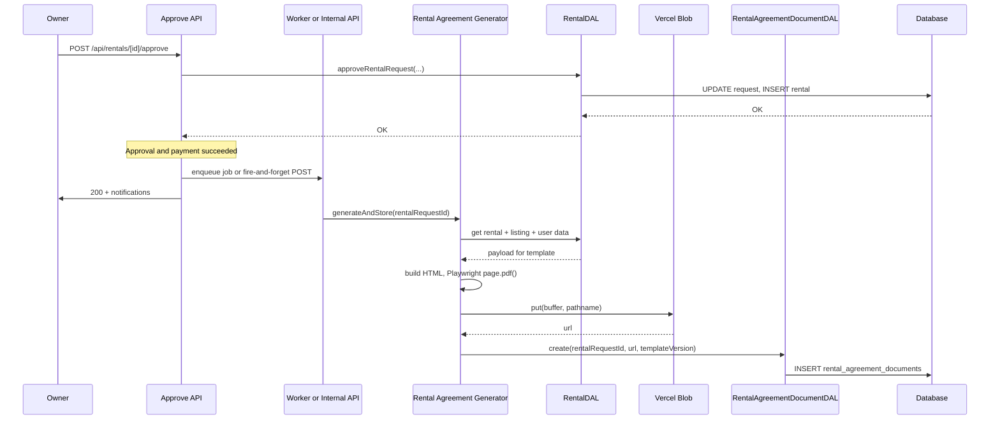
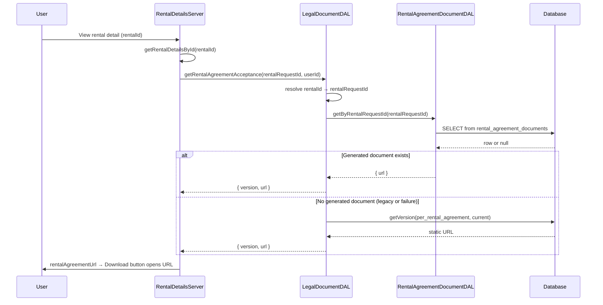

# Rental Agreement Auto-Generation - Design Document

## Overview

This design document describes the technical architecture for generating and storing a filled, per-rental PDF of the Hoador Tool and Service Rental Agreement when the owner approves a rental request. The PDF is populated with provider, renter, tool description, dates, location, and total cost; stored in blob storage and a new database table; and served on the rental detail page for download by renter and owner.

The design aligns with the existing Hoador layered architecture (DAL, API routes, server components) and reuses Vercel Blob and the current legal-document/acceptance flow. Requirements 1–8 are satisfied by the components and data flows below.

## Architecture

### High-Level Architecture

The feature fits into the existing layers without a new top-level service; generation is triggered from the approve API and retrieval is handled by the legal-document DAL and rental detail server component.

```
┌─────────────────────────────────────────────────────────────────┐
│              Presentation Layer                                  │
│  - Rental Detail Page (rentalAgreementUrl from server)           │
│  - "Download rental agreement" (opens stored PDF URL)            │
│  - Rent Page (unchanged: checkbox + link to generic agreement)   │
└────────────────────────────┬────────────────────────────────────┘
                              │
┌─────────────────────────────▼────────────────────────────────────┐
│              Application Layer                                    │
│  - POST /api/rentals/[id]/approve (triggers async PDF generation │
│    after approval + payment success; worker runs Playwright)     │
│  - RentalDetailsServer (resolves rentalAgreementUrl via DAL)      │
└────────────────────────────┬────────────────────────────────────┘
                              │
┌─────────────────────────────▼────────────────────────────────────┐
│              Service / Generation Layer                           │
│  - RentalAgreementGenerator (HTML template + data → PDF via       │
│    Playwright; runs in worker/internal route)                     │
│  - HTML template (canonical agreement + placeholders; in code)     │
│  - Vercel Blob (upload PDF, return URL)                          │
└────────────────────────────┬────────────────────────────────────┘
                              │
┌─────────────────────────────▼────────────────────────────────────┐
│              Data Access Layer                                    │
│  - LegalDocumentDAL (getRentalAgreementAcceptance: prefer         │
│    generated doc URL, fallback to legal_documents)               │
│  - RentalAgreementDocumentDAL (create, getByRentalRequestId)      │
│  - RentalDAL (existing: getRentalDetailsById, approve, etc.)      │
└────────────────────────────┬────────────────────────────────────┘
                              │
┌─────────────────────────────▼────────────────────────────────────┐
│              Database + Blob                                      │
│  - rental_agreement_documents (rental_request_id, pdf_url,        │
│    template_version, generated_at)                                │
│  - legal_documents, user_legal_acceptances (unchanged)            │
│  - Vercel Blob (per-rental PDF files)                             │
└──────────────────────────────────────────────────────────────────┘
```

### Generation Flow (At Approval)



Generation is **triggered asynchronously** after `approveRentalRequest` and payment success (e.g. queue + worker or internal API). The approve route returns 200 without waiting. If generation or storage fails in the worker, the error is logged; the rental detail page falls back to the generic agreement URL until a retry or manual fix.

### Retrieval Flow (Rental Detail Page)



The detail page passes a **rental identifier** (request id or rental id); the DAL resolves it to a **rental request id** before looking up `rental_agreement_documents`. If a generated document exists, its URL is returned; otherwise the current generic `per_rental_agreement` document URL from `legal_documents` is used (backward compatibility).

## Components and Interfaces

### 1. Template Storage and Versioning

- **Decision:** Store the canonical agreement text and structure **in code** at `src/services/playwright/template.ts`.
- **Rationale:** Single version in repo, easy to diff and review; no admin UI for template content; version identifier can be a constant (e.g. `RENTAL_AGREEMENT_TEMPLATE_VERSION = "1.0"`).
- **Format:** HTML template with placeholders (e.g. `{{PROVIDER_NAME}}`, `{{RENTER_NAME}}`, `{{TOOL_DESCRIPTION}}`, `{{START_DATE}}`, `{{END_DATE}}`, `{{RENTAL_LOCATION}}`, `{{TOTAL_COST}}`). Use Tailwind or print CSS (`@media print`) for layout. Versioning via a constant (e.g. `RENTAL_AGREEMENT_TEMPLATE_VERSION = "1.0"`).

### 2. PDF Generation Technology (Chosen: Playwright)

**Decision:** Use **Playwright** for server-side PDF generation. The team plans to adopt Playwright for E2E tests; using it for rental agreement PDFs gives a single dependency for both PDF generation and future E2E.

#### Approach

- Author the agreement as an **HTML template** (or a React component rendered to HTML string) with placeholders (e.g. `{{PROVIDER_NAME}}`, `{{RENTER_NAME}}`, etc.). Use Playwright’s headless browser to load the HTML and call `page.pdf()` to produce a PDF buffer.
- **Template format:** HTML with Tailwind or print CSS (`@media print`); same template can be used for an in-browser “View agreement” preview on the rent page if desired.
- **Interface:** `generateRentalAgreementPdf(data: RentalAgreementData): Promise<Buffer>`. Implementation: build HTML from template + data, launch browser (or reuse a pool), `page.setContent(html)`, `page.pdf({ path: null })` or equivalent to get buffer, close page/browser, return buffer.

#### Benefits

- Full **HTML/CSS** control; easy to match a design or reference PDF.
- **Single stack:** One dependency for PDF generation now and E2E tests later (browsers installed once, shared by both).
- **Print fidelity:** Browser’s print engine; good for multi-page, section breaks, and typography.

#### Deployment: Run generation outside the approve route

- Playwright (Chromium) is **heavy** for Vercel serverless: larger bundle, more memory, and duration limits. The approve route **must not** launch a browser in the same serverless function.
- **Recommended:** Trigger generation **asynchronously** after approval:
  1. **Option A (simplest for MVP):** Approve route enqueues a job (e.g. payload: `{ rentalRequestId }`) and returns 200. A **background worker** or **Vercel Background Function** (if available) runs Playwright, generates the PDF, uploads to blob, and inserts into `rental_agreement_documents`. If no queue exists yet, the approve route can call an internal API route that runs the generator (e.g. `POST /api/internal/generate-rental-agreement`) and invoke it with `fetch(..., { signal: AbortSignal.timeout(5000) })` fire-and-forget; that route must be deployed where Playwright can run (e.g. longer timeout, more memory, or a separate service).
  2. **Option B:** Use a queue (e.g. Inngest, Trigger.dev, or Vercel queue) plus a worker that runs Playwright and performs upload + DB insert. Approve route publishes `{ rentalRequestId }` and returns immediately.
- **Fallback:** Until a generated document exists, the rental detail page continues to use the generic `per_rental_agreement` URL from `legal_documents` (Requirement 5, 7). Users may see the generic doc briefly after approval until the background job completes.

#### Future: E2E tests

- When E2E is added, install Playwright once (`npx playwright install`); the same browsers are used for both PDF generation (in the worker) and E2E test runs. No second PDF-specific dependency.

### 3. Rental Agreement Generator (Orchestration)

- **Responsibility:** Load rental/listing/user data for a given `rentalRequestId`, map to `RentalAgreementData`, call the Playwright PDF generator (HTML → buffer), upload buffer to Vercel Blob, insert row into `rental_agreement_documents`, return URL (or throw).
- **Location:** `src/services/playwright/generate-rental-agreement.ts`. This service runs in a **background worker** or **internal API route** (not in the approve route), where Playwright can run (longer timeout, more memory).
- **Dependencies:** RentalDAL (or a minimal “get payload for agreement” method), listing/user data as needed, `src/services/playwright/template.ts` (HTML template + renderTemplate), Playwright, Vercel Blob `put`, RentalAgreementDocumentDAL.
- **Idempotency:** If a row already exists for the rental request id, the implementation may skip generation and return the existing URL (optional; avoids duplicate blobs on retries).

### 4. Vercel Blob Storage

- **Usage:** Same as existing (e.g. listing images, legal document uploads). Upload PDF buffer with a deterministic or unique pathname, e.g. `rental-agreements/{rentalRequestId}.pdf` or `rental-agreements/{rentalRequestId}-{timestamp}.pdf`. Store the returned URL in `rental_agreement_documents.pdf_url`.
- **Existing helper:** [src/services/vercel-blob/index.ts](src/services/vercel-blob/index.ts) exposes `uploadToBlob(filename, file | Buffer)`.

### 5. Integration with Approve Route

- **Location:** [src/app/api/rentals/[id]/approve/route.ts](src/app/api/rentals/[id]/approve/route.ts).
- **Hook:** After `rentalDAL.approveRentalRequest(...)` succeeds and payment/security-deposit logic completes, **trigger PDF generation asynchronously** (do not run Playwright in the same serverless function). Options:
  1. **Enqueue a job** (e.g. queue + worker, or Vercel Background Function): publish `{ rentalRequestId: rentalRequest.id }` and return 200. A worker runs Playwright, generates the PDF, uploads to blob, and inserts into `rental_agreement_documents`.
  2. **Fire-and-forget internal API call:** `fetch(INTERNAL_URL + '/api/internal/generate-rental-agreement', { method: 'POST', body: JSON.stringify({ rentalRequestId }), signal: AbortSignal.timeout(5000) })` and do not await the result; log and ignore errors so approval and notifications still return 200. The internal route must be deployed where Playwright can run (e.g. longer timeout, more memory, or a separate service).
- **Data:** The generator accepts `rentalRequestId` and loads full rental + listing + user details inside the service (keeps the approve route thin).

### 6. Legal Document DAL Changes

- **getRentalAgreementAcceptance(rentalRequestId, userId):** Today it returns the static document URL from `legal_documents` for the version the renter accepted. **New behavior:**
  1. Resolve input to a single **rental request id** (if the caller passes a rental id, look up `rentals.requestId` for that rental; if already request id, use it).
  2. Query `rental_agreement_documents` by that request id. If a row exists, return `{ version: row.template_version, url: row.pdf_url }`.
  3. Otherwise, keep existing logic: acceptance record + `legal_documents` URL for `per_rental_agreement` (fallback for legacy or when generation failed).
- **Resolving rental id → request id:** When the detail page has `rentalDetails` from `getRentalDetailsById(rentalId, userId)`, the “rental id” in the URL may be either a request id or a rental id. The DAL (or a shared helper) should accept the same identifier the detail page uses: if it’s a rental id, query `rentals` by id and take `requestId`; if it’s a request id, use it as-is. Exposing `requestId` on `RentalDetails` when type is `"rental"` will avoid an extra lookup in the server component.

### 7. Rental Detail Page

- **Current:** [RentalDetailsServer](src/features/rentals/components/detail-page/rental-details-server.tsx) calls `legalDocumentDAL.getRentalAgreementAcceptance(rentalId, userId)` and passes `rentalAgreementUrl` to content/actions. The button opens the URL in a new tab.
- **Change:** Pass the same `rentalId` (or, if preferred, the resolved `rentalRequestId`) into `getRentalAgreementAcceptance`. No UI change beyond ensuring the URL points to the generated PDF when available; fallback remains the generic agreement.

## Data Models

### New Table: rental_agreement_documents

Stores one generated PDF per rental request (one-to-one with `rental_requests.id`).

| Column            | Type         | Constraints                               | Description                           |
| ----------------- | ------------ | ----------------------------------------- | ------------------------------------- |
| id                | uuid         | PK, defaultRandom()                       | Surrogate key.                        |
| rental_request_id | uuid         | FK → rental_requests.id, NOT NULL, UNIQUE | Request this document belongs to.     |
| pdf_url           | varchar(500) | NOT NULL                                  | Vercel Blob URL of the generated PDF. |
| template_version  | varchar(50)  | NOT NULL                                  | Template version used (e.g. "1.0").   |
| generated_at      | timestamp    | NOT NULL, defaultNow()                    | When the PDF was generated.           |

- **Indexes:** Unique on `rental_request_id`; index on `rental_request_id` for lookups.
- **FK:** `onDelete: "cascade"` so when a rental request is deleted, the generated document row is removed (optional; could be `restrict` if we want to preserve audit).
- **Schema location:** New file `src/db/schemas/rental-agreement-documents.schema.ts` (or add to an existing schema file and export from `schemas/index.ts`).

Example Drizzle definition:

```typescript
// src/db/schemas/rental-agreement-documents.schema.ts
import {
  pgTable,
  uuid,
  varchar,
  timestamp,
  uniqueIndex,
} from "drizzle-orm/pg-core";
import { rentalRequests } from "./rentals.schema";

export const rentalAgreementDocuments = pgTable(
  "rental_agreement_documents",
  {
    id: uuid("id").defaultRandom().primaryKey(),
    rentalRequestId: uuid("rental_request_id")
      .references(() => rentalRequests.id, { onDelete: "cascade" })
      .notNull()
      .unique(),
    pdfUrl: varchar("pdf_url", { length: 500 }).notNull(),
    templateVersion: varchar("template_version", { length: 50 }).notNull(),
    generatedAt: timestamp("generated_at").defaultNow().notNull(),
  },
  (table) => [
    uniqueIndex("rental_agreement_documents_rental_request_id_idx").on(
      table.rentalRequestId,
    ),
  ],
);
```

### Existing Tables (No Schema Change)

- **legal_documents:** Still holds document types and versions (e.g. `per_rental_agreement` with a version). Optional: a row for `per_rental_agreement` can point to a generic/sample PDF for the rent page link; generation does not create new rows here.
- **user_legal_acceptances:** Unchanged; continues to record renter acceptance at request time with `documentId: "per_rental_agreement"` and `rentalRequestId`.

## Template Placeholder Mapping

| Placeholder              | Source (from rental/listing/user)                                                                                  |
| ------------------------ | ------------------------------------------------------------------------------------------------------------------ |
| Provider                 | Owner display name (e.g. `ownerName` from rental details). Optionally append owner user ID.                        |
| Renter                   | Renter display name (e.g. `renterName`). Optionally append renter user ID.                                         |
| Tool/Service Description | Listing name + description; optionally brand/model.                                                                |
| Rental Start Date/Time   | Rental request `startDate` (formatted, e.g. locale date/time).                                                     |
| Rental End Date/Time     | Rental request `endDate` (formatted).                                                                              |
| Rental Location          | If delivery requested: `deliveryAddress`; else `pickupAddress` or listing/community address. Use "N/A" if missing. |
| Total Cost               | Rental request `totalAmount` (formatted as currency, e.g. USD).                                                    |

All of these are available from `getRentalDetailsById` or from the rental request + listing + user fetch used inside the generator.

## Error Handling

1. **Generation failure at approval:** Catch errors in the approve route’s call to the generator; log with `rentalRequestId` and error message; do not return 500 or block the response. Approval and notifications still succeed. (Requirement 7.)
2. **Missing generated document at download:** `getRentalAgreementAcceptance` falls back to the current `per_rental_agreement` URL from `legal_documents` when no row exists in `rental_agreement_documents`. (Requirement 5, 7.)
3. **Blob upload failure:** If `put()` fails, log, and do not insert into `rental_agreement_documents`. Approval still succeeds; download will use fallback URL.
4. **Invalid or missing rental request id:** When resolving rental id → request id, if the rental or request is not found or the user is not renter/owner, return null (no URL); detail page can hide or disable the download button when URL is missing.

## Testing Strategy

- **Unit:** Template placeholder replacement or React-PDF document rendering with mock data; output buffer is non-empty and contains expected text snippets.
- **Unit:** RentalAgreementDocumentDAL create and getByRentalRequestId with in-memory or test DB.
- **Integration:** Approve flow: after approval, assert one row in `rental_agreement_documents` and that the blob URL is reachable (or mocked); approval response 200 even if generation is mocked to fail.
- **Integration:** getRentalAgreementAcceptance: with a generated document, returns its URL; without one, returns fallback URL when available; with invalid id or wrong user, returns null.
- **E2E (optional):** Rent → Approve → open rental detail → click Download rental agreement → document opens with correct parties and dates.

## Requirements Traceability

| Req | Design element                                                                                                 |
| --- | -------------------------------------------------------------------------------------------------------------- |
| 1   | Renter confirmation unchanged; rent page and API continue to require and record acceptance (no design change). |
| 2   | Template in code with placeholders; version constant.                                                          |
| 3   | Generator invoked after approval + payment success; non-blocking; placeholder mapping as above.                |
| 4   | Table `rental_agreement_documents`; blob storage; one row per rental request.                                  |
| 5   | getRentalAgreementAcceptance prefers generated URL, then fallback; detail page uses returned URL.              |
| 6   | Placeholder mapping table and data sources.                                                                    |
| 7   | Error handling: do not block approval; fallback URL; log failures.                                             |
| 8   | Generated row ties to rental request and template version; acceptances remain in user_legal_acceptances.       |

## Summary

- **Template:** In-code at `src/services/playwright/template.ts`; versioned constant; placeholders filled from rental/listing/user data.
- **PDF:** Playwright (HTML → PDF) in `src/services/playwright/generate-rental-agreement.ts`; upload buffer to Vercel Blob.
- **Storage:** New table `rental_agreement_documents` (rental_request_id, pdf_url, template_version, generated_at); one-to-one with rental request.
- **Trigger:** Approve route, after successful approval and payment; fire-and-forget generation and store.
- **Retrieval:** LegalDocumentDAL.getRentalAgreementAcceptance resolves rental id → request id, then returns generated PDF URL if present, else current generic `per_rental_agreement` URL.
- **Rental detail page:** Same contract (rentalAgreementUrl); no UI change beyond URL source.
