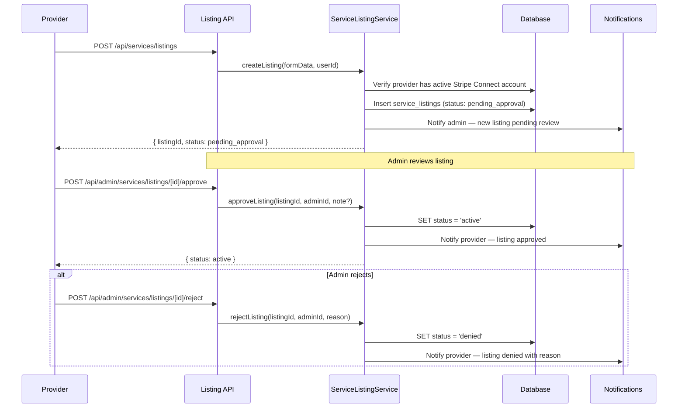
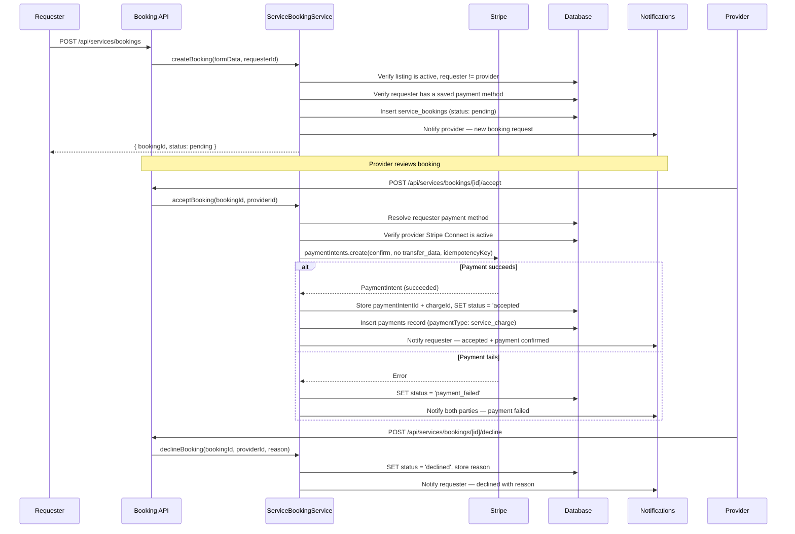
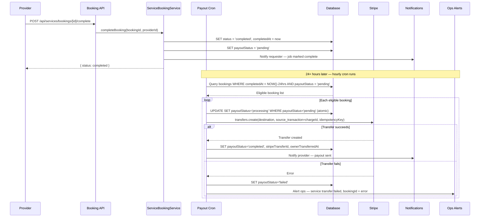
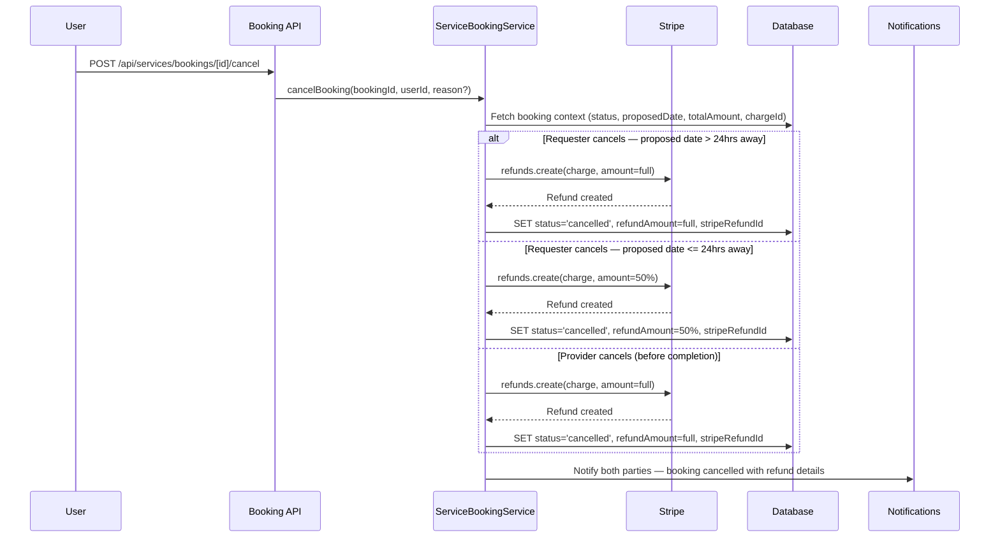

# HOA Services Marketplace (Phase 1) — Design Document

## Overview

This document details the technical design for the HOA Services Marketplace Phase 1. The implementation introduces service listing creation and admin approval, service discovery and booking, payment capture at provider acceptance (Stripe Connect), job completion with a 24-hour deferred payout via cron, cancellations and refunds, mutual reviews, and provider profiles.

The design follows the existing layered architecture (Presentation → Application → Service → DAL → Database) and reuses established patterns: `withRequestLogging`, `tryCatch`, `captureNonCriticalError`, `BaseDAL`, audit logging, `sendOpsAlert()`, `verifyCronSecret()`, `calculateServiceFee()`, `PLATFORM_FEE_PERCENTAGE`, `processRefund()`, and the notification service.

## Architecture

### High-Level Architecture

```
┌─────────────────────────────────────────────────────────┐
│              Presentation Layer                          │
│  - Service Browse & Listing Detail (new)                │
│  - Create/Edit Listing Forms (new)                      │
│  - Booking Request Flow (new)                           │
│  - Provider Profile Page (new)                          │
│  - Admin Listing Approval UI (new)                      │
└────────────────────┬────────────────────────────────────┘
                     │
┌────────────────────▼────────────────────────────────────┐
│              Application Layer                           │
│  - Service Listing APIs (new)                           │
│  - Service Booking APIs (new)                           │
│  - Admin Listing Approval APIs (new)                    │
│  - Provider Profile APIs (new)                          │
│  - Payout Cron Endpoint (new)                           │
└────────────────────┬────────────────────────────────────┘
                     │
┌────────────────────▼────────────────────────────────────┐
│              Service Layer                               │
│  - ServiceListingService (new)                          │
│  - ServiceBookingService (new)                          │
│  - ServicePayoutService (new: cron-triggered)           │
│  - ServiceReviewService (new)                           │
│  - Notification helpers (new)                           │
└────────────────────┬────────────────────────────────────┘
                     │
┌────────────────────▼────────────────────────────────────┐
│              Data Access Layer                           │
│  - ServiceListingDAL (new)                              │
│  - ServiceBookingDAL (new)                              │
│  - ServiceReviewDAL (new)                               │
└────────────────────┬────────────────────────────────────┘
                     │
┌────────────────────▼────────────────────────────────────┐
│              Database Layer                              │
│  - service_listing_categories (new table)               │
│  - service_listings (new table)                         │
│  - service_bookings (new table)                         │
│  - service_reviews (new table)                          │
│  - service_no_show_reports (new table)                  │
│  - service_provider_profiles (new table)                │
│  - New enums in _enums.ts                               │
└────────────────────┬────────────────────────────────────┘
                     │
┌────────────────────▼────────────────────────────────────┐
│              External Services                           │
│  - Stripe API (PaymentIntents, Transfers, Refunds)      │
│  - GitHub Actions (1 new scheduled cron workflow)       │
└─────────────────────────────────────────────────────────┘
```

### Data Flow: Listing Creation & Admin Approval



### Data Flow: Booking Request → Provider Accept → Payment Capture



### Data Flow: Job Completion & Payout Processing (Cron)



### Data Flow: Cancellation & Refund



## Database Schema Design

### New Enums

```typescript
// Added to src/db/schemas/_enums.ts

export const serviceListingStatusEnum = pgEnum("service_listing_status", [
  "pending_approval", // Submitted by provider, awaiting admin review
  "active", // Approved and visible to HOA residents
  "inactive", // Deactivated by provider
  "denied", // Admin denied — provider notified with reason
]);

export const servicePricingTypeEnum = pgEnum("service_pricing_type", [
  "fixed", // Flat price per job
  "hourly", // Rate × estimated hours
]);

export const serviceBookingStatusEnum = pgEnum("service_booking_status", [
  "pending", // Booking request submitted, awaiting provider response
  "accepted", // Provider accepted + payment captured
  "declined", // Provider declined — decline reason stored
  "payment_failed", // Provider accepted but payment capture failed
  "completed", // Provider marked job complete
  "cancelled", // Cancelled by requester or provider — refund issued
]);

export const servicePayoutStatusEnum = pgEnum("service_payout_status", [
  "pending", // Awaiting 24-hour dispute window + cron processing
  "processing", // Cron has claimed this booking — concurrency lock
  "completed", // Transfer to provider's Connected Account succeeded
  "failed", // Transfer failed — ops notified, manual intervention required
]);

// Extend existing notificationTypeEnum with service notification types:
// "service_booking_requested"  — to provider when requester submits booking
// "service_booking_accepted"   — to requester on acceptance + payment confirmation
// "service_booking_declined"   — to requester with decline reason
// "service_booking_completed"  — to requester when provider marks complete
// "service_payout_sent"        — to provider when payout transfer succeeds
// "service_listing_approved"   — to provider on admin approval
// "service_listing_rejected"   — to provider on admin rejection with reason
// "service_listing_pending"    — to admin on new listing submission
// "service_no_show_reported"   — to admin on no-show report submission
```

### New Table: service_listing_categories

```typescript
// src/db/schemas/services.schema.ts

export const serviceListingCategories = pgTable("service_listing_categories", {
  id: uuid("id").defaultRandom().primaryKey(),
  name: varchar("name", { length: 100 }).notNull().unique(),
  description: text("description"),
  createdAt: timestamp("created_at").defaultNow().notNull(),
});
```

### New Table: service_listings

```typescript
// src/db/schemas/services.schema.ts

export const serviceListings = pgTable(
  "service_listings",
  {
    id: uuid("id").defaultRandom().primaryKey(),
    communityId: uuid("community_id")
      .references(() => communities.id, { onDelete: "cascade" })
      .notNull(),
    providerId: uuid("provider_id")
      .references(() => users.id, { onDelete: "cascade" })
      .notNull(),
    categoryId: uuid("category_id")
      .references(() => serviceListingCategories.id)
      .notNull(),
    title: varchar("title", { length: 255 }).notNull(),
    description: text("description").notNull(),
    pricingType: servicePricingTypeEnum("pricing_type").notNull(),
    price: numeric("price", { precision: 10, scale: 2 }).notNull(), // dollars
    photos: jsonb("photos").$type<string[]>().default([]),
    serviceNotes: text("service_notes"),
    status: serviceListingStatusEnum("status")
      .default("pending_approval")
      .notNull(),
    adminNote: text("admin_note"), // Internal note on approval (optional)
    rejectionReason: text("rejection_reason"), // Required when status = 'denied'
    createdAt: timestamp("created_at").defaultNow().notNull(),
    updatedAt: timestamp("updated_at").defaultNow().notNull(),
  },
  (table) => ({
    communityStatusIdx: index("sl_community_status_idx").on(
      table.communityId,
      table.status,
    ),
    providerIdx: index("sl_provider_idx").on(table.providerId),
    categoryIdx: index("sl_category_idx").on(table.categoryId),
  }),
);
```

### New Table: service_bookings

```typescript
// src/db/schemas/services.schema.ts

export const serviceBookings = pgTable(
  "service_bookings",
  {
    id: uuid("id").defaultRandom().primaryKey(),
    listingId: uuid("listing_id")
      .references(() => serviceListings.id, { onDelete: "restrict" })
      .notNull(),
    requesterId: uuid("requester_id")
      .references(() => users.id, { onDelete: "restrict" })
      .notNull(),
    providerId: uuid("provider_id")
      .references(() => users.id, { onDelete: "restrict" })
      .notNull(),
    communityId: uuid("community_id")
      .references(() => communities.id, { onDelete: "restrict" })
      .notNull(),

    // Booking details
    proposedDate: date("proposed_date").notNull(),
    proposedTime: varchar("proposed_time", { length: 10 }).notNull(), // "HH:MM"
    hours: numeric("hours", { precision: 4, scale: 2 }), // hourly only
    notes: text("notes"),
    declineReason: text("decline_reason"),

    // Pricing snapshot at booking time
    servicePrice: numeric("service_price", {
      precision: 10,
      scale: 2,
    }).notNull(),
    serviceFee: numeric("service_fee", { precision: 10, scale: 2 }).notNull(),
    totalAmount: numeric("total_amount", { precision: 10, scale: 2 }).notNull(),

    // Status
    status: serviceBookingStatusEnum("status").default("pending").notNull(),

    // Payment
    stripePaymentIntentId: varchar("stripe_payment_intent_id", { length: 255 }),
    stripeChargeId: varchar("stripe_charge_id", { length: 255 }), // source_transaction for transfer
    paymentStatus: varchar("payment_status", { length: 50 }),

    // Refund
    refundAmount: numeric("refund_amount", { precision: 10, scale: 2 }),
    stripeRefundId: varchar("stripe_refund_id", { length: 255 }),

    // Cancellation
    cancelledAt: timestamp("cancelled_at"),
    cancelledBy: uuid("cancelled_by").references(() => users.id),
    cancellationReason: text("cancellation_reason"),

    // Completion
    completedAt: timestamp("completed_at"),

    // Payout (deferred 24hrs after completedAt)
    payoutStatus: servicePayoutStatusEnum("payout_status"),
    stripeTransferId: varchar("stripe_transfer_id", { length: 255 }),
    ownerTransferredAt: timestamp("owner_transferred_at"),

    createdAt: timestamp("created_at").defaultNow().notNull(),
    updatedAt: timestamp("updated_at").defaultNow().notNull(),
  },
  (table) => ({
    payoutStatusIdx: index("sb_payout_status_idx").on(table.payoutStatus),
    completedAtIdx: index("sb_completed_at_idx").on(table.completedAt),
    providerIdx: index("sb_provider_idx").on(table.providerId),
    requesterIdx: index("sb_requester_idx").on(table.requesterId),
  }),
);
```

### New Table: service_reviews

```typescript
// src/db/schemas/service-reviews.schema.ts

export const serviceReviews = pgTable(
  "service_reviews",
  {
    id: uuid("id").defaultRandom().primaryKey(),
    bookingId: uuid("booking_id")
      .references(() => serviceBookings.id, { onDelete: "cascade" })
      .notNull(),
    listingId: uuid("listing_id")
      .references(() => serviceListings.id, { onDelete: "cascade" })
      .notNull(),
    reviewerId: uuid("reviewer_id")
      .references(() => users.id, { onDelete: "cascade" })
      .notNull(),
    revieweeId: uuid("reviewee_id")
      .references(() => users.id, { onDelete: "cascade" })
      .notNull(),
    rating: integer("rating").notNull(), // 1–5
    comment: text("comment"),
    createdAt: timestamp("created_at").defaultNow().notNull(),
  },
  (table) => ({
    // One review per party per booking
    uniqueReviewerBooking: uniqueIndex("sr_reviewer_booking_idx").on(
      table.bookingId,
      table.reviewerId,
    ),
    revieweeIdx: index("sr_reviewee_idx").on(table.revieweeId),
    listingIdx: index("sr_listing_idx").on(table.listingId),
  }),
);
```

### New Table: service_no_show_reports

```typescript
// src/db/schemas/service-no-show-reports.schema.ts

export const serviceNoShowReports = pgTable("service_no_show_reports", {
  id: uuid("id").defaultRandom().primaryKey(),
  bookingId: uuid("booking_id")
    .references(() => serviceBookings.id, { onDelete: "cascade" })
    .notNull(),
  reportedBy: uuid("reported_by")
    .references(() => users.id, { onDelete: "cascade" })
    .notNull(),
  notes: text("notes"),
  reportedAt: timestamp("reported_at").defaultNow().notNull(),
});
```

### New Table: service_provider_profiles

```typescript
// src/db/schemas/services.schema.ts

export const serviceProviderProfiles = pgTable("service_provider_profiles", {
  id: uuid("id").defaultRandom().primaryKey(),
  userId: uuid("user_id")
    .references(() => users.id, { onDelete: "cascade" })
    .notNull()
    .unique(),
  bio: text("bio"),
  aggregateRating: numeric("aggregate_rating", { precision: 3, scale: 2 }), // null = no reviews yet
  reviewCount: integer("review_count").default(0).notNull(),
  createdAt: timestamp("created_at").defaultNow().notNull(),
  updatedAt: timestamp("updated_at").defaultNow().notNull(),
});
```

### Migration Strategy

1. Add new enums and extend existing `notificationTypeEnum` (additive, no data migration)
2. Create `service_listing_categories`, `service_listings`, `service_bookings` tables
3. Create `service_reviews`, `service_no_show_reports`, `service_provider_profiles` tables
4. All migrations are additive — no destructive changes, backward-compatible with existing rental system

## Presentation Layer

### Pages

| Route                                       | Description                                       |
| ------------------------------------------- | ------------------------------------------------- |
| `/dashboard/services`                       | Browse active service listings for the user's HOA |
| `/dashboard/services/listings/create`       | Create a new service listing                      |
| `/dashboard/services/listings/[id]`         | Listing detail — full info + booking CTA          |
| `/dashboard/services/listings/[id]/edit`    | Edit or deactivate an existing listing            |
| `/dashboard/services/listings/[id]/book`    | Booking request flow                              |
| `/dashboard/services/bookings`              | My bookings — requester and provider views        |
| `/dashboard/services/bookings/[id]`         | Booking detail — status-driven action surface     |
| `/dashboard/services/providers/[userId]`    | Provider profile — bio, rating, listings, reviews |
| `/admin/dashboard/services/listings/review` | Admin listing approval queue                      |

Services is a standalone section in the dashboard nav — `/dashboard/explore` remains rentals-only and is unchanged.

---

### Page Details

#### Browse Service Listings (`/dashboard/services`)

- Grid of listing cards, filtered to the user's HOA and `status = 'active'`
- Category filter tabs above the grid
- **Listing card:** provider avatar, provider name, title, pricing type + price, aggregate star rating (or "New" if no reviews)
- **Empty state:** "No services available in your community yet" — with a CTA to create a listing if the user has Stripe Connect
- **No Stripe Connect:** no blocking gate on this page — anyone can browse

#### Listing Detail (`/dashboard/services/listings/[id]`)

- Title, full description, service notes, photo gallery
- Provider summary: avatar, name, aggregate rating — links to provider profile
- Reviews section (all reviews for this listing)
- **Booking CTA:** shown to all users except the listing's own provider
- **No saved payment method:** CTA is visible but tapping it shows a prompt to add a payment method before proceeding
- **Own listing:** CTA hidden, "This is your listing" label shown instead

#### Create Listing (`/dashboard/services/listings/create`)

- **Gate:** if the user does not have an active Stripe Connected Account, show a prompt to complete onboarding — do not render the form
- Form fields: title, category (dropdown from seeded list), pricing type (`fixed` / `hourly`), price/rate, description, photos (optional), service notes (optional)
- On submit → listing created with `status: pending_approval`
- Confirmation state: "Your listing has been submitted for review. You'll be notified when it's approved."

#### Edit Listing (`/dashboard/services/listings/[id]/edit`)

- Same form as create, pre-populated with current values
- Edits to an approved listing do not require re-approval in Phase 1
- **Deactivate** button: sets status to `inactive`, removes from browse; available on any non-denied listing

#### Booking Request Flow (`/dashboard/services/listings/[id]/book`)

- **Step 1 — Details:** proposed date (date picker), proposed time (time input), hours (if `hourly` pricing type), notes to provider (optional)
- **Step 2 — Summary:** itemized price breakdown:
  - `fixed`: listing price + service fee = total
  - `hourly`: rate × hours + service fee = total
- **Step 3 — Confirm:** submit request — no payment captured here
- After submit: redirect to booking detail page, confirmation banner

#### My Bookings (`/dashboard/services/bookings`)

- Two tabs: **Booked** (user as requester) and **Providing** (user as provider)
- Booking card: provider/requester name + avatar, listing title, proposed date, status badge
- Status badges: `Pending`, `Accepted`, `Declined`, `Completed`, `Cancelled`, `Payment Failed`

#### Booking Detail (`/dashboard/services/bookings/[id]`)

The action surface is driven entirely by booking status and the viewer's role:

| Status           | Requester actions                                   | Provider actions                          |
| ---------------- | --------------------------------------------------- | ----------------------------------------- |
| `pending`        | Cancel                                              | Accept, Decline                           |
| `accepted`       | Cancel, Report No-Show                              | Mark Complete, Cancel                     |
| `payment_failed` | _(prompt to update payment method)_                 | _(retry accept after requester resolves)_ |
| `completed`      | Leave Review (if not yet submitted), Report No-Show | Leave Review (if not yet submitted)       |
| `declined`       | — (read-only, decline reason shown)                 | —                                         |
| `cancelled`      | — (read-only, refund amount shown)                  | —                                         |

- **Decline dialog:** text field required for decline reason
- **Cancel dialog:** shows applicable refund tier before confirming (">24h: full refund" or "≤24h: 50% refund")
- **Mark Complete dialog:** confirmation prompt — "Confirm job is done. Your payout will be sent after the 24-hour dispute window."
- **Leave Review:** inline star rating (1–5) + optional comment; one submission per party per booking; once submitted, replaced with the submitted review

#### Provider Profile (`/dashboard/services/providers/[userId]`)

- Avatar, name, member since
- Bio (editable by the provider via inline edit or settings)
- Aggregate star rating + review count (or "No reviews yet")
- Active listings grid
- Reviews list (all reviews where this user is the reviewee)

#### Admin: Listing Review (`/admin/dashboard/services/listings/review`)

- Queue of listings with `status = 'pending_approval'`
- Each row: provider name, listing title, category, price, submitted date
- **Approve action:** optional internal note field → confirm
- **Reject action:** required reason field → confirm
- Empty state: "No listings pending review"

---

### React Query Hooks

| Hook                                        | Purpose                              |
| ------------------------------------------- | ------------------------------------ |
| `useServiceListings(communityId, filters?)` | Browse active listings               |
| `useServiceListing(listingId)`              | Listing detail                       |
| `useCreateServiceListing()`                 | Submit new listing                   |
| `useEditServiceListing(listingId)`          | Edit listing fields                  |
| `useDeactivateServiceListing(listingId)`    | Deactivate listing                   |
| `useServiceBookings(role)`                  | My bookings as requester or provider |
| `useServiceBooking(bookingId)`              | Booking detail                       |
| `useCreateServiceBooking()`                 | Submit booking request               |
| `useAcceptServiceBooking(bookingId)`        | Provider accept                      |
| `useDeclineServiceBooking(bookingId)`       | Provider decline                     |
| `useCompleteServiceBooking(bookingId)`      | Provider mark complete               |
| `useCancelServiceBooking(bookingId)`        | Cancel booking                       |
| `useReportNoShow(bookingId)`                | Submit no-show report                |
| `useSubmitServiceReview(bookingId)`         | Submit review                        |
| `useProviderProfile(userId)`                | Provider profile                     |
| `useUpdateProviderBio()`                    | Edit provider bio                    |

All mutation hooks follow the existing `useCreateMutation` pattern. All query hooks follow the existing `useQuery` + server component data-fetching pattern.

---

## Components and Interfaces

### Service Layer

#### ServiceListingService (New)

```typescript
// src/features/services/services/service-listing-service.ts

export class ServiceListingService {
  /** Create a new service listing (status: pending_approval). Rejects if provider has no active Stripe Connect. */
  static async createListing(
    formData: CreateListingInput,
    providerId: string,
    context: AuditContext,
  ): Promise<ServiceListing>;

  /** Provider edits their own listing. No re-approval required in Phase 1. */
  static async editListing(
    listingId: string,
    providerId: string,
    updates: EditListingInput,
    context: AuditContext,
  ): Promise<ServiceListing>;

  /** Provider deactivates their listing (status: inactive). */
  static async deactivateListing(
    listingId: string,
    providerId: string,
    context: AuditContext,
  ): Promise<void>;

  /** Admin approves a listing (status: active). Notifies provider. */
  static async approveListing(
    listingId: string,
    adminId: string,
    note?: string,
  ): Promise<void>;

  /** Admin rejects a listing (status: denied). Reason required. Notifies provider. */
  static async rejectListing(
    listingId: string,
    adminId: string,
    reason: string,
  ): Promise<void>;
}
```

#### ServiceBookingService (New)

```typescript
// src/features/services/services/service-booking-service.ts

export class ServiceBookingService {
  /**
   * Create a booking request (status: pending).
   * Validates: listing active, requester != provider, requester has saved payment method.
   * Notifies provider.
   */
  static async createBooking(
    formData: CreateBookingInput,
    requesterId: string,
    context: AuditContext,
  ): Promise<ServiceBooking>;

  /**
   * Provider accepts booking. Immediately charges requester via Stripe PaymentIntent.
   * On success: status = 'accepted', stores paymentIntentId + chargeId, notifies requester.
   * On failure: status = 'payment_failed', notifies both parties.
   */
  static async acceptBooking(
    bookingId: string,
    providerId: string,
    context: AuditContext,
  ): Promise<void>;

  /**
   * Provider declines booking. Decline reason required.
   * No payment taken. Notifies requester with reason.
   */
  static async declineBooking(
    bookingId: string,
    providerId: string,
    reason: string,
    context: AuditContext,
  ): Promise<void>;

  /**
   * Provider marks job complete. Sets completedAt + payoutStatus = 'pending'.
   * Notifies requester immediately. Payout deferred to cron.
   */
  static async completeBooking(
    bookingId: string,
    providerId: string,
    context: AuditContext,
  ): Promise<void>;

  /**
   * Cancel a booking. Calculates refund tier based on canceller and timing.
   * Issues Stripe refund. Notifies both parties.
   */
  static async cancelBooking(
    bookingId: string,
    userId: string,
    reason?: string,
    context?: AuditContext,
  ): Promise<void>;

  /**
   * Submit a no-show report. Creates ServiceNoShowReport record. Alerts admin.
   * No automatic refund — admin resolves manually.
   */
  static async reportNoShow(
    bookingId: string,
    reportedBy: string,
    notes?: string,
  ): Promise<void>;
}
```

**Cancellation refund logic:**

| Cancelling Party | Timing                        | Refund |
| ---------------- | ----------------------------- | ------ |
| Requester        | Proposed date > 24 hours away | 100%   |
| Requester        | Proposed date ≤ 24 hours away | 50%    |
| Provider         | Any time before completion    | 100%   |

Refund percentage is applied to `totalAmount`. `processRefund()` from `src/services/stripe/refund.ts` is reused.

#### ServicePayoutService (New)

```typescript
// src/features/services/services/service-payout-service.ts

export class ServicePayoutService {
  /**
   * Cron-triggered. Finds bookings eligible for payout:
   *   completedAt < NOW() - 24hrs AND payoutStatus = 'pending'
   * For each: atomic claim → Stripe transfer → update status → notify provider.
   */
  static async processPayouts(batchSize: number): Promise<PayoutSummary>;
}
```

**Payout amount calculation:**

```typescript
const servicePriceCents = Math.round(servicePrice * 100);
const platformFeeCents = Math.round(
  servicePriceCents * PLATFORM_FEE_PERCENTAGE,
);
const transferAmountCents = servicePriceCents - platformFeeCents;
```

Note: `servicePrice` is the provider's service price, excluding the service fee (Stripe pass-through). The platform fee is calculated on `servicePrice` only — the service fee is not transferred to the provider, consistent with how the rental system excludes `rentalPrice` from the service fee when calculating `ownerTransferAmountCents`.

#### ServiceReviewService (New)

```typescript
// src/features/services/services/service-review-service.ts

export class ServiceReviewService {
  /**
   * Submit a review for an accepted/completed booking.
   * One review per party per booking (enforced by unique DB constraint).
   * Recalculates and stores provider's aggregate rating.
   */
  static async submitReview(
    bookingId: string,
    reviewerId: string,
    input: { rating: number; comment?: string },
  ): Promise<void>;
}
```

### Data Access Layer

#### ServiceListingDAL (New)

```typescript
// src/dal/service-listing.dal.ts
export class ServiceListingDAL extends BaseDAL {
  async create(data: CreateListingData): Promise<ServiceListing>;
  async update(
    listingId: string,
    updates: Partial<ServiceListing>,
  ): Promise<ServiceListing>;
  async getById(listingId: string): Promise<ServiceListing | null>;

  /** Browse active listings for a community, optionally filtered by category. */
  async findByCommunity(
    communityId: string,
    filters?: { categoryId?: string },
    pagination?: { limit: number; offset: number },
  ): Promise<ServiceListing[]>;

  /** Listings pending admin approval. */
  async findPendingApproval(): Promise<ServiceListing[]>;

  /** Provider's own listings. */
  async findByProvider(providerId: string): Promise<ServiceListing[]>;
}
```

#### ServiceBookingDAL (New)

```typescript
// src/dal/service-booking.dal.ts
export class ServiceBookingDAL extends BaseDAL {
  async create(data: CreateBookingData): Promise<ServiceBooking>;
  async update(
    bookingId: string,
    updates: Partial<ServiceBooking>,
  ): Promise<ServiceBooking>;
  async getById(bookingId: string): Promise<ServiceBooking | null>;

  /** Aggregates all context needed for cancellation or payout logic. */
  async getCancellationContext(
    bookingId: string,
  ): Promise<ServiceBookingCancellationContext>;

  /**
   * Atomically claim a booking for payout processing (concurrency lock).
   * Returns true if claim succeeded (payoutStatus was 'pending').
   */
  async claimForPayoutProcessing(bookingId: string): Promise<boolean>;

  /** Bookings eligible for payout: completedAt < cutoff AND payoutStatus = 'pending'. */
  async findEligibleForPayout(
    cutoff: Date,
    limit: number,
  ): Promise<PayoutEligibleBooking[]>;
}
```

**Key query: `findEligibleForPayout`**

```sql
SELECT sb.*,
       u.stripe_connected_account_id AS provider_connected_account_id
FROM service_bookings sb
JOIN users u ON sb.provider_id = u.id
WHERE sb.completed_at < $1          -- cutoff = NOW() - 24hrs
  AND sb.payout_status = 'pending'
ORDER BY sb.completed_at ASC
LIMIT $2;
```

**Key query: `claimForPayoutProcessing` (atomic lock)**

```sql
UPDATE service_bookings
SET payout_status = 'processing', updated_at = NOW()
WHERE id = $1 AND payout_status = 'pending'
RETURNING *;
```

Returns `true` if row was updated (claim succeeded), `false` if not (already claimed by another process).

#### ServiceReviewDAL (New)

```typescript
// src/dal/service-review.dal.ts
export class ServiceReviewDAL extends BaseDAL {
  async create(data: CreateReviewData): Promise<ServiceReview>;
  async findByListing(listingId: string): Promise<ServiceReview[]>;
  async findByBooking(bookingId: string): Promise<ServiceReview[]>;

  /** Calculate and return average rating for a provider. */
  async calculateProviderAggregateRating(
    providerId: string,
  ): Promise<{ average: number; count: number }>;

  /** Update the cached aggregate rating on service_provider_profiles. */
  async updateProviderAggregateRating(providerId: string): Promise<void>;
}
```

### Stripe Integration

#### service-payments.ts (New)

```typescript
// src/services/stripe/service-payments.ts

interface ChargeServicePaymentParams {
  customerId: string;
  paymentMethodId: string;
  amount: number; // dollars — totalAmount (servicePrice + serviceFee)
  metadata: {
    paymentType: "service_charge";
    bookingId: string;
    serviceId: string;
    providerId: string;
    requesterId: string;
  };
  idempotencyKey: string; // format: "service-charge-{bookingId}"
}

/** Charge requester at acceptance. No transfer_data — funds stay in platform account. */
export async function chargeServicePayment(
  params: ChargeServicePaymentParams,
): Promise<Stripe.PaymentIntent>;

interface CreateServiceTransferParams {
  bookingId: string;
  providerConnectedAccountId: string;
  chargeId: string;       // Stripe Charge ID → source_transaction
  totalAmount: number;    // dollars — used to calculate transfer amount
  idempotencyKey: string; // format: "service-transfer-{bookingId}"
}

interface ServiceTransferResult {
  success: true;
  transferId: string;
} | {
  success: false;
  error: string;
}

/** Transfer provider payout after platform fee deduction. */
export async function createServiceTransfer(
  params: CreateServiceTransferParams,
): Promise<ServiceTransferResult>;
```

**`chargeServicePayment` implementation notes:**

- `capture_method: 'automatic'` (default), `confirm: true`, `off_session: true`
- No `transfer_data` — funds held in platform account until cron transfer
- Store `paymentIntent.latest_charge` as `stripeChargeId` on the booking

**`createServiceTransfer` implementation notes:**

- `stripe.transfers.create()` with `source_transaction: chargeId`, `destination: providerConnectedAccountId`
- `amount` = `Math.round(servicePrice * 100) - Math.round(servicePrice * 100 * PLATFORM_FEE_PERCENTAGE)` (service fee excluded)
- Reuses `isRetryablePaymentError()` from `src/services/stripe/rental-payments.ts`

**Reused from rental system:**

- `processRefund()` in `src/services/stripe/refund.ts` — used for all service booking refunds
- `isRetryablePaymentError()` / `getPaymentErrorMessage()` — used in charge and transfer calls
- `sendOpsAlert()` in `src/features/notifications/lib/ops-alerts.ts` — used on transfer failures

### Notification Helpers

```typescript
// src/features/services/notifications/service-notifications.ts

export async function sendNewBookingRequestNotification(
  providerId,
  booking,
): Promise<void>;
export async function sendBookingAcceptedNotification(
  requesterId,
  booking,
): Promise<void>;
export async function sendBookingDeclinedNotification(
  requesterId,
  booking,
  reason,
): Promise<void>;
export async function sendJobCompletedNotification(
  requesterId,
  booking,
): Promise<void>;
export async function sendServicePayoutNotification(
  providerId,
  booking,
): Promise<void>;
export async function sendListingApprovedNotification(
  providerId,
  listing,
): Promise<void>;
export async function sendListingRejectedNotification(
  providerId,
  listing,
  reason,
): Promise<void>;
export async function sendListingPendingAdminNotification(
  listing,
): Promise<void>;
export async function sendNoShowReportAdminNotification(
  report,
  booking,
): Promise<void>;
```

All helpers delegate to the existing `sendNotification()` in `src/features/notifications/utils/send-notification.ts`.

### Cron Endpoint

#### Process Service Payouts

```typescript
// src/app/api/cron/process-service-payouts/route.ts
// Triggered by: GitHub Actions on schedule (hourly)

async function GET(request: NextRequest) {
  // 1. Verify CRON_SECRET via verifyCronSecret()
  // 2. ServicePayoutService.processPayouts(batchSize=20)
  //    a. findEligibleForPayout(cutoff = NOW()-24hrs, limit=20)
  //    b. For each booking: claimForPayoutProcessing() (atomic lock)
  //    c. createServiceTransfer(chargeId, providerConnectedAccountId, totalAmount, idempotencyKey)
  //    d. On success: SET payoutStatus='completed', stripeTransferId, ownerTransferredAt
  //    e. On success: sendServicePayoutNotification(providerId)
  //    f. On failure: SET payoutStatus='failed', sendOpsAlert()
  // 3. Record run in cronRunHistory (reuse CronRunHistoryDAL)
  // 4. Return { processedCount, successCount, failureCount }
}
```

### GitHub Actions Cron Configuration

Add a new workflow alongside existing cron workflows. The workflow runs on schedule and hits the endpoint with the `CRON_SECRET` bearer token — matching the existing cron job pattern.

```yaml
# .github/workflows/cron-process-service-payouts.yml
name: Process Service Payouts
on:
  schedule:
    - cron: "0 * * * *" # hourly
  workflow_dispatch:

jobs:
  process:
    runs-on: ubuntu-latest
    steps:
      - name: Trigger payout endpoint
        run: |
          curl -f -X GET "${{ secrets.APP_URL }}/api/cron/process-service-payouts" \
            -H "Authorization: Bearer ${{ secrets.CRON_SECRET }}"
```

## Idempotency Design

### Idempotency Keys

| Operation        | Key Format                     | When Generated         |
| ---------------- | ------------------------------ | ---------------------- |
| Service charge   | `service-charge-{bookingId}`   | At provider acceptance |
| Service transfer | `service-transfer-{bookingId}` | At payout cron run     |

### Status Gates (Defense in Depth)

Every Stripe call is gated by a DB status check:

| Stripe Call            | Required Status           | Set Before Call         | Set After Success          | Set After Failure         |
| ---------------------- | ------------------------- | ----------------------- | -------------------------- | ------------------------- |
| Charge at acceptance   | `status: 'pending'`       | —                       | `status='accepted'`        | `status='payment_failed'` |
| Refund on cancellation | `status: 'accepted'`      | —                       | `status='cancelled'`       | Log + ops alert           |
| Payout transfer (cron) | `payoutStatus: 'pending'` | `'processing'` (atomic) | `payoutStatus='completed'` | `payoutStatus='failed'`   |

## Operations Alerting

Reuses the existing `sendOpsAlert()` in `src/features/notifications/lib/ops-alerts.ts`.

### Events That Trigger Alerts

| Event                                 | Log | Email   |
| ------------------------------------- | --- | ------- |
| Payment capture failure at acceptance | Yes | No      |
| Service transfer failure (cron)       | Yes | **Yes** |
| Cron processing error (unexpected)    | Yes | **Yes** |
| No-show report filed (admin alert)    | Yes | **Yes** |

## Error Handling

### Stripe Errors

Reuse `isRetryablePaymentError()` and `getPaymentErrorMessage()` from `src/services/stripe/rental-payments.ts`.

| Error Type                  | Retryable? | Action                                           |
| --------------------------- | ---------- | ------------------------------------------------ |
| `StripeCardError`           | No         | Set status `payment_failed`, notify both parties |
| `StripeRateLimitError`      | Yes        | Retry once after 1s                              |
| `StripeAPIError`            | Yes        | Retry once after 1s                              |
| `StripeConnectionError`     | Yes        | Retry once after 1s                              |
| `StripeInvalidRequestError` | No         | Log, alert ops                                   |
| `StripeAuthenticationError` | No         | Log, alert ops (config issue)                    |

### Cron Error Handling

- Each booking is processed independently — one failure does not block others
- Failed bookings get `payoutStatus: 'failed'` and are excluded from future cron runs (manual ops resolution)
- Cron wraps each booking in try/catch and continues on failure
- Summary logged at end: `{ eligible, processed, succeeded, failed }`

### Business Rule Errors

| Scenario                                  | HTTP Status | Response                   |
| ----------------------------------------- | ----------- | -------------------------- |
| Provider lacks Stripe Connect account     | 400         | `stripe_connect_required`  |
| Requester has no saved payment method     | 400         | `payment_method_required`  |
| Requester attempts to book own listing    | 403         | `cannot_book_own_listing`  |
| Decline submitted without reason          | 400         | `decline_reason_required`  |
| Duplicate review from same party          | 409         | `review_already_submitted` |
| Booking not in expected status for action | 409         | `invalid_booking_status`   |

## Testing Strategy

### Unit Tests

- `ServiceListingService`: listing creation (Stripe Connect check), approval/rejection flows
- `ServiceBookingService`: booking creation guards, accept + charge flow, decline, complete, cancel refund tiers
- `ServicePayoutService`: eligible query, atomic claim, fee calculation, transfer amount
- `ServiceReviewService`: rating validation, aggregate recalculation, duplicate rejection
- `chargeServicePayment()`: no `transfer_data`, correct metadata, idempotency key format
- `createServiceTransfer()`: fee deduction math, `source_transaction` set correctly
- Cancellation refund tiers: `>24hrs → 100%`, `≤24hrs → 50%`, `provider cancel → 100%`

### Integration Tests

- Full booking lifecycle: create → accept → charge → complete → cron payout
- Concurrent cron runs: verify atomic `claimForPayoutProcessing` prevents double-transfer
- Payment failure at acceptance: status set to `payment_failed`, both parties notified
- Cancellation + refund: each tier verified against Stripe refund amount
- Review submission: aggregate rating recalculated and stored after review

### Key Test Scenarios

- Provider with no Stripe Connect blocked from submitting listing
- Requester with no payment method blocked from booking
- Requester cannot book their own listing (403)
- Duplicate review from same party rejected (409)
- Admin approval/rejection flow + provider notifications
- Cron skips bookings with `payoutStatus != 'pending'` (status gate)
- Transfer failure: `payoutStatus='failed'`, ops alerted, booking stays `completed`

## File Structure

```
src/
├── app/
│   ├── api/
│   │   ├── services/
│   │   │   ├── listings/
│   │   │   │   ├── route.ts                                (GET browse, POST create)
│   │   │   │   └── [id]/
│   │   │   │       ├── route.ts                            (GET detail, PATCH edit)
│   │   │   │       └── deactivate/route.ts                 (POST)
│   │   │   ├── bookings/
│   │   │   │   ├── route.ts                                (POST create)
│   │   │   │   └── [id]/
│   │   │   │       ├── accept/route.ts                     (POST)
│   │   │   │       ├── decline/route.ts                    (POST)
│   │   │   │       ├── complete/route.ts                   (POST)
│   │   │   │       ├── cancel/route.ts                     (POST)
│   │   │   │       ├── no-show/route.ts                    (POST)
│   │   │   │       └── reviews/route.ts                    (POST)
│   │   │   └── providers/
│   │   │       └── [userId]/route.ts                       (GET profile, PATCH bio)
│   │   ├── admin/services/listings/
│   │   │   └── [id]/
│   │   │       ├── approve/route.ts                        (POST)
│   │   │       └── reject/route.ts                         (POST)
│   │   └── cron/
│   │       └── process-service-payouts/route.ts            (GET)
│   └── dashboard/
│       └── services/
│           ├── page.tsx                                    (NEW: service browse)
│           ├── listings/
│           │   ├── create/page.tsx                         (NEW)
│           │   └── [id]/
│           │       ├── page.tsx                            (NEW: listing detail)
│           │       ├── edit/page.tsx                       (NEW)
│           │       └── book/page.tsx                       (NEW: booking request flow)
│           ├── bookings/
│           │   ├── page.tsx                                (NEW: my bookings)
│           │   └── [id]/page.tsx                           (NEW: booking detail)
│           └── providers/
│               └── [userId]/page.tsx                       (NEW: provider profile)
├── dal/
│   ├── service-listing.dal.ts                              (NEW)
│   ├── service-booking.dal.ts                              (NEW)
│   └── service-review.dal.ts                               (NEW)
├── db/schemas/
│   ├── _enums.ts                                           (MODIFIED: 4 new enums, extend notification types)
│   ├── services.schema.ts                                  (NEW: categories, listings, bookings, provider profiles)
│   ├── service-reviews.schema.ts                           (NEW)
│   └── service-no-show-reports.schema.ts                   (NEW)
├── services/stripe/
│   └── service-payments.ts                                 (NEW: charge + transfer)
└── features/services/
    ├── services/
    │   ├── service-listing-service.ts                      (NEW)
    │   ├── service-booking-service.ts                      (NEW)
    │   ├── service-payout-service.ts                       (NEW)
    │   └── service-review-service.ts                       (NEW)
    ├── components/                                         (NEW: all service UI components)
    └── notifications/
        └── service-notifications.ts                        (NEW)

.github/workflows/cron-process-service-payouts.yml          (NEW: GitHub Actions cron job)
```

## Design Decisions

| Decision                                                     | Rationale                                                                                                                                          |
| ------------------------------------------------------------ | -------------------------------------------------------------------------------------------------------------------------------------------------- |
| Payout fields on `service_bookings` (no lifecycle table)     | Services have no deposit complexity; a separate lifecycle table would be over-engineering for 4 extra columns                                      |
| New dedicated cron `process-service-payouts`                 | Keeps rental and service payout concerns separated; easier to disable, monitor, and tune independently                                             |
| `service_provider_profiles` for bio + aggregate rating       | Keeps service-specific data out of the `users` table; clean separation; easy to extend in future phases                                            |
| Reuse `processRefund()` from rental system                   | Already handles Stripe refund patterns correctly; avoids duplication                                                                               |
| Reuse `sendOpsAlert()` for transfer failures                 | Established ops alerting pattern; consistent with rental failure handling                                                                          |
| Platform fee on `servicePrice` (excludes service fee)        | Matches rental system pattern: transfer = servicePrice × (1 − PLATFORM_FEE_PERCENTAGE); service fee is a Stripe pass-through, not provider revenue |
| `stripeChargeId` stored on booking at acceptance             | `stripe.transfers.create()` requires Charge ID as `source_transaction`, not PaymentIntent ID                                                       |
| No-show routes to admin — no automatic refund                | Per requirements: all no-show resolution requires admin review in Phase 1                                                                          |
| HOA scoping via `communityId` on listings + bookings         | Matches existing listing pattern; enforced at both query and route level                                                                           |
| Services as a standalone nav section (`/dashboard/services`) | Keeps the entire feature self-contained; `/dashboard/explore` stays rentals-only and unchanged                                                     |

---

_Last updated: March 20, 2026 | Internal use only_
